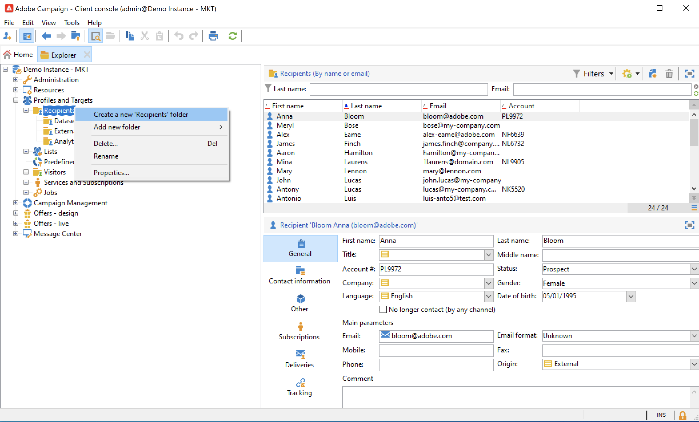
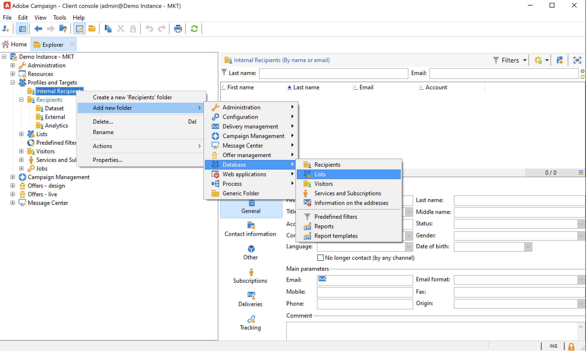
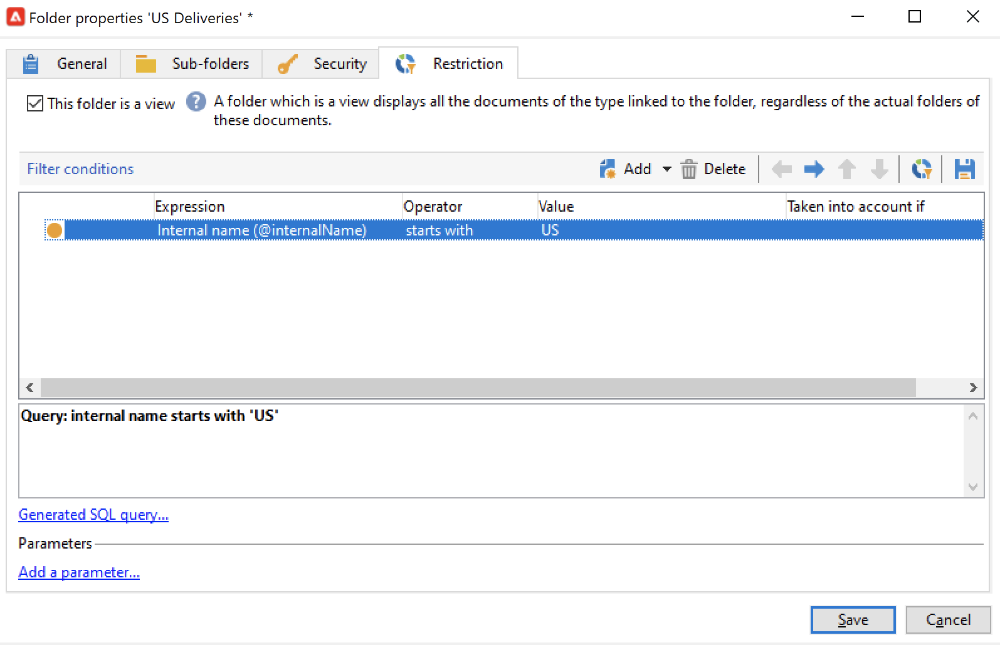
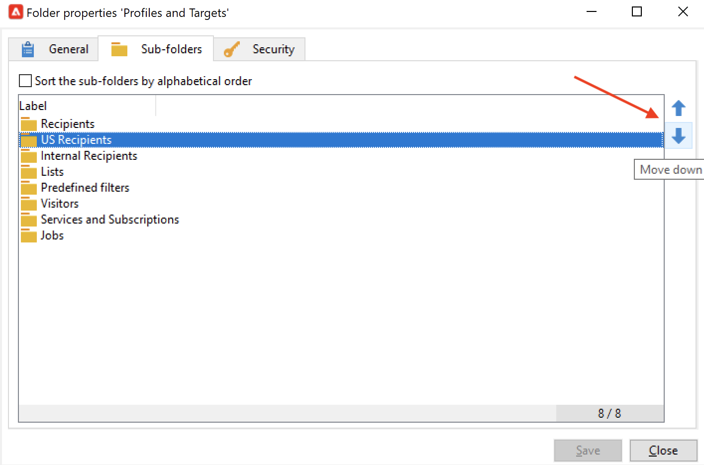

# Gestire le cartelle e le visualizzazioni {#folders-and-views}

Le cartelle di Campaign sono nodi nella struttura dell’Explorer. In base al tipo, contengono determinati tipi di dati.

Una visualizzazione è una cartella specifica che non contiene dati, ma visualizza dati fisicamente memorizzati in altre cartelle dello stesso tipo. Ad esempio, se trasformi una cartella di consegna in una visualizzazione, questa cartella mostrerà tutte le consegne. Questi dati possono quindi essere filtrati.

>[!NOTE]
>
>Per distinguere le viste dalle cartelle standard, il loro nome viene visualizzato in blu chiaro anziché in nero.

È possibile assegnare autorizzazioni alle cartelle per limitare l’accesso a determinati dati. [Ulteriori informazioni](#restrict-access-to-a-folder)

## Best practice per l’utilizzo delle cartelle{#best-practices-folders}

* **Utilizzare le cartelle incorporate** per semplificare l&#39;utilizzo, la manutenzione e la risoluzione dei problemi dell&#39;applicazione da parte di tutti gli utenti coinvolti nel progetto. Evita di creare strutture di cartelle personalizzate per destinatari, elenchi, consegne e così via, ma utilizza le cartelle standard come **Amministrazione**, **Profili e destinazioni**, **Gestione campagne**.

* **Crea sottocartelle**, ad esempio salva i flussi di lavoro tecnici nella cartella incorporata **[!UICONTROL Administration > Production > Technical Workflows]** e crea sottocartelle per tipo di flusso di lavoro.

* **Definire e applicare una convenzione per i nomi**. Ad esempio, è possibile denominare i flussi di lavoro in ordine alfabetico in modo che vengano visualizzati ordinati in base all&#39;ordine di esecuzione, ad esempio:

  A1 - destinatari importazione, inizia da 10:00;
A2 - importa ticket, inizia alle 11:00.

## Crea una cartella{#create-a-folder}

Per creare una cartella, fai clic con il pulsante destro del mouse su una cartella esistente e utilizza il menu contestuale.

Per creare lo stesso tipo di cartella selezionato, scegli la prima opzione nel menu contestuale. Ad esempio, da una cartella Destinatari, selezionare **[!UICONTROL Create a new 'Recipients' folder]**.

Puoi trascinare e rilasciare la nuova cartella per organizzare la struttura di Esplora campagne come necessario.

Per creare un altro tipo di cartella, fare clic con il pulsante destro del mouse su una cartella esistente e selezionare **[!UICONTROL Add new folder]**. Puoi creare tutti i tipi di cartelle, a seconda dei dati da archiviare.

>[!CAUTION]
>
>Queste modifiche si applicano a tutti gli utenti di Campaign.

## Trasforma una cartella in una visualizzazione{#turn-a-folder-to-a-view}

Una visualizzazione è una cartella specifica che non contiene dati, ma visualizza dati fisicamente memorizzati in altre cartelle dello stesso tipo.

È possibile trasformare qualsiasi cartella in una visualizzazione, ma la cartella deve essere vuota. Tutti i dati memorizzati nella cartella vengono eliminati quando si trasforma la cartella in una visualizzazione.

>[!IMPORTANT]
>
>Le cartelle pronte all’uso non devono essere trasformate in una visualizzazione.

>[!CAUTION]
>
>Una visualizzazione visualizza i dati e consente di accedervi, anche se non sono fisicamente memorizzati nella cartella di visualizzazione. Per poter accedere al contenuto, l’operatore deve disporre delle autorizzazioni appropriate nelle cartelle di origine, almeno l’accesso in lettura.
>
>Per concedere l&#39;accesso a una vista senza concedere l&#39;accesso alla relativa cartella di origine, non concedere l&#39;accesso in lettura al nodo padre della cartella di origine.

Nell’esempio seguente, creeremo una nuova cartella per visualizzare solo le consegne negli Stati Uniti, in base al loro nome interno.

1. Crea una cartella **[!UICONTROL Deliveries]** e denominala **Consegne USA**.
1. Fare clic con il pulsante destro del mouse su questa cartella e selezionare **[!UICONTROL Properties...]**.
1. Nella scheda **[!UICONTROL Restriction]**, selezionare **[!UICONTROL This folder is a view]**. Verranno quindi visualizzate tutte le consegne nel database.

   

1. Definisci i criteri di filtro dall’editor delle query nella sezione centrale della finestra: nella cartella vengono visualizzate solo le consegne corrispondenti al filtro.

   

   >[!NOTE]
   >
   >Scopri come progettare le query in [questa pagina](create-filters.md#advanced-filters)

>[!CAUTION]
>
>Durante la gestione di [eventi di messaggistica transazionale](../send/transactional.md), le cartelle **[!UICONTROL Real time events]** o **[!UICONTROL Batch events]** non devono essere impostate come viste nelle istanze di esecuzione, in quanto ciò potrebbe causare problemi di autorizzazioni.

## Organizzare le cartelle{#organize-your-folders}

Per impostazione predefinita, nella parte superiore della gerarchia viene aggiunta una nuova cartella.

Sfoglia la scheda **Sottocartelle** delle proprietà di una cartella per organizzarne le sottocartelle.

È possibile spostare le cartelle con le frecce a destra oppure selezionare l&#39;opzione **[!UICONTROL Sort the sub-folders in alphabetical order]** per ordinarle automaticamente.

## Filtrare i dati in una cartella{#filter-data-in-a-folder}

Per filtrare i dati memorizzati in una cartella, accedere alle proprietà della cartella e selezionare la scheda Restrizioni.

Ad esempio, la cartella seguente conterrà solo contatti con un indirizzo e-mail e la cui origine non è contrassegnata come &quot;Esterna&quot; oppure è vuota.

## Limitare l’accesso a una cartella{#restrict-access-to-a-folder}

Utilizza le autorizzazioni sulle cartelle per organizzare e controllare l’accesso ai dati di Campaign. Ulteriori informazioni sulle autorizzazioni per le cartelle in [questa sezione](../start/folder-permissions.md).
