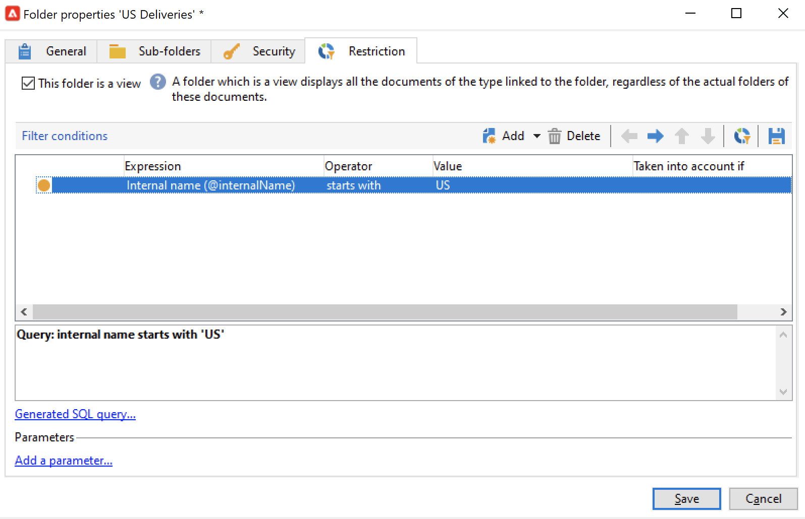

# Gestire le cartelle e le visualizzazioni {#folders-and-views}

Le cartelle di Campaign sono nodi nella struttura di explorer. In base al loro tipo, contengono determinati tipi di dati.

Una visualizzazione è una cartella specifica che non contiene dati ma visualizza dati fisicamente memorizzati in altre cartelle dello stesso tipo. Ad esempio, se ruoti una cartella di consegna in una visualizzazione, questa cartella mostrerà tutte le consegne. Questi dati possono quindi essere filtrati.

>[!NOTE]
>Per distinguere le visualizzazioni dalle cartelle standard, il loro nome viene visualizzato in blu chiaro anziché in nero.

È possibile assegnare autorizzazioni alle cartelle per limitare l’accesso a determinati dati. [Ulteriori informazioni](#restrict-access-to-a-folder)

## Procedure consigliate per l’utilizzo delle cartelle

* **Utilizzare le cartelle incorporate** per facilitare l’utilizzo, la manutenzione e la risoluzione dei problemi dell’applicazione da parte di tutti i partecipanti al progetto. Evita di creare strutture di cartelle personalizzate per destinatari, elenchi, consegne, ecc., ma utilizza le cartelle standard come **Amministrazione**, **Profili e destinazioni**, **Gestione delle campagne**.

* **Creare sottocartelle**, ad esempio, salva i flussi di lavoro tecnici nella cartella incorporata: **[!UICONTROL Administration > Production > Technical Workflows]** e crea sottocartelle per tipo di flusso di lavoro.

* **Definire e applicare una convenzione di denominazione**, ad esempio, è possibile denominare i flussi di lavoro in ordine alfabetico in modo che vengano visualizzati in ordine alfabetico nell’ordine di esecuzione, ad esempio:

   A1 - destinatari dell’importazione, inizia alle 10:00; A2: i biglietti per l’importazione iniziano alle 11:00.

## Creare una cartella{#create-a-folder}

Per creare una cartella, fai clic con il pulsante destro del mouse su una cartella esistente e utilizza il menu contestuale.

Per creare lo stesso tipo di cartella di quello selezionato, scegliere la prima opzione nel menu contestuale. Ad esempio, da una cartella Destinatari, selezionare **[!UICONTROL Create a new 'Recipients' folder]**.

Puoi trascinare e rilasciare la nuova cartella per organizzare la struttura ad albero di Campaign Explorer in base alle tue esigenze.

Per creare un altro tipo di cartella, fare clic con il pulsante destro del mouse su una cartella esistente e selezionare **[!UICONTROL Add new folder]**. È possibile creare tutti i tipi di cartelle, a seconda dei dati da memorizzare.

>[!CAUTION]
>Queste modifiche si applicano a tutti gli utenti di Campaign.

## Trasformazione di una cartella in una visualizzazione{#turn-a-folder-to-a-view}

Una visualizzazione è una cartella specifica che non contiene dati ma visualizza dati fisicamente memorizzati in altre cartelle dello stesso tipo.

È possibile trasformare qualsiasi cartella in una visualizzazione, ma la cartella deve essere vuota. Tutti i dati memorizzati nella cartella vengono eliminati quando si converte la cartella in una visualizzazione.

>[!CAUTION]
>
>Una visualizzazione visualizza i dati e fornisce l’accesso a tali dati, anche se i dati non sono fisicamente memorizzati nella cartella di visualizzazione. Per poter accedere al contenuto, l’operatore deve disporre delle autorizzazioni appropriate nelle cartelle di origine, almeno per l’accesso in lettura.
>
>Per concedere l&#39;accesso a una visualizzazione senza concedere l&#39;accesso alla relativa cartella di origine, non concedere l&#39;accesso in lettura al nodo padre della cartella di origine.

Nell’esempio seguente, creeremo una nuova cartella per visualizzare solo le consegne USA, in base al nome interno.

1. Crea un **[!UICONTROL Deliveries]** e denominarlo **Consegne statunitensi**.
1. Fai clic con il pulsante destro del mouse su questa cartella e seleziona **[!UICONTROL Properties...]**.
1. Nella scheda **[!UICONTROL Restriction]**, seleziona **[!UICONTROL This folder is a view]**. Verranno quindi visualizzate tutte le consegne nel database.

   

1. Definisci i criteri di filtro dall’editor delle query nella sezione centrale della finestra: nella cartella vengono visualizzate solo le consegne corrispondenti al filtro.

   

   >[!NOTE]
   >
   >Scopri come progettare query in [questa pagina](create-filters.md#advanced-filters)

>[!CAUTION]
>
>Durante la gestione [messaggistica transazionale](../send/transactional.md) eventi, **[!UICONTROL Real time events]** o **[!UICONTROL Batch events]** le cartelle non devono essere impostate come visualizzazioni sulle istanze di esecuzione, in quanto ciò potrebbe causare problemi di autorizzazione.

## Organizzare le cartelle{#organize-your-folders}

Per impostazione predefinita, una nuova cartella viene aggiunta nella parte superiore della gerarchia.

Sfoglia il **Sottocartelle** scheda delle proprietà di una cartella per organizzare le relative sottocartelle.

È possibile spostare le cartelle con le frecce a destra o selezionare la **[!UICONTROL Sort the sub-folders in alphabetical order]** per ordinarli automaticamente.

## Filtrare i dati in una cartella{#filter-data-in-a-folder}

Per filtrare i dati memorizzati in una cartella, accedere alle proprietà della cartella e selezionare la scheda Limitazione.

Ad esempio, la cartella seguente conterrà solo i contatti con un indirizzo e-mail e la cui origine non è contrassegnata come &quot;Esterno&quot; oppure è vuota.

## Limitare l’accesso a una cartella{#restrict-access-to-a-folder}

Utilizza le autorizzazioni nelle cartelle per organizzare e controllare l’accesso ai dati di Campaign.

Per modificare le autorizzazioni su una cartella Campaign specifica, segui i passaggi seguenti:

1. Fai clic con il pulsante destro del mouse sulla cartella e seleziona **[!UICONTROL Properties...]**.
1. Sfoglia il **[!UICONTROL Security]** per visualizzare le autorizzazioni in questa cartella.

   

* A **autorizzare un gruppo o un operatore**, fai clic su **[!UICONTROL Add]** e selezionare il gruppo o l&#39;operatore per assegnare le autorizzazioni per questa cartella.
* A **vietare un gruppo o un operatore**, fai clic su **[!UICONTROL Delete]** e selezionare il gruppo o l&#39;operatore per rimuovere l&#39;autorizzazione per questa cartella.
* A **selezionare i diritti assegnati a un gruppo o a un operatore**, seleziona il gruppo o l’operatore, seleziona i diritti di accesso che desideri concedere e deseleziona gli altri.

### Propagare le autorizzazioni {#propagate-permissions}

Per propagare le autorizzazioni e i diritti di accesso, seleziona la **[!UICONTROL Propagate]** nelle proprietà della cartella.

Le autorizzazioni definite in questa finestra verranno quindi applicate a tutte le sottocartelle del nodo corrente. Puoi sempre sovraccaricare queste autorizzazioni per ciascuna sottocartella.

>[!NOTE]
>
>Deselezionando la **[!UICONTROL Propagate]** l’opzione per una cartella non la cancella per le sottocartelle: è necessario cancellarlo esplicitamente per ciascuna sottocartella.

### Concedere l’accesso a tutti gli operatori {#grant-access-to-all-operators}

In **[!UICONTROL Security]** seleziona la scheda **[!UICONTROL System folder]** consentire l’accesso a tutti gli operatori, indipendentemente dalle relative autorizzazioni.

Se questa opzione è deselezionata, è necessario reinserire esplicitamente l’operatore (o il relativo gruppo) nell’elenco delle autorizzazioni per consentire loro di accedere.
