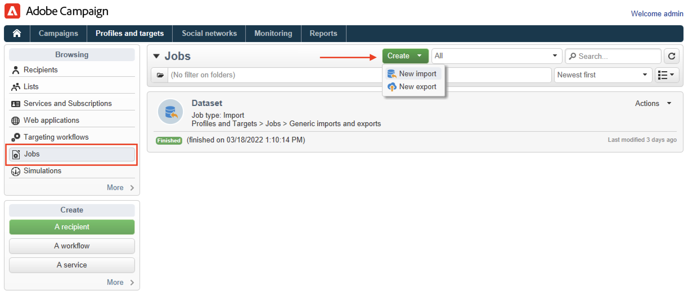

# Importare i profili da un file{#create-profiles}

Per popolare il database di Campaign, puoi [aggiungere profili manualmente](create-profiles.md) o importare i profili come descritto di seguito. È inoltre possibile utilizzare i file importati per aggiornare i dati dei contatti.

## Importare profili con un flusso di lavoro {#import-profiles-with-a-wf}

I flussi di lavoro possono essere utili per automatizzare alcuni dei processi di importazione. Che tu importi dati da un file locale o da un SFTP, puoi utilizzare i flussi di lavoro per standardizzare le procedure di gestione dei dati.

### Utilizza dati da un elenco: Leggi elenco {#data-from-read-list}

Prepara e struttura i dati in un file per importarlo con un flusso di lavoro. [Ulteriori informazioni](https://experienceleague.adobe.com/docs/campaign/automation/workflows/wf-activities/targeting-activities/read-list.html?lang=it){target="_blank"}.

### Caricare dati da un file {#data-from-a-file}

I dati elaborati in un flusso di lavoro possono essere estratti da un file strutturato in modo che possa essere importato in Adobe Campaign. [Ulteriori informazioni](https://experienceleague.adobe.com/docs/campaign/automation/workflows/wf-activities/action-activities/data-loading--file-.html?lang=it){target="_blank"}.

Una volta raccolti i dati, puoi utilizzarli nei flussi di lavoro, ad esempio per arricchire una consegna o aggiornare il database. Per ulteriori informazioni al riguardo, consulta [questa sezione](https://experienceleague.adobe.com/docs/campaign/automation/workflows/introduction/use-workflow-data.html?lang=it){target="_blank"}.

## Importazioni una tantum{#import-jobs}

Adobe Campaign fornisce funzionalità di importazione generiche che consentono, ad esempio, di estrarre un elenco di clienti o potenziali che entreranno a far parte di una popolazione target o di fornire al database dati provenienti da file esterni.

Le importazioni generiche vengono gestite dal menu **[!UICONTROL Profiles and Targets > Jobs]** della home page di Adobe Campaign.

I passaggi per eseguire un&#39;importazione generica sono descritti nella [documentazione di Campaign Classic v7](https://experienceleague.adobe.com/docs/campaign-classic/using/getting-started/importing-and-exporting-data/generic-imports-exports/about-generic-imports-exports.html?lang=it){target="_blank"}.
