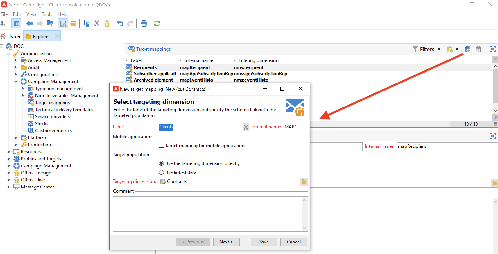

# Utilizzare le mappature target{#gs-target-mappings}

Per impostazione predefinita, i modelli di consegna e-mail e SMS sono destinati a **[!UICONTROL Recipients]**. La mappatura di destinazione utilizza pertanto i campi della tabella **nms:recipient**.

Per le notifiche push, il mapping di destinazione predefinito è **Applicazioni sottoscrittore (nms:appSubscriptionRcp)**, che è collegato alla tabella dei destinatari.

Puoi utilizzare altre mappature di destinazione per le consegne o crearne una nuova.

## Mappature di destinazione incorporate {#ootb-mappings}

Adobe Campaign è dotato delle seguenti mappature di destinazione integrate:

| Nome | Utilizza per | Schema |
|---|---|---|
| Destinatari | Consegnare ai destinatari (tabella dei destinatari incorporata) | nms:recipient |
| Visitatori | Consegnare ai visitatori i cui profili sono stati raccolti tramite riferimento (marketing virale) per es. | mns:visitor |
| Abbonamenti | Consegnare ai destinatari abbonati o iscritti a un servizio informativo, ad esempio una newsletter | nms:subscription |
| Abbonamenti visitatore | Consegnare ai visitatori abbonati o iscritti a un servizio informativo | nms:visitorSub |
| Operatori | Consegnare agli operatori Adobe Campaign | nms:operator |
| File esterno | Consegnare tramite un file contenente tutte le informazioni necessarie per la consegna | Nessuno schema collegato, nessuna destinazione immessa |
| Applicazioni in abbonamento | Consegnare ai destinatari abbonati o iscritti a un’applicazione | nms:appSubscriptionRcp |

## Creare una mappatura target {#new-mapping}

Puoi anche creare una mappatura di destinazione. Potrebbe essere necessario aggiungere una mappatura di destinazione personalizzata, ad esempio, se:

* si utilizza una tabella dei destinatari personalizzata,
* puoi configurare una dimensione di filtro diversa dalla dimensione di targeting incorporata nella schermata mappatura target.

Ulteriori informazioni sulle tabelle dei destinatari personalizzate in [questa pagina](../dev/custom-recipient.md).

la procedura guidata per la creazione di Adobe Campaign target mapping consente di creare tutti gli schemi necessari per utilizzare la mappatura di destinazione personalizzata.

1. Passare a **[!UICONTROL Administration]** `>` **[!UICONTROL Campaign Management]** `>` **[!UICONTROL Target mappings]** da Adobe Campaign Explorer.

1. Crea una nuova mappatura di destinazione e seleziona lo schema personalizzato come dimensione di targeting.

   

1. Indica i campi in cui sono memorizzate le informazioni del profilo: cognome, nome, e-mail, indirizzo, ecc.

   

1. Specifica i parametri per l’archiviazione delle informazioni, compreso il suffisso degli schemi di estensione affinché siano facilmente identificabili.

   

   Puoi scegliere se memorizzare le esclusioni (**excludelog**), con i messaggi (**broadlog**) o in una tabella separata.

   Puoi anche scegliere se gestire il tracciamento per questa mappatura di consegna (**trackinglog**).

1. Quindi seleziona le estensioni da prendere in considerazione. Il tipo di estensione dipende dalle impostazioni e dai componenti aggiuntivi di Campaign.

   

   Fai clic sul pulsante **[!UICONTROL Save]** per avviare la creazione della mappatura di consegna: tutte le tabelle collegate vengono create automaticamente in base ai parametri selezionati.
