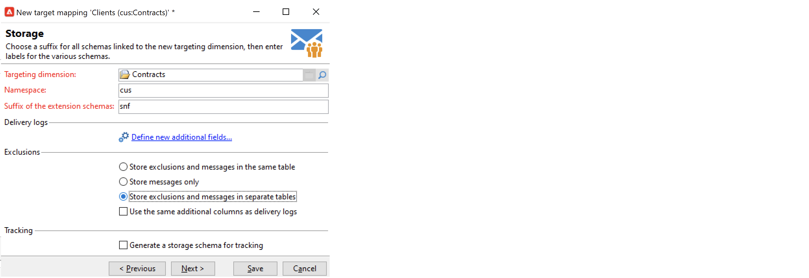

# Utilizzare le mappature target{#gs-target-mappings}

Per impostazione predefinita, target dei modelli di consegna **[!UICONTROL Recipients]**. La mappatura del target utilizza quindi i campi del **nms:recipient** tabella.

Puoi utilizzare altre mappature target per le consegne o creare una nuova mappatura target.

## Mappature di destinazione incorporate {#ootb-mappings}

Adobe Campaign viene fornito con le seguenti mappature di destinazione incorporate:

| Nome | Usa per | Schema |
|---|---|---|
| Destinatari | Consegna ai destinatari (tabella dei destinatari incorporata) | nms:recipient |
| Visitatori | Fornisci ai visitatori i cui profili sono stati raccolti tramite riferimento (marketing virale) per es. | mns:visitatore |
| Abbonamenti | Consegnare a destinatari abbonati a un servizio di informazione, ad esempio una newsletter | nms:abbonamento |
| Abbonamenti visitatore | Consegna ai visitatori abbonati a un servizio di informazione | nms:visitorSub |
| Operatori | Consegna agli operatori Adobe Campaign | nms:operatore |
| File esterno | Consegna tramite un file contenente tutte le informazioni necessarie per la consegna | Nessun schema collegato, nessuna destinazione immessa |

## Creare una mappatura target {#new-mapping}

Puoi anche creare una mappatura target. Potrebbe essere necessario aggiungere una mappatura di destinazione personalizzata, ad esempio se:

* utilizzare una tabella dei destinatari personalizzata,
* configura una dimensione di filtro diversa dalla dimensione di targeting incorporata nella schermata di mappatura della destinazione.

Ulteriori informazioni sulle tabelle dei destinatari personalizzate in [questa pagina](../dev/custom-recipient.md).

La procedura guidata per la creazione della mappatura di destinazione di Adobe Campaign consente di creare tutti gli schemi necessari per utilizzare la mappatura di destinazione personalizzata.

1. Sfoglia per **[!UICONTROL Administration]** `>` **[!UICONTROL Campaign Management]** `>` **[!UICONTROL Target mappings]** da Adobe Campaign explorer.

1. Crea una nuova mappatura di destinazione e seleziona lo schema personalizzato come dimensione di targeting.

   

1. Indica i campi in cui sono memorizzate le informazioni sul profilo: cognome, nome, e-mail, indirizzo e così via

   

1. Specifica i parametri per l’archiviazione delle informazioni, compreso il suffisso degli schemi di estensione per facilitarne l’identificazione.

   

   Puoi scegliere di memorizzare le esclusioni (**excludelog**), con messaggi (**broadlog**) o in una tabella separata.

   Puoi anche scegliere di gestire il tracciamento per questa mappatura della consegna (**trackinglog**).

1. Quindi seleziona le estensioni da prendere in considerazione. Il tipo di estensione dipende dalle impostazioni e dai componenti aggiuntivi di Campaign.

   

   Fai clic sul pulsante **[!UICONTROL Save]** pulsante per avviare la creazione della mappatura della consegna: tutte le tabelle collegate vengono create automaticamente in base ai parametri selezionati.
