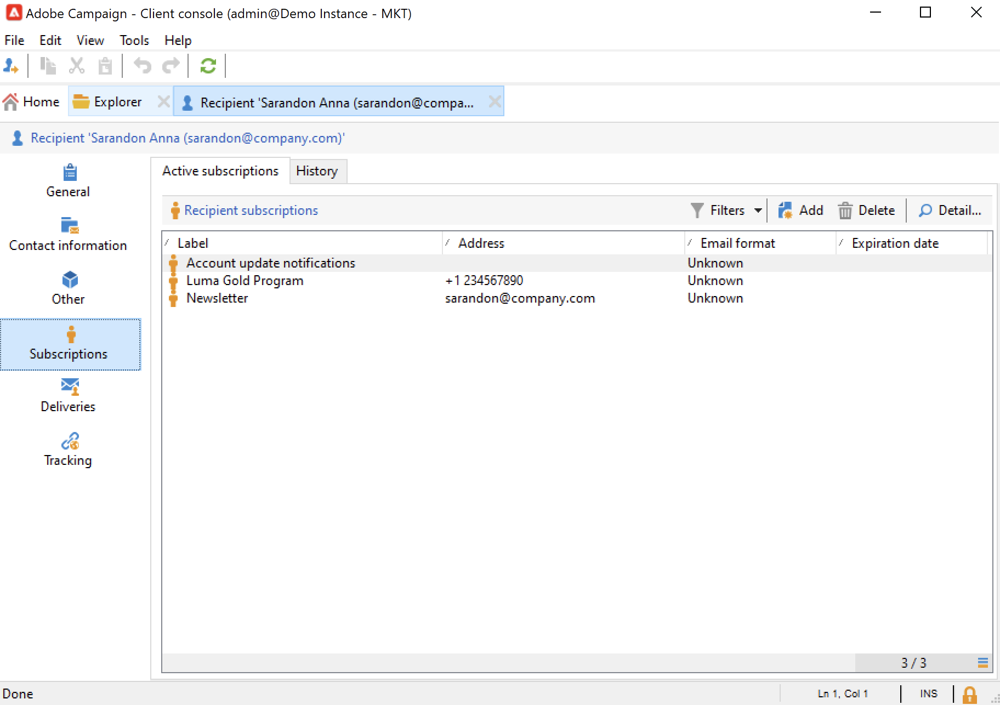

# Visualizzare i profili esistenti {#view-profiles}

Passare a **[!UICONTROL Profiles and targets]** per accedere ai destinatari archiviati nel database di Adobe Campaign.

Da questa pagina, puoi [creare un nuovo destinatario](create-profiles.md), modificare un destinatario esistente e accedere ai relativi dettagli del profilo.

Per manipolazioni del profilo più avanzate, accedere alla struttura Campaign dal collegamento **[!UICONTROL Explorer]** nella home page di Adobe Campaign.

>[!CAUTION]
>
>La schermata Destinatario incorporata viene definita tramite uno schema XML e il relativo modulo associato. Lo schema XML è archiviato nel nodo **[!UICONTROL Administration > Configuration > Data schemas]** della struttura di Adobe Campaign Explorer. Solo gli utenti esperti possono apportare modifiche a questi schemi.
>

## Modificare un profilo {#edit-a-profiles}

Seleziona un profilo per visualizzare i dettagli in una nuova scheda.

I dati relativi ai profili sono raggruppati in schede. Queste schede e il loro contenuto dipendono dalle impostazioni specifiche e dai pacchetti installati.

Per un destinatario predefinito tipico, puoi accedere alle seguenti schede:

* **[!UICONTROL General]**, per tutti i dati di profilo generali. In particolare, contiene il cognome, il nome, l’indirizzo e-mail, il formato e-mail, ecc.

  In questa scheda viene inoltre memorizzato il flag **rinuncia** per il profilo: quando l&#39;opzione **[!UICONTROL No longer contact (by any channel)]** è selezionata, il profilo è in fase di elenco Bloccati di. Queste informazioni vengono aggiunte ai dati di contatto se, ad esempio, il destinatario ha fatto clic su un collegamento di annullamento dell’abbonamento in una newsletter. Tale destinatario non è più indirizzato su alcun canale (e-mail, direct mailing, ecc.). Per ulteriori informazioni, consulta [questa pagina](../send/quarantines.md).

* **Informazioni di contatto**, che contiene l&#39;indirizzo di direct mailing del profilo selezionato.

  In questa schermata puoi archiviare l’indice di qualità dell’indirizzo e quanti errori contiene l’indirizzo. Queste informazioni vengono utilizzate direttamente dal provider di direct mailing, in base al numero di errori rilevati durante le consegne precedenti, e non possono essere modificate manualmente.

* **Altro**, per campi specifici che possono essere personalizzati e compilati in base alle tue esigenze.

  Utilizza il menu contestuale **[!UICONTROL Field properties…]** per modificare i nomi dei campi e definirne il formato.

  

  Immetti le nuove impostazioni come segue:

  

  Controlla l’aggiornamento nell’interfaccia utente:

  

  >[!CAUTION]
  >Le modifiche vengono applicate a tutti i destinatari.
  >

* **Abbonamenti**, per tutti gli abbonamenti attivi ai servizi. Utilizza la scheda **Cronologia** per accedere ai dettagli degli abbonamenti e dei loro annullamenti per questo contatto.

  

  Ulteriori informazioni sulle sottoscrizioni [in questa sezione](../start/subscriptions.md).

* **Consegne**, per tutti i registri di consegna per il profilo selezionato. Utilizza questa scheda per accedere alla cronologia di marketing del contatto: etichette, date e stato di tutte le azioni di consegna indirizzate al profilo tramite tutti i canali.

* **Tracciamento**, per tutti i registri di tracciamento per il profilo selezionato. Queste informazioni vengono utilizzate per tenere traccia del comportamento del profilo dopo le consegne. Questa scheda mostra il totale cumulativo di tutti gli URL tracciati nelle consegne. L’elenco è configurabile e in genere contiene: l’URL su cui è stato fatto clic, la data e l’ora del clic e il documento che conteneva l’URL

  Ulteriori informazioni sul tracciamento di [sono disponibili in questa sezione](../send/tracking.md).
