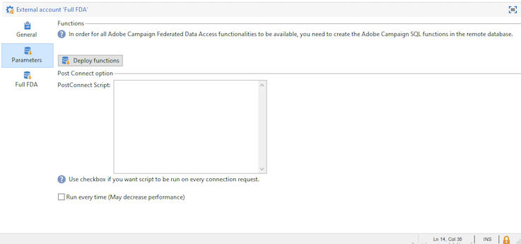

# Configurare gli account esterni

Adobe Campaign è dotato di un set di account esterni predefiniti. Per impostare connessioni con sistemi esterni, puoi creare nuovi account esterni.

Gli account esterni sono utilizzati da processi tecnici quali flussi di lavoro tecnici o flussi di lavoro per campagne. Ad esempio, quando imposti un trasferimento di file in un flusso di lavoro o uno scambio di dati con un’altra applicazione (Adobe Target, Experience Manager, ecc.), devi selezionare un account esterno.

:arrow_Upper_right: Scopri come creare e configurare account esterni nella [documentazione di Campaign Classic](https://experienceleague.adobe.com/docs/campaign-classic/using/installing-campaign-classic/accessing-external-database/external-accounts.html)

Un account esterno specifico gestisce la connessione tra il database locale di Campaign e il database Cloud ([!DNL Snowflake]).

:speech_balloon: In qualità di utente di Cloud Services gestiti, l’account esterno [!DNL Snowflake] viene configurato per la tua istanza per Adobe.

Puoi accedere a questo account esterno per controllare le impostazioni ed eseguire i flussi di lavoro di replica. Per eseguire questa operazione, effettua le seguenti operazioni:

1. Dalla campagna **[!UICONTROL Explorer]**, fai clic su **[!UICONTROL Administration > Platform > External Accounts]**.

1. Seleziona l’account esterno **[!UICONTROL Full FDA]**.

Le impostazioni globali vengono visualizzate in **[!UICONTROL General tab]**.

Utilizza la scheda **[!UICONTROL Parameters]** e quindi il pulsante **[!UICONTROL Deploy functions]** per creare funzioni.

**AGGIUNGI IL DESC DEI PARAMETRI QUI**

Utilizza la scheda **[!UICONTROL Full FDA]** per forzare l’esecuzione del flusso di lavoro di replica.

**AGGIUNGI I DETTAGLI QUI**

