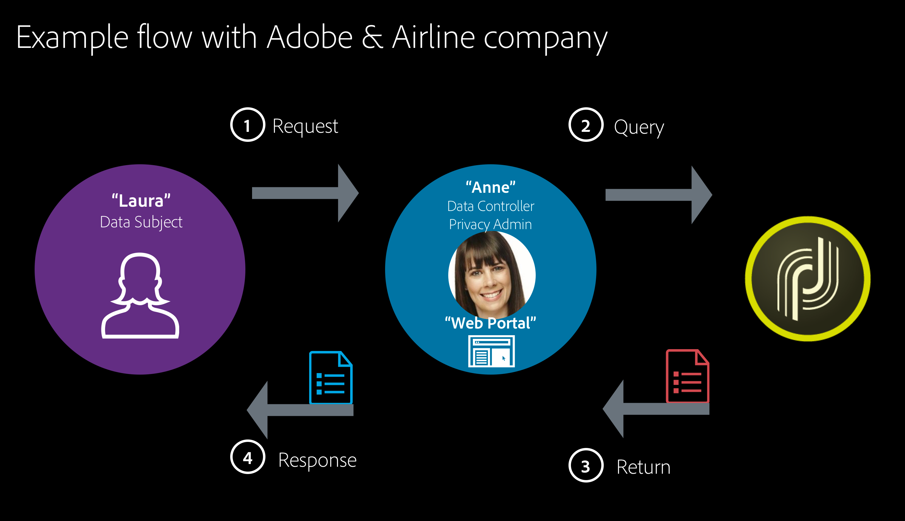

# Best practice per la sicurezza di Campaign {#ac-security}

In Adobe, prendiamo la sicurezza della tua esperienza digitale molto seriamente. Le procedure di sicurezza sono profondamente radicate nei nostri processi e strumenti interni di sviluppo e gestione del software e sono rigorosamente seguite dai nostri team interfunzionali per prevenire, rilevare e rispondere agli incidenti in modo rapido.

Inoltre, il nostro lavoro collaborativo con partner, ricercatori di spicco, istituti di ricerca sulla sicurezza e altre organizzazioni del settore ci aiuta a rimanere aggiornati sulle ultime minacce e vulnerabilità e a incorporare regolarmente tecniche di sicurezza avanzate nei prodotti e nei servizi che offriamo.

>[!NOTE]
>
>**Servizi cloud gestiti di Campaign v8:** l&#39;infrastruttura (rete, server, TLS, applicazione di patch) è gestita da Adobe. Questa pagina si concentra sulla configurazione a livello di tenant e di applicazione controllata: gestione degli accessi, autenticazione, impostazioni delle istanze, protezione dei dati, codifica e pratiche operative.

## Lista di controllo protezione {#security-checklist}

Utilizza questo elenco di controllo per allineare la configurazione ai valori predefiniti di protezione consigliati:

* [Gestione degli accessi](#access-management): creare gruppi di sicurezza, assegnare i diritti appropriati, limitare l&#39;utilizzo da parte dell&#39;amministratore, un operatore per utente, rivedere periodicamente
* [Autenticazione e sessione](#authentication-and-session): utilizzare Adobe IMS, criteri di identità avanzata, timeout della sessione
* [Istanza e sicurezza di rete](#instance-and-network-security): inserisco nell&#39;elenco Consentiti di IP, autorizzazioni URL, chiavi GPG tramite Pannello di controllo Campaign
* [Protezione dati e informazioni personali](#data-and-pii-protection): HTTPS, limitazione di visualizzazione PII, limitazione delle password, protezione delle pagine sensibili
* [Linee guida per la codifica](#coding-guidelines): nessun segreto hardcoded, convalida input, SQL con parametri, captchas
* [Limitazione dati](#data-restriction): limita l&#39;accesso ai campi password e segreto negli account esterni
* [Funzionalità e conformità](#operational-and-compliance): confronta periodicamente questa linea di base, utilizza audit trail

## Privacy

Per gestire correttamente la privacy e i dati personali, attieniti alle normative applicabili alle regioni in cui operi. Le funzionalità di Adobe Campaign consentono di rispettare le normative elencate in [questa pagina](../start/privacy.md)

### Privacy di Adobe Experience Cloud {#experience-cloud-privacy}

Adobe Campaign fa parte delle soluzioni Adobe Experience Cloud. Il modo in cui viene gestita la privacy in Campaign rispetta i principi generali di Experience Cloud, come ad esempio quanto segue:

* **Quali informazioni vengono raccolte durante l’utilizzo di Adobe Experience Cloud**

  In qualità di azienda che utilizza le soluzioni Adobe Experience Cloud, puoi scegliere quali informazioni raccogliere e inviare all’account Adobe Experience Cloud. Alcuni esempi dei tipi di informazioni che possono essere raccolti includono attività di navigazione web, indirizzi IP, informazioni sulla posizione inviate dai dispositivi mobili, tassi di successo delle campagne, articoli acquistati o inseriti nel carrello, ecc.

  >[!NOTE]
  >
  >Come tutti i prodotti Adobe, Campaign raccoglie informazioni sugli utenti dell’app e del sito web. Per ulteriori informazioni, consulta l’[Informativa sulla privacy di Adobe](https://www.adobe.com/it/privacy/policy.html).

* **Utilizzare Adobe Experience Cloud per raccogliere informazioni**

   * Le soluzioni Adobe Experience Cloud utilizzano cookie e tecnologie simili, come web beacon (noti anche come tag o pixel), per consentirti di raccogliere informazioni. Per ulteriori informazioni sui cookie e sulle funzionalità di tracciamento con Adobe Campaign, consulta [questa sezione](#tracking-capabilities).
   * Puoi anche utilizzare le tecnologie Adobe Experience Cloud nelle tue app mobili. Per ulteriori informazioni sull&#39;invio di consegne per dispositivi mobili con Campaign, consulta [Canale SMS](../send/sms/sms-channel.md) e Canale app mobile.

* **Scelte degli utenti in materia di privacy relative all’utilizzo di Adobe Experience Cloud**

   Adobe richiede che tu fornisca ai clienti le informative sulla privacy che descrivono:

   * Le tue prassi in materia di privacy in relazione ad Adobe Experience Cloud
   * In che modo gli utenti possono impostare le proprie preferenze per la raccolta o l’utilizzo delle proprie informazioni in relazione ad Adobe Experience Cloud

  >[!NOTE]
  >
  >Come per tutti i prodotti di Adobe, gli utenti di Campaign possono scegliere di rinunciare alla condivisione di informazioni raccolte su di loro tramite app e siti web. Per ulteriori informazioni, consulta le [domande frequenti relative all’utilizzo di Adobe Experience Cloud](https://www.adobe.com/it/privacy/experience-cloud-usage-info-faq.html).

Per ulteriori dettagli sulla privacy di Adobe Experience Cloud, consulta [questa pagina](https://www.adobe.com/it/privacy/experience-cloud.html).

## Dati personali e utenti tipo {#personal-data}

Nella gestione della privacy è importante definire quali dati devono essere gestiti con cura e chi si occupa della gestione.
* **I dati personali** sono informazioni che possono identificare direttamente o indirettamente un individuo.
* **I dati personali riservati** sono informazioni relative a etnia, opinioni politiche, credenze religiose, precedenti penali, informazioni genetiche, dati sanitari, orientamento sessuale e informazioni biometriche di un individuo, nonché iscrizioni a sindacati.

È necessario prestare maggiore attenzione alla protezione dei dati personali durante l&#39;integrazione di Campaign con altre soluzioni Experience Cloud in cui i tipi di pubblico possono essere trasferiti da un sistema all&#39;altro, ad esempio [Adobe Analytics](../connect/ac-aa.md), [Experience Cloud Audiences](../start/shared-audiences.md), Campaign Standard o con altre soluzioni tramite [Connettore CRM](../../automation/workflow/crm-connector.md).

Le [normative principali](#privacy-regulations) si riferiscono alle diverse entità che gestiscono i dati come segue:

* Il **titolare del trattamento** è l’autorità che determina i mezzi e lo scopo della raccolta, dell’utilizzo e della condivisione dei dati personali.

* Il **responsabile del trattamento** è qualsiasi individuo o parte che raccoglie, utilizza o condivide dati personali come indicato dal titolare del trattamento.

* L’**interessato** è qualsiasi individuo i cui dati personali vengono raccolti, utilizzati o condivisi e che può essere identificato direttamente o indirettamente in base a tali dati personali.

Pertanto, in quanto azienda che raccoglie e condivide dati personali, ricopri il ruolo di titolare del trattamento, i tuoi clienti costituiscono gli interessati e Adobe Campaign agisce come responsabile del trattamento quando tratta i loro dati personali secondo le istruzioni da te fornite. In quanto titolare del trattamento, sei responsabile della gestione del rapporto con gli interessati, ad esempio durante la gestione delle [richieste di accesso a dati personali](#privacy-requests).

### Scenario del caso d’uso {#use-case-scenario}

Per illustrare il modo in cui interagiscono i diversi utenti tipo, ecco un esempio di un caso d’uso dettagliato di customer experience relativo al GDPR.

In questo esempio, il cliente Adobe Campaign è una compagnia aerea. La compagnia aerea è il **titolare del trattamento** e tutti i suoi clienti sono gli **interessati**. Laura in questo caso particolare è una cliente della compagnia aerea.

Di seguito sono elencati i diversi utenti tipo utilizzati in questo esempio:

* **Laura** è l’**interessato**. È il destinatario che riceve messaggi dalla compagnia aerea. Ammettiamo che Laura sia una viaggiatrice frequente e che a un certo punto decida di non voler ricevere messaggi pubblicitari o di marketing personalizzati da parte della compagnia aerea. Laura chiederà alla compagnia aerea (sulla base del loro processo) di cancellare il suo numero di viaggiatrice frequente.

* **Anne** è il **titolare del trattamento** presso la compagnia aerea. Riceve la richiesta di Laura, recupera gli ID utili richiesti per identificare l’interessato e invia la richiesta in Adobe Campaign.

* **Adobe Campaign** è il **responsabile del trattamento**.



Di seguito è riportato il flusso generale relativo a questo caso d’uso:

1. L’**interessato** (Laura) invia una richiesta GDPR al **titolare del trattamento** tramite e-mail, assistenza clienti o un portale web.

1. Il **titolare del trattamento** (Anne) invia la richiesta GDPR a Campaign tramite l’interfaccia o utilizzando un’API.

1. Una volta che il **responsabile del trattamento** (Adobe Campaign) riceve le informazioni, interviene sulla richiesta GDPR e invia una risposta o una conferma al **titolare del trattamento** (Anne).

1. Il **titolare del trattamento** (Anne) esamina le informazioni e le invia nuovamente all’**interessato** (Laura).

## Acquisizione dei dati {#data-acquisition}

 Adobe Campaign ti consente di raccogliere dati, incluse informazioni personali e riservate. È pertanto essenziale ricevere e monitorare il consenso dei destinatari.

* Assicurati che i destinatari ricevano le comunicazioni solo se lo desiderano. Per farlo, accetta al più presto le richieste di rifiuto e verifica il consenso mediante un processo di doppio consenso. Per ulteriori informazioni, consulta [Creare un abbonamento con doppio consenso](https://experienceleague.adobe.com/it/docs/campaign-classic/using/designing-content/web-forms/use-cases-web-forms){target=_blank}.
* Non importare elenchi fraudolenti e utilizza indirizzi di seed per verificare che il file client non venga utilizzato in modo fraudolento. Per ulteriori informazioni, consulta [Informazioni sugli indirizzi di seed](https://experienceleague.adobe.com/it/docs/campaign-classic/using/sending-messages/using-seed-addresses/about-seed-addresses){target=_blank}.
* Tramite la gestione del consenso e dei diritti puoi tenere traccia delle preferenze dei destinatari e gestire chi all’interno dell’organizzazione può accedere ai dati. Per ulteriori informazioni, consulta [questa sezione](#consent).
* Facilita e gestisci le richieste di accesso a dati personali dei destinatari. Per ulteriori informazioni, consulta [questa sezione](#privacy-requests).

## Gestione della privacy {#privacy-management}

La gestione della privacy si riferisce a tutti i processi e gli strumenti che possono aiutarti a rispettare le normative sulla privacy (GDPR, CCPA, ecc.).

 Adobe Campaign offre varie serie di funzioni dedicate alla gestione della privacy:
* Gestione del consenso, conservazione dei dati e ruoli degli utenti. Vedi [questa sezione](#consent).
* Richieste di accesso a dati personali (diritto di accesso e diritto all’oblio). Vedi [questa sezione](#privacy-requests).
* Rinuncia alla vendita di informazioni personali (specifica per il CCPA).

In [questa sezione](https://helpx.adobe.com/it/campaign/kb/campaign-privacy-more.html#gdprpersonasandflow) sono illustrate le principali funzionalità di Campaign relative alla privacy e un esempio degli utenti tipo coinvolti.

### Consenso, conservazione e ruoli {#consent}

Adobe Campaign offre da sempre funzioni importanti necessarie per la privacy:

* **Gestione del consenso**: attraverso il processo di gestione degli abbonamenti, puoi gestire le preferenze dei destinatari e tenere traccia dei destinatari che hanno acconsentito all’abbonamento e di che tipo di abbonamento si tratta. Per ulteriori informazioni, consulta [Informazioni sugli abbonamenti](../../automation/workflow/subscription-services.md).
* **Conservazione dei dati**: tutte le tabelle di registro standard incorporate dispongono di periodi di conservazione preimpostati, che in genere limitano l’archiviazione dei dati a un massimo di 6 mesi. Puoi impostare ulteriori periodi di conservazione con i flussi di lavoro. Per maggiori informazioni, rivolgiti ai consulenti o agli amministratori tecnici di Adobe.
* **Gestione dei diritti**: Adobe Campaign consente di gestire i diritti assegnati ai vari operatori di Campaign tramite diversi ruoli predefiniti o personalizzati. Questo consente di gestire chi può modificare, esportare o accedere a diversi tipi di dati all’interno dell’azienda. Per ulteriori informazioni, consulta [Informazioni sulla gestione degli accessi](https://experienceleague.adobe.com/it/docs/campaign-classic/using/installing-campaign-classic/security-privacy/access-management){target=_blank}.

### Richieste di accesso a dati personali {#privacy-requests}

 Adobe Campaign offre funzionalità aggiuntive per consentirti di attenerti a determinate richieste di accesso a dati personali in qualità di titolare del trattamento:

* Il **diritto di accesso** è il diritto dell’interessato di ottenere conferma da parte del titolare del trattamento sul fatto che i dati personali che lo riguardano siano trattati o meno, su dove avvenga il trattamento e sullo scopo del trattamento.

* Il **diritto all’oblio** (richiesta di cancellazione) autorizza l’interessato a richiedere che il titolare del trattamento cancelli i suoi dati personali.

Le richieste di **accesso** ed **eliminazione** vengono presentate in [questa sezione](../start/privacy.md).

I passaggi di implementazione per creare queste richieste sono illustrati in [questa sezione](../start/privacy.md).

## Funzionalità di tracciamento {#tracking-capabilities}

### Cookie {#cookies}

Grazie alle sue funzionalità di tracciamento, Adobe Campaign consente di monitorare la navigazione dei destinatari della consegna utilizzando tre tipi di cookie: un cookie di sessione e due cookie permanenti.

* Un cookie di **sessione**: il cookie **nlid** contiene l’identificatore dell’e-mail inviata al contatto (**broadlogId**) e l’identificatore del modello del messaggio (**deliveryId**). Viene aggiunto quando il contatto fa clic su un URL incluso in un’e-mail inviata da Adobe Campaign e ti consente di tracciarne il comportamento sul web. Questo cookie di sessione viene cancellato automaticamente alla chiusura del browser. Il contatto può configurare il browser per rifiutare i cookie.

* Due cookie **permanenti**:
   * Il cookie **UUID** (Universal Unique IDentifier) è condiviso tra le diverse soluzioni Adobe Experience Cloud. Viene impostato una volta fino a quando non scompare dal browser client quando viene generato un nuovo valore. Questo cookie ti consente di identificare gli utenti che interagiscono con le soluzioni Experience Cloud quando visitano un sito web. Può essere depositato da una pagina di destinazione (per associare a un destinatario le attività cliente sconosciute) o da una consegna. La descrizione di questo cookie è disponibile in [questa pagina](https://experienceleague.adobe.com/docs/core-services/interface/ec-cookies/cookies-mc.html?lang=it#ec-cookies).
   * Il cookie **nllastdelid** (introdotto in Campaign Classic 20.3) è un cookie permanente che contiene il **deliveryId** dell’ultima consegna da cui l’utente ha fatto clic sul collegamento. Questo cookie viene utilizzato quando manca il cookie di sessione, per identificare la tabella di tracciamento che verrà utilizzata.

Normative quali il Regolamento generale sulla protezione dei dati (GDPR) affermano che le aziende necessitano del consenso degli utenti del sito web per installare i cookie.

* Le finestre pop-up dovrebbero essere evitate in quanto spesso sono bloccate dai browser.

### Tracciamento dei messaggi {#message-tracking}

Adobe Campaign ti consente di tenere traccia delle e-mail inviate e del comportamento dei destinatari della consegna: apertura, clic su collegamenti, annullamenti di abbonamenti, ecc. Per ulteriori informazioni, consulta [Informazioni sui messaggi](../start/gs-message.md).

A questo scopo, aggiungi collegamenti tracciati ai messaggi, in modo da poter misurare l’impatto della consegna e il comportamento del destinatario nella scheda Tracking (Tracciamento) del dashboard di consegna. I dati di tracciamento vengono interpretati nel rapporto Indicatori di tracciamento. Per ulteriori informazioni sul tracciamento, consulta [questa pagina](../send/tracking.md).

### Tracciamento web {#web-tracking}

>[!AVAILABILITY]
>
>Il tracciamento web non è disponibile in Campaign v8. Ulteriori informazioni sulle funzionalità non disponibili in [questa pagina](../start/v7-to-v8.md#gs-unavailable-features).

## Protezione dei dati e dei dati personali {#data-and-pii-protection}

La configurazione e l’irrigidimento della privacy sono un elemento chiave dell’ottimizzazione della sicurezza. Segui queste best practice:

* **Usa HTTPS per tutti gli endpoint** - Assicurati che tutti gli endpoint utilizzati da Campaign (tracciamento, pagina mirror, applicazioni web, API) siano serviti tramite HTTPS.
* **Limita visualizzazione PII** - Utilizza [Limitazione visualizzazione PII](../dev/restrict-pi-view.md) in modo che solo gli operatori autorizzati possano visualizzare campi sensibili (ad esempio e-mail, telefono) negli schemi e nelle schermate.
* **Limita l&#39;accesso alle password crittografate** - Limita l&#39;accesso ai campi password e segreti negli account esterni e in altri schemi in modo che possano essere visualizzati solo dagli amministratori o da un numero minimo di operatori. Vedi [Limitazione dati](#data-restriction) di seguito.
* **Proteggi pagine sensibili** - Limita l&#39;accesso alle pagine mirror, alle applicazioni Web e alle pagine di destinazione che visualizzano o raccolgono dati PII; utilizza le autorizzazioni dell&#39;operatore e della cartella e, se pertinente, le didascalie e il consenso.

>[!NOTE]
>
>In qualità di utente di Managed Cloud Services, Adobe collaborerà con te per implementare queste configurazioni nel tuo ambiente.

## Gestione degli accessi {#access-management}

La gestione degli accessi è una parte importante della protezione avanzata. Di seguito sono riportate le best practice principali:

* **Crea un numero sufficiente di gruppi di sicurezza** - Definisci i gruppi di operatori che corrispondono ai ruoli e assegna solo i diritti necessari a ciascun ruolo.
* **Verificare che ogni operatore disponga dei diritti di accesso appropriati**. Applicare il principio del privilegio minimo. Evitare di concedere diritti di amministrazione o altri diritti generali per impostazione predefinita.
* **Evitare di utilizzare l&#39;operatore admin ed evitare di avere troppi operatori nel gruppo admin**. Non condividere l&#39;account admin incorporato. Creare un operatore per utente fisico per la responsabilità e l&#39;audit.
* **Un operatore per utente fisico** - Non condividere account. Crea un operatore Campaign (Adobe ID) per persona in modo che gli audit trail e i registri siano attribuibili.
* **Limita i diritti denominati con privilegi elevati** - Concedi **ADMINISTRATION**, **PROGRAM EXECUTION** (createProcess) e **SQL** solo a un numero limitato di operatori attendibili; documenta chi ne dispone e perché.
* **Rivedi l&#39;accesso periodicamente** - Rivedi periodicamente gli operatori, i gruppi di operatori e le autorizzazioni per le cartelle; rimuovi o riduci l&#39;accesso quando i ruoli cambiano o le persone se ne vanno.
* **Utilizzare i profili di prodotto in modo coerente** - Preferisci assegnare gli utenti ai profili di prodotto (gruppi di operatori) in Admin Console; mantenere la coerenza dei nomi (esempio: `campaign - <instance> - <group>`). Consulta [Introduzione alle autorizzazioni](../start/gs-permissions.md).
* **Accesso al Pannello di controllo Campaign** - In Campaign v8, i profili di prodotto o i diritti denominati il cui nome contiene &quot;admin&quot; possono concedere l&#39;accesso al Pannello di controllo Campaign Campaign. Evita di usare &quot;admin&quot; nei nomi dei profili o dei gruppi, a meno che gli utenti non abbiano accesso al Pannello di controllo Campaign.

Ulteriori informazioni sulle autorizzazioni sono disponibili in [questa sezione](../start/gs-permissions.md).

## Autenticazione e sessione {#authentication-and-session}

* **Usa Adobe IMS** - Tutti gli utenti devono accedere con il proprio Adobe ID (IMS); non utilizzare il login/password legacy per gli operatori quotidiani.
* **Utilizza criteri di identità e password sicuri**. Utilizza Admin Console o il tuo provider di identità per i criteri MFA e password. Assicurati che solo gli utenti autorizzati siano assegnati ai profili di prodotto di Campaign.
* **Configura timeout sessione** - Se configurabile (ad esempio, la console del client), imposta un timeout di sessione ragionevole e blocca la schermata quando si esce dalla workstation.

## Istanza e sicurezza di rete {#instance-and-network-security}

In qualità di amministratore di prodotto di Campaign v8, utilizza [Pannello di controllo Campaign di campagne](https://experienceleague.adobe.com/docs/control-panel/using/control-panel-home.html?lang=it){target="_blank"} per gestire la sicurezza a livello di istanza:

* **inserisco nell&#39;elenco Consentiti IP** - Gestire il inserisco nell&#39;elenco Consentiti di accesso all&#39;istanza del sistema IP; limitare l&#39;accesso alle reti conosciute (ad esempio, office, VPN) ed evitare intervalli eccessivamente ampi laddove possibile.
* **Autorizzazioni URL** - Limita le autorizzazioni URL ai domini che l&#39;istanza deve chiamare (API, tracciamento, servizi esterni) per ridurre il rischio di abuso delle richieste lato server.
* **Chiavi GPG** - Se utilizzi la crittografia per trasferimenti di file o altri casi d&#39;uso, gestisci le chiavi GPG tramite il Pannello di controllo Campaign e ruotale in base ai criteri di sicurezza.

## Linee guida per la codifica {#coding-guidelines}

Durante lo sviluppo in Adobe Campaign (flussi di lavoro, JavaScript, JSSP, ecc.), segui sempre le seguenti linee guida:

* **Scripting** - Provare a evitare SQL non elaborato. Utilizzare funzioni con parametri anziché concatenazione di stringhe. Evitare SQL injection aggiungendo all&#39;elenco consentiti solo le funzioni SQL necessarie.
* **Proteggi il modello dati**. Utilizza i diritti denominati per limitare le azioni dell&#39;operatore e aggiungere filtri di sistema (sysFilter).
* **Aggiungere captchas nelle applicazioni Web** - Aggiungere captchas alle pagine di destinazione pubbliche e alle pagine di abbonamento.
* **Non codificare i segreti** - Non codificare le password, le chiavi API o i token nei flussi di lavoro, in JavaScript o JSSP; utilizza account esterni o una configurazione sicura.
* **Convalida e bonifica dell&#39;input** - Convalida e bonifica dell&#39;input utente nelle applicazioni Web e nei parametri del flusso di lavoro per ridurre i rischi di iniezione e XSS.
* **Utilizzare l&#39;elenco consentiti per SQL**. Quando è richiesta l&#39;esecuzione di SQL o script, utilizzare l&#39;elenco consentiti per le funzioni SQL consentite ed evitare di creare query dall&#39;input utente tramite la concatenazione di stringhe.

Ulteriori informazioni sono disponibili nella [documentazione di Adobe Campaign Classic v7](https://experienceleague.adobe.com/docs/campaign-classic/using/installing-campaign-classic/security-privacy/scripting-coding-guidelines.html?lang=it#installing-campaign-classic){target="_blank"}.


## Personalizzazione

Quando aggiungi collegamenti personalizzati al contenuto, evita sempre di includere alcuna personalizzazione nella parte nome host dell’URL per evitare potenziali lacune di sicurezza. I seguenti esempi non devono mai essere utilizzati in tutti gli attributi URL &lt;`a href="">` o ``:

* `<%= url >`
* `https://<%= url >`
* `https://<%= domain >/path`
* `https://<%= sub-domain >.domain.tld/path`
* `https://sub.domain<%= main domain %>/path`

## Limitazione dei dati {#data-restriction}

È necessario assicurarsi che le password crittografate non siano accessibili da un utente autenticato con privilegi limitati. A tal fine, esistono due modi principali: limitare l’accesso solo ai campi password o all’intera entità.

Questa restrizione consente di rimuovere i campi delle password, ma lascia l’account esterno accessibile dall’interfaccia per tutti gli utenti. Per ulteriori informazioni, consulta [questa pagina](../dev/restrict-pi-view.md).

1. Vai in **[!UICONTROL Administration]** > **[!UICONTROL Configuration]** > **[!UICONTROL Data schemas]**.

1. Crea un nuovo **[!UICONTROL Extension of a schema]**.

1. Scegliere **[!UICONTROL External Account]** (extAccount).

1. Nell’ultima schermata, puoi modificare il nuovo srcSchema per limitare l’accesso a tutti i campi password:

   È possibile sostituire l&#39;elemento principale (`<element name="extAccount" ... >`) con:

   ```
   <element name="extAccount">
       <attribute accessibleIf="$(loginId) = 0 or $(login) = 'admin'" name="password"/>
       <attribute accessibleIf="$(loginId) = 0 or $(login) = 'admin'" name="clientSecret"/>
   
       <element name="s3Account">
           <attribute accessibleIf="$(loginId) = 0 or $(login) = 'admin'" name="awsSecret"/>
       </element>
       <element name="wapPush">
           <attribute accessibleIf="$(loginId) = 0 or $(login) = 'admin'" name="password"/>
           <attribute accessibleIf="$(loginId) = 0 or $(login) = 'admin'" name="clientSecret"/>
       </element>
       <element name="mms">
           <attribute accessibleIf="$(loginId) = 0 or $(login) = 'admin'" name="password"/>
           <attribute accessibleIf="$(loginId) = 0 or $(login) = 'admin'" name="clientSecret"/>
       </element>
   </element>
   ```

   In questo modo lo schema src esteso può essere simile al seguente:

   ```
   <...>
       <element name="extAccount">
           <attribute accessibleIf="$(loginId) = 0 or $(login) = 'admin'" name="password"/>
           <attribute accessibleIf="$(loginId) = 0 or $(login) = 'admin'" name="clientSecret"/>
   
           <element name="s3Account">
               <attribute accessibleIf="$(loginId) = 0 or $(login) = 'admin'" name="awsSecret"/>
           </element>
           <element name="wapPush">
               <attribute accessibleIf="$(loginId) = 0 or $(login) = 'admin'" name="password"/>
               <attribute accessibleIf="$(loginId) = 0 or $(login) = 'admin'" name="clientSecret"/>
           </element>
           <element name="mms">
               <attribute accessibleIf="$(loginId) = 0 or $(login) = 'admin'" name="password"/>
               <attribute accessibleIf="$(loginId) = 0 or $(login) = 'admin'" name="clientSecret"/>
           </element>
       </element>
   <...> 
   ```

   >[!NOTE]
   >
   >È possibile sostituire `$(loginId) = 0 or $(login) = 'admin'` con `hasNamedRight('admin')` per consentire a tutti gli utenti con diritti di amministratore di visualizzare queste password.

## Funzionamento e conformità {#operational-and-compliance}

* **Confronta con baseline protetta**. Confronta periodicamente i gruppi di operatori, i diritti denominati e le autorizzazioni delle cartelle con i consigli in questa pagina (e, se applicabile, con il [componente aggiuntivo di sicurezza avanzato](enhanced-security.md)) per allinearli ai valori predefiniti di sicurezza consigliati.
* **Utilizza l&#39;audit trail**: utilizza l&#39;audit trail di Campaign per modifiche importanti (ad esempio flussi di lavoro, consegne, configurazione delle chiavi); conserva e rivedi i registri come richiesto dai tuoi criteri di conformità e conservazione.
