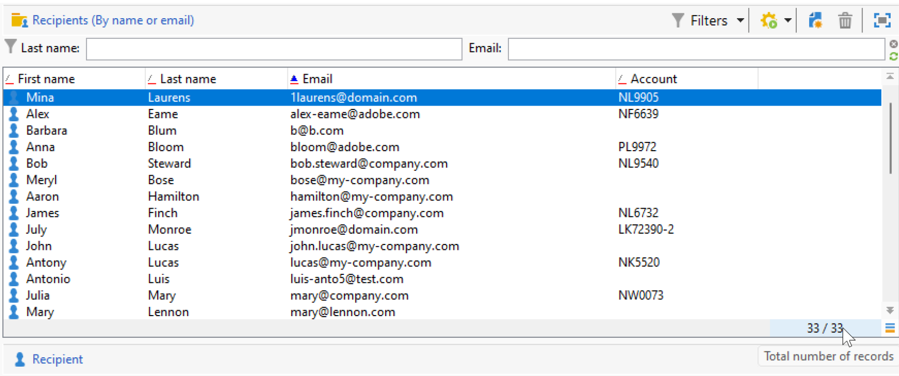

# Impostazioni dell’interfaccia utente di Campaign {#ui-settings}

## Unità predefinite {#default-units}

In Adobe Campaign, per i campi che esprimono una durata (ad esempio il periodo di validità delle risorse, il termine di approvazione di un&#39;attività, ecc.), i valori possono essere espressi nei seguenti **unità**:

* **[!UICONTROL s]** per secondi
* **[!UICONTROL mn]** per minuti
* **[!UICONTROL h]** per ore
* **[!UICONTROL d]** per giorni

## Personalizzare Campaign Explorer{#customize-explorer}

Puoi aggiungere cartelle a Esplora risorse di Campaign, creare visualizzazioni e assegnare autorizzazioni.

Scopri come gestire cartelle e viste in [questa pagina](../audiences/folders-and-views.md)

## Gestire e personalizzare gli elenchi{#customize-lists}

Nella console del client Campaign, i dati vengono visualizzati negli elenchi. È possibile adattare questi elenchi alle proprie esigenze. Ad esempio, puoi aggiungere colonne, filtrare dati, contare record, salvare e condividere le impostazioni.

Inoltre, puoi creare e salvare i filtri.  Ulteriori informazioni sui filtri in [questa pagina](../audiences/create-filters.md).

### Numero di record {#number-of-records}

Per impostazione predefinita, Adobe Campaign carica i primi 200 record di un elenco. Ciò significa che il display non mostra necessariamente tutti i record della tabella che stai visualizzando. È possibile eseguire un conteggio del numero di record nell&#39;elenco e caricare altri record.

Nella parte in basso a destra della schermata dell’elenco, un **contatore** mostra quanti record sono stati caricati e il numero totale di record nel database (dopo aver applicato eventuali filtri):

Se compare un punto interrogativo invece del numero a destra, come `240/?`, fai clic sul contatore per avviare il calcolo.

Per caricare e visualizzare record aggiuntivi fai clic su **[!UICONTROL Continue loading]**. Per impostazione predefinita, vengono caricati 200 record. Per modificare il numero predefinito di record da caricare, utilizzare il **[!UICONTROL Configure list]** nell’angolo in basso a destra dell’elenco. Nella finestra di configurazione dell’elenco, fai clic su **[!UICONTROL Advanced parameters]** (in basso a sinistra) e modifica il numero di righe da recuperare.

Per caricare tutti i record, fare clic con il pulsante destro del mouse sull&#39;elenco e selezionare **[!UICONTROL Load all]**.

>[!CAUTION]
>
>Quando un elenco contiene un volume elevato di record, il caricamento completo può richiedere del tempo.

### Aggiungi e rimuovi colonne {#add-columns}

Per ogni elenco, la configurazione di colonna incorporata può essere adattata per visualizzare ulteriori informazioni o nascondere colonne non utilizzate.

Quando i dati sono visibili nei dettagli di un record, fare clic con il pulsante destro del mouse sul campo e selezionare **[!UICONTROL Add in the list]**.

La colonna viene aggiunta a destra delle colonne esistenti.

È inoltre possibile utilizzare la schermata di configurazione dell’elenco per aggiungere e rimuovere colonne:

1. Da un elenco di record, fare clic su **[!UICONTROL Configure list]** nella sezione in basso a destra.
1. Fai doppio clic sui campi da aggiungere nella **[!UICONTROL Available fields]** elenco: vengono aggiunti al **[!UICONTROL Output columns]** elenco.

   

   >[!NOTE]
   >
   >Per impostazione predefinita, i campi avanzati non vengono visualizzati. Per visualizzarli, fai clic sul pulsante **Visualizza campi avanzati** nella sezione in basso a destra dell’elenco dei campi disponibili.
   >
   >I campi sono identificati da icone specifiche: Campi SQL, tabelle collegate, campi calcolati, ecc. Per ciascun campo selezionato, la descrizione viene visualizzata sotto l’elenco dei campi disponibili.

1. Utilizza le frecce verso l’alto o il basso per modificare il **ordine di visualizzazione**.

1. Fai clic su **[!UICONTROL OK]** per confermare la configurazione e visualizzare il risultato.

Per rimuovere una colonna, selezionala e fai clic sul pulsante **Cestino** icona.

È possibile utilizzare **[!UICONTROL Distribution of values]** per visualizzare la partizione dei valori per il campo selezionato nella cartella corrente.

### Crea una nuova colonna {#create-a-new-column}

È possibile creare nuove colonne per visualizzare campi aggiuntivi nell’elenco.

Per creare una colonna, effettua le seguenti operazioni:

1. Da un elenco di record, fare clic su **[!UICONTROL Configure list]** nella sezione in basso a destra.
1. Fai clic sul pulsante **[!UICONTROL Add]** per visualizzare un nuovo campo nell’elenco.
1. Configura il campo da aggiungere nella colonna .

### Visualizzazione dei dati nelle sottocartelle {#display-sub-folders-records}

Gli elenchi possono essere visualizzati:

* Tutti i record contenuti nella cartella selezionata (impostazione predefinita)
* Tutti i record contenuti nella cartella selezionata e nelle relative sottocartelle

Per passare da una modalità di visualizzazione all&#39;altra, fare clic su **[!UICONTROL Display sub-levels]** nella barra degli strumenti di Campaign.

### Salvare una configurazione di elenco {#saving-a-list-configuration}

Le configurazioni dell’elenco sono definite localmente per ogni utente. Quando la cache locale viene svuotata, le configurazioni locali vengono disabilitate.

Per impostazione predefinita, i parametri di impostazione si applicano a tutti gli elenchi con il tipo di cartella corrispondente. Quando modifichi la modalità di visualizzazione dell’elenco dei destinatari da una cartella, questa configurazione viene applicata a tutte le altre cartelle dei destinatari.

È possibile salvare più di una configurazione da applicare a cartelle diverse dello stesso tipo. La configurazione viene salvata con le proprietà della cartella contenente i dati e può essere riapplicata.

Per salvare una configurazione di elenco in modo che possa essere riutilizzata, segui i passaggi seguenti:

1. In Esplora risorse fare clic con il pulsante destro del mouse sulla cartella contenente i dati visualizzati.
1. Seleziona **[!UICONTROL Properties]**.
1. Fai clic su **[!UICONTROL Advanced settings]** e quindi specifica un nome nella **[!UICONTROL Configuration]** campo .
1. Fai clic su **[!UICONTROL OK]** quindi fai clic su **[!UICONTROL Save]**.

Puoi quindi applicare questa configurazione a qualsiasi altra cartella dello stesso tipo. Ulteriori informazioni sulle cartelle in [questa pagina](../audiences/folders-and-views.md).

### Esportare un elenco {#exporting-a-list}

Per esportare i dati da un elenco, è necessario utilizzare una procedura guidata di esportazione. Per accedervi, seleziona gli elementi da esportare dall’elenco, fai clic con il pulsante destro del mouse e seleziona **[!UICONTROL Export...]**.

<!--The use of the import and export functions is explained in [Generic imports and exports](../../platform/using/about-generic-imports-exports.md).-->

>[!CAUTION]
>
>Gli elementi di un elenco non devono essere esportati utilizzando la funzione Copia/Incolla .

### Ordinare un elenco {#sorting-a-list}

Gli elenchi possono contenere una grande quantità di dati. Puoi ordinare questi dati o applicare filtri semplici o avanzati. L’ordinamento consente di visualizzare i dati in ordine crescente o decrescente. I filtri ti consentono di definire e combinare criteri per visualizzare solo i dati selezionati.

Fai clic sull’intestazione della colonna per applicare un ordinamento crescente o decrescente o per annullare l’ordinamento dei dati. Lo stato di ordinamento e l’ordine di ordinamento attivi sono indicati da una freccia blu prima dell’etichetta della colonna. Un trattino rosso prima dell’etichetta della colonna indica che l’ordinamento viene applicato ai dati indicizzati dal database. Questo metodo di ordinamento viene utilizzato per ottimizzare i processi di ordinamento.

Puoi anche configurare l’ordinamento o combinare criteri di ordinamento. A tale scopo, segui la procedura indicata di seguito:

1. **[!UICONTROL Configure list]** sotto e a destra dell&#39;elenco.
1. Nella finestra di configurazione dell’elenco, fai clic su **[!UICONTROL Sorting]** scheda .
1. Selezionare i campi da ordinare e la direzione di ordinamento (crescente o decrescente).
1. La priorità di ordinamento è definita dall&#39;ordine delle colonne di ordinamento. Per modificare la priorità, utilizza le icone appropriate per modificare l’ordine delle colonne.

   La priorità di ordinamento non influisce sulla visualizzazione delle colonne dell’elenco.

1. Fai clic su **[!UICONTROL Ok]** per confermare questa configurazione e visualizzare il risultato nell’elenco.

## Operazioni con le enumerazioni {#enumerations}

Un’enumerazione (nota anche come &quot;elenco dettagliato&quot;) è un elenco di valori suggeriti dal sistema per compilare i campi. Utilizza le enumerazioni per standardizzare i valori di questi campi, aiuto con l’input di dati o utilizzo all’interno delle query.

L’elenco dei valori viene visualizzato come elenco a discesa dal quale è possibile selezionare il valore da immettere nel campo. L’elenco a discesa abilita anche l’input predittivo: inserire le prime lettere e l&#39;applicazione riempie il resto.

I valori per questo tipo di campo sono definiti e l’amministrazione complessiva di questi campi (aggiunta/eliminazione di un valore) viene eseguita tramite la **[!UICONTROL Administration > Platform > Enumerations]** nodo dell&#39;albero.

### Tipi di enumerazioni {#types-of-enum}

Le enumerazioni sono memorizzate nel **[!UICONTROL Administration > Platform > Enumerations]** cartella dell&#39;esploratore.

Possono essere: Aperto, Sistema, Emoticon o Chiuso.

* Un **Apri** l’enumerazione consente agli utenti di aggiungere nuovi valori direttamente nei campi in base a questa enumerazione.
* A **Chiuso** l&#39;enumerazione ha un elenco fisso di valori che possono essere modificati solo dal **[!UICONTROL Administration > Platform > Enumerations]** cartella dell&#39;esploratore.
* Un **Emoticon** l’enumerazione viene utilizzata per aggiornare l’elenco di emoticon. Ulteriori informazioni
* A **Sistema** l&#39;enumerazione è associata ai campi di sistema ed è in arrivo con un nome interno.

Per **Apri** e **Chiuso** enumerazioni, sono disponibili opzioni specifiche:

* **Enumerazione semplice** è il tipo standard predefinito.
* **Pulizia degli alias** l&#39;enumerazione viene utilizzata per armonizzare i valori di enumerazione memorizzati nel database. [Ulteriori informazioni](#alias-cleansing)
* **Riservato per la legatura** è un&#39;opzione che consente di collegare i valori del cubo a questa enumerazione. [Ulteriori informazioni](../reporting/gs-cubes.md)

### Pulizia alias {#alias-cleansing}

Nei campi di enumerazione è possibile selezionare un valore oppure immettere un valore personalizzato non disponibile nell’elenco a discesa. I valori personalizzati possono essere aggiunti ai valori di enumerazione esistenti come nuovo - in questo caso, il **[!UICONTROL Open]** deve essere selezionata. Questi valori personalizzati possono essere puliti utilizzando le funzionalità di pulizia degli alias. Ad esempio, se un utente immette `Adob` anziché `Adobe`, il processo di pulizia degli alias può sostituirlo automaticamente con il termine corretto.

>[!CAUTION]
>
>La pulizia dei dati è un processo critico che influisce sui dati presenti nel database. Adobe Campaign esegue aggiornamenti di massa dei dati, che possono causare l’eliminazione di alcuni valori. Questa operazione è pertanto riservata agli utenti esperti.

Abilita la **[!UICONTROL Alias cleansing]** opzione per utilizzare le funzionalità di pulizia dei dati per un&#39;enumerazione. Quando questa opzione è selezionata, la **[!UICONTROL Alias]** viene visualizzata nella parte inferiore della finestra.

Quando un utente immette un valore che non esiste in un&#39;enumerazione di pulizia alias, viene aggiunto al **Valori** elenco. È possibile [creare alias da questi valori](#convert-to-alias)oppure [creare nuovi alias da zero](#create-alias).

#### Creare un alias{#create-alias}

Per creare un alias, effettua le seguenti operazioni:

1. Fai clic su **[!UICONTROL Add]** pulsante **[!UICONTROL Alias]** scheda .
1. Immettere l&#39;alias da convertire e selezionare il valore da applicare nell&#39;elenco a discesa.

   

1. Fai clic su **[!UICONTROL Ok]** e confermare.

1. Salva le modifiche. La sostituzione dei valori viene eseguita dal **Pulizia degli alias** flusso di lavoro che viene eseguito ogni notte. Fai riferimento a [Eseguire la pulizia dei dati](#running-data-cleansing).

Per tutti i campi basati su questa enumerazione, quando un utente immette il valore **Adobe** in un campo &quot;azienda&quot; (nella console Adobe Campaign, in un modulo web), viene automaticamente sostituito dal valore **Adobe**.

#### Convertire un valore errato in un alias{#convert-to-alias}

Puoi anche convertire un valore di enumerazione esistente in un alias. Per eseguire questa operazione:

1. Nell’elenco dei valori di un’enumerazione, fai clic con il pulsante destro del mouse e sfoglia per **[!UICONTROL Actions... > Convert values into aliases...]**.

   

1. Seleziona i valori da convertire in alias e fai clic su **[!UICONTROL Next]**.
1. Fai clic su **[!UICONTROL Start]** per eseguire la conversione.

   Una volta completata l’esecuzione, gli alias vengono aggiunti all’elenco, nella **Alias** scheda . È possibile associare un valore corretto per sostituire voci errate. Per eseguire questa operazione:

1. Seleziona un valore da pulire.
1. Fai clic sul pulsante **Dettagli...** pulsante .
1. Seleziona il nuovo valore nell’elenco a discesa.

   

>[!NOTE]
>
>Puoi tenere traccia delle occorrenze di un alias nella **[!UICONTROL Hits]** nella colonna **[!UICONTROL Alias]** sottoscheda . Può visualizzare il numero di volte in cui questo valore è stato immesso.  [Ulteriori informazioni](#calculate-entry-occurrences).

#### Eseguire la pulizia dei dati {#running-data-cleansing}

La pulizia dei dati viene eseguita dal **[!UICONTROL Alias cleansing]** flusso di lavoro tecnico. Per impostazione predefinita viene eseguito su base giornaliera.

La pulizia può essere attivata anche tramite il **[!UICONTROL Cleanse values...]** link.

La **[!UICONTROL Advanced parameters...]** link ti consente di impostare la data a partire dalla quale vengono presi in considerazione i valori raccolti.

Fai clic sul pulsante **[!UICONTROL Start]** pulsante per eseguire la pulizia dei dati.

##### Monitorare le occorrenze {#calculate-entry-occurrences}

La **[!UICONTROL Alias]** la sottoscheda di un’enumerazione può visualizzare il numero di occorrenze di un alias tra tutti i valori immessi. Queste informazioni sono una stima e verranno visualizzate nella **[!UICONTROL Hits]** colonna.

>[!CAUTION]
>
>Il calcolo delle occorrenze delle voci di alias può richiedere molto tempo.

Puoi eseguire manualmente il calcolo degli hit tramite **[!UICONTROL Cleanse values...]** link. A questo scopo, fai clic sul pulsante **[!UICONTROL Advanced parameters...]** e seleziona le opzioni.

* **[!UICONTROL Update the number of alias hits]**: questo consente di aggiornare gli hit già calcolati in base alla data immessa.
* **[!UICONTROL Recalculate the number of alias hits from the start]**: consente di eseguire il calcolo sull’intera piattaforma Adobe Campaign.

È inoltre possibile creare un flusso di lavoro dedicato affinché il calcolo venga eseguito automaticamente per un determinato periodo, ad esempio una volta alla settimana.

A questo scopo, crea una copia del **[!UICONTROL Alias cleansing]** , modifica la pianificazione e utilizza le seguenti impostazioni nel **[!UICONTROL Enumeration value cleansing]** attività:

* **-updateHits** per aggiornare il numero di hit di alias,
* **-updateHits:full** per ricalcolare tutti gli hit di alias.
