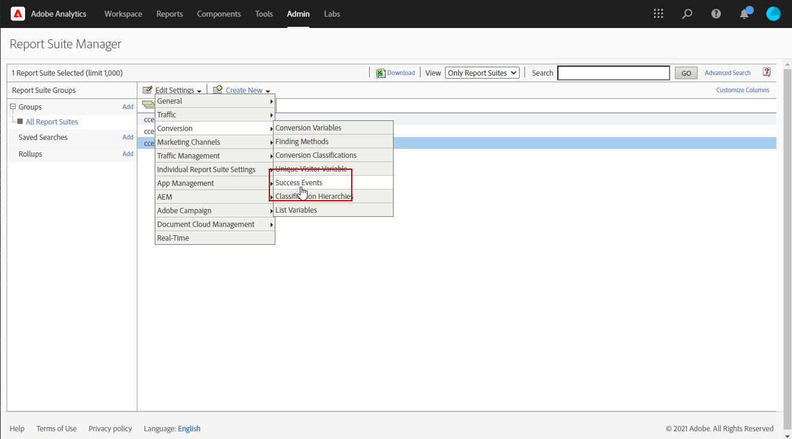

# Utilizzare Campaign e Adobe Analytics {#ac-aa}

Puoi configurare Adobe Analytics per integrare Campaign e Analytics.

Questa integrazione consente ad Adobe Campaign e Adobe Analytics di interagire tramite il componente aggiuntivo **Connettori di analisi web**. Questa integrazione invia ad Adobe Analytics indicatori e attributi delle campagne e-mail consegnate da Adobe Campaign.

>[!NOTE]
>
>In qualità di utente di Cloud Service gestiti, [contatta l&#39;Adobe](../start/campaign-faq.md#support) per collegare Campaign ai servizi e alle soluzioni di Adobe Experience Cloud. Il componente aggiuntivo Connettore Web Analytics deve essere installato nell’ambiente tramite il pacchetto dedicato.

Utilizzando il connettore Adobe Analytics, Adobe Campaign ha un modo di misurare il pubblico Internet (analisi web). Gli strumenti di analisi web consentono ad Adobe Campaign di inoltrare indicatori e attributi della campagna ad Analytics.

Il perimetro di azione di ciascun utensile è il seguente:

* **Adobe Analytics** contrassegna le campagne e-mail avviate con Adobe Campaign

* **Adobe Campaign** invia gli indicatori e gli attributi della campagna al connettore, che a sua volta li inoltra allo strumento di analisi web

>[!CAUTION]
>
>Il connettore Adobe Analytics non è compatibile con la messaggistica transazionale (Centro messaggi).

Per impostare la connessione Campaign-Analytics, è necessario eseguire le operazioni seguenti:

1. [Creare la suite di rapporti in Adobe Analytics](#report-suite-analytics)
1. [Configurare le variabili di conversione e gli eventi di successo](#configure-conversion-success)
1. [Configurare l’account esterno in Adobe Campaign](#external-account-ac)

## Creare la suite di rapporti di Analytics {#report-suite-analytics}

Per creare **[!UICONTROL Report suite]** in [!DNL Adobe Analytics], eseguire la procedura seguente:

1. Da [!DNL Adobe Analytics], seleziona la **[!UICONTROL Admin tab]** e fai clic su **[!UICONTROL All admin]**.

   

1. Fai clic su **[!UICONTROL Report suites]**.

   

1. Dalla pagina **[!UICONTROL Report suite manager]**, fai clic su **[!UICONTROL Create new]** e quindi su **[!UICONTROL Report suite]**.

   Per la procedura dettagliata sulla creazione di **[!UICONTROL Report suite]**, consulta [Documentazione di Adobe Analytics](https://experienceleague.adobe.com/docs/analytics/admin/manage-report-suites/new-report-suite/t-create-a-report-suite.html#prerequisites){target="_blank"}.

   

1. Seleziona un modello.

1. Configura la nuova suite di rapporti con le seguenti informazioni:

   * **[!UICONTROL Report Suite ID]**
   * **[!UICONTROL Site Title]**
   * **[!UICONTROL Time Zone]**
   * **[!UICONTROL Go Live Date]**
   * **[!UICONTROL Estimated Page Views Per Day]**

   

1. Una volta configurata, fai clic su **[!UICONTROL Create report suite]**.

## Configurare le variabili di conversione e gli eventi di successo {#configure-conversion-success}

Dopo aver creato la **[!UICONTROL Report suite]**, è necessario configurare **[!UICONTROL Conversion variables]** e **[!UICONTROL Success events]** come segue:

1. Seleziona la **[!UICONTROL Report suite]** configurata in precedenza.

1. Dal pulsante **[!UICONTROL Edit settings]**, seleziona **[!UICONTROL Conversion]** > **[!UICONTROL Conversion variables]**.

   

1. Fai clic su **[!UICONTROL Add new]** per creare gli identificatori necessari per misurare l’impatto della campagna e-mail, ovvero il nome della campagna interna (cid) e l’ID della tabella iNmsBroadlog (bid).

   Per informazioni su come modificare **[!UICONTROL Conversion variables]**, consulta questa [documentazione di Adobe Analytics](https://experienceleague.adobe.com/docs/analytics/admin/admin-tools/conversion-variables/t-conversion-variables-admin.html#admin-tools){target="_blank"}.

   

1. Al termine della configurazione, fai clic su **[!UICONTROL Save]**.

1. Quindi, per creare **[!UICONTROL Success events]**, seleziona **[!UICONTROL Conversion]** > **[!UICONTROL Success events]** dal pulsante **[!UICONTROL Edit settings]**.

   

1. Fai clic su **[!UICONTROL Add new]** per configurare i seguenti **[!UICONTROL Success events]**:

   * **[!UICONTROL Clicked]**
   * **[!UICONTROL Opened]**
   * **[!UICONTROL Person clicks]**
   * **[!UICONTROL Processed]**
   * **[!UICONTROL Scheduled]**
   * **[!UICONTROL Sent]**
   * **[!UICONTROL Total bounces]**
   * **[!UICONTROL Unique Clicks]**
   * **[!UICONTROL Unique Opens]**
   * **[!UICONTROL Unsubscribed]**

   Per informazioni su come configurare **[!UICONTROL Success events]**, consulta questa [documentazione di Adobe Analytics](https://experienceleague.adobe.com/docs/analytics/admin/admin-tools/manage-report-suites/edit-report-suite/conversion-variables/success-event.html)

   

1. Al termine della configurazione, fai clic su **[!UICONTROL Save]**.

Quando la suite di rapporti è configurata, dovrai configurare **[!UICONTROL External accounts]** in Adobe Campaign.

## Configurare l’account esterno di Campaign {#external-account-ac}

Ora devi configurare l’account esterno **[!UICONTROL Web Analytics]** in Adobe Campaign per abilitare la sincronizzazione tra le due soluzioni.

Nota che se uno dei **[!UICONTROL Report suite]**, **[!UICONTROL Conversion variables]** o **[!UICONTROL Success events]** non è visibile durante la configurazione dell’account esterno, significa che manca un’autorizzazione per questo componente appena creato nel **[!UICONTROL Product profile]** associato all’utente.

Per ulteriori informazioni, consulta la pagina [Profili di prodotto per Adobe Analytics](https://experienceleague.adobe.com/docs/analytics/admin/admin-console/permissions/product-profile.html#product-profile-admins){target="_blank"}.

1. Selezionare la cartella **[!UICONTROL Administration]** > **[!UICONTROL Platform]** > **[!UICONTROL External accounts]** della struttura Adobe Campaign Explorer e fare clic su **[!UICONTROL New]**.

   

1. Utilizza l’elenco a discesa per selezionare il tipo **[!UICONTROL Web Analytics]** e **[!UICONTROL Adobe Analytics]** dal menu a discesa **[!UICONTROL Integration]**.

   

1. Fai clic su **[!UICONTROL Configure]** accanto al menu a discesa **[!UICONTROL Integration]**.

1. Dalla finestra **[!UICONTROL Configure Analytics integration]**, mappa il tuo account esterno con la suite di rapporti creata in precedenza, fornendo le seguenti informazioni:

   * **[!UICONTROL E-Mail]**
   * **[!UICONTROL IMS Org]**
   * **[!UICONTROL Analytics Company]**
   * **[!UICONTROL Report Suite]**

1. Dalla categoria **[!UICONTROL eVars]**, mappa le due **[!UICONTROL Conversion variables]** configurate in [!DNL Adobe Analytics].

   >[!NOTE]
   >
   >I campi ID campagna e ID caricamento sono raccolti tramite JavaScript nella pagina di destinazione o tramite le regole di elaborazione. [Ulteriori informazioni sulle regole di elaborazione](https://experienceleague.adobe.com/en/docs/analytics/admin/admin-tools/manage-report-suites/edit-report-suite/report-suite-general/c-processing-rules/processing-rules)

   

1. Dalla categoria **[!UICONTROL Events]**, mappa i dieci **[!UICONTROL Success events]** configurati in [!DNL Adobe Analytics].

1. Al termine della configurazione, fai clic su **[!UICONTROL Submit]**. Adobe Campaign creerà una **[!UICONTROL Data source]**, **[!UICONTROL Calculated metrics]**, **[!UICONTROL Remarketing segments]** e **[!UICONTROL Classifications]** nella **[!UICONTROL Report Suite]** mappata di Analytics.

   Al termine della sincronizzazione tra [!DNL Adobe Analytics] e Adobe Campaign, puoi chiudere la finestra.

1. Le impostazioni possono essere visualizzate dalla scheda **[!UICONTROL Data Settings]** della finestra **[!UICONTROL Configure Analytics integration]**.

   Utilizzando il pulsante **[!UICONTROL Sync]**, [!DNL Adobe Campaign] sincronizzerà le modifiche al nome effettuate in [!DNL Adobe Analytics]. Se il componente viene eliminato in [!DNL Adobe Analytics], il componente verrà barrato in [!DNL Adobe Campaign] o visualizzato con un messaggio **non trovato**.

   

   >[!NOTE]
   >
   > Non è possibile aggiungere o rimuovere segmenti in questa versione di Campaign v8.

1. Dall’**[!UICONTROL External account]**, fai clic sul collegamento **[!UICONTROL Enrich the formula...]** per modificare la formula di calcolo dell’URL per specificare le informazioni sull’integrazione dello strumento di analisi web (ID campagna) e i domini dei siti di cui è necessario tenere traccia dell’attività.

   

1. Specifica i nomi di dominio dei siti.

   

1. Fai clic su **[!UICONTROL Next]** e assicurati che i nomi di dominio siano stati salvati.

   

1. Se necessario, è possibile sovraccaricare la formula di calcolo. A questo scopo, seleziona la casella e modifica la formula direttamente nella finestra.

   >[!IMPORTANT]
   >
   >Questa modalità di configurazione è riservata agli utenti esperti: eventuali errori in questa formula possono causare consegne e-mail interrotte.

1. La scheda **[!UICONTROL Advanced]** ti consente di configurare o modificare le impostazioni tecniche.

   * **[!UICONTROL Lifespan]**: consente di specificare il ritardo (in giorni) dopo il quale gli eventi web vengono recuperati in Adobe Campaign dai flussi di lavoro tecnici. Predefinito: 180 giorni.
   * **[!UICONTROL Persistence]**: consente di specificare il periodo durante il quale tutti gli eventi web (ad esempio, un acquisto) possono essere attribuiti a una campagna di remarketing, predefinito: 7 giorni.

>[!NOTE]
>
>Se utilizzi diversi strumenti di misurazione del pubblico, puoi selezionare **[!UICONTROL Other]** nell’elenco a discesa **[!UICONTROL Partners]** durante la creazione dell’account esterno. Puoi fare riferimento a un solo account esterno nelle proprietà di consegna: sarà quindi necessario adattare la formula degli URL tracciati aggiungendo i parametri previsti dallo strumento di misurazione Adobe e da tutti gli altri strumenti di misurazione utilizzati.

## Flusso di lavoro tecnico dei processi di analisi web {#technical-workflows-of-web-analytics-processes}

Lo scambio di dati tra Adobe Campaign e Adobe Analytics viene gestito da un flusso di lavoro tecnico in esecuzione come attività in background.

Questo flusso di lavoro è disponibile nella struttura di Esplora campagne, nella cartella **[!UICONTROL Administration]** > **[!UICONTROL Production]** > **[!UICONTROL Technical workflows]** > **[!UICONTROL Web analytics process]**.

Il flusso di lavoro **[!UICONTROL Sending of indicators and campaign attributes]** consente di inviare gli indicatori della campagna e-mail tramite Adobe Campaign a Adobe Experience Cloud utilizzando il connettore Adobe Analytics. Questo flusso di lavoro viene attivato alle 4 del mattino ogni giorno e possono essere necessarie 24 ore per l’invio dei dati ad Analytics.

Tieni presente che questo flusso di lavoro non deve essere riavviato altrimenti invierà nuovamente tutti i dati precedenti che possono distorcere i risultati di Analytics.

Gli indicatori interessati sono i seguenti:

* **[!UICONTROL Messages to deliver]** (@toDeliver)
* **[!UICONTROL Processed]** (@processed)
* **[!UICONTROL Success]** (@success)
* **[!UICONTROL Total count of opens]** (@totalRecipientOpen)
* **[!UICONTROL Recipients who have opened]** (@recipientOpen)
* **[!UICONTROL Total number of recipients who clicked]** (@totalRecipientClick)
* **[!UICONTROL People who clicked]** (@personClick)
* **[!UICONTROL Number of distinct clicks]** (@recipientClick)
* **[!UICONTROL Opt-Out]** (@optOut)
* **[!UICONTROL Errors]** (@error)

>[!NOTE]
>
>I dati inviati sono il delta basato sull’ultima istantanea che può portare a un valore negativo nei dati della metrica.

Gli attributi inviati sono i seguenti:

* **[!UICONTROL Internal name]** (@internalName)
* **[!UICONTROL Label]** (@label)
* **[!UICONTROL Label]** (operation/@label): solo se il pacchetto **Campaign** è installato
* **[!UICONTROL Nature]** (operation/@nature): solo se il pacchetto **Campaign** è installato
* **[!UICONTROL Tag 1]** (webAnalytics/@tag1)
* **[!UICONTROL Tag 2]** (webAnalytics/@tag2)
* **[!UICONTROL Tag 3]** (webAnalytics/@tag3)
* **[!UICONTROL Contact date]** (scheduling/@contactDate)

## Tracciare le consegne {#tracking-deliveries-in-adobe-campaign}

Affinché Adobe Experience Cloud sia in grado di monitorare l’attività sui siti una volta inviata la consegna da Adobe Campaign, è necessario fare riferimento al connettore corrispondente nelle proprietà di consegna. A questo scopo, esegui i seguenti passaggi:

1. Apri la consegna della campagna da tracciare.

   

1. Apri le proprietà di consegna.
1. Vai alla scheda **[!UICONTROL Web Analytics]** e seleziona l’account esterno creato in precedenza. Consulta [Configurare l&#39;account esterno in Adobe Campaign](#external-account-ac).

   

1. Ora puoi inviare la consegna e accedere al relativo rapporto in Adobe Analytics.

## Creare una campagna di remarketing {#create-a-re-marketing-campaign}

Per preparare la campagna di remarketing, è sufficiente creare modelli di consegna da utilizzare per campagne di tipo remarketing. Quindi configura la tua campagna di remarketing e collegala a un segmento. Ogni segmento deve avere una campagna di remarketing diversa.

Le campagne di remarketing vengono avviate automaticamente una volta che Adobe Campaign ha completato il recupero dei segmenti analizzando il comportamento delle persone target della campagna iniziale. In caso di abbandono del carrello o di visualizzazione del prodotto senza un acquisto, viene inviata una consegna ai destinatari interessati affinché la loro navigazione sul sito finalizzi il loro acquisto.

Adobe Campaign fornisce modelli di consegna personalizzati su cui puoi utilizzare o creare un database per preparare le campagne.

1. Dalla cartella **[!UICONTROL Explorer]**, vai alla cartella **[!UICONTROL Resources]** > **[!UICONTROL Templates]** > **[!UICONTROL Delivery templates]** della struttura Adobe Campaign.
1. Duplica il modello **[!UICONTROL Email delivery (re-marketing)]** o gli esempi di modelli di remarketing offerti da Adobe Campaign.
1. Personalizza il modello in base alle tue esigenze e salvalo.
1. Crea una nuova campagna e seleziona il modello **[!UICONTROL Re-marketing campaign]** dall’elenco a discesa.
1. Fai clic sul collegamento **[!UICONTROL Configure...]** per specificare il segmento e il modello di consegna collegati alla campagna.
1. Selezionare l&#39;account Analytics e[esterno](#external-account-ac) e il segmento interessato.
1. Seleziona il modello di consegna da utilizzare per la campagna di remarketing, quindi fai clic su **[!UICONTROL Finish]** per chiudere la finestra.
1. Fai clic su **[!UICONTROL OK]** per chiudere la finestra della campagna.

Il rapporto **[!UICONTROL Re-marketing efficiency]** è accessibile tramite la pagina dei report globali. Ti consente di visualizzare il numero di contatti convertiti (ovvero che hanno acquistato qualcosa) in relazione al numero di abbandoni del carrello a seguito della campagna di remarketing Adobe Campaign. Il tasso di conversione viene calcolato per settimana, mese o dall’inizio della sincronizzazione tra Adobe Campaign e Adobe Analytics.

**Argomenti correlati**

* [Campaign - Integrazione con Experience Cloud Triggers](ac-triggers.md)
