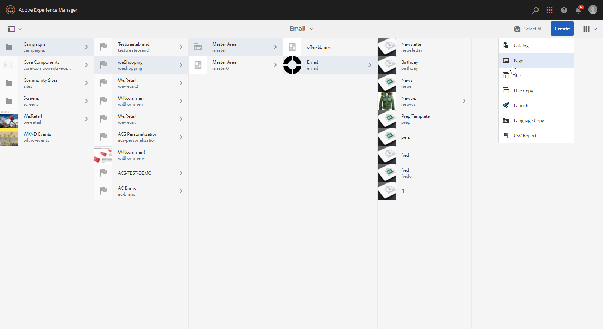
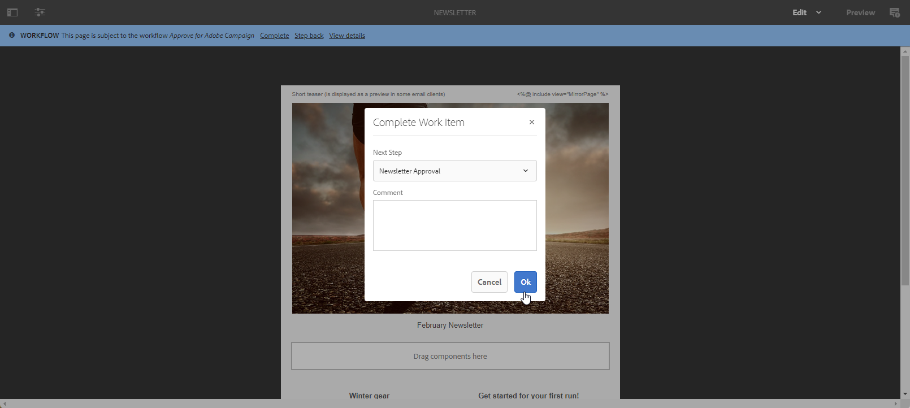
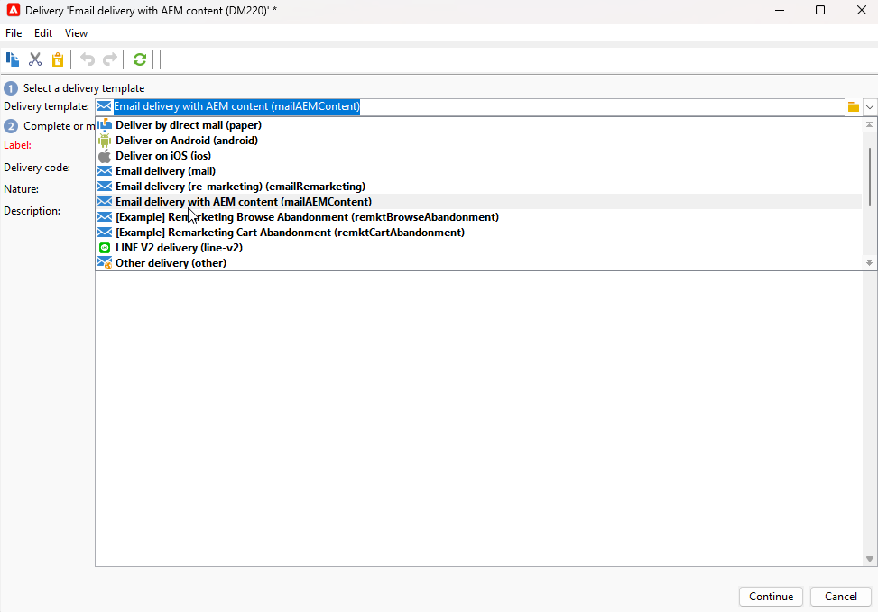
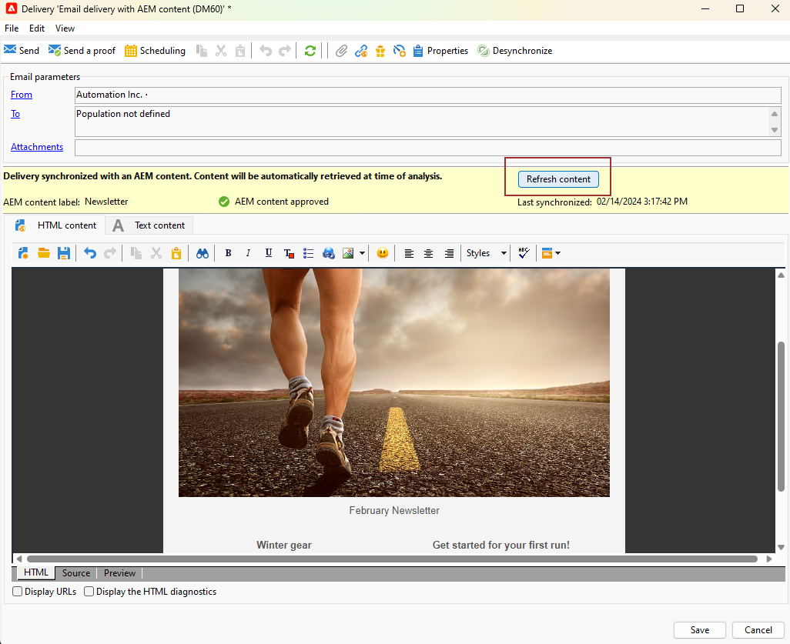
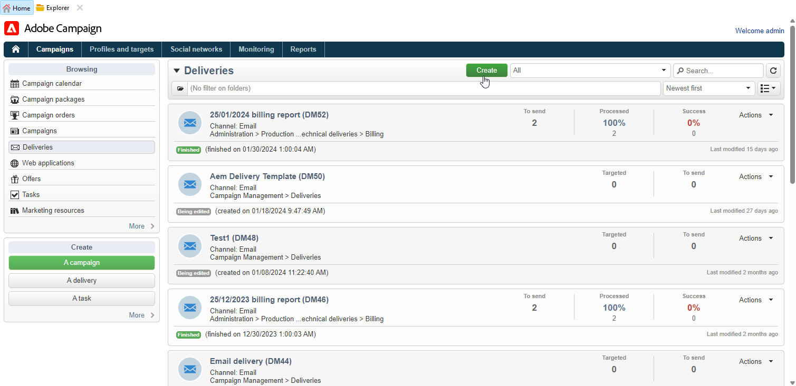

# Utilizzare Campaign e Adobe Experience Manager {#ac-aem}

L’integrazione tra Adobe Campaign e Adobe Experience Manager consente di gestire il contenuto delle consegne e-mail e dei moduli direttamente in Adobe Experience Manager.

[Scopri come modificare il contenuto di Adobe Experience Manager as Cloud Service nell&#39;interfaccia Web di Campaign](https://experienceleague.adobe.com/docs/campaign-web/v8/integrations/aem-content.html){target="_blank"}.

[Ulteriori informazioni su Adobe Experience Manager in questo documento](https://experienceleague.adobe.com/docs/experience-manager-65/administering/integration/campaignonpremise.html#aem-and-adobe-campaign-integration-workflow){target="_blank"}.

>[!NOTE]
>
>In qualità di utente di Managed Cloud Services, [contatta Adobe](../start/campaign-faq.md#support) per integrare Adobe Experience Manager con Campaign.

## Importa contenuto da Adobe Experience Manager {#integrating-with-aem}

Questa integrazione può essere utilizzata, ad esempio, per creare una newsletter in Adobe Experience Manager che verrà quindi utilizzata in Adobe Campaign come parte di una campagna e-mail.

**Da Adobe Experience Manager:**

1. Passa all&#39;istanza dell&#39;autore [!DNL Adobe Experience Manager] e fai clic su Adobe Experience nell&#39;angolo superiore sinistro della pagina. Scegliere **[!UICONTROL Sites]** dal menu.

   

1. Accedi a **[!UICONTROL Campaigns > Name of your brand (here we.Shopping) > Main Area > Email]**.

1. Fare clic su **[!UICONTROL Create]** e selezionare **[!UICONTROL Page]** dal menu a discesa.

   

1. Seleziona il modello **[!UICONTROL Adobe Campaign Email]** e assegna un nome alla newsletter.

1. Dopo aver creato la pagina, accedere al menu **[!UICONTROL Page information]** e fare clic su **[!UICONTROL Open Properties]**.

   

1. Personalizza il contenuto delle e-mail aggiungendo componenti, ad esempio campi di personalizzazione di Adobe Campaign. Ulteriori informazioni sono disponibili nella [documentazione di Adobe Experience Manager](https://experienceleague.adobe.com/docs/experience-manager-65/content/sites/authoring/aem-adobe-campaign/campaign.html#editing-email-content){target="_blank"}.

1. Quando l&#39;e-mail è pronta, passa al menu **[!UICONTROL Page information]** e fai clic su **[!UICONTROL Start workflow]**.

   

1. Dal primo elenco a discesa, selezionare **[!UICONTROL Approve Adobe Campaign]** come modello di flusso di lavoro e fare clic su **[!UICONTROL Start workflow]**.

   

1. Nella parte superiore della pagina verrà visualizzata una dichiarazione di non responsabilità che indica `This page is subject to the workflow Approve for Adobe Campaign`. Fare clic su **[!UICONTROL Complete]** accanto alla liberatoria per confermare la revisione e fare clic su **[!UICONTROL Ok]**.

1. Fare di nuovo clic su **[!UICONTROL Complete]** e selezionare **[!UICONTROL Newsletter approval]** nel menu a discesa **[!UICONTROL Next Step]**.

   

La newsletter è ora pronta e sincronizzata in Adobe Campaign.

**Da Adobe Campaign:**

1. Dalla scheda **[!UICONTROL Campaigns]**, fai clic su **[!UICONTROL Deliveries]** e quindi su **[!UICONTROL Create]**.

1. Scegliere il modello **[!UICONTROL Email delivery with AEM content (mailAEMContent)]** dal menu a discesa **[!UICONTROL Delivery template]**.

   

1. Aggiungi **[!UICONTROL Label]** alla consegna e fai clic su **[!UICONTROL Continue]**.

1. Fai clic su **[!UICONTROL Synchronize]** per accedere alle tue consegne AEM.

   Se il pulsante non è visibile nell&#39;interfaccia, passare al pulsante **[!UICONTROL Properties]** e accedere alla scheda **[!UICONTROL Advanced]**. Assicurati che il campo **[!UICONTROL Content editing mode]** sia configurato per **[!UICONTROL AEM]** e inserisci i dettagli dell&#39;istanza di AEM nel campo **[!UICONTROL AEM account]**.

   

1. Selezionare la consegna AEM creata in precedenza in [!DNL Adobe Experience Manager] e confermare facendo clic su **[!UICONTROL Ok]**.

   

1. Assicurati di fare clic sul pulsante **[!UICONTROL Refresh content]** ogni volta che vengono apportate modifiche alla consegna AEM.

   

1. Per rimuovere il collegamento tra Experience Manager e Campaign, fare clic su **[!UICONTROL Desynchronize]**.

L’e-mail è ora pronta per essere inviata al pubblico.

## Importare risorse dalla libreria Adobe Experience Manager Assets {#assets-library}

Puoi anche inserire direttamente le risorse da [!DNL Adobe Experience Manager Assets Library] durante la modifica di un&#39;e-mail o di una pagina di destinazione in Adobe Campaign. Questa funzionalità è descritta nella [documentazione di Adobe Experience Manager Assets](https://experienceleague.adobe.com/docs/experience-manager-65/content/assets/managing/manage-assets.html){target="_blank"}.

**Da Adobe Experience Manager:**

1. Passa all&#39;istanza dell&#39;autore [!DNL Adobe Experience Manager] e fai clic su Adobe Experience nell&#39;angolo superiore sinistro della pagina. Scegliere **[!UICONTROL Assets]** `>` **[!UICONTROL Files]** dal menu.

   

1. Fai clic su **Crea** e quindi su **File** per importare la risorsa nella **Libreria Adobe Experience Manager Assets**. Ulteriori informazioni sono disponibili nella [documentazione di Adobe Experience Manager](https://experienceleague.adobe.com/docs/experience-manager-65/content/assets/managing/manage-assets.html#uploading-assets){target="_blank"}.

   

1. Se necessario, rinomina la risorsa e seleziona **Carica**.

La risorsa è stata caricata nella **libreria Adobe Experience Manager Assets**.

**Da Adobe Campaign:**

1. In Adobe Campaign, crea una nuova consegna sfogliando la scheda **Campagne**, fai clic su **Consegne** e fai clic sul pulsante **Crea** sopra l&#39;elenco delle consegne esistenti.

   

1. Seleziona un **modello di consegna**, quindi assegna un nome alla consegna.

1. Definisci e personalizza il contenuto del messaggio. [Ulteriori informazioni](../send/email.md)

1. Per utilizzare la **libreria Adobe Experience Manager Assets**, accedi a **[!UICONTROL Properties]** della consegna AEM e seleziona la scheda **[!UICONTROL Advanced]**.

   Scegli il tuo account **AEM** e abilita l&#39;opzione **[!UICONTROL Use above AEM instance as shared asset library]**.

   

1. Dall&#39;icona **Immagine**, accedere al menu **[!UICONTROL Select a shared asset]**.

   

1. Dalla finestra di selezione, seleziona un&#39;immagine dalla **libreria Adobe Experience Manager Assets**, quindi **Seleziona**.

   

La risorsa viene ora caricata nella consegna e-mail. Ora puoi specificare il pubblico di destinazione, confermare la consegna e procedere con l’invio.
