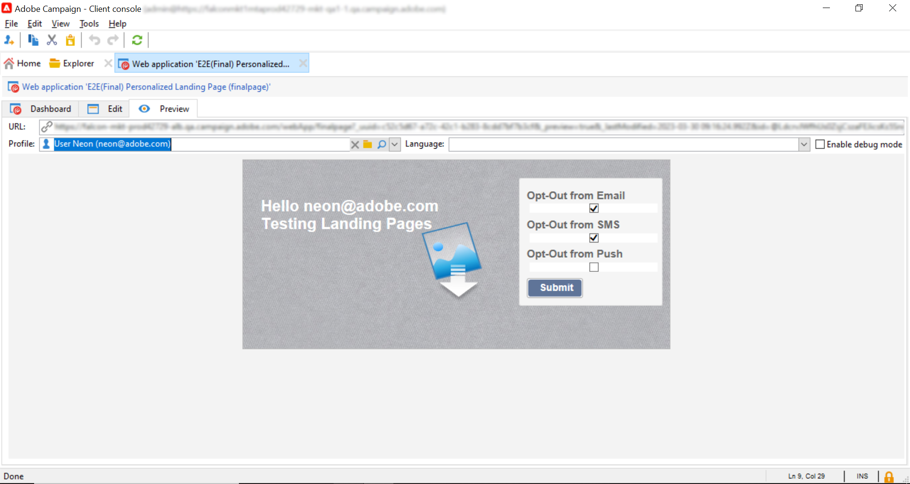

# Aggiornare i profili Adobe Experience Platform dalle pagine di destinazione di Adobe Campaign {#ac-aep-lp}

L’integrazione tra Adobe Campaign e Adobe Experience Platform consente di sincronizzare facilmente i dati del profilo tra le pagine di destinazione di Adobe Campaign e Adobe Experience Platform. Con questa integrazione, puoi:

* Recuperare gli attributi del profilo Adobe Experience Platform per visualizzare informazioni aggiornate nelle pagine di destinazione di Adobe Campaign
* Invia nuovamente gli attributi di profilo aggiornati a Adobe Experience Platform per aggiornare gli attributi corrispondenti in base a ciò che è stato compilato e inviato nelle pagine di destinazione.

I passaggi principali per configurare questa integrazione sono i seguenti:

<table>
<tr>
<td><p><a href="#oauth">Configurare una connessione OAuth</a></p></td>
<td><p><a href="#source">Creare una connessione HTTP API Source</a></p></td>
<td><p><a href="#xtk">Aggiungere opzioni di autenticazione in Campaign</a></p></td>
<td><p><a href="#javascript">Aggiungere codici JavaScript in Campaign</a></p></td>
<td><p><a href="#script">Configurare il flusso di lavoro per la pagina di destinazione</a></p></td>
</table>

## Configurare una connessione OAuth {#oauth}

Le API di Adobe Cloud Platform utilizzano il protocollo OAuth 2.0 per l’autenticazione e l’autorizzazione. Per collegare Adobe Experience Platform ad Adobe Campaign utilizzando le chiamate API, devi generare un token di accesso utilizzando l’integrazione OAuth creata in Adobe Developer Console.

Per farlo, segui questi passaggi:

1. Accedi a Adobe Developer Console.
1. Crea una nuova connessione API utilizzando il prodotto API di Adobe Experience Platform. I passaggi dettagliati su come ottenere un token di accesso OAuth 2.0 sono disponibili nella [documentazione di Adobe Developer Console](https://developer.adobe.com/developer-console/docs/guides/authentication/Tools/OAuthPlayground/).
1. Dopo aver creato la connessione, passa al menu **[!UICONTROL OAuth Server-to-Server]** e copia i dettagli riportati di seguito, necessari in Campaign per l&#39;autenticazione:

   * `CLIENT ID`
   * `CLIENT SECRET`
   * `ORGANIZATION ID`

   {width="70%"}

Dopo aver configurato la connessione Oauth, creare e configurare una nuova connessione Source **[!UICONTROL HTTP API]** per collegare Adobe Campaign a Adobe Experience Platform.

## Creare una connessione HTTP API Source {#source}

Una volta stabilita la connessione OAuth, il passaggio successivo consiste nel creare una connessione Source **[!UICONTROL HTTP API]** in Adobe Experience Platform. Questa connessione ti consente di inviare dati a Adobe Experience Platform in streaming utilizzando le API. Segui questi passaggi:

1. Passare a Adobe Experience Platform **[!UICONTROL Sources]**, cercare l&#39;origine **[!UICONTROL HTTP API]**, quindi fare clic su **[!UICONTROL Add data]**.

   {width="70%"}

1. Configura la connessione in base alle tue esigenze. Informazioni dettagliate su come configurare una connessione API HTTP sono disponibili nella [documentazione sulle origini di Adobe Experience Platform](https://experienceleague.adobe.com/docs/experience-platform/sources/ui-tutorials/create/streaming/http.html){target="_blank"}.

   Al passaggio **[!UICONTROL Authentication]**, attiva l&#39;opzione **[!UICONTROL Enable authentication]** per eseguire l&#39;autenticazione utilizzando il token di accesso generato in precedenza tramite l&#39;integrazione OAuth.

   {width="70%"}

1. Una volta configurata la connessione di origine, viene visualizzato l’endpoint di streaming. Questo endpoint è necessario per acquisire i dati in Adobe Experience Platform.

   {width="70%"}

   È inoltre possibile accedere a un esempio del formato dati acquisito in Adobe Experience Platform aprendo il flusso di dati appena creato dalla scheda **[!UICONTROL Dataflows]**.

   {width="70%"}

Ora che la connessione HTTP API Source è configurata, è necessario aggiungere opzioni specifiche in Adobe Campaign per abilitare la connessione a Adobe Experience Platform.

## Aggiungere opzioni di autenticazione in Adobe Campaign {#xtk}

Una volta configurata la connessione HTTP API Source, è necessario aggiungere opzioni specifiche ad Adobe Campaign per abilitare la connessione a Adobe Experience Platform. Questa operazione può essere eseguita nel menu Amministrazione campagna oppure durante l&#39;esecuzione del flusso di lavoro della pagina di destinazione aggiungendo un&#39;attività **[!UICONTROL JavaScript code]** specifica.

Sfoglia le schede seguenti per scoprire i due metodi:

>[!BEGINTABS]

>[!TAB Aggiungi opzioni dal menu Amministrazione]

1. Passare al menu **[!UICONTROL Administration]** > **[!UICONTROL Platform]** > **[!UICONTROL Options]**.
1. Aggiungi le seguenti opzioni con i valori corrispondenti da Adobe Developer Console:

   * IMS_CLIENT_ID = cryptString(CLIENT ID)
   * IMS_CLIENT_SECRET = cryptString(CLIENT SECRET)
   * IMS_ORG_ID = ID ORGANIZZAZIONE
   * IMS_CLIENT_API_KEY = cryptString(CLIENT ID)

   {width="70%"}

   >[!NOTE]
   >
   >La funzione cryptString() viene utilizzata per crittografare i dati di autenticazione.

>[!TAB Aggiungi opzioni tramite un&#39;attività codice JavaScript]

Per configurare automaticamente queste opzioni durante l&#39;esecuzione del flusso di lavoro delle pagine di destinazione, aggiungere un&#39;attività **[!UICONTROL JavaScript code]** al flusso di lavoro con il codice seguente. [Scopri come configurare un&#39;attività codice JavaScript](https://experienceleague.adobe.com/docs/campaign/automation/workflows/wf-activities/action-activities/sql-code-and-JavaScript-code.html#JavaScript-code){target="_blank"}.

Durante l’esecuzione del flusso di lavoro, le opzioni vengono create automaticamente nella console Campaign con i valori forniti.

```javascript
loadLibrary("xtk:shared/nl.js");
loadLibrary("xtk:shared/xtk.js");
loadLibrary("xtk:shared/json2.js");
loadLibrary("xtk:common.js");

function setAuthCredentials()
{
setOption("IMS_CLIENT_ID", cryptString('CLIENT ID'));
setOption("IMS_CLIENT_SECRET", cryptString('CLIENT SECRET'));
setOption("IMS_ORG_ID", cryptString('ORGANIZATION ID'));
setOption("IMS_CLIENT_API_KEY", cryptString('CLIENT ID'));
}
```

>[!ENDTABS]

Ora che in Campaign sono configurate le opzioni di autenticazione, devi creare codici JavaScript personalizzati per consentire la sincronizzazione dei dati tra Campaign e Adobe Experience Platform dalla pagina di destinazione.

## Aggiungi opzioni durante l’esecuzione del flusso di lavoro {#javascript}

Per consentire la sincronizzazione dei dati tra le pagine di destinazione e Adobe Experience Platform, è necessario aggiungere codici JavaScript personalizzati ad Adobe Campaign. Segui questi passaggi:

1. Passare al menu **[!UICONTROL Administration]** > **[!UICONTROL Configuration]** > **[!UICONTROL JavaScript codes]**.
1. Crea nuovi codici JavaScript e copia e incolla i frammenti seguenti.

   >[!NOTE]
   >
   >Il token di accesso e i dati di autenticazione vengono recuperati automaticamente dalle opzioni impostate in precedenza.

   {width="70%"}

   +++  Script 1 - Caricare gli attributi del profilo da Experience Platform

   Questo codice controlla se il profilo esiste in Adobe Experience Platform prima di caricare la pagina di destinazione. Recupera gli attributi del profilo e li visualizza nei campi corrispondenti della pagina di destinazione.

   ```javascript
   // API implementation to read profile from AEP
   function getProfileInfo(email)
   {
   var accessToken = getAccessToken();
   var request = new HttpClientRequest(('https://platform-stage.adobe.io/data/core/ups/access/entities?schema.name=_xdm.context.profile&entityId=' + email + '&entityIdNS=email&fields=identities,consents.marketing'));
   request.method = 'GET';
   request.header["Content-Type"] = "application/json";
   request.header["sandbox-name"] = "prod";
   request.header["x-gw-ims-org-id"] = getOption('IMS_ORG_ID');
   request.header["x-api-key"] = getOption('IMS_CLIENT_API_KEY');
   request.header["Authorization"] = "Bearer " + accessToken;
   request.execute();
   return request.response;
   }
   ```

   +++

   +++ Script 2 - Aggiornare gli attributi del profilo di Experience Platform

   Questo codice aggiorna gli attributi del profilo in Adobe Experience Platform con i valori inviati nella pagina di destinazione.

   ```javascript
   // API implementation to update profile in AEP
   loadLibrary("xtk:shared/nl.js");
   loadLibrary("xtk:shared/xtk.js");
   loadLibrary("xtk:shared/json2.js");
   loadLibrary("xtk:common.js");
   
   function updateProfileInAEP(profileUpdatePayload)
   {
   var accessToken = getAccessToken();
   var request = new HttpClientRequest('https://dcs-stg.adobedc.net/collection/64a300b84d61c0bcea4f0cd4ecaaa224a19477026d14f7e08b5408ffaf5e6162?syncValidation=false');
   request.method = 'POST';
   request.header["Content-Type"] = "application/json";
   request.header["sandbox-name"] = "prod";
   request.header["Authorization"] = "Bearer " + accessToken;
   var body = '{"header":{"schemaRef":{"id":"https://ns.adobe.com/campdev/schemas/35d8e567772e1a1093ed6cf9e41d2c1fec22eeb3a89583e1","contentType":"application/vnd.adobe.xed-full+json;version=1.0"},"imsOrgId":"A1F66F0D5C47D1950A494133@AdobeOrg","datasetId":"63c7fa2a20cce11b98cccb41","source":{"name":"testHTTPSourcesVinay - 03/06/2023 5:43 PM"}},"body":{"xdmMeta":{"schemaRef":{"id":"https://ns.adobe.com/campdev/schemas/35d8e567772e1a1093ed6cf9e41d2c1fec22eeb3a89583e1","contentType":"application/vnd.adobe.xed-full+json;version=1.0"}},"xdmEntity":' + profileUpdatePayload +'}}';
   request.body = body;
   request.execute();
   return request.response;
   }
   
   
   // Get Access token from OAuth-Server-to-server API call
   function getAccessToken() {
   var clientId = decryptString(getOption('IMS_CLIENT_ID'));
   var clientSecret = decryptString(getOption('IMS_CLIENT_SECRET'));
   var request = new HttpClientRequest(('https://ims-na1-stg1.adobelogin.com/ims/token/v2?grant_type=client_credentials' + '&client_id=' + clientId + '&client_secret=' + clientSecret + '&scope=openid,session,AdobeID,read_organizations,additional_info.projectedProductContext'));
   request.method = 'POST';
   request.execute();
   var response = request.response;
   if(response.code != 200){
   logError('GetAccessToken failed,', response.code, response.body);
   return;
   }
   var body = ''+response.body;
   var parsedResponse = JSON.parse(body);
   var accessToken = parsedResponse.access_token;
   logInfo("Access token generated successfully");
   return accessToken;
   }
   ```

   +++

Ora che i codici JavaScript personalizzati sono stati creati in Adobe Campaign, puoi configurare il flusso di lavoro contenente la pagina di destinazione in modo da utilizzare questi codici JavaScript per la sincronizzazione dei dati.

## Configurare il flusso di lavoro per la pagina di destinazione {#script}

Con i codici JavaScript aggiunti ad Adobe Campaign, puoi sfruttarli nel flusso di lavoro della pagina di destinazione utilizzando **[!UICONTROL JavaScript code]** attività:

* Per caricare i dati da Experience Platform prima di caricare la pagina di destinazione, aggiungi un&#39;attività **[!UICONTROL JavaScript code]** prima dell&#39;attività della pagina di destinazione e copia e incolla lo script 1.

  +++ Script 1 - Caricare gli attributi del profilo da Experience Platform

  ```javascript
  // Script code to read profile from AEP.
  
  logInfo("Loading profile from AEP");
  loadLibrary("cus:aepAPI");
  var recipient=ctx.recipient;
  var email = recipient.@email;
  var response = getProfileInfo(email);
  ctx.isAEPProfileExists = 1;
  
  if(response.code == 404){
  ctx.isAEPProfileExists = 0
  logInfo("Profile with email" + email + " not found in AEP, ignoring the update activity");
  }
  else if(response.code == 200){
  var body = ''+response.body;
  var parsedResponse = JSON.parse(body);
  for (var key in parsedResponse) {
      var value =  parsedResponse[key];
      var marketing = value.entity.consents.marketing;
      logInfo("User Consent Details: " + JSON.stringify(marketing));   
      if(marketing.hasOwnProperty('email')&&marketing.email.hasOwnProperty('val')&&marketing.email.val=='n'){
      ctx.recipient.@blackListEmail = 1;
      }
      if(marketing.hasOwnProperty('sms')&&marketing.sms.hasOwnProperty('val')&&marketing.sms.val=='n'){
      ctx.recipient.@blackListMobile = 1;
      }
      if(marketing.hasOwnProperty('push')&&marketing.push.hasOwnProperty('val')&&marketing.push.val=='n'){
      ctx.recipient.@blackListPostalMail = 1;
      }
  } 
  }
  ```

  +++

* Per aggiornare gli attributi del profilo di Experience Platform con i dati inviati nella pagina di destinazione, aggiungi un&#39;attività **[!UICONTROL JavaScript code]** dopo l&#39;attività della pagina di destinazione e copia e incolla script 2.

  +++ Script 2 - Aggiornare gli attributi del profilo di Experience Platform

  ```javascript
  // Script code to update profile in AEP and ACC.
  
  logInfo("Executing script to update AEP profile.");
  
  // Loading aepAPI library JS code
  loadLibrary("cus:aepAPI");
  
  var recipient=ctx.recipient
  
  // Update profile only if it exists in AEP
  if(ctx.isAEPProfileExists==1){
  
  var email = recipient.@email
  logInfo(email);
  logInfo(recipient.@blackListEmail);
  logInfo(recipient.@blackListMobile);
  logInfo(recipient.@blackListPostalMail);
  
  var optOutPayload = new Array();
  
  if(recipient.@blackListEmail==1){
      optOutPayload.push('"email":{"val":"n"}');
  }
  else
      optOutPayload.push('"email":{"val":"y"}');
  
  if(recipient.@blackListMobile==1){
      optOutPayload.push('"sms":{"val":"n"}');
  }
  else
      optOutPayload.push('"sms":{"val":"y"}');
  
  if(recipient.@blackListPostalMail==1){
      optOutPayload.push('"push":{"val":"n"}');
  }
  else
      optOutPayload.push('"push":{"val":"y"}');
  
  var profileUpdatePayload = '{'+ '"personalEmail":{"address":' + '\"' + email + '\"' + '},' +'"consents":{"marketing":{' + optOutPayload.toString() + '}}}';
  
  var response = updateProfileInAEP(profileUpdatePayload);
  if(response.code == 200){
  var body = '' + response.body;
  logInfo("AEP Profile Updated successfully, Response " + body);
  // Update ACC profile 
  recipient.@xtkschema = "nms:recipient";
  recipient.@_operation = "update";
  recipient.@_key="@id";
  xtk.session.Write(recipient);
  logInfo("ACC Profile Updated successfully");
  }
  else{
      logError('Server Error: ', response.code, response.body);
  } 
  }
  else {
  logInfo("Ignoring AEP profile update as profile doesn't exists.");
  
  // Update ACC profile   
  recipient.@xtkschema = "nms:recipient";
  recipient.@_operation = "update";
  recipient.@_key="@id";  
  xtk.session.Write(recipient);
  logInfo("ACC Profile Updated successfully");
  }
  ```

  +++

>[!CAUTION]
>
>Assicurati di personalizzare il payload in ogni script in base alle tue esigenze specifiche.
>
>Se non aggiungi alcuno script prima dell’attività della pagina di destinazione, in Adobe Experience Platform non verrà eseguito alcun controllo dell’esistenza del profilo. Quando la pagina di destinazione viene inviata e il profilo non esiste, verrà creata in Adobe Experience Platform con gli attributi della pagina di destinazione.

Di seguito è riportato un flusso di lavoro di esempio che utilizza le attività del codice JavaScript prima e dopo una pagina di destinazione:

{width="70%"}

Di seguito è riportato un esempio di pagina di destinazione e di attività codice JavaScript configurate per aggiornare gli attributi del profilo in Adobe Experience Platform:

{width="70%"}

{width="70%" zoomable="yes"}

### Ulteriori informazioni

* [Configurare un’attività di codice JavaScript](../../automation/workflow/sql-code-and-javascript-code.md#javascript-code)
* [Creare una pagina di destinazione](https://experienceleague.adobe.com/docs/campaign-classic/using/designing-content/editing-html-content/creating-a-landing-page.html){target="_blank"}
* [Gestire gli abbonamenti e il loro annullamento](../start/subscriptions.md)
