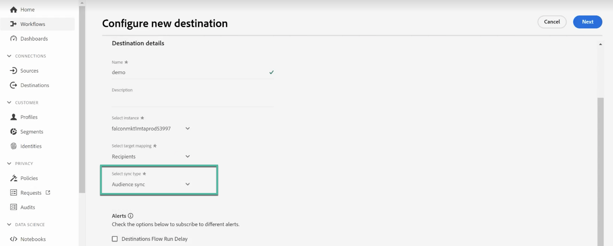
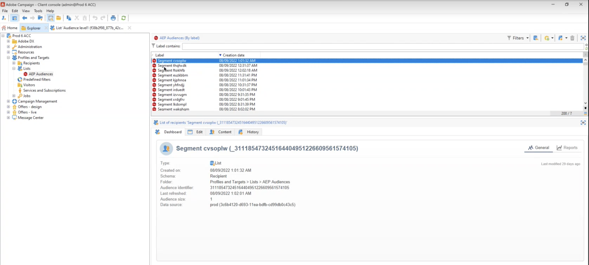
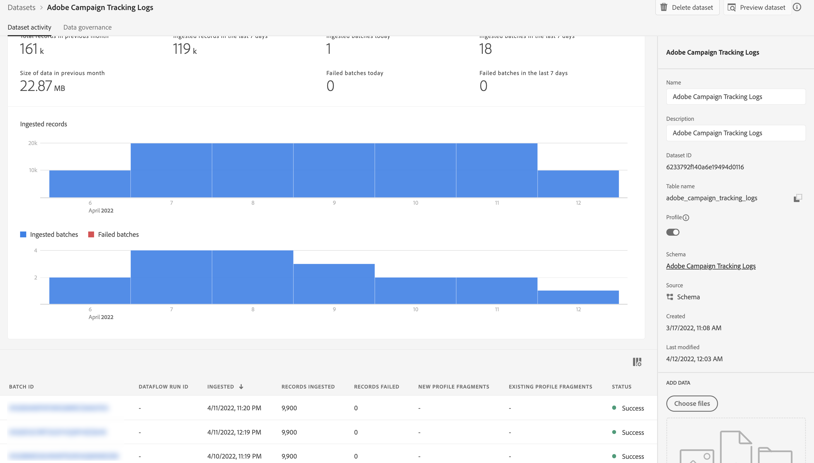
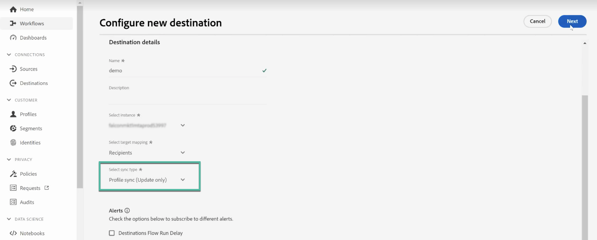

# Condividere e sincronizzare i tipi di pubblico con Adobe Experience Platform {#gs-ac-aep}

I connettori Adobe Campaign Managed Cloud Service Destination e Source consentono l’integrazione perfetta tra Adobe Campaign e Adobe Experience Platform. Con questa integrazione, puoi:

* Invia il pubblico di Adobe Experience Platform ad Adobe Campaign e invia i registri di consegna e tracciamento a Adobe Experience Platform a scopo di analisi,
* Importa gli attributi del profilo Adobe Experience Platform in Adobe Campaign e disponi di un processo di sincronizzazione in modo che possano essere aggiornati regolarmente.

## Inviare tipi di pubblico di Adobe Experience Platform a Campaign {#audiences}

I passaggi principali per inviare il pubblico di Adobe Experience Platform ad Adobe Campaign e inviare i registri di consegna e tracciamento sono i seguenti:

* Utilizza una **connessione di destinazione** di Adobe Campaign Managed Cloud Services per inviare segmenti di Experience Platform ad Adobe Campaign:

   1. Accedere al catalogo delle destinazioni di Adobe Experience Platform e creare una nuova connessione **[!UICONTROL Adobe Campaign Managed Cloud Services]**.
   1. Fornire dettagli sull&#39;istanza di Campaign da utilizzare e scegliere **[!UICONTROL Audience sync]** come tipo di sincronizzazione.

      {width="800" align="center"}

   1. Seleziona i segmenti da inviare ad Adobe Campaign.
   1. Configura gli attributi da esportare nel pubblico.
   1. Una volta configurato il flusso, i tipi di pubblico selezionati saranno disponibili per l’attivazione in Adobe Campaign.

      {width="800" align="center"}

  Informazioni dettagliate su come configurare la destinazione sono disponibili nella [documentazione della connessione Adobe Campaign Managed Cloud Services](https://www.adobe.com/go/destinations-adobe-campaign-managed-cloud-services-en){target="_blank"}

* Utilizza una **connessione Source** di Adobe Campaign Managed Cloud Services per inviare i registri di consegna e tracciamento di Adobe Campaign a Adobe Experience Platform:

  A questo scopo, configura una nuova connessione Adobe Campaign Managed Cloud Services **Source** per acquisire gli eventi Campaign in Adobe Experient Platform. Fornisci dettagli sull’istanza Campaign e sullo schema da utilizzare, seleziona un set di dati in cui acquisire i dati, quindi configura i campi da recuperare. [Scopri come creare una connessione di origine Adobe Campaign Managed Cloud Services](https://www.adobe.com/go/sources-campaign-ui-en)

  {width="800" align="center"}

## Sincronizzare gli attributi del profilo tra Adobe Experience Platform e Adobe Campaign {#profile}

Collegando Adobe Campaign a Adobe Experience Platform, puoi inserire attributi di profilo aggiuntivi associati a un profilo su Adobe Experience Platform e implementare un processo di sincronizzazione per aggiornarli nel database di Adobe Campaign.

Supponiamo ad esempio che tu stia acquisendo valori di consenso e rinuncia in Adobe Experience Platform. Con questa connessione, puoi trasferire questi valori in Adobe Campaign e impostare un processo di sincronizzazione in modo che vengano aggiornati regolarmente.

>[!NOTE]
>
>La sincronizzazione degli attributi del profilo è disponibile per i profili già presenti nel database di Adobe Campaign.

I passaggi principali per sincronizzare gli attributi del profilo di Adobe Experience Platform con Adobe Campaign sono i seguenti:

1. Accedere al catalogo delle destinazioni di Adobe Experience Platform e creare una nuova connessione **[!UICONTROL Adobe Campaign Managed Cloud Services]**.
1. Fornire dettagli sull&#39;istanza di Campaign da utilizzare e scegliere **[!UICONTROL Profile sync (Update only)]** come tipo di sincronizzazione.

   {width="800" align="center"}

1. Seleziona i segmenti che eseguono il targeting dei profili da aggiornare al database di Adobe Campaign.
1. Configura gli attributi del profilo da aggiornare in Adobe Campaign.
1. Una volta configurato il flusso, gli attributi di profilo selezionati verranno sincronizzati con Adobe Campaign e aggiornati per tutti i profili target dei segmenti configurati nella destinazione.

Informazioni dettagliate su come configurare la destinazione sono disponibili nella [documentazione della connessione Adobe Campaign Managed Cloud Services](https://www.adobe.com/go/destinations-adobe-campaign-managed-cloud-services-en){target="_blank"}