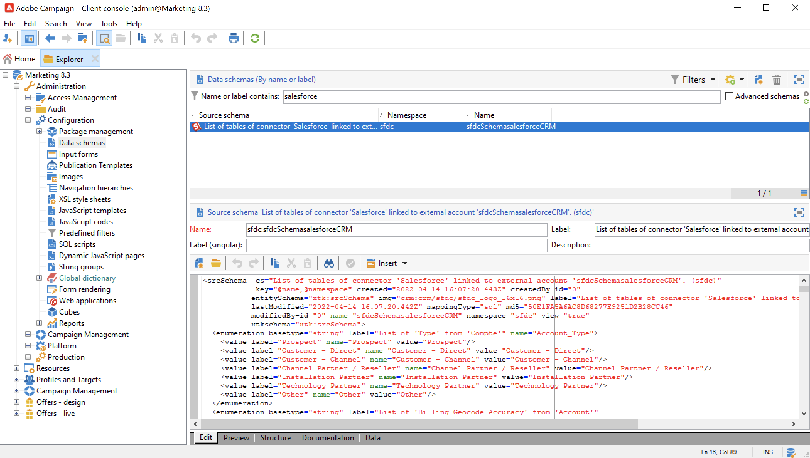

# Utilizzare Campaign e SFDC{#crm-sfdc}

Scopri come configurare il connettore Campaign CRM per collegare Campaign v8 a **Salesforce.com**.

Al termine della configurazione, la sincronizzazione dei dati tra i sistemi viene eseguita tramite un’attività di flusso di lavoro dedicata. [Ulteriori informazioni](crm-data-sync.md).

>[!NOTE]
>
>Le versioni SFDC supportate sono descritte in dettaglio in Campaign [Matrice di compatibilità](../start/compatibility-matrix.md).

Segui i passaggi seguenti per configurare un account esterno dedicato per importare ed esportare dati Salesforce in Adobe Campaign.

## Creare la connessione{#new-sfdc-external-account}

Innanzitutto, devi creare l’account esterno Salesforce.

1. Sfoglia il **[!UICONTROL Administration > Platform > External accounts]** nodo di Campaign explorer e crea un account esterno.
1. Seleziona **[!UICONTROL Salesforce.com]** account esterno nel **Tipo** sezione .
1. Immettere le impostazioni per abilitare la connessione.

   

   Per configurare l&#39;account esterno di gestione delle relazioni con i clienti Salesforce affinché funzioni con Adobe Campaign, devi fornire i seguenti dettagli:

   * Immetti l’accesso a Salesforce nel **[!UICONTROL Account]** campo .
   * Immetti la password Salesforce.
   * È possibile ignorare le **[!UICONTROL Client identifier]** campo .
   * Copia/incolla la Salesforce **[!UICONTROL Security token]**
   * Seleziona la tua **[!UICONTROL API version]**. Le versioni supportate dell’API SFDC sono elencate in Campaign [Matrice di compatibilità](../start/compatibility-matrix.md).

1. Seleziona la **Abilita** per attivare l’account in Campaign.

>[!NOTE]
>
>Per approvare la configurazione, è necessario disconnettersi e accedere nuovamente alla console Adobe Campaign.

## Selezionare le tabelle da sincronizzare{#sfdc-create-tables}

È ora possibile configurare le tabelle da sincronizzare.

1. Fai clic sul pulsante **[!UICONTROL Salesforce CRM configuration wizard...]**.
1. Selezionare le tabelle da sincronizzare e avviare il processo.
1. Controlla lo schema generato in Adobe Campaign nel **[!UICONTROL Administration > Configuration > Data schemas]** nodo.

   Esempio di **Salesforce** schema importato in Campaign:

   

## Sincronizza enumerazioni{#sfdc-enum-sync}

Una volta creato lo schema, puoi sincronizzare automaticamente le enumerazioni da Salesforce ad Adobe Campaign.

1. Apri l&#39;assistente dal  **[!UICONTROL Synchronizing enumerations...]** link.
1. Seleziona l’enumerazione Adobe Campaign che corrisponde all’enumerazione Salesforce.
Puoi sostituire tutti i valori di un&#39;enumerazione Adobe Campaign con quelli del CRM: a questo scopo, seleziona **[!UICONTROL Yes]** in **[!UICONTROL Replace]** colonna.

   

1. Fai clic su **[!UICONTROL Next]** e poi **[!UICONTROL Start]** per iniziare a importare le enumerazioni.

1. Sfoglia il **[!UICONTROL Administration > Platform > Enumerations]** nodo per controllare i valori importati. Ulteriori informazioni sulle enumerazioni in [questa pagina](../config/ui-settings.md#enumerations).

Adobe Campaign e Salesforce.com sono ora connessi. È possibile impostare la sincronizzazione dei dati tra i due sistemi.

Per sincronizzare i dati tra i dati di Adobe Campaign e SFDC, crea un flusso di lavoro e utilizza l’ **[!UICONTROL CRM connector]** attività.

Ulteriori informazioni sulla sincronizzazione dei dati [in questa pagina](crm-data-sync.md).
