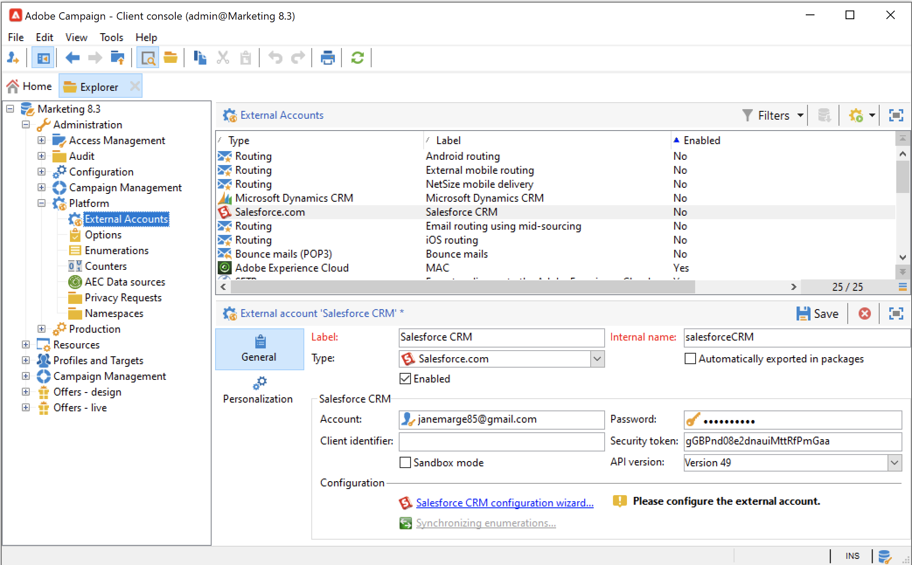
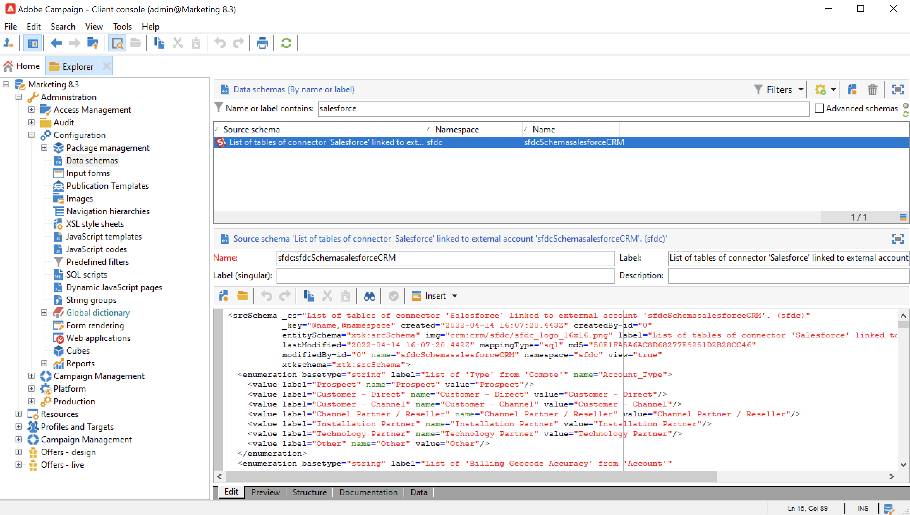
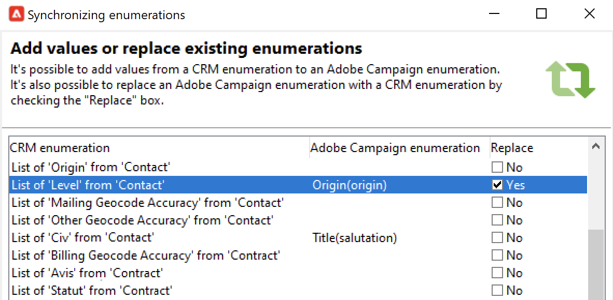

# Utilizzare Campaign e SFDC{#crm-sfdc}

Scopri come configurare il connettore di gestione delle relazioni con i clienti di Campaign per collegare Campaign v8 a **Salesforce.com**.

Al termine della configurazione, la sincronizzazione dei dati tra sistemi viene eseguita tramite un’attività del flusso di lavoro dedicata. [Ulteriori informazioni](crm-data-sync.md).

>[!NOTE]
>
>Le versioni di SFDC supportate sono descritte in dettaglio nella [Matrice di compatibilità](../start/compatibility-matrix.md) di Campaign.

Segui i passaggi seguenti per configurare un account esterno dedicato per importare ed esportare dati Salesforce in Adobe Campaign.

## Creare la connessione{#new-sfdc-external-account}

Innanzitutto, devi creare l’account esterno di Salesforce.

1. Sfoglia il nodo **[!UICONTROL Administration > Platform > External accounts]** di Esplora campagne e crea un account esterno.
1. Selezionare l&#39;account esterno **[!UICONTROL Salesforce.com]** nella sezione **Tipo**.
1. Immettere le impostazioni per abilitare la connessione.

   

   Per configurare l’account esterno di Salesforce CRM per l’utilizzo con Adobe Campaign, è necessario fornire i seguenti dettagli:

   * Immetti l&#39;accesso a Salesforce nel campo **[!UICONTROL Account]**.
   * Immettere la password Salesforce.
   * È possibile ignorare il campo **[!UICONTROL Client identifier]**.
   * Copia/incolla il tuo Salesforce **[!UICONTROL Security token]**
   * Seleziona **[!UICONTROL API version]**. Le versioni dell&#39;API SFDC supportate sono elencate nella [Matrice di compatibilità](../start/compatibility-matrix.md) di Campaign.

1. Seleziona l&#39;opzione **Abilita** per attivare l&#39;account in Campaign.

>[!NOTE]
>
>Per approvare la configurazione, è necessario disconnettersi e accedere nuovamente alla console client di Adobe Campaign.

## Seleziona tabelle da sincronizzare{#sfdc-create-tables}

È ora possibile configurare le tabelle da sincronizzare.

1. Fare clic su **[!UICONTROL Salesforce CRM configuration wizard...]**.
1. Selezionare le tabelle da sincronizzare e avviare il processo.
1. Controllare lo schema generato in Adobe Campaign nel nodo **[!UICONTROL Administration > Configuration > Data schemas]**.

   Esempio di schema **Salesforce** importato in Campaign:

   

## Sincronizzare le enumerazioni{#sfdc-enum-sync}

Una volta creato lo schema, puoi sincronizzare automaticamente le enumerazioni da Salesforce ad Adobe Campaign.

1. Apri l&#39;assistente dal collegamento **[!UICONTROL Synchronizing enumerations...]**.
1. Seleziona l’enumerazione Adobe Campaign che corrisponde all’enumerazione Salesforce.
È possibile sostituire tutti i valori di un&#39;enumerazione Adobe Campaign con quelli del CRM: a questo scopo, selezionare **[!UICONTROL Yes]** nella colonna **[!UICONTROL Replace]**.

   

1. Fare clic su **[!UICONTROL Next]** e quindi su **[!UICONTROL Start]** per avviare l&#39;importazione delle enumerazioni.

1. Sfoglia il nodo **[!UICONTROL Administration > Platform > Enumerations]** per controllare i valori importati. Ulteriori informazioni sulle enumerazioni in [questa pagina](../config/ui-settings.md#enumerations).

Adobe Campaign e Salesforce.com sono ora connessi. È possibile impostare la sincronizzazione dei dati tra i due sistemi.

Per sincronizzare i dati tra Adobe Campaign e SFDC, creare un flusso di lavoro e utilizzare l&#39;attività **[!UICONTROL CRM connector]**.

Ulteriori informazioni sulla sincronizzazione dei dati [sono disponibili in questa pagina](crm-data-sync.md).

Ulteriori informazioni sulla gestione dell&#39;enumerazione in Campaign [in questa pagina](../config/enumerations.md).
