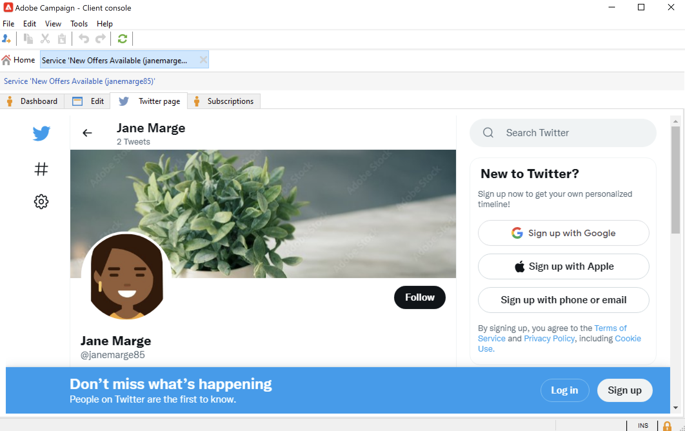

# Utilizzare Campaign e Twitter{#tw-ac-ovv}

La **Gestione dei social network (Social Marketing)** Il modulo ti consente di interagire con i clienti tramite Twitter. Utilizza questa funzionalità per:

* Pubblica messaggi e invia DM - Utilizza Adobe Campaign Social Marketing per inviare messaggi su Twitter. Puoi anche inviare messaggi diretti a tutti i tuoi follower.

* Raccogli nuovi contatti - Adobe Campaign Social Marketing semplifica anche l&#39;acquisizione di nuovi contatti: contatta gli utenti e chiedi loro se desiderano condividere le loro informazioni di profilo. Se accettano, Adobe Campaign recupera automaticamente i dati, consentendo di eseguire campagne di targeting e, quando possibile, di implementare strategie cross-channel.

 Come utente di Cloud Services gestiti, [Adobe di contatto](../start/campaign-faq.md#support) per collegare Campaign a Twitter. La  **Gestione dei social network (Social Marketing)** il componente aggiuntivo deve essere installato nel tuo ambiente tramite il pacchetto dedicato e deve essere configurato l&#39;account esterno Twitter.

Per configurare Adobe Campaign per la pubblicazione dei tweet negli account Twitter, delegare l’accesso in scrittura ad Adobe Campaign per questi account. A questo scopo, devi:

1. Crea un account Twitter e registrati per un account sviluppatore. [Ulteriori informazioni](#dev-account)
1. (facoltativo) Crea un account Twitter di prova per l’invio di bozze. [Ulteriori informazioni](#tw-test-account)
1. Crea un&#39;applicazione Twitter (un&#39;app per account Twitter). [Ulteriori informazioni](#create-an-app-on-twitter)
1. Crea un nuovo servizio per **[!UICONTROL Twitter]** (un servizio per account Twitter). [Ulteriori informazioni](#create-tw-service)
1. Sincronizza il tuo account Twitter con Campaign. [Ulteriori informazioni](#synchro-tw-accounts)

## Account sviluppatore twitter {#dev-account}

Per iniziare con questa integrazione, devi registrarti per un [Account sviluppatore twitter](https://developer.twitter.com){target="_blank"}.

Campaign utilizza la versione 1.1 dell’API Twitter. Per utilizzarlo, è necessario richiedere l&#39;accesso Elevato tramite il Developer Portal. Ulteriori informazioni su Twitter Elevated Access [in questa pagina](https://developer.twitter.com/en/portal/products/elevated){target="_blank"}.

## Creare un’applicazione in Twitter {#create-an-app-on-twitter}

Una volta approvato con accesso avanzato, crea un’applicazione Twitter per consentire ad Adobe Campaign di inviare tweet al tuo account Twitter. A tale scopo, segui la procedura indicata di seguito:

1. Accedi al tuo account Twitter.
1. Connetti a [Portale per sviluppatori twitter](https://developer.twitter.com/en/apps).
1. Seleziona **Creare un’app**.
1. Lascia che l’assistente Twitter ti guidi attraverso il processo.
1. Per consentire ad Adobe Campaign di inviare tweet al tuo account, modifica il **Autorizzazioni app** dalla sezione Configurazione autenticazione utente dell’app. Seleziona **Leggere, scrivere e inviare messaggi diretti**.

   

1. In **Tipo di app** sezione , seleziona **App web, app automatizzata o bot**. Puoi lasciare il **URL di callback** campo vuoto e salva la configurazione.

   

1. Torna al dashboard dell&#39;app, seleziona l&#39;app e sfoglia **Tasti e token** scheda . Sotto **Token di accesso e segreto**, se **Leggere, scrivere e inviare messaggi diretti** autorizzazione non menzionata, devi rigenerare il token e il segreto dell&#39;app. Tieni presente che tutte le chiavi e i token devono essere salvati al momento della creazione. Sarà necessario che configurino il servizio Twitter per Campaign.

   

>[!NOTE]
>
>È necessaria un&#39;applicazione per account Twitter. Di conseguenza, devi creare un’altra applicazione di test per inviare le bozze al tuo account di test.

## Creare un servizio Twitter in Campaign {#create-tw-service}

Per collegare la tua istanza Campaign al tuo account Twitter, crea un **Twitter** accesso in scrittura a Campaign.

>[!CAUTION]
>
>Crearne uno **Twitter** servizio per account Twitter. Di conseguenza, devi creare un altro servizio di test per inviare le bozze al tuo [conto di prova](#tw-test-account).
>
>Ogni **Twitter** il servizio deve essere creato anche dall&#39;Adobe sulla tua istanza MID. Contatta il tuo rappresentante di Adobe per configurare l’ambiente.

Per immettere le impostazioni, devi accedere sia alla console Adobe Campaign che alle autorizzazioni dell’app Twitter.

1. In **Adobe Campaign**, sfoglia fino al **[!UICONTROL Profiles and targets]** e seleziona la **[!UICONTROL Services and Subscriptions]** collegamento
1. Crea un nuovo servizio.
1. Seleziona la **[!UICONTROL Twitter]** digitare.
1. Immetti l’etichetta e il nome interno del servizio.

   >[!CAUTION]
   >
   >La **[!UICONTROL Internal name]** del servizio deve essere esattamente lo stesso nome del tuo account Twitter.

1. Per impostazione predefinita, i follower vengono salvati in **[!UICONTROL Visitors]** cartella. Puoi selezionare un’altra posizione dalla **[!UICONTROL Visitor folder]** campo . [Ulteriori informazioni](../send/twitter.md#direct-tw-messages)

   

   >[!NOTE]
   >
   >La **[!UICONTROL Synchronize subscriptions]** è attivata per impostazione predefinita: questa opzione recupera automaticamente l&#39;elenco dei follower di Twitter in modo da [inviare loro messaggi diretti](../send/twitter.md#direct-tw-messages). La sincronizzazione viene eseguita da un [flusso di lavoro tecnico dedicato](#synchro-tw-accounts).

1. Dall’app Twitter, copia il contenuto della **Chiave API** e **[Segreto chiave API]** e incollarli nel **[!UICONTROL Consumer key]** e **[!UICONTROL Consumer secret]** campi della campagna **Twitter** servizio.

1. Dall’app Twitter, copia il contenuto della **Token di accesso** e **Segreto token di accesso** e incollarli nel **[!UICONTROL Access token]** e **[!UICONTROL Access token secret]** campi della campagna **Twitter** servizio.

1. Nella console del client Campaign, fai clic su **[!UICONTROL Save]**. Hai delegato l’accesso in scrittura ad Adobe Campaign.

Per controllare le impostazioni, puoi:

* Modifica le **Twitter** servizio appena creato.
* Sfoglia il **[!UICONTROL Twitter page]** scheda: il tuo account Twitter deve essere visualizzato.
   

## Sincronizzazione dell&#39;account Twitter {#synchro-tw-accounts}

La sincronizzazione tra Campaign e Twitter viene gestita tramite flussi di lavoro tecnici dedicati. Questi flussi di lavoro sono memorizzati nella variabile **[!UICONTROL Administration > Production > Technical workflows > Managing social networks]** cartella.

Vengono fermati per impostazione predefinita: è necessario avviarli manualmente quando si inizia a utilizzare il **Social marketing** modulo .

La **[!UICONTROL Synchronization of Twitter accounts]** il flusso di lavoro tecnico sincronizza gli account Twitter in Adobe Campaign. Questo flusso di lavoro recupera l’elenco dei follower di Twitter in modo da poter inviare loro messaggi diretti. [Ulteriori informazioni](../send/twitter.md#direct-tw-messages)

Per impostazione predefinita, questo flusso di lavoro viene attivato ogni giovedì alle 7:30. È possibile utilizzare **[!UICONTROL Execute pending task(s) now]** per avviare il flusso di lavoro in qualsiasi momento durante l’implementazione di questa integrazione.  Puoi anche modificare la pianificazione per modificare la frequenza di attivazione del flusso di lavoro. Per ulteriori informazioni, consulta [questa pagina](../../automation/workflow/scheduler.md).

>[!CAUTION]
>
>Per recuperare l&#39;elenco degli abbonati Twitter, la **[!UICONTROL Twitter account synchronization]** deve essere selezionata per il servizio collegato all&#39;account. [Ulteriori informazioni](#create-tw-service)

I seguenti elementi sono memorizzati in una tabella specifica: la tabella dei visitatori. Per visualizzare l’elenco dei follower di Twitter, seleziona **[!UICONTROL Profiles and Targets > Visitors]**.

Per ogni follower, Adobe Campaign memorizza le seguenti informazioni:

* **[!UICONTROL Origin]**: Twitter
* **[!UICONTROL External ID]**: identificatore utente
* **[!UICONTROL Username]**: nome account dell&#39;utente
* **[!UICONTROL Full name]**: nome dell&#39;utente
* **[!UICONTROL Number of friends]**: numero di follower
* **[!UICONTROL Checked]**: questo campo indica se l’utente dispone di un account Twitter verificato

Al termine di questa configurazione, puoi pubblicare tweet nei tuoi account Twitter e inviare messaggi diretti ai tuoi follower. [Ulteriori informazioni](../send/twitter.md)

## Creare un account di test su Twitter {#tw-test-account}

Oltre all’account Twitter, crea un account Twitter privato che può essere utilizzato per l’invio [bozze di tweet](../send/twitter.md#send-tw-proofs). A tale scopo, segui la procedura indicata di seguito:

1. Crea un nuovo account Twitter.
1. Accedere all’account  **Impostazioni**.
1. Sfoglia per **Privacy e sicurezza** e **Pubblico e assegnazione tag** e controlla **Protect i tuoi tweet** opzione . I tuoi Tweet e altre informazioni sull&#39;account sono visibili solo alle persone che ti seguono.

Configura l’app Twitter e il servizio Campaign per lavorare con questo account di test, come descritto in precedenza.
