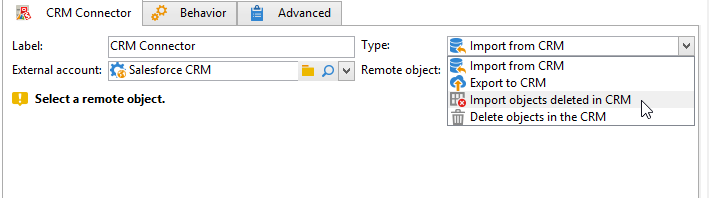
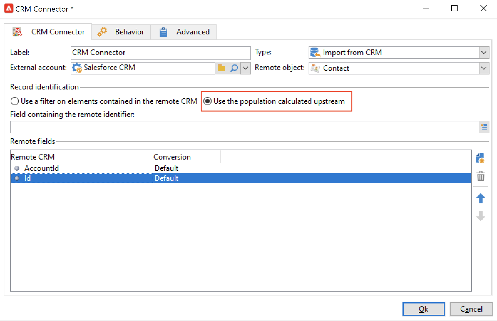

# Sincronizzazione dei dati tra Campaign e il CRM {#data-synchronization}

La sincronizzazione dei dati tra Adobe Campaign e il CRM è gestita dal **Connettore CRM** attività del flusso di lavoro.

Ad esempio, per importare i dati di Microsoft Dynamics in Adobe Campaign, crea il seguente tipo di flusso di lavoro:

Questo flusso di lavoro importa i contatti tramite Microsoft Dynamics, li sincronizza con i dati esistenti di Adobe Campaign, elimina i contatti duplicati e aggiorna il database Adobe Campaign.

La **[!UICONTROL CRM Connector]** l’attività deve essere configurata per sincronizzare i dati.

Con questa attività puoi:

* Importa dal CRM - [Ulteriori informazioni](#importing-from-the-crm)
* Esportazione in CRM - [Ulteriori informazioni](#exporting-to-the-crm)
* Importa oggetti eliminati nel CRM - [Ulteriori informazioni](#importing-objects-deleted-in-the-crm)
* Elimina gli oggetti nel CRM - [Ulteriori informazioni](#deleting-objects-in-the-crm)

Seleziona l’account esterno che corrisponde al CRM con cui desideri configurare la sincronizzazione, quindi seleziona l’oggetto da sincronizzare: account, opportunità, lead, contatti, ecc.

La configurazione di questa attività dipende dal processo da eseguire. Di seguito sono descritte diverse configurazioni.

## Importazione da CRM {#importing-from-the-crm}

Per importare dati tramite il CRM in Adobe Campaign, devi creare il seguente tipo di flusso di lavoro:

1. Seleziona un **[!UICONTROL Import from the CRM]** funzionamento.
1. In **[!UICONTROL Remote object]** dall’elenco a discesa, selezionare l’oggetto da importare. Questo oggetto corrisponde a una delle tabelle create in Adobe Campaign durante la configurazione del connettore.
1. In **[!UICONTROL Remote fields]** immettere i campi da importare.

   Per aggiungere un campo, fai clic sul pulsante **[!UICONTROL Add]** nella barra degli strumenti, quindi fai clic sul pulsante **[!UICONTROL Edit expression]** icona.

   Se necessario, modifica il formato dei dati utilizzando l’elenco a discesa del **[!UICONTROL Conversion]** colonne. I possibili tipi di conversione sono descritti in [questa sezione](#data-format).

   >[!CAUTION]
   >
   >L&#39;identificatore del record nel CRM è obbligatorio per il collegamento di oggetti in CRM e in Adobe Campaign. Viene aggiunto automaticamente quando la casella viene approvata.
   >
   >Anche l’ultima data di modifica sul lato CRM è obbligatoria per le importazioni di dati incrementali.

1. Puoi filtrare i dati da importare in base alle tue esigenze. A questo scopo, fai clic sul pulsante **[!UICONTROL Edit the filter...]** link.

   Nell’esempio seguente, Adobe Campaign importa solo i contatti per i quali è stata registrata una certa attività dal 1° novembre 2021.

   

   >[!CAUTION]
   >
   >Le limitazioni relative alle modalità di filtraggio dei dati sono descritte in [questa sezione](#filtering-data).

1. Seleziona la **[!UICONTROL Use automatic index...]** per gestire automaticamente la sincronizzazione incrementale degli oggetti tra CRM e Adobe Campaign, a seconda della data e dell&#39;ultima modifica.

   Per ulteriori informazioni al riguardo, consulta [questa sezione](#variable-management).

### Gestire le variabili {#variable-management}

Attiva la **[!UICONTROL Automatic index]** per raccogliere solo gli oggetti modificati dall’ultima importazione.

Per impostazione predefinita, la data dell&#39;ultima sincronizzazione viene memorizzata in un&#39;opzione specificata nella finestra di configurazione: **LASTIMPORT_&lt;%=instance.internalName%>_&lt;%=activityName%>**.

>[!NOTE]
>
>Questa nota si applica solo al generico **[!UICONTROL CRM Connector]** attività. Per altre attività CRM, il processo è automatico.
>
>Questa opzione deve essere creata e compilata manualmente in **[!UICONTROL Administration]** > **[!UICONTROL Platform]** > **[!UICONTROL Options]**. Deve essere un’opzione di testo e il suo valore deve corrispondere al seguente formato: **aaaa/MM/gg hh:mm:ss**.
> 
>È necessario aggiornare manualmente questa opzione per qualsiasi ulteriore importazione.

Puoi specificare il campo CRM remoto da prendere in considerazione per identificare le modifiche più recenti.

Per impostazione predefinita, vengono utilizzati i campi seguenti (nell’ordine specificato):

* Per Microsoft Dynamics: **modifiedon**,
* Per Salesforce.com: **LastModifiedDate**, **SystemModestamp**.

Attivazione della **[!UICONTROL Automatic index]** L’opzione genera tre variabili che possono essere utilizzate nel flusso di lavoro di sincronizzazione tramite un **[!UICONTROL JavaScript code]** digitare activity. Queste attività sono:

* **vars.crmOptionName**: nome dell’opzione che contiene l’ultima data di importazione.
* **vars.crmStartImport**: data di inizio (inclusa) dell’ultima importazione di dati.
* **vars.crmEndDate**: data di fine (esclusa) dell’ultima importazione di dati.

   >[!NOTE]
   >
   >Queste date vengono visualizzate nel seguente formato: **aaaa/MM/gg hh:mm:ss**.

### Filtrare i dati {#filtering-data}

Per garantire un funzionamento efficiente con le varie CRM, è necessario creare i filtri utilizzando le seguenti regole:

* Ogni livello di filtro può utilizzare un solo tipo di operatore.
* Operatore AND NOT non supportato.
* I confronti possono riguardare solo valori nulli (&quot;è vuoto&quot;/&quot;non è vuoto&quot;) o numeri. Ciò significa che il valore (colonna a destra) è valutato e il risultato di tale valutazione deve essere un numero. I confronti tra tipi JOIN non sono pertanto supportati.
* Il valore contenuto nella colonna di destra viene valutato in JavaScript.
* I confronti JOIN non sono supportati.
* L’espressione nella colonna a sinistra deve essere un campo. Non può essere una combinazione di più espressioni, un numero, ecc.

### Ordina per {#order-by}

In Microsoft Dynamics e Salesforce.com, puoi ordinare i campi remoti da importare in ordine crescente o decrescente.

A questo scopo, fai clic sul pulsante **[!UICONTROL Order by]** collega e aggiungi le colonne all’elenco.

L’ordine delle colonne nell’elenco è l’ordinamento:

### Identificazione del record {#record-identification}

Invece di importare gli elementi inclusi (e possibilmente filtrati) nel CRM, puoi utilizzare una popolazione calcolata in precedenza nel flusso di lavoro.

A questo scopo, seleziona la **[!UICONTROL Use the population calculated upstream]** e specifica il campo contenente l&#39;identificatore remoto.

Quindi seleziona i campi della popolazione in entrata che desideri importare, come illustrato di seguito:

## Esportazione in CRM {#exporting-to-the-crm}

Esporta i dati Adobe Campaign nel tuo CRM per copiare l&#39;intero contenuto nel tuo database CRM.

Per esportare i dati nel CRM, crea il seguente tipo di flusso di lavoro:

1. Seleziona un **[!UICONTROL Export to CRM]** funzionamento.
1. Vai a **[!UICONTROL Remote object]** elenco a discesa e selezionare l’oggetto da esportare. Questo oggetto corrisponde a una delle tabelle create in Adobe Campaign durante la configurazione del connettore.

   >[!CAUTION]
   >
   >La funzione di esportazione del **[!UICONTROL CRM Connector]** L&#39;attività può inserire o aggiornare campi nel CRM. Per abilitare gli aggiornamenti dei campi nel CRM, specifica la chiave primaria della tabella remota. Se la chiave è mancante, i dati verranno inseriti, anziché essere aggiornati.

1. Per eseguire esportazioni più veloci, controlla la  **[!UICONTROL Export in Batches]** opzione .

   

1. In **[!UICONTROL Mapping]** sezione, fai clic su **[!UICONTROL New]** per specificare i campi da esportare e la relativa mappatura nel CRM.

   Per aggiungere un campo, fai clic sul pulsante **[!UICONTROL Add]** nella barra degli strumenti, quindi fai clic sul pulsante **[!UICONTROL Edit expression]** icona.

   >[!NOTE]
   >
   >Se non è definita alcuna corrispondenza per un campo, i valori non possono essere aggiornati: vengono inseriti direttamente nel CRM.

   Se necessario, modifica il formato dei dati utilizzando l’elenco a discesa del **[!UICONTROL Conversion]** colonne. I possibili tipi di conversione sono descritti in [questa sezione](#data-format).

   >[!NOTE]
   >
   >L’elenco dei record da esportare e il risultato dell’esportazione vengono salvati in un file temporaneo che rimane accessibile finché il flusso di lavoro non viene completato o riavviato. Questo consente di avviare il processo in modo sicuro in caso di errori.

## Configurazioni aggiuntive {#additional-configurations}

### Formato dati {#data-format}

Puoi convertire al volo il formato dei dati quando li importi in o dal tuo CRM.

A questo scopo, seleziona la conversione da applicare nella colonna corrispondente.

La **[!UICONTROL Default]** applica la conversione automatica dei dati, che nella maggior parte dei casi equivale a una copia/incolla dei dati. Tuttavia, viene applicata la gestione del fuso orario.

Altre possibili conversioni sono:

* **[!UICONTROL Date only]**: elimina i campi tipo data + ora .
* **[!UICONTROL Without time offset]**: annulla la gestione del fuso orario applicata nella modalità predefinita.
* **[!UICONTROL Copy/Paste]**: utilizza dati non elaborati, ad esempio stringhe (nessuna conversione).

### Elaborazione errore {#error-processing}

Nel quadro delle importazioni o delle esportazioni di dati, puoi applicare un processo specifico a errori e rifiuti. A questo scopo, seleziona la **[!UICONTROL Keep the rejections in a file]** e **[!UICONTROL Process errors]** nelle opzioni **[!UICONTROL Behavior]** scheda .

Queste opzioni aggiungono le relative transizioni di output.

Quindi inserisci le attività rilevanti per elaborare i dati. Ad esempio, aggiungi un **Wait** nuovi tentativi di attività e pianificazione per gli errori.

La **[!UICONTROL Reject]** la transizione di output consente di accedere allo schema di output contenente le colonne specifiche relative ai messaggi di errore e ai codici. Per Salesforce.com, questa colonna è **errorSymbol** (simbolo di errore diverso dal codice di errore), **errorMessage** (descrizione del contesto dell’errore).

## Importa oggetti eliminati nel CRM {#importing-objects-deleted-in-the-crm}

È possibile importare in Adobe Campaign gli oggetti eliminati nel CRM.

1. Seleziona un **[!UICONTROL Import objects deleted in the CRM]** funzionamento.
1. Vai a **[!UICONTROL Remote object]** elenco a discesa e selezionare l&#39;oggetto interessato dal processo. Questo oggetto corrisponde a una delle tabelle create in Adobe Campaign durante la configurazione del connettore.
1. Specifica il periodo di eliminazione di cui tenere conto nel **[!UICONTROL Start date]** e **[!UICONTROL End date]** campi (date incluse).

   >[!CAUTION]
   >
   >Il periodo di eliminazione deve coincidere con le limitazioni specifiche del CRM. Ad esempio, per Salesforce.com, gli elementi eliminati più di 30 giorni fa non possono essere recuperati.

## Eliminare gli oggetti nel CRM {#deleting-objects-in-the-crm}

Per eliminare gli oggetti nel CRM, specifica la chiave primaria degli elementi remoti da eliminare.

La **[!UICONTROL Behavior]** consente di abilitare l’elaborazione dei rifiuti. Questa opzione genera una seconda transizione di output per **[!UICONTROL CRM connector]** attività. Per ulteriori informazioni, consulta [Elaborazione errore](#error-processing).
