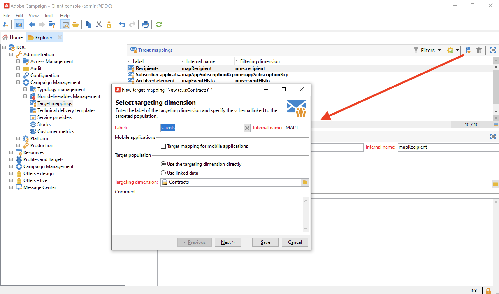
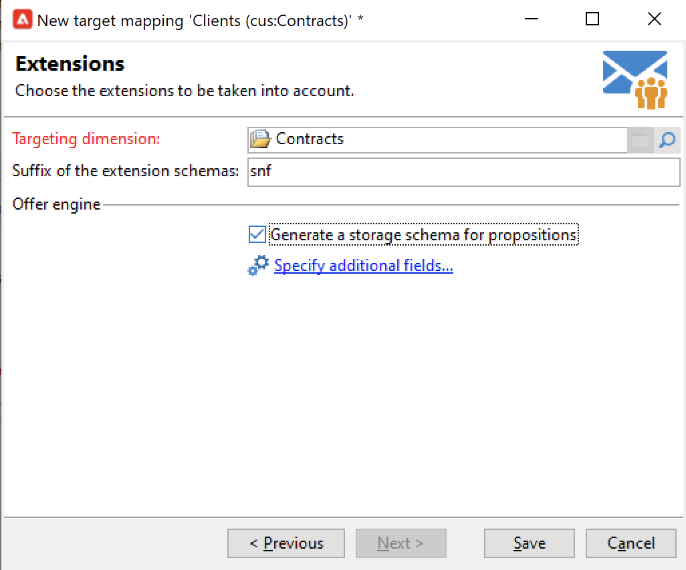

# Federated Data Access (FDA){#gs-fda}

Utilizza il connettore FDA (Federated Data Access) per collegare Campaign a uno o più **database esterni** ed elaborare le informazioni archiviate senza influire sui dati del database di Campaign Cloud. Puoi quindi accedere ai dati esterni senza modificare la struttura dei dati di Adobe Campaign.

>[!NOTE]
>
>I database compatibili per FDA sono elencati nella [Matrice di compatibilità](../start/compatibility-matrix.md).

L’opzione FDA di Campaign ti consente di estendere il modello dati in un database di terze parti. Rileva automaticamente la struttura delle tabelle di destinazione e utilizza i dati dalle origini SQL.

Per interagire tra loro sono necessarie **autorizzazioni specifiche** su [!DNL Adobe Campaign] e sul database esterno. Ulteriori informazioni in [questa sezione](#fda-permissions).

## Best practice e limitazioni

* **Ottimizzazione della personalizzazione delle e-mail con dati esterni**

   Puoi preelaborare la personalizzazione dei messaggi in un flusso di lavoro dedicato. Per eseguire questa operazione, utilizza l’opzione **[!UICONTROL Prepare the personalization data with a workflow]** , disponibile nella scheda **[!UICONTROL Analysis]** delle proprietà di consegna.

   Durante l’analisi della consegna, questa opzione crea ed esegue automaticamente un flusso di lavoro che memorizza in una tabella temporanea tutti i dati collegati alla destinazione, inclusi i dati provenienti da tabelle collegate in un database esterno.

   Questa opzione migliora notevolmente le prestazioni durante l’esecuzione del passaggio di personalizzazione.

* **Limiti FDA**

   L’opzione FDA viene eseguita per manipolare i dati in database esterni in modalità batch nei flussi di lavoro. Per evitare problemi di prestazioni, si sconsiglia di utilizzare il modulo FDA nel contesto di operazioni unitarie, ad esempio: personalizzazione, interazione, messaggistica in tempo reale, ecc.

   Evita le operazioni che devono utilizzare il più possibile sia Adobe Campaign che il database esterno. A questo scopo, puoi:

   * Esporta il database Adobe Campaign nel database esterno ed esegui le operazioni solo dal database esterno prima di reimportare i risultati in Adobe Campaign.

   * Raccogli i dati dal database Adobe Campaign esterno ed esegui le operazioni localmente.

   Se desideri eseguire la personalizzazione nelle consegne utilizzando i dati del database esterno, raccogli i dati da utilizzare in un flusso di lavoro per renderli disponibili in una tabella temporanea. Quindi utilizza i dati della tabella temporanea per personalizzare la consegna.

   L’opzione FDA è soggetta alle limitazioni del sistema di database esterno utilizzato.

## Passaggi di configurazione{#fda-configuration-steps}

Per impostare l&#39;accesso a un database esterno con FDA, i passaggi di configurazione sono i seguenti:

1. In qualità di utente di Adobe Managed Services, contatta l’Adobe per installare i driver nell’istanza Campaign.
1. Una volta installati i driver, configura l&#39;account esterno corrispondente al database sul server Adobe Campaign e verifica l&#39;account esterno. [Ulteriori informazioni](#fda-external-account)
1. Crea lo schema del database esterno in Adobe Campaign. Ciò ti consente di identificare la struttura dati del database esterno. [Ulteriori informazioni](#create-data-schema)
1. Se necessario, crea una nuova mappatura di destinazione dallo schema creato in precedenza. Questo è necessario se i destinatari delle consegne provengono dal database esterno. Questa implementazione include limitazioni relative alla personalizzazione dei messaggi. [Ulteriori informazioni](#define-data-mapping)

## Account esterno database esterno esterno{#fda-external-account}

Devi creare un account esterno specifico per collegare l’istanza Campaign al database esterno.

A questo scopo, segui i passaggi seguenti:

1. Dalla campagna **[!UICONTROL Explorer]**, passa a **[!UICONTROL Administration]** `>` **[!UICONTROL Platform]** `>` **[!UICONTROL External accounts]**.

1. Fai clic su **[!UICONTROL New]**.

   >[!NOTE]
   >
   > Per essere attiva, è necessario selezionare l’opzione **[!UICONTROL Enabled]** . Se necessario, deselezionare questa opzione per disabilitare l&#39;accesso a questo database senza eliminarne la configurazione.

1. Seleziona **[!UICONTROL External database]** come account esterno **[!UICONTROL Type]**.

1. Scegli il database esterno nell’elenco a discesa e configura l’account esterno. È necessario specificare:

   * **[!UICONTROL Server]**: URL del server

   * **[!UICONTROL Account]**: Nome dell’utente

   * **[!UICONTROL Password]**: Password account utente

   * **[!UICONTROL Database]**: Nome del database

      

1. Fai clic sulla scheda **[!UICONTROL Parameters]** , quindi sul pulsante **[!UICONTROL Deploy functions]** per creare le funzioni.

1. Una volta inseriti i parametri, fai clic sul pulsante **[!UICONTROL Test the connection]** per approvarli.

1. Per consentire ad Adobe Campaign di accedere a questo database, è necessario distribuire le funzioni SQL. Fai clic sulla scheda **[!UICONTROL Parameters]** , quindi sul pulsante **[!UICONTROL Deploy functions]** .

È possibile definire tablespace di lavoro specifiche per le tabelle e per l&#39;indice nella scheda **[!UICONTROL Parameters]** .

Per [!DNL Snowflake], il connettore supporta le seguenti opzioni:

| Opzione | Descrizione |
|---|---|
| schema di lavoro | Schema di database da utilizzare per le tabelle di lavoro |
| magazzino | Nome del magazzino predefinito da utilizzare. Sostituirà il valore predefinito dell’utente. |
| TimeZoneName | Per impostazione predefinita è vuoto e indica che viene utilizzato il fuso orario del sistema dell’app server Campaign Classic. L’opzione può essere utilizzata per forzare il parametro di sessione TIMEZONE.  Per ulteriori informazioni, consulta [questa pagina](https://docs.snowflake.net/manuals/sql-reference/parameters.html#timezone). |
| WeekStart | Parametro di sessione WEEK_START. Per impostazione predefinita, è impostato su 0.  Per ulteriori informazioni, consulta [questa pagina](https://docs.snowflake.com/en/sql-reference/parameters.html#week-start). |
| UseCachedResult | Parametro di sessione USE_CACHED_RESULTS . Per impostazione predefinita, è impostato su TRUE. Questa opzione può essere utilizzata per disabilitare i risultati della cache del Snowflake.  Per ulteriori informazioni, consulta [questa pagina](https://docs.snowflake.net/manuals/user-guide/querying-persisted-results.html). |

## Creare lo schema dati{#create-data-schema}

Per creare lo schema del database esterno in Adobe Campaign, effettua le seguenti operazioni:

1. Fai clic sul pulsante **[!UICONTROL New]** sopra l’elenco degli schemi di dati e scegli **[!UICONTROL Access external data]**.

   

1. Immetti un nome e una descrizione per lo schema e seleziona l’account esterno che abiliterà la connessione al database. Ciò consente l’accesso all’elenco delle tabelle disponibili nella base esterna. Scegliere la tabella contenente i dati da raccogliere.

   

1. Fai clic su **[!UICONTROL OK]** per confermare. Adobe Campaign rileva automaticamente la struttura della tabella selezionata e genera lo schema logico. Tieni presente che Adobe Campaign non genera collegamenti.

1. Fai clic su **[!UICONTROL Save]** per confermare la creazione.

## Definire la mappatura target{#define-data-mapping}

Puoi definire una mappatura sui dati in una tabella esterna.

A questo scopo, una volta creato lo schema della tabella esterna, devi creare una nuova mappatura della consegna per utilizzare i dati presenti in questa tabella come destinazione della consegna.

Per farlo, esegui questi passaggi:

1. Passa a **[!UICONTROL Administration]** `>` **[!UICONTROL Campaign Management]** `>` **[!UICONTROL Target mappings]** da Adobe Campaign explorer.

1. Crea una nuova mappatura di destinazione e seleziona lo schema appena creato come dimensione di targeting.

   

1. Indica i campi in cui sono memorizzate le informazioni di consegna (cognome, nome, e-mail, indirizzo, ecc.).

   

1. Specifica i parametri per l’archiviazione delle informazioni, compreso il suffisso degli schemi di estensione, in modo che siano facilmente identificabili.

   

   Puoi scegliere di memorizzare le esclusioni (**excludelog**), con i messaggi (**broadlog**) o in una tabella separata.

   Puoi anche scegliere di gestire il tracciamento per questa mappatura di consegna (**trackinglog**).

1. Quindi seleziona le estensioni da prendere in considerazione. Il tipo di estensione dipende dai parametri e dalle opzioni della piattaforma (visualizza il contratto di licenza).

   

   Fai clic sul pulsante **[!UICONTROL Save]** per avviare la creazione della mappatura della consegna: tutte le tabelle collegate vengono create automaticamente in base ai parametri selezionati.

## Autorizzazioni{#fda-permissions}

Per interagire tra loro sono necessarie **autorizzazioni specifiche** su [!DNL Adobe Campaign] e sul database esterno.

Innanzitutto, affinché l’utente possa eseguire operazioni su un database esterno tramite FDA, l’operatore deve disporre di un diritto specifico denominato in [!DNL Adobe Campaign].

1. Seleziona il nodo **[!UICONTROL Administration > Access Management > Named Rights]** nell’explorer di Adobe Campaign.
1. Crea un nuovo diritto specificando l’etichetta selezionata.
1. Inserisci il nome del diritto con nome nel seguente formato **utente:base@server**, dove :

   * **** user è il nome dell’utente nel database esterno
   * **** baseè il nome del database esterno
   * **** server è il nome del server di database esterno

1. Salva il diritto con nome e collegalo all’operatore scelto dal nodo **[!UICONTROL Administration > Access Management > Operators]** di Adobe Campaign Explorer.

Quindi, per elaborare i dati contenuti in un database esterno, l&#39;operatore Adobe Campaign deve disporre di almeno le autorizzazioni &quot;Write&quot; sul database per poter creare tabelle di lavoro. Queste tabelle vengono eliminate automaticamente da Adobe Campaign.

Sono necessarie le seguenti autorizzazioni:

* **CONNECT**: connessione al database remoto
* **LEGGI I Dati**: accesso in sola lettura alle tabelle contenenti i dati dei clienti
* **LEGGI &#39;MetaData&#39;**: accesso ai cataloghi di dati del server per ottenere la struttura della tabella
* **CARICA**: carico di massa nelle tabelle di lavoro (richiesto quando si lavora su raccolte e giunti)
* **CREA/** RILASCIA per  **TABLE/INDEX/PROCEDURE/FUNCTION**  (solo per tabelle di lavoro generate da Adobe Campaign)
* **EXPLAIN**  (consigliato): per il monitoraggio delle prestazioni in caso di problemi
* **SCRIVI dati**  (a seconda dello scenario di integrazione)

L’amministratore del database deve fare in modo che questi diritti corrispondano ai diritti specifici di ciascun motore di database, come descritto di seguito.

|   | Snowflake |  Amazon Redshift |
|:-:|:-:|:-:|
| **Connessione al database remoto** | UTILIZZO SU WAREHOUSE, UTILIZZO SU DATABASE E UTILIZZO SU privilegi SCHEMA | Creazione di un utente collegato all’account AWS |
| **Creazione di tabelle** | CREA IL privilegio TABELLA SU SCHEMA | Privilegio CREATE |
| **Creazione degli indici** | N/D | Privilegio CREATE |
| **Creazione di funzioni** | CREA FUNZIONE SUL privilegio SCHEMA | UTILIZZARE IL privilegio plpythonu LINGUAGE per poter chiamare script python esterni |
| **Creazione di procedure** | N/D | UTILIZZARE IL privilegio di pitone LINGUISTICO per poter chiamare script di pitone esterni |
| **Rimozione di oggetti (tabelle, indici, funzioni, procedure)** | Proprietario dell&#39;oggetto | Proprietario dell&#39;oggetto o utente avanzato |
| **Monitoraggio delle esecuzioni** | Privilegio MONITOR sull&#39;oggetto richiesto | Nessun privilegio richiesto per l&#39;utilizzo del comando EXPLAIN |
| **Scrittura dei dati** | Privilegi INSERT e/o UPDATE (a seconda dell&#39;operazione di scrittura) | Privilegi INSERT e UPDATE |
| **Caricamento dei dati nelle tabelle** | CREA FASE SU SCHEMA, SELEZIONA e INSERISCI sui privilegi della tabella di destinazione | Privilegi SELECT e INSERT |
| **Accesso ai dati client** | SELEZIONARE (FUTURO) TABELLA(I) o privilegio(i) VISUALIZZAZIONE(I) | Privilegio SELECT |
| **Accesso ai metadati** | SELEZIONARE il privilegio SCHEMA INFORMATION_SCHEMA | Privilegio SELECT |

## Utilizzare dati esterni in un flusso di lavoro

Una volta creato lo schema di dati, i dati possono essere elaborati nei flussi di lavoro Adobe Campaign.

Attività multiple consentono di interagire con i dati provenienti da un database esterno:

* **Filtrare i dati esterni** : l’ **[!UICONTROL Query]** attività ti consente di aggiungere dati esterni e di utilizzarli nelle configurazioni di filtro definite.

* **Crea sottoinsiemi** : l’ **[!UICONTROL Split]** attività ti consente di creare sottoinsiemi. Puoi utilizzare dati esterni per definire i criteri di filtro da utilizzare.

* **Carica database esterno** : puoi utilizzare i dati esterni nell’ **[!UICONTROL Data loading (RDBMS)]** attività.

* **Aggiunta di informazioni e collegamenti**  - L’ **[!UICONTROL Enrichment]** attività ti consente di aggiungere dati aggiuntivi alla tabella di lavoro del flusso di lavoro e collegamenti a una tabella esterna. In questo contesto, può utilizzare dati provenienti da un database esterno.

Puoi anche definire direttamente una connessione a un database esterno da queste attività del flusso di lavoro, per un utilizzo temporaneo. In questo caso, si trova in un database esterno locale, riservato all’interno di un flusso di lavoro corrente: non verrà salvato negli account esterni.

>[!CAUTION]
>
>Questo tipo di configurazione deve essere utilizzato solo temporaneamente per raccogliere i dati. La configurazione dell’account esterno deve essere preferita per qualsiasi altro utilizzo.

Ad esempio, nell’attività **[!UICONTROL Query]** puoi definire una connessione temporanea a un database esterno come segue:

1. Apri l’attività e fai clic su **[!UICONTROL Add data...]**
1. Seleziona le opzioni **[!UICONTROL External data]**
1. Seleziona l’opzione **[!UICONTROL Locally defining the data source]**
1. Selezionare il motore di database di destinazione nell&#39;elenco a discesa. Immetti il nome del server e fornisci i parametri di autenticazione. Specifica anche il nome del database esterno.
1. Selezionare la tabella in cui sono memorizzati i dati. È possibile immettere il nome della tabella direttamente nel campo corrispondente oppure fare clic sull&#39;icona di modifica per accedere all&#39;elenco delle tabelle del database.
1. Fai clic sul pulsante **[!UICONTROL Add]** per definire uno o più campi di riconciliazione tra i dati del database esterno e i dati nel database Adobe Campaign. Le icone **[!UICONTROL Edit expression]** di **[!UICONTROL Remote field]** e **[!UICONTROL Local field]** consentono di accedere all’elenco dei campi di ciascuna tabella.
1. Se necessario, specifica una condizione di filtro e la modalità di ordinamento dei dati.
1. Selezionare i dati aggiuntivi da raccogliere nel database esterno. A questo scopo, fai doppio clic sui campi che desideri aggiungere per visualizzarli in **[!UICONTROL Output columns]**.
1. Fai clic su **[!UICONTROL Finish]** per confermare questa configurazione.
