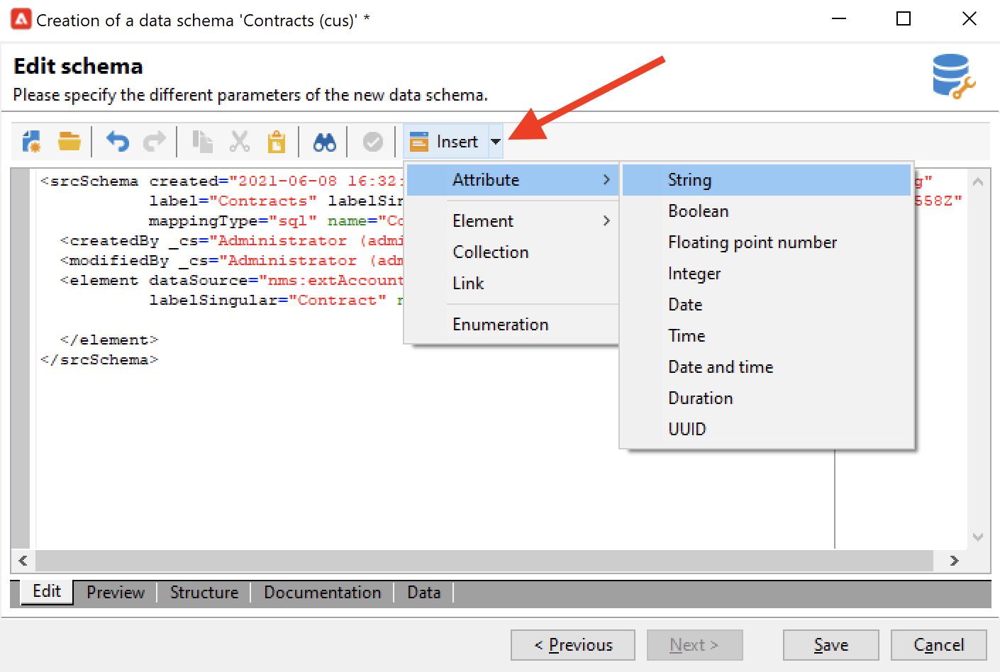

# Crea un nuovo schema{#create-new-schema}

Per modificare, creare e configurare gli schemi, fai clic sul nodo **[!UICONTROL Administration > Configuration > Data schemas]** della console client di Adobe Campaign.

>[!NOTE]
>
>Gli schemi di dati incorporati possono essere eliminati solo da un amministratore della console Adobe Campaign Classic.


La scheda **[!UICONTROL Edit]** mostra il contenuto XML di uno schema:


>[!NOTE]
>
>Il controllo di modifica &quot;Nome&quot; consente di inserire la chiave dello schema composta dal nome e dallo spazio dei nomi. Gli attributi &quot;name&quot; e &quot;namespace&quot; dell’elemento principale dello schema vengono aggiornati automaticamente nella zona di modifica XML dello schema. Alcuni namespace sono interni solo. [Ulteriori informazioni](schemas.md#reserved-namespaces).

La scheda **[!UICONTROL Preview]** genera automaticamente lo schema esteso:


>[!NOTE]
>
>Quando lo schema di origine viene salvato, la generazione dello schema esteso viene avviata automaticamente.

Se è necessario controllare la struttura completa di uno schema, è possibile utilizzare la scheda **[!UICONTROL Preview]** . Se lo schema è stato esteso, potrai visualizzarne tutte le estensioni. Come complemento, la scheda **[!UICONTROL Documentation]** visualizza tutti gli attributi e gli elementi dello schema e le relative proprietà (Campo SQL, tipo/lunghezza, etichetta, descrizione). La scheda **[!UICONTROL Documentation]** si applica solo agli schemi generati.

## Caso di utilizzo: creare una tabella dei contratti {#example--creating-a-contract-table}

Nell&#39;esempio seguente viene creata una nuova tabella per **contratti** nel database. Questa tabella ti consente di memorizzare i nomi e i cognomi e gli indirizzi e-mail dei titolari e dei co-titolari per ogni contratto.

A questo scopo, è necessario creare lo schema della tabella e aggiornare la struttura del database per generare la tabella corrispondente. I passaggi dettagliati sono elencati di seguito.

1. Modifica il nodo **[!UICONTROL Administration > Configuration > Data schemas]** della struttura Adobe Campaign e fai clic su **[!UICONTROL New]**.
1. Scegli l’opzione **[!UICONTROL Create a new table in the data template]** e fai clic su **[!UICONTROL Next]** .

   

1. Specifica un nome per la tabella e uno spazio dei nomi.

   

   >[!NOTE]
   >
   >Per impostazione predefinita, gli schemi creati dagli utenti vengono memorizzati nello spazio dei nomi &quot;cus&quot;. Per ulteriori informazioni, consulta [Identificazione di uno schema](extend-schema.md#identification-of-a-schema).

1. Crea il contenuto della tabella. È consigliabile utilizzare l’assistente dedicato per assicurarsi che non siano presenti impostazioni. A questo scopo, fai clic sul pulsante **[!UICONTROL Insert]** e scegli il tipo di impostazione da aggiungere.

   

1. Definire le impostazioni per la tabella del contratto:

   ```
   <srcSchema created="YYYY-MM-DD HH:MM:SS.TZ" desc="Active contracts" img="crm:crm/mscrm/mscrm_account_16x16.png"
           label="Contracts" labelSingular="Contract" lastModified="YYYY-MM-DD HH:MM:SS.TZ"
           mappingType="sql" name="Contracts" namespace="cus" xtkschema="xtk:srcSchema">
      <element dataSource="nms:extAccount:ffda" desc="Active contracts" img="crm:crm/mscrm/mscrm_account_16x16.png"
           label="Contracts" labelSingular="Contract" name="Contracts">
           <attribute name="holderName" label="Holder last name" type="string"/>
           <attribute name="holderFirstName" label="Holder first name" type="string"/>
           <attribute name="holderEmail" label="Holder email" type="string"/>
           <attribute name="co-holderName" label="Co-holder last name" type="string"/>           
           <attribute name="co-holderFirstName" label="Co-holder first name" type="string"/>           
           <attribute name="co-holderEmail" label="Co-holder email" type="string"/>    
           <attribute name="date" label="Subscription date" type="date"/>     
           <attribute name="noContract" label="Contract number" type="long"/> 
      </element>
   </srcSchema>
   ```

   Aggiungi il tipo di enumerazione del contratto.

   ```
   <srcSchema created="AA-MM-DD HH:MM:SS.TZ" desc="Active contracts" img="crm:crm/mscrm/mscrm_account_16x16.png" label="Contracts" labelSingular="Contract" AA-MM-DD HH:MM:SS.TZ"mappingType="sql" name="Contracts" namespace="cus" xtkschema="xtk:srcSchema">
      <enumeration basetype="byte" name="typeContract">
         <value label="Home" name="home" value="0"/>
         <value label="Car" name="car" value="1"/>
         <value label="Health" name="health" value="2"/>
         <value label="Pension fund" name="pension fund" value="2"/>
      </enumeration>
      <element dataSource="nms:extAccount:ffda" desc="Active contracts" img="crm:crm/mscrm/mscrm_account_16x16.png"
           label="Contracts" labelSingular="Contract" name="Contracts">
           <attribute name="holderName" label="Holder last name" type="string"/>
           <attribute name="holderFirstName" label="Holder first name" type="string"/>
           <attribute name="holderEmail" label="Holder email" type="string"/>
           <attribute name="co-holderName" label="Co-holder last name" type="string"/>           
           <attribute name="co-holderFirstName" label="Co-holder first name" type="string"/>           
           <attribute name="co-holderEmail" label="Co-holder email" type="string"/>    
           <attribute name="date" label="Subscription date" type="date"/>     
           <attribute name="noContract" label="Contract number" type="long"/> 
      </element>
   </srcSchema>
   ```

1. Salva lo schema e fai clic sulla scheda **[!UICONTROL Structure]** per generare la struttura:

   

1. Aggiornare la struttura del database per creare la tabella a cui verrà collegato lo schema. Per ulteriori informazioni al riguardo, consulta [questa sezione](update-database-structure.md).

