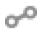

# Mappatura del database{#database-mapping}

La mappatura SQL dello schema di esempio fornisce il seguente documento XML:

```
<schema mappingType="sql" name="recipient" namespace="cus" xtkschema="xtk:schema">
  <enumeration basetype="byte" name="gender">    
    <value label="Not specified" name="unknown" value="0"/>    
    <value label="Male" name="male" value="1"/>    
    <value label="Female" name="female" value="2"/> 
  </enumeration>  

  <element name="recipient" sqltable="CusRecipient">    
    <attribute desc="Recipient e-mail address" label="Email" length="80" name="email" sqlname="sEmail" type="string"/>    
    <attribute default="GetDate()" label="Date of creation" name="created" sqlname="tsCreated" type="datetime"/>    
    <attribute enum="gender" label="Gender" name="gender" sqlname="iGender" type="byte"/>    
    <element label="Location" name="location">      
      <attribute label="City" length="50" name="city" sqlname="sCity" type="string" userEnum="city"/>    
    </element>  
  </element>
</schema>
```

## Descrizione {#description}

L&#39;elemento principale dello schema non è più **`<srcschema>`**, ma **`<schema>`**.

Questo ci porta a un altro tipo di documento, generato automaticamente dallo schema di origine, semplicemente denominato schema. Questo schema verrà utilizzato dall&#39;applicazione Adobe Campaign.

I nomi SQL vengono determinati automaticamente in base al nome e al tipo dell&#39;elemento.

Le regole di denominazione SQL sono le seguenti:

* tabella: concatenazione dello spazio dei nomi e del nome dello schema

   Nel nostro esempio, il nome della tabella viene immesso tramite l’elemento principale dello schema nell’attributo **sqltable** :

   ```
   <element name="recipient" sqltable="CusRecipient">
   ```

* campo: nome dell’elemento preceduto da un prefisso definito in base al tipo (&#39;i&#39; per integer, &#39;d&#39; per double, &#39;s&#39; per string, &#39;ts&#39; per date, ecc.)

   Il nome del campo viene immesso tramite l&#39;attributo **sqlname** per ciascun tipo **`<attribute>`** e **`<element>`**:

   ```
   <attribute desc="E-mail address of recipient" label="Email" length="80" name="email" sqlname="sEmail" type="string"/> 
   ```

>[!NOTE]
>
>I nomi SQL possono essere sovraccaricati dallo schema di origine. A questo scopo, compila gli attributi &quot;sqltable&quot; o &quot;sqlname&quot; sull’elemento interessato.

Lo script SQL per creare la tabella generata dallo schema esteso è il seguente:

```
CREATE TABLE CusRecipient(
  iGender NUMERIC(3) NOT NULL Default 0,   
  sCity VARCHAR(50),   
  sEmail VARCHAR(80),
  tsCreated TIMESTAMP Default NULL);
```

I vincoli del campo SQL sono i seguenti:

* nessun valore nullo nei campi numerici e di data,
* i campi numerici sono inizializzati a 0.

## Campi XML {#xml-fields}

Per impostazione predefinita, qualsiasi elemento **`<attribute>`** e **`<element>`** digitato viene mappato su un campo SQL della tabella dello schema dati. È tuttavia possibile fare riferimento a questo campo in XML anziché in SQL, il che significa che i dati vengono memorizzati in un campo Memo (&quot;mData&quot;) della tabella contenente i valori di tutti i campi XML. L&#39;archiviazione di questi dati è un documento XML che osserva la struttura dello schema.

Per compilare un campo in XML, è necessario aggiungere l&#39;attributo **xml** con il valore &quot;true&quot; all&#39;elemento interessato.

**Esempio**: di seguito sono riportati due esempi di utilizzo del campo XML.

* Campo commento su più righe:

   ```
   <element name="comment" xml="true" type="memo" label="Comment"/>
   ```

* Descrizione dei dati in formato HTML:

   ```
   <element name="description" xml="true" type="html" label="Description"/>
   ```

   Il tipo &quot;html&quot; ti consente di memorizzare il contenuto HTML in un tag CDATA e di visualizzare un controllo di modifica HTML speciale nell’interfaccia client di Adobe Campaign.

L’utilizzo di campi XML consente di aggiungere campi senza dover modificare la struttura fisica del database. Un altro vantaggio è l&#39;utilizzo di meno risorse (dimensioni assegnate ai campi SQL, limite al numero di campi per tabella, ecc.).

## Gestione delle chiavi {#management-of-keys}

Una tabella deve avere almeno una chiave per identificare un record nella tabella.

Una chiave viene dichiarata dall&#39;elemento principale dello schema dati.

```
<key name="name_of_key">
  <keyfield xpath="xpath_of_field1"/>
  <keyfield xpath="xpath_of_field2"/>
  ...
</key>
```

Le chiavi obbediscono alle seguenti regole:

* Una chiave può fare riferimento a uno o più campi della tabella.
* Una chiave è nota come &quot;primaria&quot; (o &quot;priorità&quot;) quando è la prima nello schema da compilare o se contiene l’attributo **interno** con il valore &quot;true&quot;.

**Esempio**:

* Aggiunta di una chiave all&#39;indirizzo e-mail e alla città:

   ```
   <srcSchema name="recipient" namespace="cus">
     <element name="recipient">
       <key name="email">
         <keyfield xpath="@email"/> 
         <keyfield xpath="location/@city"/> 
       </key>
   
       <attribute name="email" type="string" length="80" label="Email" desc="E-mail address of recipient"/>
       <element name="location" label="Location">
         <attribute name="city" type="string" length="50" label="City" userEnum="city"/>
       </element>
     </element>
   </srcSchema>
   ```

   Lo schema generato:

   ```
   <schema mappingType="sql" name="recipient" namespace="cus" xtkschema="xtk:schema">  
     <element name="recipient" sqltable="CusRecipient">    
      <key name="email">      
       <keyfield xpath="@email"/>      
       <keyfield xpath="location/@city"/>    
      </key>    
   
      <attribute desc="E-mail address of recipient" label="Email" length="80" name="email" sqlname="sEmail" type="string"/>    
      <element label="Location" name="location">      
        <attribute label="City" length="50" name="city" sqlname="sCity" type="string" userEnum="city"/>    
      </element>  
     </element>
   </schema>
   ```

* Aggiunta di una chiave primaria o interna al campo del nome &quot;id&quot;:

   ```
   <srcSchema name="recipient" namespace="cus">
     <element name="recipient">
       <key name="id" internal="true">
         <keyfield xpath="@id"/> 
       </key>
   
       <key name="email">
         <keyfield xpath="@email"/> 
       </key>
   
       <attribute name="id" type="long" label="Identifier"/>
       <attribute name="email" type="string" length="80" label="Email" desc="E-mail address of recipient"/>
     </element>
   </srcSchema>
   ```

   Lo schema generato:

   ```
   <schema mappingType="sql" name="recipient" namespace="cus" xtkschema="xtk:schema">  
     <element name="recipient" sqltable="CusRecipient">    
       <key name="email">      
         <keyfield xpath="@email"/>    
       </key>  
   
       <key internal="true" name="id">      
        <keyfield xpath="@id"/>    
       </key>    
   
       <attribute label="Identifier" name="id" sqlname="iRecipientId" type="long"/>    
       <attribute desc="E-mail address of recipient" label="Email" length="80" name="email" sqlname="sEmail" type="string"/>  
     </element>
   </schema>
   ```

### Chiave principale - Identificatore

La chiave primaria delle tabelle Adobe Campaign è un **ID univoco universale (UUID)** generato automaticamente dal motore di database. Il valore chiave è univoco nell&#39;intero database. Il contenuto della chiave viene generato automaticamente all’inserimento del record.

**Esempio**

Dichiarazione di una chiave incrementale nello schema di origine:

```
<srcSchema name="recipient" namespace="cus">
  <element name="recipient" autouuid="true">
  ...
  </element>
</srcSchema>
```

Lo schema generato:

```
<schema mappingType="sql" name="recipient" namespace="cus" xtkschema="xtk:schema">  
  <element name="recipient" autouuid="true" sqltable="CusRecipient"> 

    <key internal="true" name="id">
      <keyfield xpath="@id"/>
    </key>

    <attribute desc="Internal primary key" label="Primary key" name="id" sqlname="iRecipientId" type="long"/>
  </element>
</schema>
```

Oltre alla definizione della chiave, allo schema esteso è stato aggiunto un campo numerico denominato &quot;id&quot; per contenere la chiave primaria generata automaticamente.

>[!CAUTION]
>
>Al momento della creazione della tabella viene inserito automaticamente un record con una chiave primaria impostata su 0. Questo record viene utilizzato per evitare i join esterni, che non sono efficaci nelle tabelle dei volumi. Per impostazione predefinita, tutte le chiavi esterne vengono inizializzate con il valore 0 in modo che sia sempre possibile restituire un risultato sul join quando l&#39;elemento dati non è popolato.

## Collegamenti: relazione tra tabelle {#links--relation-between-tables}

Un collegamento descrive l’associazione tra una tabella e un’altra.

I vari tipi di associazioni (note come &quot;cardinalità&quot;) sono i seguenti:

* Cardinalità 1-1: una occorrenza della tabella sorgente può avere al massimo una occorrenza corrispondente della tabella di destinazione.
* Cardinalità 1-N: una occorrenza della tabella sorgente può avere diverse occorrenze corrispondenti della tabella di destinazione, ma una occorrenza della tabella di destinazione può avere al massimo una occorrenza corrispondente della tabella sorgente.
* Cardinalità N-N: una occorrenza della tabella sorgente può avere diverse occorrenze corrispondenti della tabella di destinazione e viceversa.

Nell’interfaccia è possibile distinguere facilmente i diversi tipi di relazioni grazie alle loro icone.

Per le relazioni di unione con una tabella/database della campagna:

*  : Cardinalità 1-1. Ad esempio, tra un destinatario e un ordine corrente. Un destinatario può essere correlato a una sola occorrenza della tabella dell&#39;ordine corrente alla volta.
*  : Cardinalità 1-1, unione esterna. Ad esempio, tra un destinatario e il proprio paese. Un destinatario può essere correlato a una sola occorrenza del paese della tabella. Il contenuto della tabella del paese non verrà salvato.
*  : Cardinalità 1-N. Ad esempio, tra un destinatario e la tabella Abbonamenti. Un destinatario può essere correlato a diverse occorrenze nella tabella Abbonamenti.

Per le relazioni di unione che utilizzano Federated Database Access:

*  : Cardinalità 1-1
*  : Cardinalità 1-N

:lampadina: Per ulteriori informazioni sulle tabelle FDA, consulta [Federated Data Access](../connect/fda.md).

Un collegamento deve essere dichiarato nello schema contenente la chiave esterna della tabella collegata tramite l’elemento principale:

```
<element name="name_of_link" type="link" target="key_of_destination_schema">
  <join xpath-dst="xpath_of_field1_destination_table" xpath-src="xpath_of_field1_source_table"/>
  <join xpath-dst="xpath_of_field2_destination_table" xpath-src="xpath_of_field2_source_table"/>
  ...
</element>
```

I collegamenti obbediscono alle seguenti regole:

* La definizione di un collegamento viene inserita in un tipo **link** **`<element>`** con i seguenti attributi:

   * **nome**: nome del collegamento dalla tabella sorgente,
   * **target**: nome dello schema di destinazione,
   * **etichetta**: etichetta del collegamento,
   * **revLink**  (facoltativo): nome del collegamento inverso dallo schema di destinazione (dedotto automaticamente per impostazione predefinita),
   * **integrità**  (facoltativo): integrità referenziale dell&#39;occorrenza della tabella di origine all&#39;occorrenza della tabella di destinazione. I valori possibili sono i seguenti:

      * **definisci**: è possibile eliminare l&#39;occorrenza sorgente se non è più referenziata da un&#39;occorrenza di destinazione,
      * **normale**: l&#39;eliminazione dell&#39;occorrenza di origine inizializza le chiavi del collegamento all&#39;occorrenza di destinazione (modalità predefinita). Questo tipo di integrità inizializza tutte le chiavi esterne,
      * **propri**: l&#39;eliminazione dell&#39;occorrenza di origine porta all&#39;eliminazione dell&#39;occorrenza di destinazione,
      * **owncopy**: uguale al  **proprio**  (in caso di eliminazione) o duplica gli eventi (in caso di duplicazione),
      * **neutro**: non fa nulla.
   * **revIntegrity**  (facoltativo): integrità dello schema di destinazione (facoltativo, &quot;normale&quot; per impostazione predefinita),
   * **revCardinalità**  (facoltativo): con il valore &quot;single&quot; popola la cardinalità con il tipo 1-1 (1-N per impostazione predefinita).
   * **externalJoin**  (facoltativo): forza il join esterno
   * **revExternalJoin**  (facoltativo): forza l&#39;unione esterna sul collegamento inverso


* Un collegamento fa riferimento a uno o più campi dalla tabella di origine alla tabella di destinazione. I campi che compongono l’elemento join ( `<join>` ) non devono essere compilati perché vengono detratti automaticamente per impostazione predefinita utilizzando la chiave interna dello schema di destinazione.
* Un collegamento è costituito da due collegamenti parziali, in cui il primo è dichiarato dallo schema di origine e il secondo viene creato automaticamente nello schema esteso dello schema di destinazione.
* Un join può essere un join esterno se viene aggiunto l&#39;attributo **externalJoin** con il valore &quot;true&quot; (supportato in PostgreSQL).

>[!NOTE]
>
>I collegamenti sono gli elementi dichiarati alla fine dello schema.

### Esempio 1 {#example-1}

Relazione 1-N alla tabella dello schema &quot;cus:company&quot;:

```
<srcSchema name="recipient" namespace="cus">
  <element name="recipient">
    ...
    <element label="Company" name="company" revIntegrity="define" revLabel="Contact" target="cus:company" type="link"/>
  </element>
</srcSchema>
```

Lo schema generato:

```
<schema mappingType="sql" name="recipient" namespace="cus" xtkschema="xtk:schema">  
  <element name="recipient" sqltable="CusRecipient"> 
    ...
    <element label="Company" name="company" revLink="recipient" target="cus:company" type="link">      
      <join xpath-dst="@id" xpath-src="@company-id"/>    
    </element>    
    <attribute advanced="true" label="Foreign key of 'Company' link (field 'id')" name="company-id" sqlname="iCompanyId" type="long"/>
  </element>
</schema>
```

La definizione del collegamento è completata dai campi che compongono il join, ovvero la chiave primaria con il relativo XPath (&quot;@id&quot;) nello schema di destinazione, e la chiave esterna con il relativo XPath (&quot;@company-id&quot;) nello schema.

La chiave esterna viene aggiunta automaticamente in un elemento che utilizza le stesse caratteristiche del campo associato nella tabella di destinazione, con la seguente convenzione di denominazione: nome dello schema di destinazione seguito dal nome del campo associato (&quot;company-id&quot; nel nostro esempio).

Schema esteso del target (&quot;cus:company&quot;):

```
<schema mappingType="sql" name="company" namespace="cus" xtkschema="xtk:schema">  
  <element name="company" sqltable="CusCompany" autouuid="true"> 
    <key internal="true" name="id">      
      <keyfield xpath="@id"/>    
    </key>
    ...
    <attribute desc="Internal primary key" label="Primary key" name="id" sqlname="iCompanyId" type="long"/>
    ...
    <element belongsTo="cus:recipient" integrity="define" label="Contact" name="recipient" revLink="company" target="nms:recipient" type="link" unbound="true">      
      <join xpath-dst="@company-id" xpath-src="@id"/>    
    </element>
  </element>
</schema>
```

È stato aggiunto un link inverso alla tabella &quot;cus:recipient&quot; con i seguenti parametri:

* **nome**: dedotto automaticamente dal nome dello schema di origine (può essere forzato con l&#39;attributo &quot;revLink&quot; nella definizione del collegamento sullo schema di origine)
* **revLink**: nome del link inverso
* **target**: chiave dello schema collegato ( schema &quot;cus:recipient&quot;)
* **non associato**: il collegamento viene dichiarato come elemento di raccolta per una cardinalità 1-N (per impostazione predefinita)
* **integrità**: &quot;define&quot; per impostazione predefinita (può essere forzato con l&#39;attributo &quot;revIntegrity&quot; nella definizione del collegamento sullo schema di origine).

### Esempio 2 {#example-2}

In questo esempio, dichiareremo un collegamento verso la tabella di schema &quot;nms:address&quot;. Il join è un join esterno ed è popolato in modo esplicito con l&#39;indirizzo e-mail del destinatario e il campo &quot;@address&quot; della tabella collegata (&quot;nms:address&quot;).

```
<srcSchema name="recipient" namespace="cus">
  <element name="recipient"> 
    ...
    <element integrity="neutral" label="Info about email" name="emailInfo" revIntegrity="neutral" revLink="recipient" target="nms:address" type="link" externalJoin="true">      
      <join xpath-dst="@address" xpath-src="@email"/>
    </element>
  </element>
</srcSchema>
```

### Esempio 3 {#example-3}

Relazione 1-1 alla tabella dello schema &quot;cus:extension&quot;:

```
<element integrity="own" label="Extension" name="extension" revCardinality="single" revLink="recipient" target="cus:extension" type="link"/>
```

### Esempio 4 {#example-4}

Collega a una cartella (&quot;schema xtk:folder&quot;):

```
<element default="DefaultFolder('nmsFolder')" label="Folder" name="folder" revDesc="Recipients in the folder" revIntegrity="own" revLabel="Recipients" target="xtk:folder" type="link"/>
```

Il valore predefinito restituisce l&#39;identificatore del primo file di tipo di parametro idoneo immesso nella funzione &quot;DefaultFolder(&#39;nmsFolder&#39;)&quot;.

### Esempio 5 {#example-5}

In questo esempio, desideriamo creare una chiave su un collegamento (&quot;azienda&quot; a schema &quot;cus:company&quot;) con l&#39;attributo **xlink** e un campo della tabella (&quot;e-mail&quot;):

```
<srcSchema name="recipient" namespace="cus">
  <element name="recipient">
    <key name="companyEmail"> 
      <keyfield xpath="@email"/>
      <keyfield xlink="company"/>
    </key>
    
    <attribute name="email" type="string" length="80" label="Email" desc="Recipient email"/>
    <element label="Company" name="company" revIntegrity="define" revLabel="Contact" target="cus:company" type="link"/>
  </element>
</srcSchema>
```

Lo schema generato:

```
<schema mappingType="sql" name="recipient" namespace="cus" xtkschema="xtk:schema">  
  <element name="recipient" sqltable="CusRecipient"> 
    <key name="companyEmail">      
      <keyfield xpath="@email"/>      
      <keyfield xpath="@company-id"/>    
    </key>

    <attribute desc="E-mail address of recipient" label="Email" length="80" name="email" sqlname="sEmail" type="string"/>
    <element label="Company" name="company" revLink="recipient" target="sfa:company" type="link">      
      <join xpath-dst="@id" xpath-src="@company-id"/>    
    </element>    
    <attribute advanced="true" label="Foreign key of link 'Company' (field 'id')" name="company-id" sqlname="iCompanyId" type="long"/>
  </element>
</schema>
```

La definizione della chiave del nome &quot;companyEmail&quot; è stata estesa con la chiave esterna del link &quot;company&quot;.
