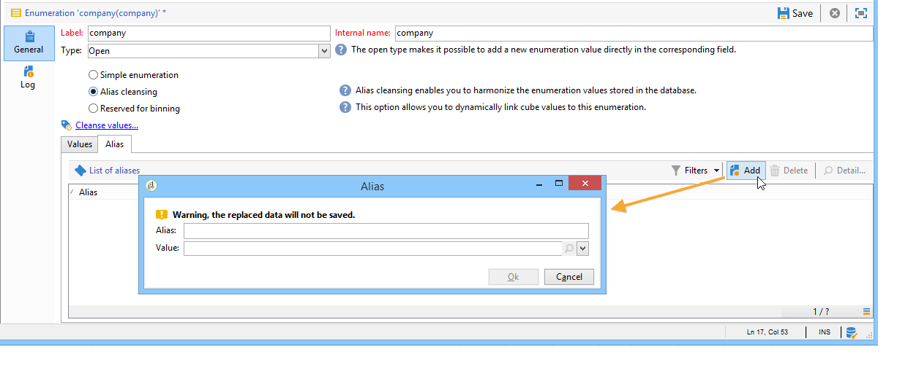

# Gestire le enumerazioni {#manage-enumerations}

Un’enumerazione (detta anche elenco dettagliato) è un elenco predefinito di valori che è possibile utilizzare per compilare determinati campi. Le enumerazioni consentono di standardizzare i valori dei campi, rendendo più coerente l&#39;immissione dei dati e semplificando le query.

Se disponibili, i valori vengono visualizzati in un elenco a discesa. Puoi selezionare direttamente un valore o iniziare a digitare; l’input predittivo suggerisce i valori corrispondenti e li completa automaticamente.

Alcuni campi della console sono configurati con enumerazioni. Se un&#39;enumerazione è **open**, è anche possibile aggiungere nuovi valori direttamente nel campo.

## Enumerazioni di accesso

I valori utilizzati in questi campi vengono gestiti centralmente. Puoi aggiungerli, modificarli, aggiornarli o eliminarli dalla struttura di Explorer, in **Amministrazione** `>` **Piattaforma** `>` **Enumerazioni**.

* La sezione superiore offre un elenco di campi per i quali è stata definita un’enumerazione.
* Nella sezione inferiore sono elencati i valori disponibili.

Quando un&#39;enumerazione è **[!UICONTROL Open]**, gli utenti possono immettere un nuovo valore direttamente nel campo corrispondente nell&#39;interfaccia utente.

Quando un&#39;enumerazione è **[!UICONTROL Closed]**, è possibile aggiungere nuovi valori solo dal menu **Enumerazione**.

## Aggiungi un nuovo valore

Per creare un nuovo valore di enumerazione, fare clic sul pulsante **[!UICONTROL Add]**.

Immetti l’etichetta del valore.

## Pulizia alias {#alias-cleansing}

Nei campi di enumerazione è possibile immettere valori diversi da quelli di enumerazione. Questi possono essere memorizzati così come sono o essere puliti.

>[!CAUTION]
>
>La pulizia dei dati è un processo critico che influisce sui dati presenti nel database. Adobe Campaign esegue aggiornamenti di massa dei dati, che potrebbero causare l’eliminazione di alcuni valori. Questa operazione è pertanto riservata agli utenti esperti.

Il valore immesso è quindi:

* Aggiunto ai valori dell&#39;elenco dettagliati: in questo caso è necessario selezionare l&#39;opzione **[!UICONTROL Open]**,
* o automaticamente sostituito dal relativo alias corrispondente: in questo caso, il caso deve essere definito nella scheda **[!UICONTROL Alias]** dell&#39;elenco dettagliato,
* o viene memorizzato nell’elenco degli alias: gli verrà successivamente assegnato un alias.

### Creare un alias {#creating-an-alias}

L&#39;opzione **[!UICONTROL Alias cleansing]** consente di utilizzare alias per l&#39;elenco dettagliato selezionato. Quando questa opzione è selezionata, nella parte inferiore della finestra viene visualizzata la scheda **[!UICONTROL Alias]**.

Per creare un alias, eseguire la procedura seguente:

1. Passare all&#39;enumerazione per aggiornare ant click **[!UICONTROL Add]**.

   

1. Immettere l&#39;alias che si desidera convertire e il valore da applicare e fare clic su **[!UICONTROL Ok]**.

1. Controlla i parametri prima di confermare questa operazione.

>[!CAUTION]
>
>Una volta confermato questo passaggio, i valori precedenti potrebbero non essere recuperati: vengono sostituiti.

Pertanto, quando un utente immette il valore **NEILSEN** in un campo &quot;company&quot; (nella console Adobe Campaign o in un modulo), viene automaticamente sostituito dal valore **NIELSEN Ltd**. Il valore viene sostituito dal flusso di lavoro **Pulizia alias**. Consulta [Eseguire la pulizia dei dati](#running-data-cleansing).

### Convertire valori in alias {#values-into-aliases}

È possibile convertire i valori esistenti in alias. Per eseguire questa operazione, eseguire la procedura seguente:

1. Fare clic con il pulsante destro del mouse nell&#39;elenco di valori e scegliere **[!UICONTROL Convert values into aliases...]**.

1. Scegliere i valori da convertire e fare clic su **[!UICONTROL Next]**.

1. Fare clic su **[!UICONTROL Start]** per eseguire la conversione.

Al termine dell’esecuzione, l’alias viene aggiunto all’elenco degli alias.

### Recuperare gli hit alias {#alias-hits}

Quando gli utenti immettono valori non inclusi nell&#39;enumerazione, questi vengono memorizzati nella scheda **[!UICONTROL Alias]**.

Il flusso di lavoro tecnico **Pulizia alias** recupera questi valori ogni notte per aggiornare l&#39;enumerazione. Fai riferimento a [Eseguire la pulizia dei dati](#running-data-cleansing)

Se necessario, la colonna **[!UICONTROL Hits]** può visualizzare il numero di volte in cui questo valore è stato immesso. Tuttavia, il calcolo di questo valore può richiedere tempo e memoria. Per ulteriori informazioni, consulta [Calcolare le occorrenze della voce](#calculating-entry-occurrences).

### Esegui pulizia dati {#run-data-cleansing}

La pulizia dei dati viene eseguita dal flusso di lavoro tecnico **[!UICONTROL Alias cleansing]**. Le configurazioni definite per le enumerazioni vengono applicate durante l’esecuzione. Consulta [Flusso di lavoro di pulizia alias](#alias-cleansing-workflow).

La pulizia può essere attivata tramite il collegamento **[!UICONTROL Cleanse values...]**.

Il collegamento **[!UICONTROL Advanced parameters...]** consente di impostare la data a partire dalla quale i valori raccolti vengono presi in considerazione.

Fare clic sul pulsante **[!UICONTROL Start]** per eseguire la pulizia dei dati.

### Calcola occorrenze voce {#entry-occurrences}

Nella scheda secondaria **[!UICONTROL Alias]** di un elenco dettagliato è possibile visualizzare il numero di occorrenze di un alias tra tutti i valori immessi. Queste informazioni sono una stima e verranno visualizzate nella colonna **[!UICONTROL Hits]**.

>[!CAUTION]
>
>Il calcolo delle occorrenze della voce alias può richiedere molto tempo. Per questo motivo è necessario prestare attenzione quando si utilizza questa funzione.

Puoi eseguire il calcolo degli hit manualmente tramite il collegamento **[!UICONTROL Cleanse values...]**. A tale scopo, fare clic sul collegamento **[!UICONTROL Advanced parameters...]** e selezionare le opzioni desiderate.

* **[!UICONTROL Update the number of alias hits]**: consente di aggiornare gli hit già calcolati in base alla data immessa.
* **[!UICONTROL Recalculate the number of alias hits from the start]**: consente di eseguire calcoli sull&#39;intera piattaforma Adobe Campaign.

Puoi anche creare un flusso di lavoro dedicato per consentire l’esecuzione automatica del calcolo per un determinato periodo, ad esempio una volta alla settimana.

Per eseguire questa operazione, creare una copia del flusso di lavoro **[!UICONTROL Alias cleansing]**, modificare la pianificazione e utilizzare le impostazioni seguenti nell&#39;attività **[!UICONTROL Enumeration value cleansing]**:

* **-updateHits** per aggiornare il numero di hit alias,
* **-updateHits:full** per ricalcolare tutti gli hit alias.

### Flusso di lavoro di pulizia degli alias {#alias-cleansing-workflow}

Il flusso di lavoro **Pulizia alias** esegue la pulizia dei valori delle enumerazioni. Per impostazione predefinita, viene eseguito su base giornaliera.

È accessibile tramite il nodo **[!UICONTROL Administration > Production > Technical workflows]**.

