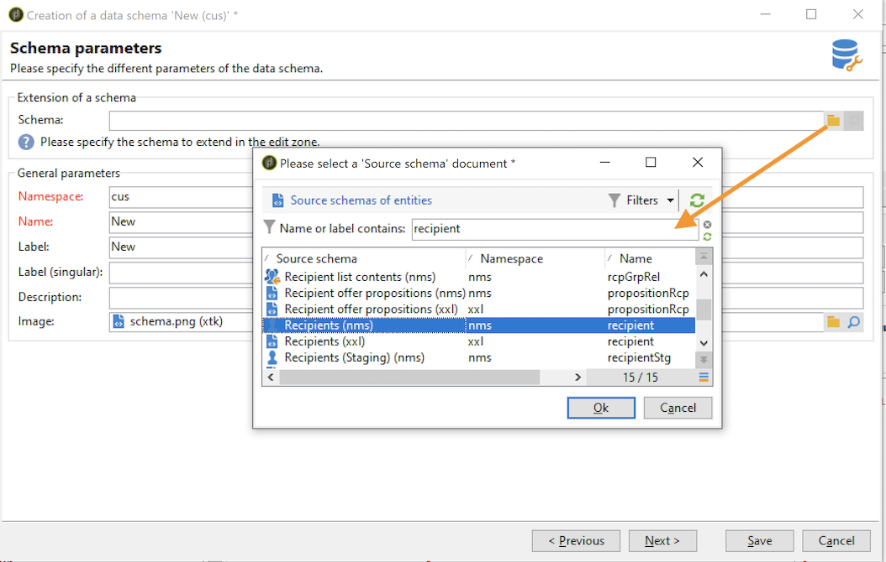

# Estendere uno schema{#extend-schemas}

In qualità di utente tecnico, puoi personalizzare il modello dati di Campaign per soddisfare le esigenze della tua implementazione: puoi aggiungere elementi a uno schema esistente, modificare un elemento in uno schema o eliminare elementi.

I passaggi chiave per personalizzare il modello dati di Campaign sono:

1. Creare uno schema di estensione
1. Aggiornare il database di Campaign
1. Adattare il modulo di input

>[!CAUTION]
>Lo schema incorporato non deve essere modificato direttamente. Se devi adattare uno schema integrato, devi estenderlo.

Per informazioni sulle tabelle integrate di Campaign e sulla loro interazione, consulta [questa pagina](datamodel.md). Consulta anche i consigli durante la creazione di un nuovo schema in [questa pagina](create-schema.md).

Per estendere uno schema, effettua le seguenti operazioni:

1. Accedi a **[!UICONTROL Administration > Configuration > Data schemas]** in Esplora risorse.
1. Fai clic su **Nuovo** e seleziona **[!UICONTROL Extend the data in a table using an extension schema]**.

   

1. Identifica lo schema integrato da estendere e selezionalo.

   

   Per convenzione, assegna allo schema di estensione lo stesso nome dello schema incorporato e utilizza uno spazio dei nomi personalizzato.  Alcuni spazi dei nomi sono solo interni. [Ulteriori informazioni](schemas.md#reserved-namespaces)

   

1. Una volta nell’editor dello schema, aggiungi gli elementi necessari utilizzando il menu contestuale e salva.

   

   Nell’esempio seguente, aggiungiamo il **MembershipYear** , imposta un limite di lunghezza per il cognome (questo limite sovrascriverà quello predefinito) e rimuovi la data di nascita dallo schema predefinito.

   

   ```
   <srcSchema created="YYYY-MM-DD" desc="Recipient table" extendedSchema="nms:recipient"
           img="nms:recipient.png" label="Recipients" labelSingular="Recipient" lastModified="YYYY-MM-DD"
           mappingType="sql" name="recipient" namespace="cus" xtkschema="xtk:srcSchema">
    <element desc="Recipient table" img="nms:recipient.png" label="Recipients" labelSingular="Recipient" name="recipient">
       <attribute label="Member since" name="MembershipYear" type="long"/>
       <attribute length="50" name="lastName"/>
       <attribute _operation="delete" name="birthDate"/>
   </element>
   </srcSchema>
   ```

1. Disconnettiti e riconnettiti a Campaign per verificare l’aggiornamento della struttura dello schema in **[!UICONTROL Structure]** scheda.

   

1. Aggiorna la struttura del database per applicare le modifiche. [Ulteriori informazioni](update-database-structure.md)

1. Una volta implementate le modifiche nel database, è possibile adattare il modulo di input del destinatario per rendere visibili le modifiche. [Ulteriori informazioni](forms.md)
