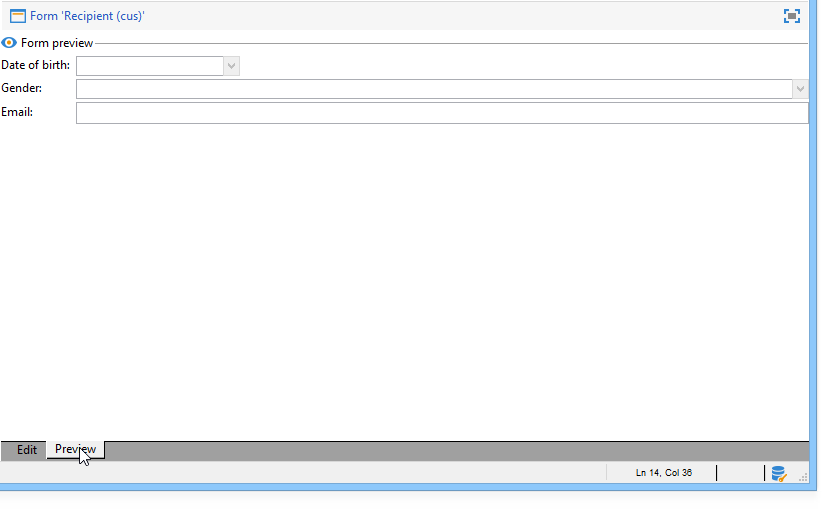

# Guida introduttiva ai moduli di input{#gs-ac-forms}

Quando si crea o si estende uno schema, è necessario creare o modificare i moduli di input associati per rendere tali modifiche visibili agli utenti finali.

Un modulo di input consente di modificare un’istanza associata a uno schema di dati dalla console client di Adobe Campaign. Il modulo è identificato dal nome e dallo spazio dei nomi.

La chiave di identificazione di un modulo è una stringa costituita dallo spazio dei nomi e dal nome separati da due punti, ad esempio: &quot;cus:contact&quot;.

## Modificare i moduli di input

Creare e configurare i moduli di input dal **[!UICONTROL Administration]> [!UICONTROL Configuration] >[!UICONTROL Input forms]** cartella della console client:


La zona di modifica consente di immettere il contenuto XML del modulo di input:


Nell’anteprima viene generata una visualizzazione del modulo di input:



## Struttura di un modulo

La descrizione di un modulo è un documento XML strutturato che osserva la grammatica dello schema del modulo **xtk:form**.

Il documento XML del modulo di input deve contenere `<form>` elemento principale con  **name** e  **namespace** attributi per compilare il nome e lo spazio dei nomi del modulo.

```
<form name="form_name" namespace="name_space">
...
</form>
```

Per impostazione predefinita, un modulo è associato allo schema dati con lo stesso nome e lo stesso spazio dei nomi. Per associare un modulo con un nome diverso, impostare la **entity-schema** dell&#39;attributo `<form>` al nome della chiave dello schema. Per illustrare la struttura di un modulo di input, descriviamo un’interfaccia utilizzando lo schema di esempio &quot;cus:recipient&quot;:

```
<srcSchema name="recipient" namespace="cus">
  <enumeration name="gender" basetype="byte">    
    <value name="unknown" label="Not specified" value="0"/>    
    <value name="male" label="Male" value="1"/>   
    <value name="female" label="Female" value="2"/>   
  </enumeration>

  <element name="recipient">
    <attribute name="email" type="string" length="80" label="Email" desc="E-mail address of recipient"/>
    <attribute name="birthDate" type="datetime" label="Date"/>
    <attribute name="gender" type="byte" label="Gender" enum="gender"/>
  </element>
</srcSchema>
```

Il modulo di input basato sullo schema di esempio:


```
<form name="recipient" namespace="cus">
  <input xpath="@gender"/>
  <input xpath="@birthDate"/>
  <input xpath="@email"/>
</form>
```

La descrizione dei controlli di modifica inizia dal `<form>` elemento principale. Un controllo di modifica viene immesso in un **`<input>`** con **xpath** attributo contenente il percorso del campo nel relativo schema.

Il controllo edit si adatta automaticamente al tipo di dati corrispondente e utilizza l’etichetta definita nello schema.

>[!NOTE]
>
>Puoi sovrascrivere l’etichetta definita nel relativo schema di dati aggiungendo la variabile **etichetta** attributo `<input>` elemento:\
>`<input label="E-mail address" xpath="@name" />`

Per impostazione predefinita, ogni campo viene visualizzato su una singola riga e occupa tutto lo spazio disponibile a seconda del tipo di dati.

 Tutti gli attributi del modulo sono elencati in [Documentazione di Campaign Classic v7](https://experienceleague.adobe.com/developer/campaign-api/api/control-Button.html){target="_blank"}.

## Formattazione {#formatting}

Il layout dei controlli è simile al layout utilizzato nelle tabelle di HTML, con la possibilità di dividere un controllo in più colonne, elementi di interlacciamento o di specificare l&#39;occupazione dello spazio disponibile. Tenere tuttavia presente che la formattazione consente solo di suddividere l&#39;area per proporzioni; non è possibile specificare dimensioni fisse per un oggetto.

Per visualizzare i controlli dell&#39;esempio precedente in due colonne:


```
<form name="recipient" namespace="cus">
  <container colcount="2">
    <input xpath="@gender"/>
    <input xpath="@birthDate"/>
    <input xpath="@email"/>
  </container>
</form>
```

La **`<container>`** con **colcount** attributo consente di forzare la visualizzazione dei controlli figlio su due colonne.

La **colata** l&#39;attributo di un controllo estende il controllo in base al numero di colonne inserite nel relativo valore:


```
<form name="recipient" namespace="cus">
  <container colcount="2">
    <input xpath="@gender"/>
    <input xpath="@birthDate"/>
    <input xpath="@email" colspan="2"/>
  </container>
</form> 
```

Compilando il **type=&quot;frame&quot;** attributo , il contenitore aggiunge una cornice intorno ai controlli secondari con l&#39;etichetta contenuta in **etichetta** attributo:


```
<form name="recipient" namespace="cus">
  <container colcount="2" type="frame" label="General">
    <input xpath="@gender"/>
    <input xpath="@birthDate"/>
    <input xpath="@email" colspan="2"/>
  </container>
</form>
```

A **`<static>`** può essere utilizzato per formattare il modulo di input:


```
<form name="recipient" namespace="cus">
  <static type="separator" colspan="2" label="General"/>
  <input xpath="@gender"/>
  <input xpath="@birthDate"/>
  <input xpath="@email" colspan="2"/>
  <static type="help" label="General information about recipient with date of birth, gender, and e-mail address." colspan="2"/>
</form>
```

La **`<static>`** con il tag **separatore** Il tipo consente di aggiungere una barra separatrice con un’etichetta contenuta in **etichetta** attributo.

È stato aggiunto un testo della guida utilizzando `<static>` tag con tipo di guida. Il contenuto del testo viene immesso nel **etichetta** attributo.

## Usa contenitori {#containers}

Utilizzo **contenitori** per raggruppare un insieme di controlli. Sono rappresentati dal **`<container>`** elemento. Sono stati utilizzati in precedenza per formattare i controlli su più colonne.

La **xpath** attributo su `<container>` consente di semplificare il riferimento ai controlli figlio. Il riferimento ai controlli è quindi relativo all&#39;elemento padre `<container>` genitore.

Esempio di contenitore senza &quot;xpath&quot;:

```
<container colcount="2">
  <input xpath="location/@zipCode"/>
  <input xpath="location/@city"/>
</container>
```

Esempio con l’aggiunta di &quot;xpath&quot; all’elemento denominato &quot;location&quot;:

```
<container colcount="2" xpath="location">
  <input xpath="@zipCode"/>
  <input xpath="@city"/>
</container>
```

I contenitori vengono utilizzati per creare controlli complessi utilizzando un set di campi formattati nelle pagine.

### Aggiungi schede (blocco appunti) {#tab-container}

Utilizza un **blocco** per formattare i dati in pagine accessibili dalle schede.


```
<container type="notebook">
  <container colcount="2" label="General">
    <input xpath="@gender"/>
    <input xpath="@birthDate"/>
    <input xpath="@email" colspan="2"/>
  </container>
  <container colcount="2" label="Location">
    ...
  </container>
</container>
```

Il contenitore principale è definito dalla **type=&quot;notebook&quot;** attributo. Le schede vengono dichiarate nei contenitori secondari e l’etichetta delle schede viene compilata dalla **etichetta** attributo.

Aggiungi il **style=&quot;down&quot;** per forzare il posizionamento verticale delle etichette di tabulazione sotto il controllo. Questo attributo è facoltativo. Il valore predefinito è **&quot;su&quot;**.


`<container style="down" type="notebook">  ... </container>`

### Aggiungi icone (icona) {#icon-list}

Utilizza questo contenitore per visualizzare una barra delle icone verticale che ti consente di selezionare le pagine da visualizzare.


```
<container type="iconbox">
  <container colcount="2" label="General" img="xtk:properties.png">
    <input xpath="@gender"/>
    <input xpath="@birthDate"/>
    <input xpath="@email" colspan="2"/>
  </container>
  <container colcount="2" label="Location" img="nms:msgfolder.png">
    ...
  </container>
</container>
```

Il contenitore principale è definito dalla **type=&quot;iconbox&quot;** attributo. Le pagine associate alle icone vengono dichiarate nei contenitori secondari. L’etichetta delle icone viene compilata dal **etichetta** attributo.

L’icona di una pagina viene compilata dal `img="<image>"` attributo, dove `<image>` è il nome dell’immagine corrispondente alla chiave costituita dal nome e dallo spazio dei nomi (ad esempio, &quot;xtk:properties.png&quot;).

Le immagini sono disponibili dal **[!UICONTROL Administration > Configuration > Images]** nodo.

### Nascondi contenitori (visibleGroup) {#visibility-container}

È possibile nascondere un set di controlli tramite una condizione dinamica.

Questo esempio illustra la visibilità dei controlli sul valore del campo &quot;Genere&quot;:

```
<container type="visibleGroup" visibleIf="@gender=1">
  ...
</container>
<container type="visibleGroup" visibleIf="@gender=2">
  ...
</container>
```

Un contenitore di visibilità è definito dall’attributo **type=&quot;visibleGroup&quot;**. La **visibleIf** l&#39;attributo contiene la condizione di visibilità.

Esempi di sintassi della condizione:

* **visibleIf=&quot;@email=&#39;peter.martinezATneeolane.net&#39;&quot;**: verifica l&#39;uguaglianza nei dati di tipo stringa. Il valore di confronto deve essere tra virgolette.
* **visibleIf=&quot;@gender >= 1 e @gender != 2&quot;**: su un valore numerico.
* **visibleIf=&quot;@boolean1=true o @boolean2=false&quot;**: test su campi booleani.

### Visualizzazione condizionale (enabledGroup) {#enabling-container}

Questo contenitore consente di abilitare o disabilitare un set di dati da una condizione dinamica. La disattivazione di un controllo ne impedisce la modifica. L&#39;esempio seguente illustra l&#39;abilitazione dei controlli dal valore del campo &quot;Genere&quot;:

```
<container type="enabledGroup" enabledIf="@gender=1">
  ...
</container>
<container type="enabledGroup" enabledIf="@gender=2">
  ...
</container>
```

Un contenitore di abilitazione è definito dalla **type=&quot;enabledGroup&quot;** attributo. La **enabledIf** l&#39;attributo contiene la condizione di attivazione.

## Modificare un collegamento {#editing-a-link}

Ricorda che nello schema dati è dichiarato un collegamento come segue:

```
<element label="Company" name="company" target="cus:company" type="link"/>
```

Il controllo di modifica del collegamento nel relativo modulo di input è il seguente:


```
<input xpath="company"/>
```

La selezione di Target è accessibile tramite il campo di modifica. L’ingresso è assistito dal tipo avanti in modo che un elemento di destinazione possa essere facilmente trovato dai primi caratteri immessi. La ricerca viene quindi basata sul **Stringa di calcolo** definito nello schema di destinazione. Se lo schema non esiste dopo la convalida nel controllo, viene visualizzato un messaggio di conferma della creazione rapida del target. La conferma crea un nuovo record nella tabella di destinazione e lo associa al collegamento.

Un elenco a discesa viene utilizzato per selezionare un elemento di destinazione dall’elenco di record già creati.

La **[!UICONTROL Modify the link]** (cartella) avvia un modulo di selezione con l’elenco degli elementi di destinazione e una zona filtro.

La **[!UICONTROL Edit link]** (lente di ingrandimento) lancia il modulo di modifica dell’elemento collegato. Il modulo utilizzato viene dedotto per impostazione predefinita sulla chiave dello schema di destinazione. La **modulo** consente di forzare il nome del modulo di modifica (ad esempio &quot;cus:company2&quot;).

Puoi limitare la scelta degli elementi di destinazione aggiungendo il **`<sysfilter>`** elemento dalla definizione del collegamento nel modulo di input:

```
<input xpath="company">
  <sysFilter>
    <condition expr="[location/@city] =  'Newton"/>
  </sysFilter>
</input>
```

È inoltre possibile ordinare l’elenco con **`<orderby>`** elemento:

```
<input xpath="company">
  <orderBy>
    <node expr="[location/@zipCode]"/>
  </orderBy>
</input>
```

## Proprietà di controllo {#control-properties}

* **noAutoComplete**: disabilita type-ahead (con il valore &quot;true&quot;)
* **createMode**: crea il collegamento al volo, se non esiste. I valori possibili sono:

   * **nessuno**: disabilita la creazione. Se il collegamento non esiste, viene visualizzato un messaggio di errore
   * **inline**: crea il collegamento con il contenuto del campo di modifica
   * **edizione**: visualizza il modulo di modifica sul collegamento. Quando il modulo viene convalidato, i dati vengono salvati (modalità predefinita)

* **noZoom**: nessun modulo di modifica sul collegamento (con il valore &quot;true&quot;)
* **modulo**: sovraccarica il modulo di modifica dell’elemento di destinazione

## Aggiungere un elenco di collegamenti (non associati) {#list-of-links}

Un collegamento inserito nello schema dati come elemento di raccolta (unbound=&quot;true&quot;) deve passare attraverso un elenco per visualizzare tutti gli elementi associati ad esso.

Il principio consiste nel visualizzare l’elenco degli elementi collegati con il caricamento ottimizzato dei dati (download per batch di dati, esecuzione dell’elenco solo se visibile).

Esempio di collegamento di una raccolta in uno schema:

```
<element label="Events" name="rcpEvent" target="cus:event" type="link" unbound="true">
...
</element>
```

L’elenco nel relativo modulo di immissione:

```
 <input xpath="rcpEvent" type="linklist">
  <input xpath="@label"/>
  <input xpath="@date"/>
</input>
```

Il controllo elenco è definito dalla **type=&quot;linklist&quot;** attributo. Il percorso dell&#39;elenco deve fare riferimento al collegamento della raccolta.

Le colonne vengono dichiarate tramite il **`<input>`** elementi dell&#39;elenco. La **xpath** attributo si riferisce al percorso del campo nello schema di destinazione.

Una barra degli strumenti con un’etichetta (definita sul collegamento nello schema) viene automaticamente posizionata sopra l’elenco.

L’elenco può essere filtrato tramite **[!UICONTROL Filters]** e configurati per aggiungere e ordinare le colonne.

La **[!UICONTROL Add]** e **[!UICONTROL Delete]** I pulsanti ti consentono di aggiungere ed eliminare elementi della raccolta sul collegamento. Per impostazione predefinita, l’aggiunta di un elemento avvia il modulo di modifica dello schema di destinazione.

La **[!UICONTROL Detail]** viene aggiunto automaticamente quando **zoom=&quot;true&quot;** l&#39;attributo è completato nel **`<input>`** tag dell’elenco: consente di avviare il modulo di modifica della riga selezionata.

È possibile applicare filtri e ordinamento quando l’elenco viene caricato:

```
 <input xpath="rcpEvent" type="linklist">
  <input xpath="@label"/>
  <input xpath="@date"/>
  <sysFilter>
    <condition expr="@type = 1"/>
  </sysFilter>
  <orderBy>
    <node expr="@date" sortDesc="true"/>
  </orderBy>
</input>
```

## Definire una tabella di relazione {#relationship-table}

Una tabella di relazione consente di collegare due tabelle con cardinalità N-N. La tabella delle relazioni contiene solo i collegamenti alle due tabelle.

L’aggiunta di un elemento all’elenco dovrebbe pertanto consentire di completare un elenco da uno dei due collegamenti presenti nella tabella delle relazioni.

Esempio di tabella di relazione in uno schema:

```
<srcSchema name="subscription" namespace="cus">
  <element name="recipient" type="link" target="cus:recipient" label="Recipient"/>
  <element name="service" type="link" target="cus:service" label="Subscription service"/>
</srcSchema>
```

Per il nostro esempio, iniziamo con il modulo di input dello schema &quot;cus:recipient&quot;. L’elenco deve visualizzare le associazioni con abbonamenti ai servizi e deve consentire di aggiungere un abbonamento selezionando un servizio esistente.


```
<input type="linklist" xpath="subscription" xpathChoiceTarget="service" xpathEditTarget="service" zoom="true">
  <input xpath="recipient"/>
  <input xpath="service"/>
</input>
```

La **xpathChoiceTarget** consente di avviare un modulo di selezione dal collegamento inserito. La creazione del record della tabella delle relazioni aggiornerà automaticamente il collegamento al destinatario corrente e al servizio selezionato.

>[!NOTE]
>
>La **xpathEditTarget** attributo ti consente di forzare la modifica della riga selezionata sul collegamento inserito.

### Proprietà elenco {#list-properties}

* **noToolbar**: nasconde la barra degli strumenti (con valore &quot;true&quot;)
* **toolbarCaption**: sovraccarica l’etichetta della barra degli strumenti
* **toolbarAlign**: modifica la geometria verticale o orizzontale della barra degli strumenti (valori possibili: &quot;verticale&quot;|&quot;orizzontale&quot;)
* **img**: visualizza l’immagine associata all’elenco
* **modulo**: sovraccarica il modulo di modifica dell’elemento di destinazione
* **zoom**: aggiunge la **[!UICONTROL Zoom]** per modificare l’elemento di destinazione
* **xpathEditTarget**: imposta la modifica del collegamento inserito
* **xpathChoiceTarget**: inoltre, avvia il modulo di selezione sul collegamento inserito

## Aggiungi controlli elenco memoria {#memory-list-controls}

Gli elenchi di memoria consentono di modificare gli elementi della raccolta utilizzando il precaricamento dei dati dell’elenco. Impossibile filtrare o configurare l&#39;elenco.

Questi elenchi vengono utilizzati su elementi di raccolta mappati XML o su collegamenti a basso volume.

## Aggiungi un elenco di colonne {#column-list}

Questo controllo visualizza un elenco di colonne modificabili con una barra degli strumenti contenente i pulsanti Aggiungi ed Elimina .

```
<input xpath="rcpEvent" type="list">
  <input xpath="@label"/>
  <input xpath="@date"/>
</input>
```

Il controllo elenco deve essere compilato con **type=&quot;list&quot;** e il percorso dell&#39;elenco deve fare riferimento all&#39;elemento di raccolta.

Le colonne sono dichiarate nel figlio **`<input>`** tag dell’elenco. L’etichetta e la dimensione della colonna possono essere forzate con **etichetta** e **colSize** attributi.

>[!NOTE]
>
>Le frecce di ordinamento vengono aggiunte automaticamente quando **ordered=&quot;true&quot;** viene aggiunto all&#39;elemento di raccolta nello schema dati.

I pulsanti della barra degli strumenti possono essere allineati orizzontalmente:

```
<input nolabel="true" toolbarCaption="List of events" type="list" xpath="rcpEvent" zoom="true">
  <input xpath="@label"/>
  <input xpath="@date"/>
</input>
```

La **toolbarCaption** forza l’allineamento orizzontale della barra degli strumenti e immette il titolo sopra l’elenco.

### Abilita zoom in un elenco {#zoom-in-a-list}

L’inserimento e la modifica dei dati in un elenco possono essere immessi in un modulo di modifica separato.

```
<input nolabel="true" toolbarCaption="List of events" type="list" xpath="rcpEvent" zoom="true" zoomOnAdd="true">
  <input xpath="@label"/>
  <input xpath="@date"/>

  <form colcount="2" label="Event">
    <input xpath="@label"/>
    <input xpath="@date"/>
  </form>
</input>
```

Il modulo di modifica viene completato dal `<form>`  in definizione elenco. La sua struttura è identica a quella di un modulo di input. La **[!UICONTROL Detail]** viene aggiunto automaticamente quando **zoom=&quot;true&quot;** l&#39;attributo è completato nel **`<input>`** tag dell’elenco. Questo attributo consente di avviare il modulo di modifica della riga selezionata.

>[!NOTE]
>
>Aggiunta di **zoomOnAdd=&quot;true&quot;** forza la chiamata del modulo di modifica quando viene inserito un elemento elenco.

### Proprietà elenco {#list-properties-1}

* **noToolbar**: nasconde la barra degli strumenti (con valore &quot;true&quot;)
* **toolbarCaption**: sovraccarica l’etichetta della barra degli strumenti
* **toolbarAlign**: modifica il posizionamento della barra degli strumenti (valori possibili: &quot;verticale&quot;|&quot;orizzontale&quot;)
* **img**: visualizza l’immagine associata all’elenco
* **modulo**: sovraccarica il modulo di modifica dell’elemento di destinazione
* **zoom**: aggiunge la **[!UICONTROL Zoom]** per modificare l’elemento di destinazione
* **zoomOnAdd**: avvia il modulo di modifica sull’aggiunta
* **xpathChoiceTarget**: inoltre, avvia il modulo di selezione sul collegamento inserito

## Aggiungi campi non modificabili {#non-editable-fields}

Per visualizzare un campo ed impedirne la modifica, utilizza la **`<value>`** oppure completa il **readOnly=&quot;true&quot;** dell&#39;attributo **`<input>`** tag .

Esempio nel campo &quot;Genere&quot;:


```
<value value="@gender"/>
<input xpath="@gender" readOnly="true"/>
```

## Aggiungi pulsante di scelta {#radio-button}

Un pulsante di scelta consente di scegliere tra diverse opzioni. La **`<input>`** vengono utilizzati per elencare le opzioni possibili e **checkedValue** attributo specifica il valore associato alla scelta.

Esempio nel campo &quot;Genere&quot;:

```
<input type="RadioButton" xpath="@gender" checkedValue="0" label="Choice 1"/>
<input type="RadioButton" xpath="@gender" checkedValue="1" label="Choice 2"/>
<input type="RadioButton" xpath="@gender" checkedValue="2" label="Choice 3"/>
```


## Aggiungi una casella di controllo {#checkbox}

Una casella di controllo riflette uno stato booleano (selezionato o meno). Per impostazione predefinita, questo controllo è utilizzato dai campi &quot;booleani&quot; (true/false). A questo pulsante può essere associata una variabile con un valore predefinito pari a 0 o 1. Questo valore può essere sovraccaricato tramite il **checkValue** attributi.

```
<input xpath="@boolean1"/>
<input xpath="@field1" type="checkbox" checkedValue="Y"/>
```


## Modifica gerarchia di navigazione {#navigation-hierarchy-edit}

Questo controllo crea una struttura ad albero in un insieme di campi da modificare.

I controlli da modificare sono raggruppati in un **`<container>`** inserito sotto **`<input>`** tag del controllo struttura:

```
<input nolabel="true" type="treeEdit">
  <container label="Text fields">
    <input xpath="@text1"/>
    <input xpath="@text2"/>
  </container>
  <container label="Boolean fields">
    <input xpath="@boolean1"/>
    <input xpath="@boolean2"/>
  </container>
</input>
```


## Aggiungi un campo espressione {#expression-field}

Un campo espressione aggiorna dinamicamente un campo da un’espressione; la **`<input>`** viene utilizzato con un **xpath** per inserire il percorso del campo da aggiornare e un **expr** attributo contenente l&#39;espressione update .

```
<!-- Example: updating the boolean1 field from the value contained in the field with path /tmp/@flag -->
<input expr="Iif([/tmp/@flag]=='On', true, false)" type="expr" xpath="@boolean1"/>
<input expr="[/ignored/@action] == 'FCP'" type="expr" xpath="@launchFCP"/>
```

## Contesto dei moduli {#context-of-forms}

L’esecuzione di un modulo di input inizializza un documento XML contenente i dati dell’entità da modificare. Questo documento rappresenta il contesto del modulo e può essere utilizzato come area di lavoro.

### Aggiornare il contesto {#updating-the-context}

Per modificare il contesto del modulo, utilizzare la `<set expr="<value>" xpath="<field>"/>` tag, dove `<field>` è il campo di destinazione e `<value>` è l&#39;espressione o il valore di aggiornamento.

Esempi di utilizzo `<set>` tag:

* **`<set expr="'Test'" xpath="/tmp/@test" />`**: posiziona il valore &#39;Test&#39; nella posizione temporanea /tmp/@test1
* **`<set expr="'Test'" xpath="@lastName" />`**: aggiorna l’entità sull’attributo &quot;lastName&quot; con il valore &quot;Test&quot;
* **`<set expr="true" xpath="@boolean1" />`**: imposta il valore del campo &quot;boolean1&quot; su &quot;true&quot;
* **`<set expr="@lastName" xpath="/tmp/@test" />`**: aggiornamenti relativi al contenuto dell&#39;attributo &quot;lastName&quot;

Il contesto del modulo può essere aggiornato al momento dell’inizializzazione e della chiusura del modulo tramite la **`<enter>`** e **`<leave>`** tag.

```
<form name="recipient" namespace="cus">
  <enter>
    <set...
  </enter>
  ...
  <leave>
    <set...
  </leave>
</form>
```

>[!NOTE]
>
>La `<enter>`  e  `<leave>`   possono essere utilizzati nei `<container>` di pagine (tipi &quot;blocco appunti&quot; e &quot;casella icone&quot;).

### Linguaggio delle espressioni {#expression-language-}

Per eseguire test condizionali, è possibile utilizzare una macro-lingua nella definizione del modulo.

La **`<if expr="<expression>" />`** se l’espressione è verificata, il tag esegue le istruzioni specificate sotto il tag :

```
<if expr="([/tmp/@test] == 'Test' or @lastName != 'Doe') and @boolean2 == true">
  <set xpath="@boolean1" expr="true"/>
</if>
```

La **`<check expr="<condition>" />`** combinato con **`<error>`** impedisce la convalida del modulo e visualizza un messaggio di errore se la condizione non è soddisfatta:

```
<leave>
  <check expr="/tmp/@test != ''">
    <error>You must populate the 'Test' field!</error> 
  </check>
</leave>
```

## Assistente (procedura guidata) {#wizards}

Un assistente ti guida attraverso un set di passaggi di immissione dati sotto forma di pagine. I dati immessi vengono salvati al momento della convalida del modulo.

Per aggiungere un assistente, utilizzare il seguente tipo di struttura:

```
<form type="wizard" name="example" namespace="cus" img="nms:rcpgroup32.png" label="Wizard example" entity-schema="nms:recipient">
  <container title="Title of page 1" desc="Long description of page 1">
    <input xpath="@lastName"/>
    <input xpath="comment"/>
  </container>
  <container title="Title of page 2" desc="Long description of page 2">
    ...
  </container>
  ...
</form>
```

La presenza di **type=&quot;Wizard&quot;** dell&#39;attributo `<form>` consente di definire la modalità di creazione guidata nella costruzione del modulo. Le pagine vengono completate da `<container>` elementi, che sono figli del `<form>` elemento. La `<container>` L’elemento di una pagina viene popolato con gli attributi title per il titolo e desc per visualizzare la descrizione sotto il titolo della pagina. La **[!UICONTROL Previous]** e **[!UICONTROL Next]** i pulsanti vengono aggiunti automaticamente per consentire la navigazione tra le pagine.

La **[!UICONTROL Finish]** salva i dati immessi e chiude il modulo.

### Metodi SOAP {#soap-methods}

L’esecuzione del metodo SOAP può essere avviata da un popolato **`<leave>`** alla fine di una pagina.

La **`<soapcall>`** Il tag contiene la chiamata per il metodo con i seguenti parametri di input:

```
<soapCall name="<name>" service="<schema>">
  <param type="<type>" exprIn="<xpath>"/>  
  ...
</soapCall>
```

Il nome del servizio e il relativo schema di implementazione vengono immessi tramite il **name** e **servizio** gli attributi **`<soapcall>`** tag .

I parametri di input sono descritti nella sezione **`<param>`** gli elementi **`<soapcall>`** tag .

Il tipo di parametro deve essere specificato tramite il **type** attributo. I tipi possibili sono i seguenti:

* **string**: stringa di caratteri
* **booleano**: Booleano
* **byte**: Numero intero a 8 bit
* **short**: Numero intero a 16 bit
* **long**: Numero intero a 32 bit
* **short**: Numero intero a 16 bit
* **double**: numero a virgola mobile a doppia precisione
* **DOMElement**: nodo di tipo elemento

La **exprIn** L&#39;attributo contiene la posizione dei dati da trasmettere come parametro.

**Esempio**:

```
<leave>
  <soapCall name="RegisterGroup" service="nms:recipient">         
    <param type="DOMElement" exprIn="/tmp/entityList"/>         
    <param type="DOMElement" exprIn="/tmp/choiceList"/>         
    <param type="boolean"    exprIn="true"/>       
  </soapCall>
</leave>
```
