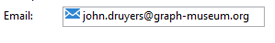

# Struttura dello schema{#schema-structure}

La struttura di base di un `<srcschema>` è la seguente:

```
<srcSchema>
    <enumeration>
        ...          //definition of enumerations
    </enumeration>
   
    <element>         //definition of the root <element>    (mandatory)

        <compute-string/>  //definition of a compute-string
        <key>
            ...        //definition of keys
        </key>
        <sysFilter>
            ...           //definition of filters
        </sysFilter>
        <attribute>
            ...             //definition of fields
        </attribute>
    
            <element>           //definition of sub-<element> 
                  <attribute>           //(collection, links or XML)
                  ...                         //and additional fields
                  </attribute>
                ...
            </element>
      
    </element> 

        <methods>                 //definition of SOAP methods
            <method>
                ...
            </method>
            ...
    </methods>  
          
</srcSchema>
```

Il documento XML di uno schema dati deve contenere gli attributi **`<srcschema>`** root con gli attributi **name** e **namespace** per popolare il nome dello schema e il relativo spazio dei nomi.

```
<srcSchema name="schema_name" namespace="namespace">
...
</srcSchema>
```

Utilizza il seguente contenuto XML per illustrare la struttura di uno schema di dati:

```
<recipient email="John.doe@aol.com" created="AAAA/DD/MM" gender="1"> 
  <location city="London"/>
</recipient>
```

Con lo schema di dati corrispondente:

```
<srcSchema name="recipient" namespace="cus">
  <element name="recipient">
    <attribute name="email"/>
    <attribute name="created"/>
    <attribute name="gender"/>
    <element name="location">
      <attribute name="city"/>
   </element>
  </element>
</srcSchema>
```

## Descrizione {#description}

Il punto di ingresso dello schema è il suo elemento principale. È facile da identificare perché ha lo stesso nome dello schema e dovrebbe essere l&#39;elemento secondario dell&#39;elemento principale. La descrizione del contenuto inizia con questo elemento.

Nel nostro esempio, l’elemento principale è rappresentato dalla seguente riga:

```
<element name="recipient">
```

Gli elementi **`<attribute>`** e **`<element>`** che seguono l&#39;elemento principale consentono di definire le posizioni e i nomi degli elementi dati nella struttura XML.

Nel nostro schema di esempio, questi sono:

```
<attribute name="email"/>
<attribute name="created"/>
<attribute name="gender"/>
<element name="location">
  <attribute name="city"/>
</element>
```

Devono essere rispettate le seguenti regole:

* Ciascun **`<element>`** e **`<attribute>`** deve essere identificato per nome tramite l&#39;attributo **name**.

   >[!CAUTION]
   >
   >Il nome dell’elemento deve essere conciso, preferibilmente in inglese, e includere solo caratteri autorizzati in conformità alle regole di denominazione XML.

* Solo gli elementi **`<element>`** possono contenere elementi **`<attribute>`** e elementi **`<element>`** nella struttura XML.
* Un elemento **`<attribute>`** deve avere un nome univoco all&#39;interno di un elemento **`<element>`**.
* Si consiglia di utilizzare **`<elements>`** nelle stringhe di dati su più righe.

## Tipi di dati {#data-types}

Il tipo di dati viene immesso tramite l’attributo **type** negli elementi **`<attribute>`** e **`<element>`**.

Un elenco dettagliato è disponibile nella [documentazione di Campaign Classic v7](https://experienceleague.adobe.com/docs/campaign-classic/using/configuring-campaign-classic/schema-reference/elements-attributes/schema-introduction.html?lang=en#configuring-campaign-classic).

Quando questo attributo non viene popolato, **string** è il tipo di dati predefinito, a meno che l&#39;elemento non contenga elementi secondari. Se lo fa, viene utilizzato solo per strutturare gli elementi gerarchicamente (**`<location>`** nel nostro esempio).

I seguenti tipi di dati sono supportati negli schemi:

* **stringa**: stringa di caratteri. Esempi: un nome, una città, ecc.

   La dimensione può essere specificata tramite l&#39;attributo **length** (facoltativo, valore predefinito &quot;255&quot;).

* **booleano**: Campo booleano. Esempio di possibili valori: true/false, 0/1, yes/no, ecc.
* **byte**,  **short**,  **long**: numeri interi (1 byte, 2 byte, 4 byte). Esempi: un’età, un numero di conto, un numero di punti, ecc.
* **doppio**: numero a virgola mobile a doppia precisione. Esempi: un prezzo, un tasso, ecc.
* **data**,  **datetime**: date e date + ore. Esempi: una data di nascita, una data di acquisto, ecc.
* **datetimenotz**: data + ora senza dati sul fuso orario.
* **timespan**: durate. Esempio: anzianità.
* **Memo**: campi di testo lunghi (righe multiple). Esempi: una descrizione, un commento, ecc.
* **uuid**: campi &quot;uniqueidentifier&quot;

   >[!NOTE]
   >
   >Per contenere un campo **uuid**, è necessario aggiungere e completare la funzione &quot;newuuid()&quot; con il relativo valore predefinito.

Di seguito è riportato lo schema di esempio con i tipi immessi:

```
<srcSchema name="recipient" namespace="cus">
  <element name="recipient">
    <attribute name="email" type="string" length="80"/>
    <attribute name="created" type="datetime"/>
    <attribute name="gender" type="byte"/>
    <element name="location">
      <attribute name="city" type="string" length="50"/>
   </element>
  </element>
</srcSchema>
```

## Properties {#properties}

Gli elementi **`<elements>`** e **`<attributes>`** dello schema dati possono essere arricchiti con varie proprietà. È possibile compilare un’etichetta per descrivere l’elemento corrente.

### Etichette e descrizioni {#labels-and-descriptions}

* La proprietà **label** consente di inserire una breve descrizione.

   >[!NOTE]
   >
   >L’etichetta è associata alla lingua corrente dell’istanza.

   **Esempio**:

   ```
   <attribute name="email" type="string" length="80" label="Email"/>
   ```

   L’etichetta è visibile dal modulo di input della console client di Adobe Campaign:

   

* La proprietà **desc** consente di inserire una descrizione lunga.

   La descrizione può essere visualizzata dal modulo di input nella barra di stato della finestra principale della console client di Adobe Campaign.

   >[!NOTE]
   >
   >La descrizione è associata alla lingua corrente dell’istanza.

   **Esempio**:

   ```
   <attribute name="email" type="string" length="80" label="Email" desc="Email of recipient"/>
   ```

### Valori predefiniti {#default-values}

La proprietà **default** consente di definire un&#39;espressione che restituisce un valore predefinito al momento della creazione del contenuto.

Il valore deve essere un&#39;espressione conforme al linguaggio XPath. Per ulteriori informazioni al riguardo, consulta [questa sezione](#reference-with-xpath).

**Esempio**:

* Data corrente: **default=&quot;GetDate()&quot;**
* Contatore: **default=&quot;&#39;FRM&#39;+CounterValue(&#39;myCounter&#39;)&quot;**

   In questo esempio, il valore predefinito viene costruito utilizzando la concatenazione di una stringa e chiamando la funzione **CounterValue** con un nome di contatore gratuito. Il numero restituito viene incrementato di uno a ogni inserimento.

   >[!NOTE]
   >
   >Nella console client di Adobe Campaign, il nodo **[!UICONTROL Administration>Counters]** viene utilizzato per gestire i contatori.

Per collegare un valore predefinito a un campo, è possibile utilizzare il comando `<default>  or  <sqldefault>   field.  </sqldefault> </default>`

`<default>` : consente di precompilare il campo con un valore predefinito durante la creazione di entità. Il valore non sarà un valore SQL predefinito.

`<sqldefault>` : consente di ottenere un valore aggiunto durante la creazione di un campo. Questo valore viene visualizzato come risultato SQL. Durante un aggiornamento dello schema, questo valore incide solo sui nuovi record.

### Enumerazioni {#enumerations}

#### Enumerazione gratuita {#free-enumeration}

La proprietà **userEnum** consente di definire un&#39;enumerazione gratuita per memorizzare e visualizzare i valori immessi tramite questo campo. La sintassi è la seguente:

**userEnum=&quot;nome dell&#39;enumerazione&quot;**

Il nome assegnato all&#39;enumerazione può essere scelto liberamente e condiviso con altri campi.

Questi valori vengono visualizzati in un elenco a discesa del modulo di input:


>[!NOTE]
>
>Nella console client di Adobe Campaign, il nodo **[!UICONTROL Administration > Enumerations]** viene utilizzato per gestire le enumerazioni.

#### Imposta enumerazione {#set-enumeration}

La proprietà **enum** consente di definire un&#39;enumerazione fissa utilizzata quando l&#39;elenco dei valori possibili è noto in anticipo.

L&#39;attributo **enum** fa riferimento alla definizione di una classe di enumerazione compilata nello schema al di fuori dell&#39;elemento principale.

Le enumerazioni consentono all’utente di selezionare un valore da un elenco a discesa invece di immettere il valore in un campo di input regolare:


Esempio di dichiarazione di enumerazione nello schema dati:

```
<enumeration name="gender" basetype="byte" default="0">    
  <value name="unknown" label="Not specified" value="0"/>    
  <value name="male" label="male" value="1"/>   
  <value name="female" label="female" value="2"/>   
</enumeration>
```

Un’enumerazione viene dichiarata al di fuori dell’elemento principale tramite l’elemento **`<enumeration>`** .

Le proprietà di enumerazione sono le seguenti:

* **baseType**: tipo di dati associati ai valori,
* **etichetta**: descrizione dell&#39;enumerazione,
* **nome**: nome dell&#39;enumerazione,
* **predefinito**: valore predefinito dell&#39;enumerazione.

I valori di enumerazione sono dichiarati nell&#39;elemento **`<value>`** con i seguenti attributi:

* **nome**: nome del valore memorizzato internamente,
* **etichetta**: viene visualizzata tramite l’interfaccia grafica.

#### enumerazione del dbenum {#dbenum-enumeration}

* La proprietà **dbenum** consente di definire un&#39;enumerazione le cui proprietà sono simili a quelle della proprietà **enum** .

   Tuttavia, l&#39;attributo **name** non memorizza il valore internamente, ma memorizza un codice che consente di estendere le tabelle interessate senza modificarne lo schema.

   I valori sono definiti tramite il nodo **[!UICONTROL Administration>Enumerations]** .

   Questa enumerazione viene utilizzata, ad esempio, per specificare la natura delle campagne.

   

### Esempio {#example}

Ecco il nostro schema di esempio con le proprietà inserite:

```
<srcSchema name="recipient" namespace="cus">
  <enumeration name="gender" basetype="byte">    
    <value name="unknown" label="Not specified" value="0"/>    
    <value name="male" label="male" value="1"/>   
    <value name="female" label="female" value="2"/>   
  </enumeration>

  <element name="recipient">
    <attribute name="email" type="string" length="80" label="Email" desc="Email of recipient"/>
    <attribute name="created" type="datetime" label="Date of creation" default="GetDate()"/>
    <attribute name="gender" type="byte" label="gender" enum="gender"/>
    <element name="location" label="Location">
      <attribute name="city" type="string" length="50" label="City" userEnum="city"/>
   </element>
  </element>
</srcSchema>
```

## Raccolte {#collections}

Una raccolta è un elenco di elementi con lo stesso nome e lo stesso livello gerarchico.

L&#39;attributo **unbound** con il valore &quot;true&quot; consente di popolare un elemento di raccolta.

**Esempio**: definizione dell&#39;elemento  **`<group>`** di raccolta nello schema.

```
<element name="group" unbound="true" label="List of groups">
  <attribute name="label" type="string" label="Label"/>
</element>
```

Con proiezione del contenuto XML:

```
<group label="Group1"/>
<group label="Group2"/>
```

## Riferimento con XPath {#reference-with-xpath}

Il linguaggio XPath viene utilizzato in Adobe Campaign per fare riferimento a un elemento o un attributo appartenente a uno schema di dati.

XPath è una sintassi che consente di individuare un nodo nella struttura di un documento XML.

Gli elementi sono designati in base al loro nome e gli attributi sono designati in base al nome preceduto dal carattere &quot;@&quot;.

**Esempio**:

* **@email**: seleziona l’e-mail,
* **location/@city**: seleziona l&#39;attributo &quot;city&quot; sotto l&#39; **`<location>`** elemento
* **../@email**: seleziona l’indirizzo e-mail dall’elemento padre dell’elemento corrente
* **gruppo`[1]/@label`**: seleziona l’attributo &quot;label&quot; secondario del primo elemento  **`<group>`** di raccolta
* **gruppo`[@label='test1']`**: seleziona l’attributo &quot;label&quot; secondario dell’ **`<group>`** elemento e contiene il valore &quot;test1&quot;

>[!NOTE]
>
>Viene aggiunto un vincolo aggiuntivo quando il percorso attraversa un sottoelemento. In questo caso, è necessario inserire tra parentesi la seguente espressione:
>
>* **location/@** cityis non valido; utilizzare  **`[location/@city]`**
>* **`[@email]`** e  **@** emailare equivalente

>


È inoltre possibile definire espressioni complesse, ad esempio le seguenti operazioni aritmetiche:

* **@gender+1**: aggiunge 1 al contenuto dell&#39;attributo  **** genderattribute,
* **@email + &#39;(&#39;+@created+&#39;)&#39;**: crea una stringa prendendo il valore dell&#39;indirizzo e-mail aggiunto alla data di creazione tra parentesi (per il tipo di stringa, inserire la costante tra virgolette).

Sono state aggiunte funzioni di alto livello alle espressioni per arricchire il potenziale di questa lingua.

Puoi accedere all’elenco delle funzioni disponibili tramite qualsiasi editor di espressioni nella console client di Adobe Campaign:


**Esempio**:

* **GetDate()**: restituisce la data corrente
* **Year(@created)**: restituisce l&#39;anno della data contenuta nell&#39;attributo &quot;created&quot;.
* **GetEmailDomain(@email)**: restituisce il dominio dell&#39;indirizzo di posta elettronica.

## Creazione di una stringa tramite la stringa di calcolo {#building-a-string-via-the-compute-string}

Una **stringa di calcolo** è un&#39;espressione XPath utilizzata per creare una stringa che rappresenta un record in una tabella associata allo schema. **La** stringa di calcolo viene utilizzata principalmente nell&#39;interfaccia grafica per visualizzare l&#39;etichetta di un record selezionato.

La **stringa di calcolo** viene definita tramite l&#39;elemento **`<compute-string>`** sotto l&#39;elemento principale dello schema dati. Un attributo **expr** contiene un&#39;espressione XPath per calcolare la visualizzazione.

**Esempio**: stringa di calcolo della tabella dei destinatari.

```
<srcSchema name="recipient" namespace="nms">  
  <element name="recipient">
    <compute-string expr="@lastName + ' ' + @firstName +' (' + @email + ')' "/>
    ...
  </element>
</srcSchema>
```

Risultato della stringa calcolata per un destinatario: **Doe John (john.doe@aol.com)**

>[!NOTE]
>
>Se lo schema non contiene una stringa Compute, per impostazione predefinita viene compilata una stringa Compute con i valori della chiave primaria dello schema.
