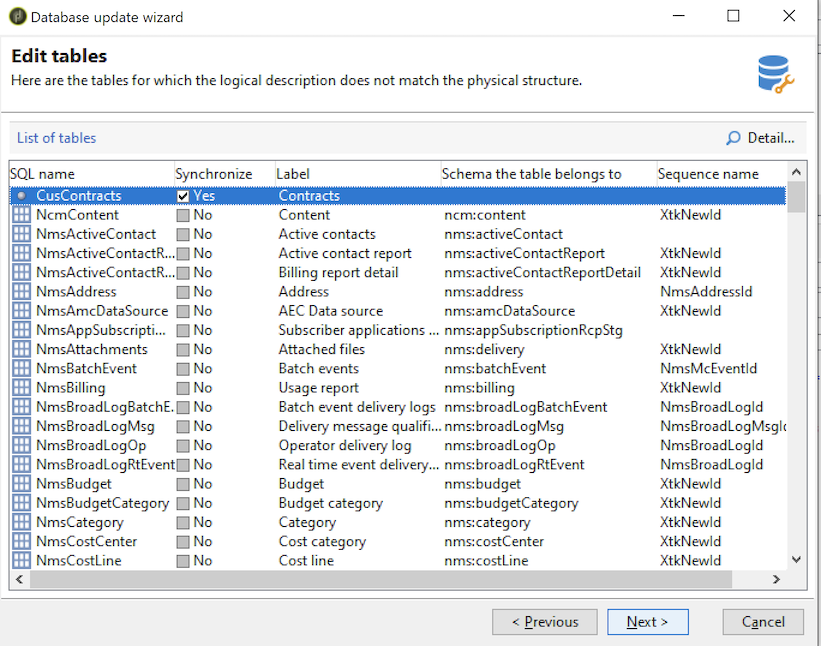

# Aggiornare la struttura del database{#updating-the-database-structure}

Per applicare le modifiche apportate agli schemi, avviare la procedura guidata di aggiornamento del database. Questo assistente è accessibile tramite **[!UICONTROL Tools > Advanced > Update database structure]**. Controlla se la struttura fisica del database corrisponde alla relativa descrizione logica ed esegue gli script di aggiornamento SQL.

I moduli nel database vengono compilati e attivati automaticamente.

Seguire i passaggi e visualizzare lo script SQL di aggiornamento del database:

>[!NOTE]
>
>Questo si trova in un campo di modifica e può essere modificato per eliminare o aggiungere codice SQL.

Quindi, avvia l&#39;aggiornamento del database:

