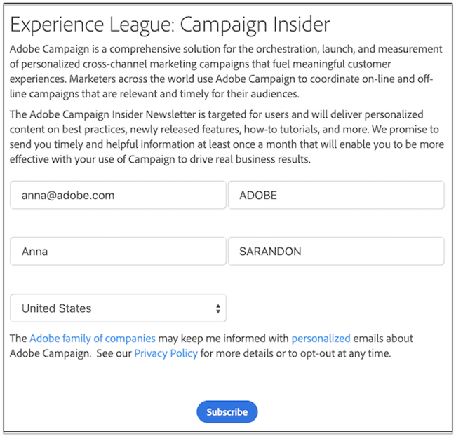

# Introduzione alle applicazioni web e ai moduli web{#gs-ac-web}

Adobe Campaign integra un modulo grafico per la definizione e la pubblicazione di **moduli Web** per la creazione di pagine con campi di input e di selezione e che possono includere dati provenienti dal database. In questo modo è possibile progettare e pubblicare pagine Web a cui gli utenti possono accedere per visualizzare o immettere informazioni.

Scopri come creare e pubblicare moduli web nella [documentazione di Campaign Classic v7](https://experienceleague.adobe.com/docs/campaign-classic/using/designing-content/web-forms/about-web-forms.html?lang=it#designing-content){target="_blank"}

Adobe Campaign consente inoltre di creare e pubblicare **applicazioni Web** dinamiche e interattive con dati provenienti dal database e contenuto adattato ai diritti dell&#39;utente connesso.

È possibile creare pagine, ad esempio un modulo di modifica su una extranet, o moduli di notifica che includono dati provenienti dal database con tabelle, grafici, moduli di input e così via. Questa funzionalità consente di progettare e pubblicare pagine Web in cui gli utenti possono cercare o immettere informazioni.

Scopri come creare e pubblicare applicazioni web nella [documentazione di Campaign Classic v7](https://experienceleague.adobe.com/docs/campaign-classic/using/designing-content/web-applications/about-web-applications.html?lang=it#designing-content){target="_blank"}
