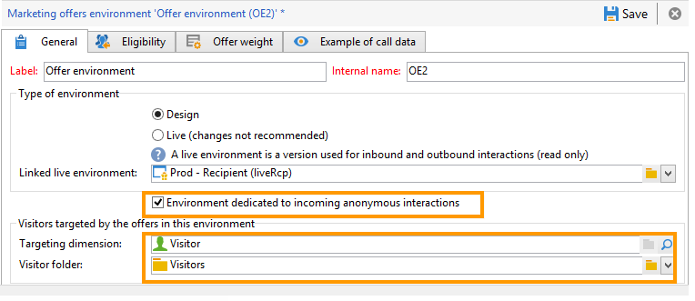

# Interazioni anonime {#anonymous-interactions}

## Ambiente per interazioni anonime {#environment-for-anonymous-interactions}

Per impostazione predefinita, il modulo **Interazione** di Campaign viene fornito con un ambiente preconfigurato per eseguire il targeting della tabella dei destinatari incorporata (offerte identificate). Se ad esempio devi eseguire il targeting per un’altra tabella, una tabella dei visitatori per le offerte anonime o una tabella dei destinatari personalizzata, utilizza la procedura guidata di mappatura di destinazione per creare l’ambiente. [Ulteriori informazioni sugli ambienti](interaction-env.md).

Quando si crea un ambiente anonimo tramite la procedura guidata di creazione della mappatura, la casella **[!UICONTROL Environment dedicated to incoming anonymous interactions]** viene selezionata automaticamente nella scheda **[!UICONTROL General]** dell&#39;ambiente.

**[!UICONTROL Targeting dimension]** è completato automaticamente. Per impostazione predefinita, si collega alla tabella dei visitatori.

Viene visualizzato il campo **[!UICONTROL Visitor folder]**. Il collegamento alla cartella **[!UICONTROL Visitors]** viene completato automaticamente. Questo campo consente di scegliere dove memorizzare i profili dei visitatori.

>[!NOTE]
>
>Se desideri filtrare diversi tipi di visitatori, ad esempio nel caso di offerte anonime presentate per uno o più marchi, devi creare un ambiente per ogni marchio e una cartella di tipo **[!UICONTROL Visitors]** per ogni ambiente.

## Catalogo delle offerte per interazioni anonime {#offer-catalog-for-anonymous-interactions}

Proprio come le interazioni in uscita, le interazioni in entrata sono organizzate in un catalogo di offerte composto da categorie e offerte.

Per creare categorie e spazi, applica lo stesso processo utilizzato per i visitatori identificati. Consulta [Creare una categoria di offerte](interaction-offer-catalog.md#creating-offer-categories) e [Creare un ambiente di offerte](interaction-env.md#creating-an-offer-environment)).

## Visitatori anonimi {#anonymous-visitors}

I visitatori anonimi possono essere sottoposti a un processo di identificazione dei cookie durante la connessione. Questo riconoscimento implicito si basa sulla cronologia del browser del visitatore.

Durante questo passaggio, viene effettuato un confronto tra i dati recuperati dai cookie e quelli presenti nel database. In alcuni casi, i visitatori vengono riconosciuti (vengono quindi implicitamente identificati), in altri, non vengono riconosciuti (e quindi rimangono anonimi).

Per eseguire questa analisi, per lo spazio dell&#39;offerta selezionare l&#39;opzione **[!UICONTROL Implicitly identify the individual based on their browser history]**.

## Elaborazione di visitatori anonimi non identificati {#processing-unidentified-anonymous-visitors}

Dopo l’analisi, se un visitatore anonimo non viene identificato, puoi memorizzarne i dati in un determinato spazio. Questo ti consentirà di suggerire offerte specifiche per questo tipo di visitatore, che corrispondono alle regole di tipologia specificate.

Se non esiste alcun elemento che ti consenta di identificare un contatto o se non desideri suggerire un’offerta identificata a un contatto che possa essere identificato implicitamente, puoi scegliere di eseguire un fallback in un ambiente anonimo.

A questo scopo, controlla **[!UICONTROL Fall back on an anonymous environment if no individuals were identified]**, quindi specifica l&#39;ambiente dedicato a questi visitatori non identificati in **[!UICONTROL Linked anonymous space]** quando specifichi uno spazio dell&#39;offerta.

