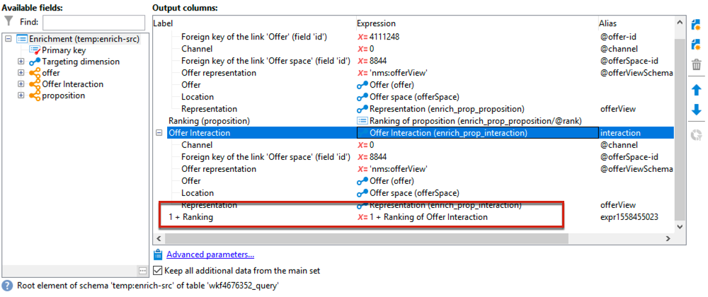

# Best practice di interazione{#interaction-best-practices}

## Raccomandazioni generali {#general-recommendations}

La gestione delle offerte in Adobe Campaign richiede un’attenta gestione per funzionare in modo efficiente. Per evitare problemi, è necessario trovare un equilibrio tra il numero di contatti e il numero di categorie e offerte di offerta.

Questa sezione presenta le best practice per gestire **Interazione** in Adobe Campaign, incluse le regole di idoneità, i filtri predefiniti, le attività del flusso di lavoro e le opzioni del database.

* Quando **implementazione e configurazione delle interazioni**, è necessario tenere presente le seguenti raccomandazioni:

   * Per il motore batch (generalmente utilizzato in comunicazioni in uscita come e-mail), il throughput è il problema principale, in quanto più contatti possono essere gestiti contemporaneamente. Il collo di bottiglia tipico è rappresentato dalle prestazioni del database.
   * Il vincolo principale per il motore unitario (generalmente utilizzato nelle comunicazioni in entrata come un banner su un sito web) è la latenza, in quanto qualcuno si aspetta una risposta. Il tipico collo di bottiglia è rappresentato dalle prestazioni della CPU.
   * Il design del catalogo delle offerte ha un enorme impatto sulle prestazioni di Adobe Campaign.
   * Quando si lavora con molte offerte, è consigliabile suddividerle in diversi cataloghi di offerte.

* Di seguito sono elencate alcune best practice per l’utilizzo di **regole di idoneità**:

   * Semplifica le regole. La complessità delle regole influisce sulle prestazioni mentre estende la ricerca. Una regola complessa è qualsiasi regola con più di cinque condizioni.
   * Per migliorare le prestazioni, le regole possono essere suddivise in filtri distinti predefiniti condivisi tra più offerte.
   * Inserisci le regole di categoria di offerta più restrittive nella posizione più alta possibile nell&#39;albero. In questo modo, escluderanno i contatti più numerosi, riducendo il numero di target e impedendo loro di essere elaborati da ulteriori regole.
   * Mettete le regole più costose in termini di tempo o lavorazione in fondo all&#39;albero. A questo scopo, queste regole verranno eseguite solo sul pubblico di destinazione rimanente.
   * Iniziare da una categoria specifica per evitare la scansione dell&#39;intero albero.
   * Per risparmiare tempo di elaborazione, esegui il precalcolo degli aggregati invece di creare regole complesse con join. A questo scopo, prova a memorizzare i dati dei clienti in una tabella di riferimento che può essere cercata all’interno delle regole di idoneità.
   * Utilizza un numero minimo di pesi per limitare il numero di query.
   * Si consiglia di avere un numero limitato di offerte per spazio di offerta. Questo garantisce un recupero più rapido delle offerte in qualsiasi spazio.
   * Utilizza gli indici, in particolare nelle colonne di ricerca più utilizzate.

* Di seguito sono elencate alcune best practice relative **tavola propositiva**:

   * Utilizza un numero minimo di regole per velocizzare il più possibile l’elaborazione.
   * Limita il numero di record nella tabella della proposta: conservare solo i record necessari per tenere traccia dell&#39;aggiornamento dello stato e di ciò che è necessario per le regole, quindi archiviarli in un altro sistema.
   * Eseguire una manutenzione intensiva del database nella tabella delle proposte, ad esempio ricreare indici o ricreare la tabella.
   * Limita il numero di proposte richieste per target. Non impostare più di quello che stai per utilizzare.
   * Evita di unirsi il più possibile ai criteri delle regole.

## Suggerimenti per la gestione delle offerte {#tips-managing-offers}

Questa sezione contiene consigli più dettagliati sulla gestione delle offerte e sull’utilizzo del modulo di interazione in Adobe Campaign.

### Più spazi di offerta in un messaggio e-mail {#multiple-offer-spaces}

Quando si includono le offerte nelle consegne, le offerte vengono generalmente selezionate a monte nel flusso di lavoro di Campaign tramite un’ **Arricchimento** attività del flusso di lavoro (o un’altra attività simile).

Quando selezioni le offerte in un **Arricchimento** attività, puoi scegliere lo spazio di offerta da utilizzare. Tuttavia, indipendentemente dallo spazio di offerta selezionato, il menu di personalizzazione della consegna dipende dallo spazio di offerta configurato nella consegna.

Nell’esempio seguente, lo spazio di offerta selezionato nella consegna è **[!UICONTROL Email (Environment - Recipient)]**:


Se lo spazio di offerta selezionato nella consegna non dispone di una funzione di rendering di HTML impostata, non verrà visualizzato nel menu di consegna e non sarà disponibile per la selezione. Questo è indipendente dallo spazio di offerta selezionato nella **Arricchimento** attività.

Nell’esempio seguente, la funzione di rendering di HTML è disponibile nell’elenco a discesa, perché lo spazio di offerta selezionato nella consegna ha una funzione di rendering:


Questa funzione inserisce codice come: `<%@ include proposition="targetData.proposition" view="rendering/html" %>`.

Quando selezioni la proposta, il valore della **[!UICONTROL view]** l&#39;attributo è il seguente:
* &quot;rendering/html&quot;: rendering html. Utilizza la funzione di rendering di HTML.
* &quot;offer/view/html&quot;: contenuto HTML. Non utilizza la funzione di rendering di HTML. Include solo il campo HTML.

Quando includi più spazi di offerta in un’unica consegna e-mail e se alcuni di essi hanno funzioni di rendering e altri no, devi ricordare quali offerte utilizzano quali spazi di offerta e quali spazi di offerta hanno funzioni di rendering.

Di conseguenza, per evitare problemi, si consiglia a tutti gli spazi di offerta di avere una funzione di rendering HTML definita, anche se lo spazio di offerta richiede solo contenuto HTML.

### Impostare la classificazione nella tabella del registro delle proposte {#rank-proposition-log-table}

Gli spazi di offerta possono memorizzare i dati nella tabella di proposta quando le proposte vengono generate o accettate:


Tuttavia, questo vale solo per le interazioni in entrata.

È inoltre possibile memorizzare dati aggiuntivi nella tabella delle proposte quando si utilizzano le interazioni in uscita e anche quando si utilizzano le offerte in uscita senza il modulo Interaction .

Tutti i campi della tabella temporanea del flusso di lavoro il cui nome corrisponde a un nome di campo nella tabella delle proposte vengono copiati nello stesso campo della tabella delle proposte.

Ad esempio, quando selezioni manualmente un’offerta (senza interazione) in un **Arricchimento** attività flusso di lavoro, i campi standard sono definiti come segue:


È possibile aggiungere altri campi, ad esempio `@rank` campo:


Poiché nella tabella della proposta è presente un campo denominato `@rank`, il valore nella tabella temporanea del flusso di lavoro viene copiato.

Per ulteriori informazioni sulla memorizzazione di campi aggiuntivi nella tabella delle proposte, consulta [questa sezione](interaction-send-offers.md#storing-offer-rankings-and-weights).

Per le offerte in uscita con interazione, questa funzione è utile quando sono selezionate più offerte e si desidera registrare l’ordine in cui verranno visualizzate in un messaggio e-mail.

Puoi anche archiviare metadati aggiuntivi direttamente nella tabella delle proposte, ad esempio il livello di spesa corrente, per conservare i record storici relativi alla spesa al momento in cui sono state generate le offerte.

Quando utilizzi l’interazione in uscita, la funzione `@rank` È possibile aggiungere un campo, come nell’esempio precedente, ma il relativo valore viene impostato automaticamente in base all’ordine restituito da Interaction. Ad esempio, se utilizzi l’interazione per selezionare tre offerte, la `@rank` avranno restituito i valori 1, 2 e 3.

Quando utilizzi l’interazione e selezioni manualmente le offerte, l’utente può combinare entrambi gli approcci. Ad esempio, l&#39;utente può impostare manualmente il `@rank` deve essere 1 per l’offerta selezionata manualmente e utilizzare un’espressione come `"1 + @rank"` per le offerte restituite da Interaction. Supponendo che Interazione selezioni tre offerte, le offerte restituite da entrambi gli approcci saranno classificate 1-4:



### Estendere lo schema nms:offerta {#extending-nms-offer-schema}

Quando estendi lo schema nms:offer, assicurati di seguire la struttura preconfigurata già configurata:
* Definire un nuovo campo per l’archiviazione dei contenuti in `<element name="view">`.
* Ogni nuovo campo deve essere definito due volte. Una volta come campo XML normale e una volta come campo XML CDATA con &quot;_jst&quot; aggiunto al nome. Ad esempio:

   ```
   <element label="Price" name="price" type="long" xml="true"/>
   <element advanced="true" label="Script price" name="price_jst" type="CDATA" xml="true"/>
   ```

* Eventuali campi che contengono URL da tracciare devono essere inseriti in `<element name="trackedUrls">` che si trova in `<element name="view" >`.
