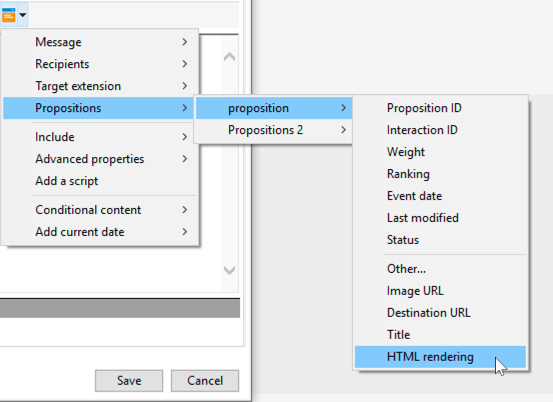

# Best practice di interazione{#interaction-best-practices}

## Raccomandazioni generali {#general-recommendations}

La gestione delle offerte in Adobe Campaign richiede un’attenta gestione per funzionare in modo efficiente. Per evitare problemi, è necessario trovare un equilibrio tra il numero di contatti e il numero di categorie e di offerte di offerta.

Questa sezione presenta le best practice per gestire **Interazione** in Adobe Campaign, incluse le regole di idoneità, i filtri predefiniti, le attività del flusso di lavoro e le opzioni del database.

* Quando **implementazione e configurazione delle interazioni**, è necessario essere a conoscenza delle seguenti raccomandazioni:

   * Per il motore batch (in genere utilizzato nelle comunicazioni in uscita come le e-mail), la velocità effettiva è il problema principale, in quanto è possibile gestire più contatti contemporaneamente. Il collo di bottiglia tipico è rappresentato dalle prestazioni del database.
   * Il vincolo principale per il motore unitario (in genere utilizzato nelle comunicazioni in entrata come un banner su un sito web) è la latenza, in quanto qualcuno si aspetta una risposta. Il collo di bottiglia tipico è rappresentato dalle prestazioni della CPU.
   * Il design del catalogo delle offerte ha un impatto enorme sulle prestazioni di Adobe Campaign.
   * Quando si lavora con molte offerte, si consiglia di suddividerle in diversi cataloghi di offerte.

* Di seguito sono elencate alcune best practice per l’utilizzo di **regole di idoneità**:

   * Semplificare le regole. La complessità delle regole influisce sulle prestazioni in quanto estende la ricerca. Una regola complessa è una regola con più di cinque condizioni.
   * Per migliorare le prestazioni, le regole possono essere suddivise in filtri predefiniti distinti condivisi tra più offerte.
   * Posiziona le regole di categoria di offerta più restrittive nella posizione più alta possibile nella struttura. In questo modo, escluderanno prima il maggior numero di contatti, riducendo il numero di destinazione e impedendo che vengano elaborati da ulteriori regole.
   * Metti le regole più costose in termini di tempo o di elaborazione nella parte inferiore dell’albero. In questo modo, queste regole verranno eseguite solo sul pubblico di destinazione rimanente.
   * Inizia da una categoria specifica per evitare di eseguire la scansione dell’intera struttura.
   * Per risparmiare tempo di elaborazione, precalcolare gli aggregati anziché creare regole complesse con join. A questo scopo, prova a memorizzare i dati dei clienti in una tabella di riferimento che può essere cercata all’interno delle regole di idoneità.
   * Utilizza un numero minimo di pesi per limitare il numero di query.
   * Si consiglia di avere un numero limitato di offerte per spazio dell’offerta. In questo modo è possibile recuperare più rapidamente le offerte in qualsiasi spazio.
   * Utilizza gli indici, in particolare nelle colonne di ricerca utilizzate di frequente.

* Di seguito sono elencate alcune best practice relative al **tabella delle proposte**:

   * Utilizza un numero minimo di regole per velocizzare l’elaborazione.
   * Limita il numero di record nella tabella della proposta: conserva solo i record necessari per tenere traccia del suo aggiornamento di stato e di ciò che è necessario per le regole, quindi archiviali in un altro sistema.
   * Esegui una manutenzione intensiva del database sulla tabella della proposta, ad esempio ricompila indici o ricrea tabella.
   * Limita il numero di proposte richieste per target. Non impostare più di quello che si sta per utilizzare.
   * Evita il più possibile i join nei criteri delle regole.

## Suggerimenti per la gestione delle offerte {#tips-managing-offers}

Questa sezione contiene consigli più dettagliati sulla gestione delle offerte e sull’utilizzo del modulo di interazione in Adobe Campaign.

### Più spazi di offerta in un’e-mail {#multiple-offer-spaces}

Quando si includono le offerte nelle consegne, queste vengono generalmente selezionate a monte nel flusso di lavoro di Campaign tramite un’ **Arricchimento** un’attività del flusso di lavoro (o un’altra attività simile).

Quando si selezionano le offerte in un **Arricchimento** attività, puoi scegliere quale spazio di offerta utilizzare. Tuttavia, indipendentemente dallo spazio dell’offerta selezionato, il menu di personalizzazione della consegna dipende dallo spazio dell’offerta configurato nella consegna.

Nell’esempio seguente, lo spazio dell’offerta selezionato nella consegna è **[!UICONTROL Email (Environment - Recipient)]**:


Se lo spazio dell’offerta selezionato nella consegna non dispone di una funzione di rendering HTML configurata, non verrà visualizzato nel menu della consegna e non sarà disponibile per la selezione. Questo è indipendente dallo spazio dell’offerta selezionato nella **Arricchimento** attività.

Nell’esempio seguente, la funzione di rendering HTML è disponibile nell’elenco a discesa perché lo spazio dell’offerta selezionato nella consegna ha una funzione di rendering:



Questa funzione inserisce un codice come: `<%@ include proposition="targetData.proposition" view="rendering/html" %>`.

Quando selezioni la proposta, il valore della **[!UICONTROL view]** è il seguente:
* &quot;rendering/html&quot;: rendering html. Utilizza la funzione di rendering HTML.
* &quot;offer/view/html&quot;: contenuto html. Non utilizza la funzione di rendering HTML. Include solo il campo HTML.

Se includi più spazi di offerta in una singola consegna e-mail e alcuni di essi dispongono di funzioni di rendering, è necessario ricordare quali offerte utilizzano quali spazi di offerta e quali spazi di offerta dispongono di funzioni di rendering.

Di conseguenza, per evitare problemi, si consiglia di definire una funzione di rendering HTML per tutti gli spazi dell’offerta, anche se lo spazio dell’offerta richiede solo contenuto HTML.

### Impostare la classificazione nella tabella del registro delle proposte {#rank-proposition-log-table}

Gli spazi dell’offerta consentono di memorizzare i dati nella tabella delle proposte quando queste vengono generate o accettate:


Tuttavia, questo si applica solo alle interazioni in entrata.

È inoltre possibile memorizzare dati aggiuntivi nella tabella della proposta quando si utilizzano interazioni in uscita e anche quando si utilizzano offerte in uscita senza il modulo di interazione.

Qualsiasi campo della tabella temporanea del flusso di lavoro il cui nome corrisponde a un nome di campo della tabella della proposta viene copiato nello stesso campo della tabella della proposta.

Ad esempio, quando si seleziona manualmente un’offerta (senza interazione) in un **Arricchimento** attività del flusso di lavoro, i campi standard sono definiti come segue:


È possibile aggiungere altri campi, ad esempio `@rank` campo:


Perché nella tabella della proposta è presente un campo denominato `@rank`, il valore nella tabella temporanea del flusso di lavoro verrà copiato.

Per ulteriori informazioni sulla memorizzazione di campi aggiuntivi nella tabella della proposta, consulta [questa sezione](interaction-send-offers.md#storing-offer-rankings-and-weights).

Per le offerte in uscita con interazione, questo è utile quando sono selezionate più offerte e vuoi registrare in quale ordine verranno visualizzate in un’e-mail.

Puoi anche memorizzare metadati aggiuntivi direttamente nella tabella della proposta, ad esempio il livello di spesa corrente, per conservare registrazioni storiche sulla spesa nel momento in cui sono state generate le offerte.

Quando si utilizza l’interazione in uscita, il `@rank` può essere aggiunto, come nell’esempio precedente, ma il suo valore viene impostato automaticamente in base all’ordine restituito da Interaction. Ad esempio, se utilizzi Interazione per selezionare tre offerte, il `@rank` nel campo verranno restituiti i valori 1, 2 e 3.

Quando si utilizza l’interazione e si selezionano manualmente le offerte, l’utente può combinare entrambi gli approcci. Ad esempio, è possibile impostare manualmente `@rank` deve essere 1 per l’offerta selezionata manualmente e utilizza un’espressione come `"1 + @rank"` per le offerte restituite da Interaction. Supponendo che Interaction selezioni tre offerte, le offerte restituite da entrambi gli approcci saranno classificate da 1 a 4:


### Estendere lo schema nms:offer {#extending-nms-offer-schema}

Quando estendi lo schema nms:offer, accertati di seguire la struttura preconfigurata già impostata:
* Definisci un nuovo campo per l’archiviazione dei contenuti in `<element name="view">`.
* Ogni nuovo campo deve essere definito due volte. Una volta come campo XML normale e una volta come campo XML CDATA con &quot;_jst&quot; aggiunto al nome. Ad esempio:

  ```
  <element label="Price" name="price" type="long" xml="true"/>
  <element advanced="true" label="Script price" name="price_jst" type="CDATA" xml="true"/>
  ```

* Tutti i campi che contengono URL da tracciare devono essere posizionati in `<element name="trackedUrls">` che si trova in `<element name="view" >`.
