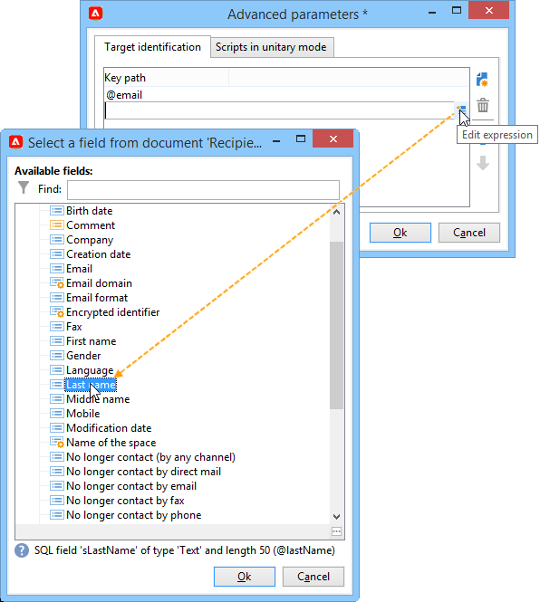

# Aggiungere un’offerta in una pagina web{#add-an-offer-in-web}

Per chiamare il motore di offerta in una pagina web, inserisci una chiamata a un codice JavaScript direttamente nella pagina. Questa chiamata restituisce il contenuto dell’offerta in un elemento di destinazione.

L’URL di chiamata dello script si presenta così:

```
<script id="interactionProposalScript" src="https://<SERVER_URL>/nl/interactionProposal.js?env=" type="text/javascript"></script>
```

Il parametro &quot;**env**&quot; riceve il nome interno dell&#39;ambiente live dedicato alle interazioni anonime.

Per presentare un’offerta, è necessario creare un ambiente e uno spazio dell’offerta in Adobe Campaign, quindi configurare la pagina HTML.

I seguenti casi d’uso descrivono le opzioni possibili per l’integrazione delle offerte tramite JavaScript.

## Opzione 1: modalità HTML {#html-mode}

### Presentare un’offerta anonima {#presenting-an-anonymous-offer}

**Passaggio 1: preparare il motore di offerta**

1. Apri l’interfaccia di Adobe Campaign e prepara un ambiente anonimo.
1. Crea uno spazio delle offerte collegato all’ambiente anonimo.
1. Crea un’offerta e la relativa rappresentazione collegata allo spazio dell’offerta.

**Passaggio 2: aggiornare il contenuto della pagina HTML**

La pagina HTML deve includere un elemento con un attributo @id con il valore del nome interno dello spazio dell’offerta creato (&quot;i_internal name space&quot;). L’offerta verrà inserita in questo elemento dall’interazione.

Nel nostro esempio, l’attributo @id riceve il valore &quot;i_SPC12&quot;, dove &quot;SPC12&quot; è il nome interno dello spazio dell’offerta creato in precedenza:

```
<div id="i_SPC12"></div>
```

Nel nostro esempio, l’URL per la chiamata dello script è il seguente (&quot;OE3&quot; è il nome interno dell’ambiente live):

```
<script id="interactionProposalScript" src="https://instance.adobe.org:8080/nl/interactionProposal.js?env=OE3" type="text/javascript"></script>
```

>[!CAUTION]
>
>Il tag `<script>` non deve essere a chiusura automatica.

Questa chiamata statica genera automaticamente una chiamata dinamica contenente tutti i parametri necessari al motore di offerta.

Questo comportamento ti consente di utilizzare diversi spazi di offerta sulla stessa pagina, da gestire con una singola chiamata al motore di offerta.

**Passaggio 3: visualizzazione dei risultati nella pagina HTML**

Il contenuto della rappresentazione dell’offerta viene restituito alla pagina HTML dal motore di offerta:

```
<div id="banner_header">
 <div id="i_SPC12">
   <table>
    <tbody>
        <tr>
            <td><h3>Fly to Japan!</h3></td>
        </tr>
        <tr>
            <td></td>
            <td>
            <p>Discover Japan for 2 weeks at an unbelievable price!!</p>
            <p><b>2345 Dollars - All inclusive</b></p>
        </td>
        </tr>
    </tbody>
    </table>
 </div>
<script src="https://instance.adobe.org:8080/nl/interactionProposal.js?env=OE3" id="interactionProposalScript" type="text/javascript"></script>
</div>
```

### Presentare un’offerta identificata {#presenting-an-identified-offer}

Per presentare un&#39;offerta a un contatto identificato, il processo è simile a quello dettagliato [in questa sezione](#presenting-an-anonymous-offer).

Nel contenuto della pagina web, devi aggiungere il seguente script che identificherà il contatto durante la chiamata al motore di offerta:

```
<script type="text/javascript">
  interactionTarget = <contact_identifier>;
</script>
```

1. Vai allo spazio dell&#39;offerta che verrà richiamato dalla pagina Web, fai clic su **[!UICONTROL Advanced parameters]** e aggiungi una o più chiavi di identificazione.

   

   In questo esempio, la chiave di identificazione è composita perché si basa sia sull’e-mail che sul nome del destinatario.

1. Durante la visualizzazione della pagina web, la valutazione dello script ti consente di trasmettere l’ID destinatario al motore di offerta. Se l’ID è composito, i tasti vengono visualizzati nella stessa sequenza utilizzata nelle impostazioni avanzate e sono separati da un simbolo |.

   Nell’esempio seguente, il contatto ha effettuato l’accesso al sito web ed è stato riconosciuto durante la chiamata al motore di offerta grazie alla sua e-mail e al suo nome.

   ```
   <script type="text/javascript">
     interactionTarget = myEmail|myName;
   </script>
   ```

### Utilizzare una funzione di rendering di HTML {#using-an-html-rendering-function}

Per generare automaticamente la rappresentazione dell’offerta HTML, puoi utilizzare una funzione di rendering.

1. Vai allo spazio dell&#39;offerta e fai clic sul collegamento **[!UICONTROL Edit functions]**.
1. Seleziona **[!UICONTROL Overload the HTML rendering function]**.
1. Vai alla scheda **[!UICONTROL HTML rendering]** e inserisci le variabili che corrispondono ai campi definiti per il contenuto dell&#39;offerta nello spazio dell&#39;offerta.

   

   In questo esempio, l’offerta viene visualizzata sotto forma di banner in una pagina web ed è composta da un’immagine cliccabile e da un titolo che corrisponde ai campi definiti nel contenuto dell’offerta.

## Opzione 2: modalità XML {#xml-mode}

### Presentare un’offerta {#presenting-an-offer}

Il modulo **Interaction** della campagna ti consente di restituire un nodo XML alla pagina HTML che richiama il motore di offerta. Questo nodo XML può essere elaborato da funzioni da sviluppare sul lato cliente.

La chiamata al motore di offerta si presenta così:

```
<script type="text/javascript" id="interactionProposalScript" src="https://<SERVER_URL>/nl/interactionProposal.js?env=&cb="></script>
```

* Il parametro &quot;**env**&quot; riceve il nome interno dell&#39;ambiente live.

* Il parametro &quot;**cb**&quot; riceve il nome della funzione che leggerà il nodo XML restituito dal motore contenente le proposte (callback). Questo parametro è facoltativo.

* Il parametro &quot;**t**&quot; riceve il valore della destinazione solo per un&#39;interazione identificata. Questo parametro può essere passato anche con la variabile **actionTarget**. Questo parametro è facoltativo.

* Il parametro &quot;**c**&quot; riceve l&#39;elenco dei nomi interni delle categorie. Questo parametro è facoltativo.

* Il parametro &quot;**th**&quot; riceve l&#39;elenco dei temi. Questo parametro è facoltativo.

* Il parametro &quot;**gctx**&quot; riceve i dati globali della chiamata (contesto) per l&#39;intera pagina. Questo parametro è facoltativo.

Il nodo XML restituito è simile al seguente:

```
<propositions>
 <proposition id="" offer-id="" weight="" rank="" space="" div=""> //proposition identifiers
   ...XML content defined in Adobe Campaign...
 </proposition>
 ...
</propositions>
```

Il caso d’uso seguente descrive le configurazioni da eseguire in Adobe Campaign per abilitare la modalità XML e quindi mostra il risultato della chiamata al motore nella pagina HTML.

1. **Creare un ambiente e uno spazio delle offerte**

   Per ulteriori informazioni sulla creazione di un ambiente, consulta [questa pagina](interaction-env.md).

   Per ulteriori informazioni sulla creazione di uno spazio delle offerte, consulta [questa pagina](interaction-offer-spaces.md).

1. **Estendere lo schema delle offerte per aggiungere nuovi campi**

   Questo schema definirà i seguenti campi: Titolo numero 2 e prezzo.

   Il nome dello schema nell&#39;esempio è **cus:offer**

   ```
   <srcSchema _cs="Marketing offers (cus)" created="2013-01-18 17:14:20.762Z" createdBy-id="0"
              desc="" entitySchema="xtk:srcSchema" extendedSchema="nms:offer" img="nms:offer.png"
              label="Marketing offers" labelSingular="Marketing offers" lastModified="2013-01-18 15:20:18.373Z"
              mappingType="sql" md5="F14A7AA009AE1FCE31B0611E72866AC3" modifiedBy-id="0"
              name="offer" namespace="cus" xtkschema="xtk:srcSchema">
     <createdBy _cs="Administrator (admin)"/>
     <modifiedBy _cs="Administrator (admin)"/>
     <element img="nms:offer.png" label="Marketing offers" labelSingular="Marketing offer"
              name="offer">
       <element label="Content" name="view">
         <element label="Price" name="price" type="long" xml="true"/>
         <element label="Title 2" name="title2" type="string" xml="true"/>
   
         <element advanced="true" desc="Price calculation script." label="Script price"
                  name="price_jst" type="CDATA" xml="true"/>
         <element advanced="true" desc="Title calculation script." label="Script title"
                  name="title2_jst" type="CDATA" xml="true"/>
       </element>
     </element>
   </srcSchema>
   ```

   >[!CAUTION]
   >
   >Ogni elemento deve essere definito due volte. Gli elementi di tipo CDATA (&quot;_jst&quot;) possono contenere campi di personalizzazione.
   >
   >Aggiornare la struttura del database.

   Puoi estendere lo schema dell’offerta per aggiungere nuovi campi sia in modalità batch che unitaria e in qualsiasi formato (testo, HTML e XML).

1. **Estendere la formula dell&#39;offerta per modificare nuovi campi e modificare un campo esistente**

   Modifica il modulo di input **Offerta (nsm)**.

   Nella sezione &quot;Viste&quot;, inserisci i due nuovi campi con il seguente contenuto:

   ```
   <input label="Title 2" margin-right="5" prebuildSubForm="false" type="subFormLink" xpath="title2_jst">
        <form label="Edit title 2" name="editForm" nothingToSave="true">
            <input nolabel="true" toolbarAlign="horizontal" type="jstEdit" xpath="." xpathInsert="/ignored/customizeTitle2">
            <container>
                <input menuId="viewMenuBuilder" options="inbound" type="customizeBtn" xpath="/ignored/customizeTitle2"/>
            </container>
            </input>
        </form>
    </input>
    <input nolabel="true" type="edit" xpath="title2_jst"/>
    <input label="Price" margin-right="5" prebuildSubForm="false" type="subFormLink" xpath="price_jst">
        <form label="Edit price" name="editForm" nothingToSave="true">
        <input nolabel="true" toolbarAlign="horizontal" type="jstEdit" xpath="." xpathInsert="/ignored/customizePrice">
            <container>
                <input menuId="viewMenuBuilder" options="inbound" type="customizeBtn" xpath="/ignored/customizePrice"/>
            </container>
        </input>
        </form>
    </input>
    <input colspan="2" label="Prix" nolabel="true" type="number" xpath="price_jst"/>
   ```

   Commenta il campo URL di destinazione:

   

   >[!CAUTION]
   >
   >I campi del modulo ( `<input>`) devono puntare agli elementi del tipo CDATA definiti nello schema creato.

   Il rendering nel modulo delle rappresentazioni di offerta è simile al seguente:

   

   I campi **[!UICONTROL Title 2]** e **[!UICONTROL Price]** sono stati aggiunti e il campo **[!UICONTROL Destination URL]** non viene più visualizzato.

1. **Creare un’offerta**

   Per ulteriori informazioni sulla creazione delle offerte, consulta [questa pagina](interaction-offer.md).

   Nel seguente caso d’uso, l’offerta viene immessa come segue:

   

1. **Approva l&#39;offerta**

   Approva un’offerta o falla approvare da qualcun altro, quindi attivala nell’area delle offerte creata nell’ultimo passaggio, in modo che sia disponibile nell’ambiente live collegato.

1. **Chiamate del motore e risultato nella pagina HTML**

   La chiamata al motore di offerta nella pagina HTML si presenta così:

   ```
   <script id="interactionProposalScript" src="https://<SERVER_URL>/nl/interactionProposal.js?env=OE7&cb=alert" type="text/javascript">
   ```

   Il valore del parametro &quot;**env**&quot; è il nome interno dell&#39;ambiente live.

   Il valore del parametro &quot;**cb**&quot; è il nome della funzione che deve interpretare il nodo XML restituito dal motore. Nel nostro esempio, la funzione richiamata apre una finestra modale (funzione alert()).

   Il nodo XML restituito dal motore delle offerte è simile al seguente:

   ```
   <propositions>
    <proposition id="a28002" offer-id="10322005" weight="1" rank="1" space="SPC14" div="i_SPC14">
     <xmlOfferView>
      <title>Travel to Russia</title>
      <price>3456</price>
      <description>Discover this vacation package!INCLUDES 10 nights. FEATURES buffet breakfast daily. BONUS 5th night free.</description>
      <image>
       <path>https://myinstance.com/res/Track/ae1d2113ed732d58a3beb441084e5960.jpg</path>
       <alt>Travel to Russia</alt>
      </image>
     </xmlOfferView>
    </proposition>
   </propositions>
   ```

### Utilizzare una funzione di rendering {#using-a-rendering-function-}

È possibile utilizzare una funzione di rendering XML per creare una presentazione di offerta. Questa funzione modificherà il nodo XML restituito alla pagina HTML durante la chiamata al motore di offerta.

1. Vai allo spazio dell&#39;offerta e fai clic sul collegamento **[!UICONTROL Edit functions]**.
1. Seleziona **[!UICONTROL Overload the XML rendering function]**.
1. Passare alla scheda **[!UICONTROL XML rendering]** e inserire la funzione desiderata.

   La funzione può essere simile alla seguente:

   ```
   function (proposition) {
     delete proposition.@id;
     proposition.@newAttribute = "newValue";
   } 
   ```


## Configurare un’integrazione SOAP

I servizi web di SOAP forniti per la gestione delle offerte sono diversi da quelli solitamente utilizzati in Adobe Campaign. È possibile accedervi tramite l’URL di interazione descritto nella sezione precedente e presentare o aggiornare le offerte per un determinato contatto.

### Proposta di offerta {#offer-proposition}

Per una proposta di offerta tramite SOAP, aggiungi il comando **nms:proposition#Propose** seguito dai seguenti parametri:

* **targetId**: chiave primaria del destinatario (può essere una chiave composita).
* **maxCount**: specifica il numero di proposte di offerta per il contatto.
* **contesto**: consente di aggiungere informazioni di contesto nello schema dello spazio. Se lo schema utilizzato è **nms:interface**, aggiungere **`<empty>`**.
* **categorie**: specifica le categorie a cui devono appartenere le offerte.
* **temi**: specifica i temi a cui le offerte devono appartenere.
* **uuid**: valore del cookie permanente di Adobe Campaign (&quot;uuid230&quot;).
* **nli**: valore del cookie di sessione di Adobe Campaign (&quot;nlid&quot;).
* **noProp**: utilizzare il valore &quot;true&quot; per disattivare l&#39;inserimento della proposta.

>[!NOTE]
>
>Le impostazioni **targetId** e **maxCount** sono obbligatorie. Le altre sono facoltative.

In risposta alla query, il servizio SOAP restituirà i seguenti parametri:

* **interfaceId**: ID dell&#39;interazione.
* **propositions**: elemento XML, contiene l&#39;elenco delle proposte, ciascuna con il proprio ID e la propria rappresentazione HTML.

### Aggiornamento offerta {#offer-update}

Aggiungi il comando **nms:interface#UpdateStatus** all&#39;URL, seguito dai seguenti parametri:

* **proposition**: stringa di caratteri, contiene l&#39;ID della proposta fornito come output durante una proposta di offerta. Consulta [Proposta di offerte](#offer-proposition).
* **status**: tipo di stringa che specifica il nuovo stato dell&#39;offerta. I valori possibili sono elencati nell&#39;enumerazione **propositionStatus** nello schema **nms:common**. Ad esempio, il numero 3 corrisponde allo stato **Accettato**.
* **contesto**: elemento XML, che consente di aggiungere informazioni di contesto nello schema dello spazio. Se lo schema utilizzato è **nms:interface**, aggiungere **`<empty>`**.

### Esempio di utilizzo di una chiamata SOAP {#example-using-a-soap-call}

Di seguito è riportato un esempio di codice per una chiamata SOAP:

```
<%
  var space = request.parameters.sp
  var cnx = new HttpSoapConnection(
    "https://" + request.serverName + ":" + request.serverPort + "/interaction/" + env + "/" + space,
    "utf-8",
    HttpSoapConnection.SOAP_12)
  var session = new SoapService(cnx, "nms:interaction")
  var action = request.parameters.a
  if( action == undefined )
    action = 'propose'

  try
  {
    switch( action )
    {
    case "update":
      var proposition = request.parameters.p
      var status      = request.parameters.st
      session.addMethod("UpdateStatus", "nms:interaction#UpdateStatus",
       ["proposition", "string",
        "status",      "string",
        "context",     "NLElement"],
       [])
      session.UpdateStatus(proposition, status, <undef/>)
      var redirect = request.parameters.r
      if( redirect != undefined )
        response.sendRedirect(redirect)
      break;

    case "propose":
      var count = request.parameters.n
      var target = request.parameters.t
      var categorie = request.parameters.c
      var theme = request.parameters.th
      var layout = request.parameters.l
      if( count == undefined )
        count = 1
      session.addMethod("Propose", "nms:proposition#Propose",
       ["targetId",      "string",
        "maxCount",      "string",
         "categories",    "string",
         "themes",        "string",
        "context",       "NLElement"],
       ["interactionId", "string",
        "propositions",  "NLElement"])
      response.setContentType("text/html")
      var result = session.Propose(target, count, category, theme, <empty/>)
      var props = result[1]
  %><table><tr><%
      for each( var propHtml in props.proposition.*.mdSource )
      {
        %><td><%=propHtml%></td><%
      }
  %></tr></table><%
      break;
    }
  }
  catch( e )
  {
  }
  %>
```
