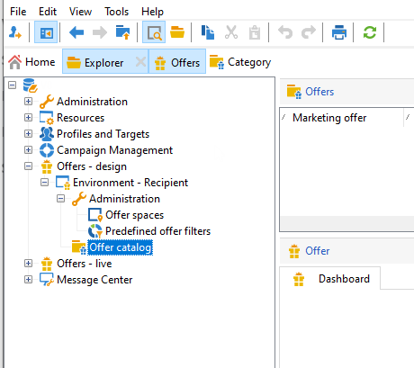

# Creare un catalogo di offerte

In qualità di **Gestione offerte**, sei responsabile della creazione del catalogo delle offerte.

Un catalogo di offerta è associato a un singolo ambiente preesistente. Le offerte di questo catalogo possono essere associate solo agli spazi specificati nello stesso ambiente.

Prima di creare le offerte, è necessario specificare un [ambiente](interaction-env.md) che contiene tutte le caratteristiche (idoneità, vincoli sulla destinazione, regole di presentazione) di un set di offerte, ordinate in categorie e l&#39;elenco dei relativi spazi.

## Creare categorie di offerta{#creating-offer-categories}

Le offerte sono organizzate in categorie/sottocategorie. Le categorie vengono create nell&#39;ambiente **[!UICONTROL Design]** e distribuite automaticamente nell&#39;ambiente **[!UICONTROL Live]** (ovvero rese disponibili) quando le offerte in esse contenute vengono approvate. L&#39;ambiente **[!UICONTROL Design]** contiene una categoria predefinita per la ricezione di tutte le offerte. È possibile creare sottocategorie per aggiungere una gerarchia alle offerte di catalogo.

Per ogni categoria, puoi definire **date di idoneità**, che è il periodo durante il quale le offerte contenute nella categoria possono essere presentate al relativo target. Puoi anche regolare il peso di una categoria per assegnare la priorità alla presentazione dell’offerta.

Per creare una nuova categoria, effettua le seguenti operazioni:

1. Browser alla cartella **[!UICONTROL Offer catalog]**.

   

1. Fare clic con il pulsante destro del mouse e selezionare **[!UICONTROL Create a new "Offer category" folder]** dall&#39;elenco a discesa.

   

1. Rinomina la categoria. In seguito sarà possibile modificare l&#39;etichetta utilizzando la scheda **[!UICONTROL General]**.

   

   >[!NOTE]
   >
   >Ripeti questi passaggi per creare tutte le categorie necessarie.

   In seguito, se necessario, è possibile:

   * Assegnare le date di idoneità dalla scheda **[!UICONTROL Eligibility]**.

     

   * **[!UICONTROL Edit query]** per applicare i filtri alla destinazione dell&#39;offerta.

   * Riepilogo delle regole di idoneità.Per visualizzarle, fare clic sul collegamento **[!UICONTROL Schedule and eligibility rules of the offer]**.

## Aggiungere una categoria di fallback

Al fine di garantire che tutti i destinatari ricevano una proposta di offerta, è possibile aggiungere sistematicamente una o più categorie di offerta nelle raccomandazioni.

Queste offerte di fallback devono avere un peso basso (ma non nullo), in modo che vengano prese in considerazione solo se non sono idonee offerte con un peso maggiore.

Inoltre, a queste offerte non deve essere applicata alcuna regola di presentazione per garantire che vengano sempre incluse nelle raccomandazioni. Ciò significa che, durante una proposta, se non è disponibile un’offerta di peso superiore, il destinatario riceverà almeno un’offerta da questa categoria.

Per includere una categoria di fallback nelle raccomandazioni, effettua le seguenti operazioni:

1. Accedi al catalogo delle offerte.
1. Fare clic sulla scheda **[!UICONTROL Eligibility]** e selezionare l&#39;opzione **[!UICONTROL Always include this category in the recommendations]**.
1. Fai clic su **[!UICONTROL Save]**.

   
