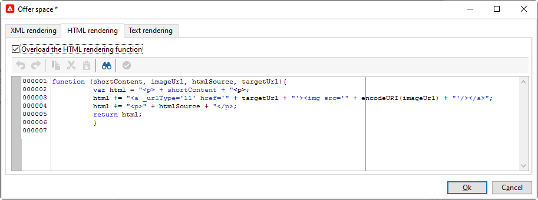
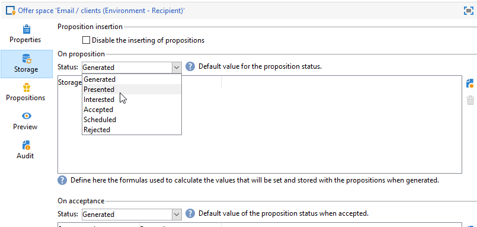

# Creare spazi dell’offerta{#creating-offer-spaces}

Il contenuto del catalogo delle offerte è configurato negli spazi delle offerte. Per impostazione predefinita, il contenuto può includere i campi seguenti: **[!UICONTROL Title]**, **[!UICONTROL Destination URL]**, **[!UICONTROL Image URL]**, **[!UICONTROL HTML content]** e **[!UICONTROL Text content]**. La sequenza di campi è configurata nello spazio di offerta.

Come **amministratore tecnico**, puoi creare spazi di offerta nell’ambiente Progettazione . Devi avere accesso alla sottocartella spazio offerta . Una volta creati, questi spazi di offerta vengono automaticamente duplicati nell’ambiente Live durante l’approvazione dell’offerta.

Il rendering di HTML viene creato tramite una funzione di rendering. La sequenza dei campi definiti nella funzione di rendering deve essere identica alla sequenza configurata nel contenuto.


Per creare un nuovo spazio di offerta, effettua le seguenti operazioni:

1. Dall’elenco degli spazi di offerta, fai clic su **[!UICONTROL New]**.

   

1. Seleziona il canale da utilizzare e modifica l’etichetta dello spazio di offerta.

   

1. Controlla la **[!UICONTROL Enable unitary mode]** opzione

1. Vai a **[!UICONTROL Content field]** finestra e fai clic su **[!UICONTROL Add]**.

   

1. Vai a **[!UICONTROL Content]** e seleziona i campi nel seguente ordine: **[!UICONTROL Title]**, quindi **[!UICONTROL Image URL]**, quindi **[!UICONTROL HTML content]**, quindi **[!UICONTROL Destination URL]**.

   

1. Controlla la **[!UICONTROL Required]** opzione per rendere ogni campo obbligatorio.

   >[!NOTE]
   >
   >Questa opzione viene utilizzata nell’anteprima e rende gli spazi di offerta non validi durante la pubblicazione se nell’offerta manca uno dei campi obbligatori. Tuttavia, se un’offerta è già attiva in uno spazio di offerta, questi criteri non vengono presi in considerazione.

   

1. Fai clic su **[!UICONTROL Edit functions]** per creare una funzione di rendering.

   Queste funzioni vengono utilizzate per generare rappresentazioni di offerte su uno spazio di offerta. Esistono diversi formati possibili: HTML o testo.

   **Nota** - Il formato XML è limitato alle interazioni in entrata non disponibili in questa versione del prodotto. [Ulteriori informazioni](../start/v7-to-v8.md#gs-unavailable-features)

   _

1. Vai a **[!UICONTROL HTML rendering]** e seleziona **[!UICONTROL Overload the HTML rendering function]**.
1. Inserisci la funzione di rendering.

   

## Stato delle proposte di offerta {#offer-proposition-statuses}

Lo stato della proposta di offerta varia a seconda delle interazioni con la popolazione target. Il modulo di interazione della campagna viene fornito con un set di valori che possono essere applicati alla proposta di offerta per tutto il suo ciclo di vita. Devi configurare la piattaforma in modo che lo stato cambi quando la proposta di offerta viene creata e accettata.

>[!NOTE]
>
>L&#39;aggiornamento dello stato è un **asincrono** processo. Viene eseguito dal flusso di lavoro di tracciamento che viene attivato ogni ora.

### Elenco dello stato dell’offerta {#status-list}

Gli stati di offerta disponibili sono:

* **[!UICONTROL Accepted]**
* **[!UICONTROL Scheduled]**
* **[!UICONTROL Generated]**
* **[!UICONTROL Interested]**
* **[!UICONTROL Presented]**
* **[!UICONTROL Rejected]**

Questi valori non vengono applicati per impostazione predefinita: devono essere configurate.

>[!NOTE]
>
>Lo stato di una proposta di offerta viene automaticamente modificato in &quot;Presentato&quot; se l’offerta è collegata a una consegna con lo stato &quot;Inviato&quot;.

### Stato dell’offerta al momento della creazione della proposta {#configuring-the-status-when-the-proposition-is-created}

Quando una proposta di offerta è **creato**, lo stato viene aggiornato.

In **[!UICONTROL Design]** per ogni spazio di offerta, configura lo stato da applicare al momento della creazione di una proposta, in base alle informazioni che desideri visualizzare nei rapporti di offerta.

A tale scopo, segui la procedura indicata di seguito:

1. Vai a **[!UICONTROL Storage]** scheda dello spazio desiderato.
1. Selezionare lo stato da applicare alla proposta al momento della creazione.

   

### Stato dell’offerta quando la proposta viene accettata {#configuring-the-status-when-the-proposition-is-accepted}

Una volta che la proposta di offerta è stata **accettato**, utilizza uno dei valori forniti per impostazione predefinita per configurare il nuovo stato della proposta. L’aggiornamento viene applicato quando un destinatario fa clic su un collegamento nell’offerta.

A tale scopo, segui la procedura indicata di seguito:

1. Vai a **[!UICONTROL Storage]** scheda dello spazio desiderato.
1. Selezionare lo stato da applicare alla proposta quando viene accettata.

   


**Interazione in entrata**

La **[!UICONTROL Storage]** consente di definire gli stati per **proposto** e **accettato** solo proposte di offerta. Per l’interazione in entrata, lo stato delle proposte di offerta deve essere specificato direttamente nell’URL per la chiamata al motore di offerta, anziché tramite l’interfaccia . In questo modo, potrai specificare quale stato applicare in altri casi, ad esempio se una proposta di offerta viene rifiutata.

```
<BASE_URL>?a=UpdateStatus&p=<PRIMARY_KEY_OF_THE_PROPOSITION>&st=<NEW_STATUS_OF_THE_PROPOSITION>&r=<REDIRECT_URL>
```

Ad esempio, la proposta (identificatore **40004**) che corrisponde al **Assicurazione abitativa** offerta visualizzata sul **Neobank** il sito contiene il seguente URL:

```
<BASE_URL>?a=UpdateStatus&p=<40004>&st=<3>&r=<"http://www.neobank.com/insurance/subscribe.html">
```

Non appena un visitatore fa clic sull’offerta, e quindi sull’URL, il **[!UICONTROL Accepted]** status (valore) **3**) viene applicata alla proposta e il visitatore viene reindirizzato a una nuova pagina della **Neobank** luogo in cui stipulare il contratto di assicurazione.

>[!NOTE]
>
>Se desideri specificare un altro stato nell’url (ad esempio se una proposta di offerta viene rifiutata), utilizza il valore corrispondente allo stato desiderato. Esempio: **[!UICONTROL Rejected]** = &quot;5&quot;, **[!UICONTROL Presented]** = &quot;1&quot; e così via.
>
>Gli stati e i relativi valori possono essere recuperati nella **[!UICONTROL Offer propositions (nms)]** schema dati. Per ulteriori informazioni, consulta [questa pagina](../dev/create-schema.md).

**Interazione in uscita**

È possibile applicare automaticamente la **[!UICONTROL Interested]** stato di una proposta di offerta quando la consegna contiene un collegamento. Aggiungi semplicemente il **_urlType=&quot;11&quot;** valore del collegamento:

```
<a _urlType="11" href="<DEST_URL>">Link inserted into the delivery</a>
```

## Anteprima offerta per spazio {#offer-preview-per-space}

In **[!UICONTROL Preview]** puoi visualizzare le offerte per le quali il destinatario è idoneo tramite un metodo scelto. Nell’esempio seguente, il destinatario può ricevere tre proposte di offerta per posta.


Se un destinatario non è idoneo per alcuna offerta, questa viene visualizzata nell’anteprima.


L’anteprima può ignorare i contesti quando sono limitati a uno spazio. Questo si verifica quando lo schema di interazione è stato esteso per aggiungere campi a cui si fa riferimento in uno spazio utilizzando un canale in entrata.

  Per ulteriori informazioni, consulta questo esempio in [Documentazione di Campaign Classic v7](https://experienceleague.adobe.com/docs/campaign-classic/using/managing-offers/advanced-parameters/extension-example.html){target=&quot;_blank&quot;}.