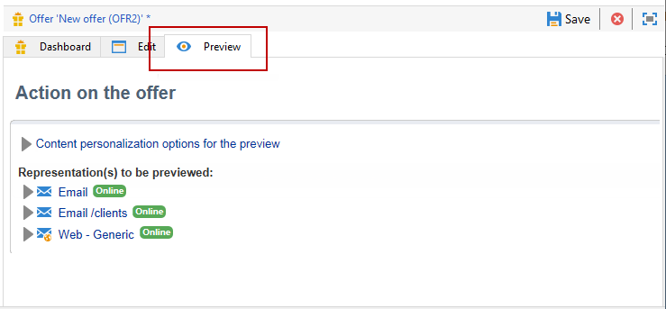

# Creare un’offerta

Per creare un’offerta, effettua le seguenti operazioni:

1. Passare alla scheda **[!UICONTROL Campaigns]** e fare clic sul collegamento **[!UICONTROL Offers]**.

1. Fai clic sul pulsante **[!UICONTROL Create]**.

1. Modifica l’etichetta e seleziona la categoria a cui deve appartenere l’offerta.

1. Fare clic su **[!UICONTROL Save]** per creare l&#39;offerta.

   L’offerta è disponibile nella piattaforma e è possibile configurarne il contenuto.

## Impostazioni di idoneità

È ora possibile utilizzare la scheda **[!UICONTROL Eligibility]** per definire:

* Il periodo di idoneità dell’offerta. [Ulteriori informazioni](#eligibility-period)
* Filtri per la popolazione target dell’offerta. [Ulteriori informazioni](#filters-on-the-target)
* Il peso dell’offerta. [Ulteriori informazioni](#offer-weight)

### Periodo di idoneità dell’offerta{#eligibility-period}

Nella scheda **[!UICONTROL Eligibility]** dell&#39;offerta, definisci il periodo di idoneità dell&#39;offerta. utilizzare gli elenchi a discesa per selezionare una data di inizio e una data di fine nel calendario.


Al di fuori di questo periodo, l’offerta non sarà selezionata. Se hai configurato anche le date di idoneità per la categoria dell’offerta, verrà applicato il periodo più restrittivo.

### Aggiungere filtri alla destinazione {#filters-on-the-target}

Nella scheda **[!UICONTROL Eligibility]** dell&#39;offerta, applica i filtri alla destinazione dell&#39;offerta.

A tale scopo, fare clic sul collegamento **[!UICONTROL Edit query]** e selezionare il filtro che si desidera applicare.


Se sono già stati creati filtri predefiniti, puoi selezionarli dall’elenco dei filtri utente. [Ulteriori informazioni](interaction-predefined-filters.md)


### Impostare il peso dell’offerta {#offer-weight}

Per consentire al motore di decidere tra diverse offerte per le quali il target è idoneo, devi assegnare uno o più pesi all’offerta. Se necessario, puoi anche applicare dei filtri al target o limitare lo spazio dell’offerta a cui verrà applicato il peso. Un’offerta con un peso più significativo sarà preferita rispetto a un’offerta con meno peso.

Puoi configurare più pesi per la stessa offerta, ad esempio per distinguere periodi superiori, target specifici o persino uno spazio dell’offerta.

Ad esempio, un’offerta può avere un peso di A per i contatti di età compresa tra i 18 e i 25 anni e un peso di B per i contatti al di sopra di tale intervallo. Se un’offerta è idonea per tutta l’estate, può anche avere un peso di A in luglio e un peso di B in agosto.

>[!NOTE]
>
>Il peso assegnato può essere modificato temporaneamente in base ai parametri della categoria a cui appartiene l’offerta. [Ulteriori informazioni](interaction-offer-catalog.md#creating-offer-categories)

Per creare un peso in un’offerta, effettua le seguenti operazioni:

1. Nella scheda **[!UICONTROL Eligibility]** dell&#39;offerta, fare clic su **[!UICONTROL Add]**.

   

1. Modifica l’etichetta e assegna un peso. Il valore predefinito è 1.

   

   >[!CAUTION]
   >
   >Se non viene inserito alcun peso (0), il target non sarà considerato idoneo per l&#39;offerta.

1. Se si desidera applicare il fattore di ponderazione per un determinato periodo, definire le date di idoneità.

   

1. Se necessario, limita il peso a uno spazio dell’offerta specifico.

   

1. Applicare un filtro a una destinazione.

   

1. Fare clic su **[!UICONTROL OK]** per salvare lo spessore.

   

   >[!NOTE]
   >
   >Se un target è idoneo per più pesi per un’offerta selezionata, il motore mantiene il peso migliore (il più alto). Quando si richiama il motore di offerta, viene selezionata un’offerta al massimo una volta per contatto.

### Riepilogo delle regole di idoneità dell’offerta {#a-summary-of-offer-eligibility-rules}

Al termine della configurazione, nel dashboard delle offerte sarà disponibile un riepilogo delle regole di idoneità.

Per visualizzarlo, fare clic sul collegamento **[!UICONTROL Schedule and eligibility rules]**.


## Creare il contenuto dell’offerta {#creating-the-offer-content}

Utilizzare la scheda **[!UICONTROL Content]** per definire il contenuto dell&#39;offerta.


1. Definisci i vari parametri del contenuto dell’offerta.

   * **[!UICONTROL Title]**: specifica il titolo da visualizzare nell&#39;offerta. Avviso: non si tratta dell&#39;etichetta dell&#39;offerta, definita nella scheda **[!UICONTROL General]**.
   * **[!UICONTROL Destination URL]**: specifica l&#39;URL dell&#39;offerta. Deve iniziare con &quot;http://&quot; o &quot;https://&quot;.
   * **[!UICONTROL Image URL]**: specifica un URL o un percorso di accesso all&#39;immagine dell&#39;offerta.
   * **[!UICONTROL HTML content]** / **[!UICONTROL Text content]**: inserisci il corpo dell&#39;offerta nella scheda desiderata. Per generare il tracciamento, **[!UICONTROL HTML content]** deve essere composto da elementi HTML che possono essere racchiusi in un elemento di tipo `<div>`. Ad esempio, il risultato di un elemento `<table>` nella pagina HTML sarà il seguente:

   ```
      <div> 
       <table>
        <tr>
         <th>Month</th>
         <th>Savings</th>   
        </tr>   
        <tr>    
         <td>January</td>
         <td>$100</td>   
        </tr> 
       </table> 
      </div>
   ```

   Scopri come definire l’URL di accettazione in [questa sezione](interaction-offer-spaces.md#configuring-the-status-when-the-proposition-is-accepted).

   

   Per trovare i campi obbligatori definiti durante la configurazione dello spazio dell&#39;offerta, fare clic sul collegamento **[!UICONTROL Content definitions]** per visualizzare l&#39;elenco. [Ulteriori informazioni](interaction-offer-spaces.md)

   

   In questo esempio, l’offerta deve includere un titolo, un’immagine, un contenuto HTML e un URL di destinazione.

## Visualizzare l’anteprima dell’offerta {#previewing-the-offer}

Una volta configurato il contenuto dell’offerta, puoi visualizzare in anteprima l’offerta così come verrà visualizzata per il destinatario.

Per eseguire questa operazione:

1. Fare clic sulla scheda **[!UICONTROL Preview]**.

   

1. Seleziona la rappresentazione dell’offerta da visualizzare.

   

1. Se hai personalizzato il contenuto dell’offerta, seleziona il target dell’offerta per visualizzare la personalizzazione.

<!--

## Create a hypothesis on an offer {#creating-a-hypothesis-on-an-offer}

You can create hypotheses on your offer propositions. This lets you determine the impact of your offers on purchases carried out for the product concerned.

>[!NOTE]
>
>These hypotheses are carried out via Response Manager. Please check your license agreement.

Hypotheses carried out on an offer proposition are referenced in their **[!UICONTROL Measure]** tab.

Creating hypotheses is detailed in [this page](../../campaign/using/about-response-manager.md).

-->

## Approvare e attivare un’offerta{#approve-offers}

Ora puoi approvare e attivare l&#39;offerta per renderla disponibile nell&#39;ambiente **Live**.

Per ulteriori informazioni, consulta la [documentazione di Campaign Classic v7](https://experienceleague.adobe.com/docs/campaign-classic/using/managing-offers/managing-an-offer-catalog/approving-and-activating-an-offer.html?lang=it#approving-offer-content){target="_blank"}.

## Gestire la presentazione delle offerte{#offer-presentation}

Campaign ti consente di controllare il flusso delle proposte di offerta utilizzando le regole di presentazione. Queste regole, specifiche dell&#39;interazione con Campaign, sono **regole di tipologia**. Ti consentono di escludere le offerte basate sulla cronologia delle proposte già effettuate a un destinatario. Nell’ambiente vi si fa riferimento.

Per ulteriori informazioni, consulta la [documentazione di Campaign Classic v7](https://experienceleague.adobe.com/docs/campaign-classic/using/managing-offers/managing-an-offer-catalog/managing-offer-presentation.html?lang=it#managing-offers){target="_blank"}.

## Simulazione di offerta

Il modulo **Simulazione** ti consente di verificare la distribuzione delle offerte appartenenti a una categoria o a un ambiente prima di inviare la proposta ai destinatari.

La simulazione tiene conto dei contesti e delle regole di idoneità applicati in precedenza alle offerte e delle relative regole di presentazione. Questo consente di testare e perfezionare varie versioni della proposta di offerta senza utilizzare effettivamente un’offerta o sollecitare in eccesso o in difetto un target, poiché la simulazione non ha alcun impatto sui destinatari target.

Per ulteriori informazioni sulla simulazione delle offerte, consulta la [documentazione di Campaign Classic v7](https://experienceleague.adobe.com/docs/campaign-classic/using/managing-offers/simulating-offers/about-offers-simulation.html?lang=it){target="_blank"}.
