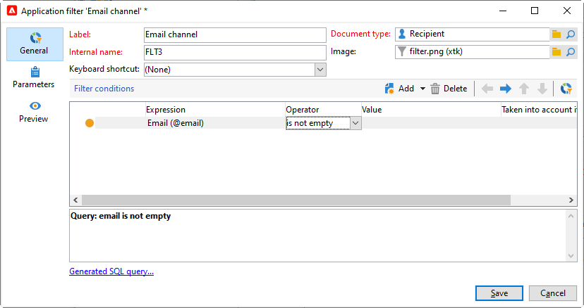

# Creare filtri predefiniti{#creating-pre-defined-filters}

Crea filtri predefiniti per definire le regole di idoneità per la popolazione target che possono essere facilmente riutilizzate durante la creazione dell’offerta. Sono specifici per ogni ambiente e tengono conto dei parametri dell’offerta.

Per creare un filtro predefinito, applica il seguente processo:

1. Sfoglia il **[!UICONTROL Administration]** e seleziona **[!UICONTROL Pre-defined offer filters]**.

   

1. Fai clic su **[!UICONTROL New]**.

   

1. Modifica l’etichetta per identificare il filtro in un secondo momento.

   

1. Seleziona il campo che verrà interessato dalla condizione di filtro.

   

1. Se necessario, seleziona un operatore e un valore, quindi salva la query.

   

1. Fai clic su **[!UICONTROL Preview]** per visualizzare il risultato del filtro.

   
