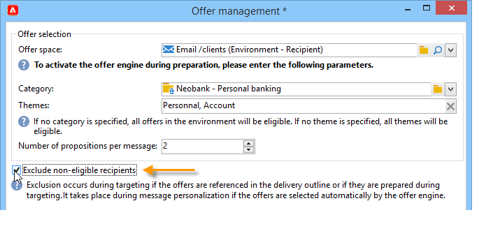
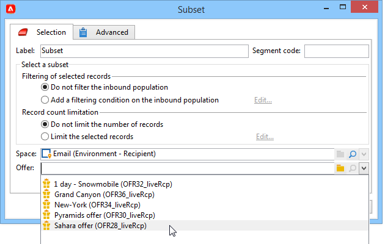

# Inviare un’offerta{#send}

Per poter essere selezionata dal motore di offerta, un&#39;offerta deve essere approvata e disponibile in un ambiente **Live**. [Ulteriori informazioni](interaction-offer.md#approve-offers)

La presentazione dell’offerta tramite un canale di comunicazione in uscita viene eseguita tramite direct mailing, e-mail o consegne su dispositivi mobili. Puoi anche utilizzare la modalità unitaria con la messaggistica transazionale (Centro messaggi).

## Inserire un’offerta in una consegna {#offer-into-a-delivery}

Per inserire le proposte di offerta in una consegna, segui i passaggi seguenti:

1. Nella finestra di consegna, fai clic sull&#39;icona **Offerte**.

   

1. Seleziona lo spazio corrispondente all’ambiente delle offerte.

   

1. Per perfezionare la scelta delle offerte da parte del motore, seleziona la categoria di cui fanno parte le offerte da presentare oppure uno o più temi. È consigliabile utilizzare solo uno di questi campi alla volta per evitare di sovraccaricare le restrizioni.

   

   

1. Specifica il numero di offerte che desideri inserire nel corpo della consegna.

   

1. Selezionare l&#39;opzione **[!UICONTROL Exclude non-eligible recipients]** se necessario. [Ulteriori informazioni](#parameters-for-calling-offer-engine)

   

1. Se necessario, selezionare l&#39;opzione **[!UICONTROL Do not display anything if no offers are selected]**. [Ulteriori informazioni](#parameters-for-calling-offer-engine)

   

1. Inserisci le proprietà nel contenuto della consegna utilizzando i campi di unione. Il numero di proposte disponibili dipende dal modo in cui viene configurata la chiamata del motore e il loro ordine dipende dalla priorità delle offerte.

   

1. Completa il contenuto, esegui un test e invia la consegna.

   

### Parametri del motore di offerta {#parameters-for-calling-offer-engine}

* **[!UICONTROL Space]**: spazio dell&#39;ambiente dell&#39;offerta che deve essere selezionato per attivare il motore dell&#39;offerta.
* **[!UICONTROL Category]** : cartella specifica in cui sono ordinate le offerte. Se non viene specificata alcuna categoria, tutte le offerte contenute nell’ambiente verranno prese in considerazione dal motore di offerta, a meno che non venga selezionato un tema.
* **[!UICONTROL Themes]** : parole chiave definite a monte nelle categorie. Queste fungono da filtro e ti consentono di perfezionare il numero di offerte da presentare selezionandole in un set di categorie.
* **[!UICONTROL Number of propositions]** : numero di offerte restituite dal motore che possono essere inserite nel corpo della consegna. Se non vengono inserite nel messaggio, le offerte verranno comunque generate, ma non presentate.
* **[!UICONTROL Exclude non-eligible recipients]** : questa opzione consente di attivare o disattivare l&#39;esclusione dei destinatari per i quali non sono disponibili sufficienti offerte idonee. Il numero di proposte idonee può essere inferiore al numero richiesto di proposte. Se questa casella è selezionata, i destinatari che non dispongono di un numero sufficiente di proposte verranno esclusi dalla consegna. Se non selezioni questa opzione, questi destinatari non verranno esclusi ma non avranno il numero richiesto di proposte.
* **[!UICONTROL Do not display anything if no offer is selected]** : questa opzione ti consente di scegliere come verrà elaborato il messaggio nel caso in cui una delle proposte non esista. Quando questa casella è selezionata, la rappresentazione della proposta mancante non viene visualizzata e nel messaggio relativo non verrà visualizzato alcun contenuto. Se la casella non è selezionata, il messaggio viene annullato durante l’invio e i destinatari non riceveranno più messaggi.

## Inviare offerte nei flussi di lavoro{#offer-via-wf}

Diverse attività di flusso di lavoro ti consentono di definire il modo in cui vengono presentate le offerte:

* Arricchimento
* Motore di offerta
* Offerte per cella

### Arricchimento {#enrichment}

L&#39;attività **Enrichment** ti consente di aggiungere offerte o collegamenti alle offerte per i destinatari della consegna.[Ulteriori informazioni](https://experienceleague.adobe.com/docs/campaign/automation/workflows/wf-activities/targeting-activities/enrichment.html){target="_blank"}.

Ad esempio, puoi arricchire i dati di una query del destinatario prima di una consegna.

Esistono due metodi per specificare le proposte di offerta.

* Specifica di un’offerta o di una chiamata del motore di offerta.
* Riferimento a un collegamento a un’offerta.

#### Specifica un’offerta o una chiamata al motore di offerta {#specifying-an-offer-or-a-call-to-the-offer-engine}

Dopo aver configurato l&#39;attività **Query**:

1. Aggiungi e apri un&#39;attività **Enrichment**.
1. Nella scheda **[!UICONTROL Enrichment]**, selezionare **[!UICONTROL Add data]**.
1. Selezionare **[!UICONTROL An offer proposition]** nei tipi di dati da aggiungere.

   

1. Specifica un identificatore e un’etichetta per la proposta che verrà aggiunta.
1. Specifica la selezione dell’offerta. Esistono due opzioni possibili per questo:

   * **[!UICONTROL Search for the best offer in a category]** : seleziona questa opzione e specifica i parametri di chiamata del motore di offerta (spazio, categoria o temi dell&#39;offerta, data di contatto, numero di offerte da mantenere). Il motore calcola automaticamente le offerte da aggiungere in base a questi parametri. È consigliabile completare il campo **[!UICONTROL Category]** o **[!UICONTROL Theme]**, anziché entrambi contemporaneamente.

     

   * **[!UICONTROL A pre-defined offer]** : seleziona questa opzione e specifica uno spazio dell&#39;offerta, un&#39;offerta specifica e una data di contatto per configurare direttamente l&#39;offerta da aggiungere senza chiamare il motore delle offerte.

     

1. Quindi configura un’attività di consegna che corrisponde al canale scelto. [Ulteriori informazioni](#offer-into-a-delivery)

   >[!NOTE]
   >
   >Il numero di proposte disponibili per l’anteprima dipende dalla configurazione eseguita nell’attività di arricchimento anziché da qualsiasi configurazione possibile eseguita direttamente nella consegna.

#### Fare riferimento a un collegamento a un’offerta {#referencing-a-link-to-an-offer}

È inoltre possibile fare riferimento a un collegamento a un&#39;offerta in un&#39;attività **Enrichment**.

A questo scopo, segui la procedura indicata di seguito:

1. Selezionare **[!UICONTROL Add data]** nella scheda **[!UICONTROL Enrichment]** dell&#39;attività.
1. Nella finestra in cui si sceglie il tipo di dati da aggiungere, selezionare **[!UICONTROL A link]**.
1. Seleziona il tipo di collegamento che desideri stabilire e la relativa destinazione. In questo caso, la destinazione è lo schema dell’offerta.

   

1. Specifica il join tra i dati della tabella in entrata nell’attività di arricchimento (qui la tabella dei destinatari) e la tabella delle offerte. Ad esempio, puoi collegare un codice di offerta a un destinatario.

   

1. Quindi configura un’attività di consegna che corrisponde al canale scelto. [Ulteriori informazioni](#offer-into-a-delivery)

   >[!NOTE]
   >
   >Il numero di proposte disponibili per l’anteprima dipende dalla configurazione eseguita nella consegna.

#### Classificazioni e pesi delle offerte del Negozio {#storing-offer-rankings-and-weights}

Per impostazione predefinita, quando un&#39;attività **Enrichment** viene utilizzata per distribuire le offerte, le classificazioni e i pesi non vengono memorizzati nella tabella delle proposte.

>[!NOTE]
>
>L&#39;attività **[!UICONTROL Offer engine]** memorizza queste informazioni per impostazione predefinita.

Tuttavia, è possibile memorizzare queste informazioni come segue:

1. Crea una chiamata al motore di offerta in un’attività di arricchimento inserita dopo una query e prima di un’attività di consegna. [Ulteriori informazioni](#specifying-an-offer-or-a-call-to-the-offer-engine)
1. Nella finestra principale dell&#39;attività, selezionare **[!UICONTROL Edit additional data...]**.

   

1. Aggiungi le colonne **[!UICONTROL @rank]** per la classificazione e **[!UICONTROL @weight]** per il peso dell&#39;offerta.

   

1. Conferma l’aggiunta e salva il flusso di lavoro.

La consegna memorizza automaticamente la classificazione e il peso delle offerte. Queste informazioni sono visibili nella scheda **[!UICONTROL Offers]** della consegna.

### Motore di offerta {#offer-engine}

L&#39;attività **[!UICONTROL Offer engine]** consente inoltre di specificare una chiamata al motore di offerta prima della consegna.

Per ulteriori informazioni sull&#39;attività del **motore di offerta**, fare riferimento a [questa pagina](https://experienceleague.adobe.com/docs/campaign/automation/workflows/wf-activities/targeting-activities/offer-engine.html){target="_blank"}.

Questa attività funziona sullo stesso principio dell&#39;attività **Enrichment** con una chiamata al motore, arricchendo i dati della popolazione in entrata con un&#39;offerta calcolata dal motore, prima di una consegna.

Dopo aver configurato l&#39;attività **Query**:

1. Aggiungi e apri un&#39;attività **[!UICONTROL Offer engine]**.
1. Completa i vari campi disponibili per specificare i parametri della chiamata al motore di offerta (spazio dell’offerta, categoria o temi, data di contatto, numero di offerte da mantenere). Il motore calcola automaticamente le offerte da aggiungere in base a questi parametri.

   >[!CAUTION]
   >
   >Se utilizzi questa attività, verranno memorizzate solo le proposte di offerta utilizzate nella consegna.

   

1. Quindi configura un’attività di consegna che corrisponde al canale scelto. [Ulteriori informazioni](#inserting-an-offer-proposition-into-a-delivery)

### Offerte per cella {#offers-by-cell}

L&#39;attività **[!UICONTROL Offers by cell]** consente di distribuire il gruppo in entrata (ad esempio da una query) in più segmenti e di specificare un&#39;offerta da presentare per ciascuno di questi segmenti.

Per ulteriori informazioni sull&#39;attività **Offerta per cella**, fare riferimento a [questa pagina](https://experienceleague.adobe.com/docs/campaign/automation/workflows/wf-activities/targeting-activities/offers-by-cell.html){target="_blank"}.

A questo scopo, utilizza il seguente processo:

1. Aggiungere l&#39;attività **[!UICONTROL Offers by cell]** dopo aver specificato la popolazione target, quindi aprirla.
1. Nella scheda **[!UICONTROL General]**, seleziona lo spazio dell&#39;offerta in cui desideri presentare le offerte.
1. Nella scheda **[!UICONTROL Cells]**, specifica i diversi sottoinsiemi utilizzando il pulsante **[!UICONTROL Add]**:

   * Specifica la popolazione del sottoinsieme utilizzando le regole di filtro e limitazione disponibili.
   * Quindi seleziona l’offerta da presentare al sottoinsieme. Le offerte disponibili sono quelle idonee nell’ambiente delle offerte selezionato al passaggio precedente.

     

1. Quindi configura un’attività di consegna che corrisponde al canale scelto.

<!--

## Delivering with delivery outlines {#delivering-with-delivery-outlines}

You can also present offers in a delivery using delivery outlines.

For more information on delivery outlines, refer to the Campaign - MRM guide.

1. Create a new campaign or access an existing campaign.
1. Access the delivery outlines via the campaign's **[!UICONTROL Edit]** > **[!UICONTROL Documents]** tab.
1. Add an outline then insert as many offers as you like into it by right-clicking on the outline and selecting **[!UICONTROL New]** > **[!UICONTROL Offer]**, then save the campaign.

1. Create a delivery whose delivery outlines you have access to (for example, a direct mail delivery).
1. When editing the delivery, click **[!UICONTROL Select a delivery outline]**.

   >[!NOTE]
   >
   >Depending on the type of delivery, this option can be found in the **[!UICONTROL Properties]** > **[!UICONTROL Advanced]** menu (for email deliveries for example).

1. Using the **[!UICONTROL Offers]** button, you can then configure the offer space as well as the number of offers to present in the delivery.

1. Add the propositions into the delivery body using the personalization fields (for more on this, refer to the [Inserting an offer proposition into a delivery](#inserting-an-offer-proposition-into-a-delivery) section), or in the case of a direct mail delivery, by editing the extraction file format.

   Propositions will be selected from the offers referenced in the delivery outline.

   >[!NOTE]
   >
   >Information regarding the offer rankings and weights is only saved in the proposition table if the offers are generated directly in the delivery.
-->
