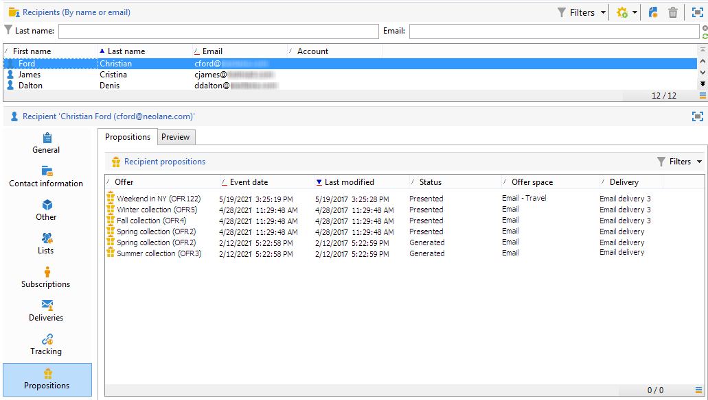

# Cronologia e reporting delle interazioni in tempo reale

>[!NOTE]
>
>Queste funzionalità sono visibili solo online e solo ai **Responsabili della consegna**.

## Cronologia delle proposte di offerta{#offer-proposition-history}

Una volta create le proposte di offerta, puoi visualizzare la cronologia delle presentazioni.

* A livello di offerta, nella scheda **[!UICONTROL Edit]**, fare clic su **[!UICONTROL Propositions]**.

  

* Dal profilo di un destinatario, fare clic sulla scheda **[!UICONTROL Propositions]**.

  

* A livello di spazio dell&#39;offerta, fare clic sulla scheda **[!UICONTROL Propositions]**.

  

## Rapporto di analisi delle offerte{#offer-analysis-report}

Il report **[!UICONTROL Offer analysis]** fornisce una panoramica del numero di proposte accettate o rifiutate.

Le statistiche sono ordinate in base a tre criteri:

* Per data:

  

* Per spazio:

  

* Per consegne:

  

I dati possono essere filtrati in base ai vari criteri disponibili nella sezione superiore del rapporto. Dopo aver selezionato i criteri desiderati, fare clic sul collegamento **[!UICONTROL Refresh]** per applicarli al report.
