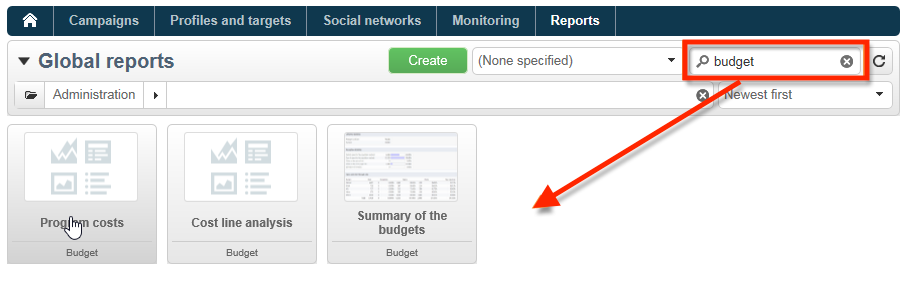
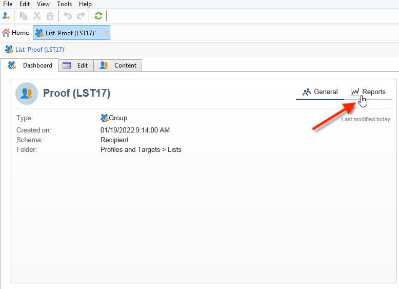

# Report incorporati di Adobe Campaign{#ootb-reports}

Questa pagina fornisce l’elenco dei rapporti incorporati di Adobe Campaign, il loro contenuto e il loro contesto. Adobe Campaign fornisce una serie di rapporti incorporati, accessibili dalla console del client o da un browser Internet.

Sono disponibili i seguenti tipi di rapporto:

* Rapporti sull’intera piattaforma. [Ulteriori informazioni](global-reports.md).
* Rapporti di consegna. [Ulteriori informazioni](delivery-reports.md).

Puoi accedere ai rapporti incorporati dalla home page di Campaign, dal dashboard dei rapporti dedicati o dall’elenco di consegna. Il modo in cui il rapporto viene visualizzato nell’interfaccia utente dipende dal suo contesto.

Un elenco di rapporti chiave è disponibile nella home page e consente di accedere rapidamente ai dati di consegna. Questo elenco può essere modificato in base alle tue esigenze. Puoi anche imparare ad aggiungere rapporti personalizzati al **[!UICONTROL Reports]** scheda .

Per ulteriori informazioni su queste configurazioni personalizzate, consulta questo [Documentazione di Campaign Classic v7](https://experienceleague.adobe.com/docs/campaign-classic/using/reporting/creating-new-reports/configuring-access-to-the-report.html).

## Accedere ai rapporti incorporati {#access-ootb-reports}

Per accedere ai rapporti incorporati di Campaign:

1. Seleziona la **[!UICONTROL Reports]** scheda dell’interfaccia di Adobe Campaign.

   

1. Utilizza i campi di ricerca per filtrare i rapporti visualizzati.

1. Quindi fare clic sul rapporto che si desidera visualizzare.

   

1. Fai clic sul pulsante **[!UICONTROL Back]** nella parte superiore dello schermo, torna all’elenco dei report.

   

I rapporti specifici per una campagna o una consegna sono accessibili tramite le rispettive dashboard.

Il principio è lo stesso per gli elenchi, i servizi, le offerte, ecc. come mostrato di seguito:

## Report sulle consegne {#reports-on-deliveries}

I rapporti incorporati forniti da Adobe Campaign si trovano nella tabella seguente.

Per ulteriori informazioni sul contenuto di questi rapporti, consulta [questa sezione](delivery-reports.md).

<table> 
 <tbody> 
  <tr> 
   <td> <strong>Etichetta e nome interno</strong>  </td> 
   <td> <strong>Descrizione</strong>  </td> 
   <td> <strong>Schema</strong>  </td> 
  </tr> 
  <tr> 
   <td> Attività utente (recipientActivity)  </td> 
   <td> Suddivisione di aperture, clic e transazioni per periodo di tempo.  </td> 
   <td> nms:consegna  </td> 
  </tr> 
  <tr> 
   <td> Velocità effettiva di consegna (throughput)  </td> 
   <td> Grafici a velocità effettiva di consegna, in messaggi/ora e Mbit/s.  </td> 
   <td> nms:consegna  </td> 
  </tr> 
  <tr> 
   <td> Errori e mancati recapiti (errori)  </td> 
   <td> Rimbalzi e non risultati finali per causa e dominio.  </td> 
   <td> nms:consegna  </td> 
  </tr> 
  <tr> 
   <td> Indicatori di tracciamento (deliveryFeedback)  </td> 
   <td> Riepilogo degli indicatori chiave per il tracciamento del comportamento dei destinatari.  </td> 
   <td> nms:consegna  </td> 
  </tr> 
  <tr> 
   <td> Indicatori di tracciamento (mobileAppDeliveryFeedback)  </td> 
   <td> Indicatori di tracciamento di una consegna a un’app mobile.  </td> 
   <td> nms:consegna  </td> 
  </tr> 
  <tr> 
   <td> Browser (browserStatistics)  </td> 
   <td> Statistiche sui browser utilizzati dai destinatari che hanno fatto clic sui messaggi.  </td> 
   <td> xtk:none  </td> 
  </tr> 
  <tr> 
   <td> Condivisione sui social network (deliveryForward)  </td> 
   <td> Condivisione di statistiche di apertura di attività e posta elettronica.  </td> 
   <td> nms:consegna  </td> 
  </tr> 
  <tr> 
   <td> Hot click (foto)  </td> 
   <td> Visualizza il messaggio e le percentuali di clic sovrapposte.  </td> 
   <td> nms:consegna  </td> 
  </tr> 
  <tr> 
   <td> Rapporto di ipotesi (deliveryHypothetic)  </td> 
   <td> Visualizza il riepilogo delle misure in base alle ipotesi di consegna.  </td> 
   <td> nms:consegna  </td> 
  </tr> 
  <tr> 
   <td> Statistiche di consegna (statisticsPerDelivery)  </td> 
   <td> Statistiche (messaggi elaborati, messaggi consegnati, mancati recapiti, non recapitati, clic, annullamenti di abbonamenti) per dominio e-mail.  </td> 
   <td> nms:consegna  </td> 
  </tr> 
  <tr> 
   <td> Condivisione di statistiche sulle attività (forwardActivities)  </td> 
   <td> Analisi delle attività di condivisione, delle aperture e degli abbonamenti per periodo di tempo.  </td> 
   <td> nms:consegna  </td> 
  </tr> 
  <tr> 
   <td> Statistiche di tracciamento (trackingStatistics)  </td> 
   <td> Apri, fai clic su e rapporto tassi di transazione.  </td> 
   <td> nms:consegna  </td> 
  </tr> 
  <tr> 
   <td> Riepilogo consegna (deliverySending)  </td> 
   <td> Sintesi degli indicatori di consegna: target, esclusione e messaggi inviati.  </td> 
   <td> nms:consegna  </td> 
  </tr> 
  <tr> 
   <td> Riepilogo della consegna (deliveryStatistics)  </td> 
   <td> Tabella di riepilogo per le consegne selezionate: Target, esclusioni e messaggi inviati.  </td> 
   <td> nms:consegna  </td> 
  </tr> 
  <tr> 
   <td> Sistemi operativi (osStatistics)  </td> 
   <td> Statistiche sui sistemi operativi utilizzati dai destinatari che hanno fatto clic su in un messaggio.  </td> 
   <td> xtk:none  </td> 
  </tr> 
  <tr> 
   <td> Tasso di reattività (deliveryFeedbackSocial)  </td> 
   <td> Tasso di reattività della consegna e disaggregazione della reazione.  </td> 
   <td> nms:consegna  </td> 
  </tr> 
  <tr> 
   <td> URL e throughput di clic (topUrlDelivery)  </td> 
   <td> La maggior parte degli URL reattivi e dei flussi di clic associati.  </td> 
   <td> nms:consegna  </td> 
  </tr> 
 </tbody> 
</table>

## Report sulle campagne {#reports-on-campaigns}

I rapporti sulle campagne riguardano i dati nel **nms:operazione** tabella.

<table> 
 <tbody> 
  <tr> 
   <td> <strong>Etichetta e nome interno</strong>  </td> 
   <td> <strong>Descrizione</strong>  </td> 
  </tr> 
  <tr> 
   <td> Attività utente (operationRecipientActivity)  </td> 
   <td> La suddivisione di aperture, clic e transazioni per periodo di tempo dipende da Campaign.  </td> 
  </tr> 
  <tr> 
   <td> Velocità effettiva di consegna (operationThroughput)  </td> 
   <td> I grafici della velocità effettiva di consegna, in e-mail/ora e Mbit/s, dipendono da Campaign.  </td> 
  </tr> 
  <tr> 
   <td> Spese campagna (budgetOperationExpenses)  </td> 
   <td> Visualizza in dettaglio le voci della campagna, a seconda di Campaign.  </td> 
  </tr> 
  <tr> 
   <td> Errori e mancati recapiti (operationErrors)  </td> 
   <td> I rimbalzi e i non consegnabili per causa e dominio dipendono da Campaign.  </td> 
  </tr> 
  <tr> 
   <td> Esplorazione delle linee dei costi (budgetExplorerOperation)  </td> 
   <td> L'analisi descrittiva delle linee di costo dipende dal MRM.  </td> 
  </tr> 
  <tr> 
   <td> Indicatori di tracciamento (operationFeedback)  </td> 
   <td> Panoramica degli indicatori di tracciamento chiave: Le aperture, i clic e le transazioni dipendono da Campaign.  </td> 
  </tr> 
  <tr> 
   <td> Condivisione sui social network (operationForward)  </td> 
   <td> La condivisione di statistiche di apertura di attività e posta dipende da Campaign.  </td> 
  </tr> 
  <tr> 
   <td> Rapporto di ipotesi (operationHypothetic)  </td> 
   <td> Visualizza il riepilogo delle misurazioni delle ipotesi per le consegne della campagna, a seconda di Campaign.  </td> 
  </tr> 
  <tr> 
   <td> Condivisione di statistiche sulle attività (forwardActivityOpt)  </td> 
   <td> L’analisi delle attività di condivisione, delle aperture e degli abbonamenti per periodo di tempo dipende da Campaign.  </td> 
  </tr> 
  <tr> 
   <td> Riepilogo della consegna (operationStatistics)  </td> 
   <td> Grafico di riepilogo delle consegne della campagna: Target, esclusioni e messaggi inviati.  </td> 
  </tr> 
  <tr> 
   <td> URL e throughput di clic (operationTopUrlDelivery)  </td> 
   <td> La maggior parte degli URL reattivi e dei flussi di clic associati dipendono da Campaign.  </td> 
  </tr> 
 </tbody> 
</table>

## Rapporti sui servizi {#reports-on-services}

Le relazioni sui servizi riguardano i dati **nms:servizio** tabella.

<table> 
 <tbody> 
  <tr> 
   <td> <strong>Etichetta e nome interno</strong>  </td> 
   <td> <strong>Descrizione</strong>  </td> 
  </tr> 
  <tr> 
   <td> Acquisizioni di ventole (socialAcquisitionsByWebapp)  </td> 
   <td> Quali applicazioni web hanno permesso le acquisizioni potenziali? Dipende dal componente aggiuntivo Social marketing.  </td> 
  </tr> 
  <tr> 
   <td> Disaggregazione degli abbonamenti (mobileAppDistribution)  </td> 
   <td> La suddivisione degli abbonamenti attivi per app mobile dipende dal componente aggiuntivo per canale app mobile.  </td> 
  </tr> 
  <tr> 
   <td> Tracciamento sottoscrizione (subscriptionsProgress)  </td> 
   <td> Evoluzione degli abbonamenti ai servizi di informazione  </td> 
  </tr> 
  <tr> 
   <td> Tasso di reattività (socialReactionRate)  </td> 
   <td> Quali sono i tassi di reattività per le ultime consegne? Dipende dal componente aggiuntivo Social marketing.  </td> 
  </tr> 
  <tr> 
   <td> Tasso di reattività (mobileAppReactivityRate)  </td> 
   <td> Il tasso di reattività per le consegne più recenti dipende dal componente aggiuntivo per canale app mobile.  </td> 
  </tr> 
 </tbody> 
</table>

## Relazioni di bilancio {#budget-reports}

I rapporti incorporati forniti da Adobe Campaign si trovano nella tabella seguente.

<table> 
 <tbody> 
  <tr> 
   <td> <strong>Etichetta e nome interno</strong>  </td> 
   <td> <strong>Descrizione</strong>  </td> 
   <td> <strong>Schema</strong>  </td> 
  </tr> 
  <tr> 
   <td> Costi legati al programma o ai programmi (budgetProgramCost)  </td> 
   <td> Ripartizione dei costi dei programmi.  </td> 
   <td> nms:program  </td> 
  </tr> 
  <tr> 
   <td> Evoluzione del bilancio (evoluzione del bilancio)  </td> 
   <td> Evoluzione dei costi di bilancio per livello di impegno.  </td> 
   <td> nms:budget  </td> 
  </tr> 
  <tr> 
   <td> Evoluzione cumulativa del budget (budgetCumulativeEvolution)  </td> 
   <td> Evoluzione dei costi di bilancio cumulati ripartiti per commi  livello del trattamento. </td> 
   <td> nms:budget  </td> 
  </tr> 
  <tr> 
   <td> Esplorazione delle linee di costo (budgetExplorerBudget)  </td> 
   <td> Analisi descrittiva delle linee di costo.  </td> 
   <td> nms:budget  </td> 
  </tr> 
  <tr> 
   <td> Esplorazione delle linee di costo (budgetExplorer)  </td> 
   <td> Analisi descrittiva delle linee di costo.  </td> 
   <td> nms:costLine  </td> 
  </tr> 
  <tr> 
   <td> Esplorazione delle linee di costo (budgetExplorerPlan)  </td> 
   <td> Analisi descrittiva delle linee di costo.  </td> 
   <td> nms:plan  </td> 
  </tr> 
  <tr> 
   <td> Esplorazione delle linee di costo (budgetExplorerProgram)  </td> 
   <td> Analisi descrittiva delle linee di costo.  </td> 
   <td> nms:program  </td> 
  </tr> 
  <tr> 
   <td> Sintesi del bilancio (bilancio)  </td> 
   <td> Istantanea dei principali costi, categorie di spesa e budget.  </td> 
   <td> nms:budget  </td> 
  </tr> 
 </tbody> 
</table>

## Rapporti sulle simulazioni {#reports-on-simulations}

Le relazioni sulle simulazioni riguardano i dati **nms:simulazione** tabella.

<table> 
 <tbody> 
  <tr> 
   <td> <strong>Etichetta e nome interno</strong>  </td> 
   <td> <strong>Descrizione</strong>  </td> 
  </tr> 
  <tr> 
   <td> Dettaglio delle esclusioni di simulazione (dlvSimuLossesDetail)  </td> 
   <td> Tabella dettagliata di tutte le cause di esclusione.  </td> 
  </tr> 
  <tr> 
   <td> Suddivisione delle offerte per classificazione (offerSimulationRanking)  </td> 
   <td> Suddivisione delle offerte nella simulazione, per classificazione.  </td> 
  </tr> 
  <tr> 
   <td> Riepilogo della simulazione (dlvSimuLossesSummary)  </td> 
   <td> Riepilogo dei volumi di simulazione ed esclusioni.  </td> 
  </tr> 
  <tr> 
   <td> Statistiche di sovrapposizione (dlvSimuOverlapping)  </td> 
   <td> Volumi di sovrapposizione target di consegna.  </td> 
  </tr> 
  <tr> 
   <td> Riepilogo delle esclusioni dovute alla simulazione (dlvSimuLossesSimu)  </td> 
   <td> Tabella delle esclusioni dovute alla simulazione.  </td> 
  </tr> 
 </tbody> 
</table>

## Rapporti sulle applicazioni web {#reports-on-web-applications}

I rapporti sulle applicazioni web riguardano i dati **nms:WebApp** tabella.

<table> 
 <tbody> 
  <tr> 
   <td> <strong>Etichetta e nome interno</strong>  </td> 
   <td> <strong>Descrizione</strong>  </td> 
  </tr> 
  <tr> 
   <td> Documentazione (surveyDictionary)  </td> 
   <td> Descrizione della struttura del sondaggio, dipende dal componente aggiuntivo Survey Manager.  </td> 
  </tr> 
  <tr> 
   <td> Principale (surveyProperties)  </td> 
   <td> Proprietà del sondaggio  </td> 
  </tr> 
  <tr> 
   <td> Suddivisione delle risposte (surveyDistribution)  </td> 
   <td> Scomposizione delle risposte alle domande.  </td> 
  </tr> 
 </tbody> 
</table>

## Altri rapporti ootb {#other-ootb-reports}

Vengono inoltre forniti i seguenti rapporti incorporati. Per ulteriori informazioni, consulta il documento sulle funzionalità che riguardano.

<table> 
 <tbody> 
  <tr> 
   <td> <strong>Etichetta e nome interno</strong>  </td> 
   <td> <strong>Descrizione</strong>  </td> 
   <td> <strong>Schema</strong>  </td> 
  </tr> 
  <tr> 
   <td> Analisi delle offerte (offerAnalysis)  </td> 
   <td> L’analisi dell’offerta per data e canale dipende dal componente aggiuntivo Interaction .  </td> 
   <td> nms:offerta  </td> 
  </tr> 
  <tr> 
   <td> Efficienza di remarketing (remarketingEffect)  </td> 
   <td> Misurazione dell’efficienza del remarketing  </td> 
   <td> nms:webEvent  </td> 
  </tr> 
  <tr> 
   <td> Storia delle acquisizioni di prospettiva sociale (socialVisitorStatistics)  </td> 
   <td> La storia delle acquisizioni potenziali di Twitter e Facebook dipende dal componente aggiuntivo Social marketing.  </td> 
   <td> nms:visitatore  </td> 
  </tr> 
  <tr> 
   <td> Tracking delle proposte recenti (RecentProposition)  </td> 
   <td> Tracciamento delle proposte in tempo reale  </td> 
   <td> nms:propositionRcp  </td> 
  </tr> 
 </tbody> 
</table>
