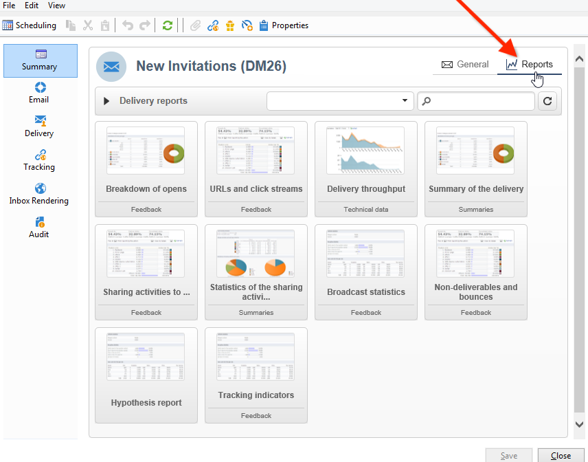

# Rapporti incorporati di Adobe Campaign {#ootb-reports}

Questa pagina fornisce l’elenco dei rapporti incorporati di Adobe Campaign, il loro contenuto e il loro contesto. Adobe Campaign fornisce una serie di rapporti incorporati, accessibili tramite la console client o un browser Internet.

Sono disponibili i seguenti tipi di rapporto:

* Report sull&#39;intera piattaforma. [Ulteriori informazioni](global-reports.md).
* Rapporti di consegna. [Ulteriori informazioni](delivery-reports.md).

Puoi accedere ai rapporti incorporati dalla pagina Home di Campaign, dalla dashboard dei rapporti dedicati o dall’elenco di consegna. Il modo in cui il rapporto viene visualizzato nell’interfaccia utente dipende dal suo contesto.

Nella home page è disponibile un elenco di rapporti chiave che consentono di accedere rapidamente ai dati di consegna. Questo elenco può essere modificato in base alle tue esigenze. Scopri anche come aggiungere i tuoi report personalizzati alla scheda **[!UICONTROL Reports]**.

Per ulteriori informazioni su queste configurazioni personalizzate, consulta questa [documentazione di Campaign Classic v7](https://experienceleague.adobe.com/docs/campaign-classic/using/reporting/creating-new-reports/configuring-access-to-the-report.html?lang=it){target="_blank"}.

## Accedere ai rapporti incorporati {#access-ootb-reports}

Per accedere ai rapporti incorporati di Campaign:

1. Selezionare la scheda **[!UICONTROL Reports]** dell&#39;interfaccia di Adobe Campaign.

   

1. Utilizza i campi di ricerca per filtrare i rapporti visualizzati.

1. Quindi fai clic sul rapporto che desideri visualizzare.

   

1. Fai clic sul collegamento **[!UICONTROL Back]** nella parte superiore della schermata per tornare all&#39;elenco dei rapporti.

   

I rapporti specifici di una campagna o di una consegna sono accessibili tramite le rispettive dashboard.

Il principio è lo stesso per elenchi, servizi, offerte, ecc. come mostrato di seguito:

## Rapporti sulle consegne {#reports-on-deliveries}

I rapporti incorporati forniti da Adobe Campaign sono disponibili nella tabella seguente.

Per ulteriori informazioni sul contenuto di questi report, consulta [questa sezione](delivery-reports.md).

<table> 
 <tbody> 
  <tr> 
   <td> <strong>Etichetta e nome interno</strong>  </td> 
   <td> <strong>Descrizione</strong>  </td> 
   <td> <strong>Schema</strong>  </td> 
  </tr> 
  <tr> 
   <td> Attività utente (recipientActivity)  </td> 
   <td> Raggruppamento di aperture, clic e transazioni per periodo di tempo.  </td> 
   <td> nms:delivery  </td> 
  </tr> 
  <tr> 
   <td> Velocità effettiva di consegna (velocità effettiva)  </td> 
   <td> Grafici della velocità effettiva di consegna, in messaggi/ora e Mbit/s.  </td> 
   <td> nms:delivery  </td> 
  </tr> 
  <tr> 
   <td> Errori e mancati recapiti (errori)  </td> 
   <td> Mancati recapiti e non recapiti per causa e dominio.  </td> 
   <td> nms:delivery  </td> 
  </tr> 
  <tr> 
   <td> Indicatori di tracciamento (deliveryFeedback)  </td> 
   <td> Riepilogo degli indicatori chiave per tenere traccia del comportamento del destinatario.  </td> 
   <td> nms:delivery  </td> 
  </tr> 
  <tr> 
   <td> Indicatori di tracciamento (mobileAppDeliveryFeedback)  </td> 
   <td> Indicatori di tracciamento di una consegna a un'app mobile.  </td> 
   <td> nms:delivery  </td> 
  </tr> 
  <tr> 
   <td> Browser (browserStatistics)  </td> 
   <td> Statistiche sui browser utilizzati dai destinatari che hanno fatto clic nei messaggi.  </td> 
   <td> xtk:none  </td> 
  </tr> 
  <tr> 
   <td> Condivisione sui social network (deliveryForward)  </td> 
   <td> Condivisione delle statistiche relative all'attività e all'apertura dei messaggi di posta elettronica.  </td> 
   <td> nms:delivery  </td> 
  </tr> 
  <tr> 
   <td> Hot click (hoturl)  </td> 
   <td> Visualizza il messaggio e le percentuali di clic sovrapposte.  </td> 
   <td> nms:delivery  </td> 
  </tr> 
  <tr> 
   <td> Rapporto ipotesi (deliveryHypothesis)  </td> 
   <td> Visualizza il riepilogo delle misure sulle ipotesi di consegna.  </td> 
   <td> nms:delivery  </td> 
  </tr> 
  <tr> 
   <td> Statistiche di consegna (statisticsPerDelivery)  </td> 
   <td> Statistiche (messaggi elaborati, messaggi consegnati, mancati recapiti permanenti, mancati recapiti non permanenti, clic, annullamenti di abbonamenti) per dominio e-mail.  </td> 
   <td> nms:delivery  </td> 
  </tr> 
  <tr> 
   <td> Condivisione delle statistiche delle attività (forwardActivities)  </td> 
   <td> Analisi delle attività di condivisione, delle aperture e delle sottoscrizioni per periodo di tempo.  </td> 
   <td> nms:delivery  </td> 
  </tr> 
  <tr> 
   <td> Statistiche di tracciamento (trackingStatistics)  </td> 
   <td> Apri, rapporto sulle tariffe di clic e transazione.  </td> 
   <td> nms:delivery  </td> 
  </tr> 
  <tr> 
   <td> Riepilogo delle consegne (deliverySending)  </td> 
   <td> Riepilogo degli indicatori di consegna: destinazione, esclusione e messaggi inviati.  </td> 
   <td> nms:delivery  </td> 
  </tr> 
  <tr> 
   <td> Riepilogo delle consegne (deliveryStatistics)  </td> 
   <td> Tabella di riepilogo per le consegne selezionate: destinazioni, esclusioni e messaggi inviati.  </td> 
   <td> nms:delivery  </td> 
  </tr> 
  <tr> 
   <td> Sistemi operativi (osStatistics)  </td> 
   <td> Statistiche sui sistemi operativi utilizzati dai destinatari che hanno fatto clic in un messaggio.  </td> 
   <td> xtk:none  </td> 
  </tr> 
  <tr> 
   <td> Tasso di reattività (deliveryFeedbackSocial)  </td> 
   <td> Frequenza di reattività della consegna e raggruppamento della reazione.  </td> 
   <td> nms:delivery  </td> 
  </tr> 
  <tr> 
   <td> URL e velocità effettiva di clic (topUrlDelivery)  </td> 
   <td> URL più reattivi e flussi di clic associati.  </td> 
   <td> nms:delivery  </td> 
  </tr> 
 </tbody> 
</table>

## Rapporti sulle campagne {#reports-on-campaigns}

I report sulle campagne riguardano i dati nella tabella **nms:operation**.

<table> 
 <tbody> 
  <tr> 
   <td> <strong>Etichetta e nome interno</strong>  </td> 
   <td> <strong>Descrizione</strong>  </td> 
  </tr> 
  <tr> 
   <td> Attività utente (operationRecipientActivity)  </td> 
   <td> Raggruppamento di aperture, clic e transazioni per periodo di tempo, in base a Campaign.  </td> 
  </tr> 
  <tr> 
   <td> Velocità effettiva di consegna (operationThroughput)  </td> 
   <td> I grafici della velocità effettiva di consegna, in mail/ora e Mbit/s, dipendono da Campaign.  </td> 
  </tr> 
  <tr> 
   <td> Spese campagna (budgetOperationExpenses)  </td> 
   <td> Visualizza gli elementi riga campagna in dettaglio, a seconda di Campaign.  </td> 
  </tr> 
  <tr> 
   <td> Errori e mancati recapiti (operationErrors)  </td> 
   <td> Mancati recapiti e non recapitabili per causa e dominio, dipende da Campaign.  </td> 
  </tr> 
  <tr> 
   <td> Esplorazione righe costi (budgetExplorerOperation)  </td> 
   <td> Analisi descrittiva delle linee di costo, dipende da MRM.  </td> 
  </tr> 
  <tr> 
   <td> Indicatori di tracciamento (operationFeedback)  </td> 
   <td> Panoramica degli indicatori chiave di tracciamento: aperture, clic e transazioni, dipende da Campaign.  </td> 
  </tr> 
  <tr> 
   <td> Condivisione sui social network (operationForward)  </td> 
   <td> La condivisione delle statistiche di attività e apertura della posta dipende da Campaign.  </td> 
  </tr> 
  <tr> 
   <td> Report ipotesi (operationHypothesis)  </td> 
   <td> Visualizza il riepilogo delle misurazioni delle ipotesi per le consegne della campagna, in base a Campaign.  </td> 
  </tr> 
  <tr> 
   <td> Condivisione delle statistiche delle attività (forwardActivityOpt)  </td> 
   <td> L'analisi delle attività di condivisione, delle aperture e delle sottoscrizioni per periodo di tempo dipende da Campaign.  </td> 
  </tr> 
  <tr> 
   <td> Riepilogo consegne (operationStatistics)  </td> 
   <td> Grafico di riepilogo delle consegne della campagna: destinazioni, esclusioni e messaggi inviati.  </td> 
  </tr> 
  <tr> 
   <td> URL e velocità effettiva di clic (operationTopUrlDelivery)  </td> 
   <td> La maggior parte degli URL reattivi e dei flussi di clic associati dipende da Campaign.  </td> 
  </tr> 
 </tbody> 
</table>

## Rapporti sui servizi {#reports-on-services}

I report sui servizi riguardano i dati nella tabella **nms:service**.

<table> 
 <tbody> 
  <tr> 
   <td> <strong>Etichetta e nome interno</strong>  </td> 
   <td> <strong>Descrizione</strong>  </td> 
  </tr> 
  <tr> 
   <td> Acquisizioni di ventole (socialAcquisitionsByWebapp)  </td> 
   <td> Quali applicazioni web hanno consentito le acquisizioni dei potenziali clienti? Dipende dal componente aggiuntivo Social marketing.  </td> 
  </tr> 
  <tr> 
   <td> Raggruppamento delle sottoscrizioni (mobileAppDistribution)  </td> 
   <td> Raggruppamento degli abbonamenti attivi per app mobile, in base al componente aggiuntivo Canale app mobile.  </td> 
  </tr> 
  <tr> 
   <td> Tracciamento abbonamento (subscriptionsProgress)  </td> 
   <td> Evoluzione degli abbonamenti a servizi di informazione  </td> 
  </tr> 
  <tr> 
   <td> Tasso di reattività (socialReactionRate)  </td> 
   <td> Quali sono i tassi di reattività per le ultime consegne? Dipende dal componente aggiuntivo Social marketing.  </td> 
  </tr> 
  <tr> 
   <td> Tasso di reattività (mobileAppReactivityRate)  </td> 
   <td> Il tasso di reattività per le ultime consegne dipende dal componente aggiuntivo Canale app mobile.  </td> 
  </tr> 
 </tbody> 
</table>

## Report budget {#budget-reports}

I rapporti incorporati forniti da Adobe Campaign sono disponibili nella tabella seguente.

<table> 
 <tbody> 
  <tr> 
   <td> <strong>Etichetta e nome interno</strong>  </td> 
   <td> <strong>Descrizione</strong>  </td> 
   <td> <strong>Schema</strong>  </td> 
  </tr> 
  <tr> 
   <td> Costi collegati ai programmi (budgetProgramCost)  </td> 
   <td> Raggruppamento dei costi del programma.  </td> 
   <td> nms:programma  </td> 
  </tr> 
  <tr> 
   <td> Evoluzione budget (budgetEvolution)  </td> 
   <td> Evoluzione dei costi budget per livello di impegno.  </td> 
   <td> nms:budget  </td> 
  </tr> 
  <tr> 
   <td> Evoluzione cumulativa del budget (budgetCumulativeEvolution)  </td> 
   <td> Evoluzione dei costi preventivati cumulativi suddivisi per livello di frammento Commi . </td> 
   <td> nms:budget  </td> 
  </tr> 
  <tr> 
   <td> Esplorazione righe costi (budgetExplorerBudget)  </td> 
   <td> Analisi descrittiva delle righe costi.  </td> 
   <td> nms:budget  </td> 
  </tr> 
  <tr> 
   <td> Esplorazione righe costi (budgetExplorer)  </td> 
   <td> Analisi descrittiva delle righe costi.  </td> 
   <td> nms:costLine  </td> 
  </tr> 
  <tr> 
   <td> Esplorazione righe costi (budgetExplorerPlan)  </td> 
   <td> Analisi descrittiva delle righe costi.  </td> 
   <td> nms:piano  </td> 
  </tr> 
  <tr> 
   <td> Esplorazione righe costi (budgetExplorerProgram)  </td> 
   <td> Analisi descrittiva delle righe costi.  </td> 
   <td> nms:programma  </td> 
  </tr> 
  <tr> 
   <td> Riepilogo budget (budget)  </td> 
   <td> Snapshot dei costi principali, delle categorie di spesa e dei budget.  </td> 
   <td> nms:budget  </td> 
  </tr> 
 </tbody> 
</table>

## Rapporti sulle simulazioni {#reports-on-simulations}

I report sulle simulazioni riguardano i dati nella tabella **nms:simulation**.

<table> 
 <tbody> 
  <tr> 
   <td> <strong>Etichetta e nome interno</strong>  </td> 
   <td> <strong>Descrizione</strong>  </td> 
  </tr> 
  <tr> 
   <td> Dettagli delle esclusioni di simulazione (dlvSimuLossesDetail)  </td> 
   <td> Tabella dettagliata di tutte le cause di esclusione.  </td> 
  </tr> 
  <tr> 
   <td> Raggruppamento delle offerte per rango (offerSimulationRanking)  </td> 
   <td> Raggruppamento delle offerte nella simulazione, per rango.  </td> 
  </tr> 
  <tr> 
   <td> Riepilogo simulazione (dlvSimuLossesSummary)  </td> 
   <td> Riepilogo di volumi ed esclusioni di simulazione.  </td> 
  </tr> 
  <tr> 
   <td> Statistiche di sovrapposizione (dlvSimuOverlapping)  </td> 
   <td> Volumi di sovrapposizione di destinazione della consegna.  </td> 
  </tr> 
  <tr> 
   <td> Riepilogo delle esclusioni dovute alla simulazione (dlvSimuLossesSimu)  </td> 
   <td> Tabella di esclusioni dovute alla simulazione.  </td> 
  </tr> 
 </tbody> 
</table>

## Rapporti sulle applicazioni web {#reports-on-web-applications}

I report sulle applicazioni Web riguardano i dati nella tabella **nms:WebApp**.

<table> 
 <tbody> 
  <tr> 
   <td> <strong>Etichetta e nome interno</strong>  </td> 
   <td> <strong>Descrizione</strong>  </td> 
  </tr> 
  <tr> 
   <td> Documentazione (surveyDictionary)  </td> 
   <td> Descrizione della struttura del sondaggio, in base al componente aggiuntivo Gestione sondaggi.  </td> 
  </tr> 
  <tr> 
   <td> Principale (surveyProperties)  </td> 
   <td> Proprietà sondaggio  </td> 
  </tr> 
  <tr> 
   <td> Raggruppamento delle risposte (surveyDistribution)  </td> 
   <td> Raggruppamento delle risposte alle domande.  </td> 
  </tr> 
 </tbody> 
</table>

## Altri rapporti ootb {#other-ootb-reports}

Sono inoltre forniti i seguenti rapporti incorporati. Per ulteriori informazioni, consulta il documento sulle funzionalità a cui si riferiscono.

<table> 
 <tbody> 
  <tr> 
   <td> <strong>Etichetta e nome interno</strong>  </td> 
   <td> <strong>Descrizione</strong>  </td> 
   <td> <strong>Schema</strong>  </td> 
  </tr> 
  <tr> 
   <td> Analisi delle offerte (offerAnalysis)  </td> 
   <td> L'analisi delle offerte per data e canale dipende dal componente aggiuntivo di interazione.  </td> 
   <td> nms:offer  </td> 
  </tr> 
  <tr> 
   <td> Efficienza remarketing (remarketingEffect)  </td> 
   <td> Misurazione dell'efficienza di remarketing  </td> 
   <td> nms:webEvent  </td> 
  </tr> 
  <tr> 
   <td> Cronologia acquisizioni di potenziali clienti social (socialVisitorStatistics)  </td> 
   <td> La cronologia delle acquisizioni di X (precedentemente noto come Twitter) e Facebook prospect dipende dal componente aggiuntivo Social marketing.  </td> 
   <td> nms:visitor  </td> 
  </tr> 
  <tr> 
   <td> Tracciamento delle proposte recenti (recentiPropositions)  </td> 
   <td> Tracciamento delle proposte in tempo reale  </td> 
   <td> nms:propositionRcp  </td> 
  </tr> 
 </tbody> 
</table>
