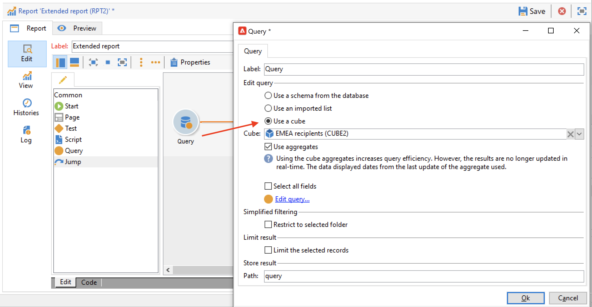

# Creare un cubo{#create-a-cube}

## Area di lavoro del cubo {#cube-workspace}

Per accedere ai cubi, passa a **[!UICONTROL Administration > Configuration > Cubes]** da Esplora campagne.

Con i cubi è possibile:

* Esporta i dati direttamente in un report, progettato nella scheda **[!UICONTROL Reports]** della piattaforma Adobe Campaign.

  A questo scopo, crea un nuovo rapporto e seleziona il cubo da utilizzare.

  

  I cubi vengono visualizzati come modelli in base ai rapporti creati. Dopo aver scelto un modello, fare clic su **[!UICONTROL Create]** per configurare e visualizzare il nuovo report.

  Puoi adattare le misure, modificare la modalità di visualizzazione o configurare la tabella, quindi visualizzare il rapporto utilizzando il pulsante principale.

  

* Fare riferimento a un cubo nella casella **[!UICONTROL Query]** di un report per utilizzare i relativi indicatori, come illustrato di seguito:

  

* Inserire una tabella pivot basata su un cubo in una pagina qualsiasi di un report. A tale scopo, fare riferimento al cubo da utilizzare nella scheda **[!UICONTROL Data]** della tabella pivot sulla pagina interessata.

  

  Per ulteriori informazioni, consulta [Esplorare i dati in un report](cube-tables.md#explore-the-data-in-a-report).

>[!CAUTION]
>
>Per creare i cubi sono necessarie le autorizzazioni di amministratore.
>

## Creare un cubo{#cube-create}

Prima di iniziare a creare un report cubo, identificare le dimensioni e le misure rilevanti e crearle nel cubo.

Per creare un cubo, attenersi alla procedura descritta di seguito.

1. Selezionare la tabella di lavoro. [Ulteriori informazioni](#select-the-work-table).
1. Definite le quote. [Ulteriori informazioni](#define-dimensions).
1. Definire le misure. [Ulteriori informazioni](#build-indicators).
1. Creare aggregati (facoltativo). [Ulteriori informazioni](customize-cubes.md#calculate-and-use-aggregates).

Nell’esempio seguente, scopri come creare rapidamente un cubo semplice in un rapporto per esportare le relative misure.

### Seleziona la tabella di lavoro {#select-the-work-table}

Per creare un cubo, effettuare le seguenti operazioni:

1. Fare clic sul pulsante **[!UICONTROL New]** sopra l&#39;elenco dei cubi.

   

1. Seleziona lo schema contenente gli elementi da esplorare (noto anche come &quot;schema dei fatti&quot;). In questo esempio, selezionare la tabella predefinita **Destinatario**.
1. Fare clic su **[!UICONTROL Save]** per creare il cubo, che verrà aggiunto all&#39;elenco dei cubi. Ora puoi utilizzare le schede per configurarlo.

1. Fare clic sul collegamento **[!UICONTROL Filter the source data...]** per applicare i calcoli del cubo ai dati del database.

   

### Definire le dimensioni {#define-dimensions}

Una volta creato il cubo, definirne le dimensioni. Le dimensioni sono gli assi di analisi definiti per ciascun cubo in base al relativo schema fact. Queste sono le dimensioni analizzate nell’analisi, come il tempo (anno, mese, data), una classificazione di prodotti o contratti (famiglia, riferimento, ecc.), un segmento di popolazione (per città, fascia di età, stato, ecc.).

Per creare le quote, effettuate le seguenti operazioni:

1. Passare alla scheda **[!UICONTROL Dimension]** del cubo e fare clic sul pulsante **[!UICONTROL Add]** per creare una nuova dimensione.
1. In **[!UICONTROL Expression field]**, fare clic sull&#39;icona **[!UICONTROL Edit expression]** per selezionare il campo che contiene i dati interessati.

   

1. In questo esempio, stiamo selezionando il destinatario **Età**. Per questo campo, puoi definire il binning per raggruppare le pagine e semplificare la lettura delle informazioni. È consigliabile utilizzare il binning quando è probabile che siano presenti più valori separati.

Per eseguire questa operazione, selezionare l&#39;opzione **[!UICONTROL Enable binning]**. [Ulteriori informazioni](customize-cubes.md#data-binning).

1. Aggiungi una dimensione di tipo **Date**. In questo caso, vogliamo visualizzare le date di creazione del profilo del destinatario. A tale scopo, fare clic su **[!UICONTROL Add]** e selezionare il campo **[!UICONTROL Creation date]** nella tabella dei destinatari.
Puoi personalizzare la modalità di visualizzazione della data. A questo scopo, seleziona la gerarchia da utilizzare e i livelli da generare:

Nel nostro esempio, vogliamo visualizzare solo anni, mesi e giorni. Tieni presente che non è possibile lavorare contemporaneamente con settimane e semestri/mesi: questi livelli non sono compatibili.

1. Crea un’altra dimensione per analizzare i dati relativi alla città del destinatario. A questo scopo, aggiungi una nuova dimensione e seleziona la città nel nodo **[!UICONTROL Location]** dello schema del destinatario.

È possibile abilitare il binning per semplificare la lettura delle informazioni e collegare i valori a una [enumerazione](../config/enumerations.md).

Seleziona l’enumerazione dall’elenco a discesa. Questa enumerazione deve essere definita come **[!UICONTROL Reserved for binning]**.

Verranno visualizzati solo i valori nell’enumerazione. Gli altri saranno raggruppati sotto l&#39;etichetta definita nel campo **[!UICONTROL Label of the other values]**.

Per ulteriori informazioni al riguardo, consulta [questa sezione](customize-cubes.md#dynamically-manage-bins).

### Creare indicatori {#build-indicators}

Una volta definite le dimensioni, specificate una modalità di calcolo per i valori da visualizzare nelle celle.

A tale scopo, creare gli indicatori nella scheda **[!UICONTROL Measures]**. Crea tutte le misure presenti nelle colonne da visualizzare nei rapporti basati su questo cubo.

Per creare gli indicatori, effettua le seguenti operazioni:

1. Passare alla scheda **[!UICONTROL Measures]** e fare clic sul pulsante **[!UICONTROL Add]**.
1. Selezionare il tipo di misura e la formula da applicare. In questo esempio, stiamo contando il numero di donne tra i destinatari. La misura si basa sullo schema dei fatti e utilizza l&#39;operatore **[!UICONTROL Count]**.

   

   Utilizza il collegamento **[!UICONTROL Filter the measure data...]** per selezionare solo donne. [Ulteriori informazioni](customize-cubes.md#define-measures).

   

1. Immettere l&#39;etichetta della misura e salvarla.

   

1. Salvare il cubo.

È ora possibile creare un report basato su questo cubo. [Ulteriori informazioni](cube-tables.md).
