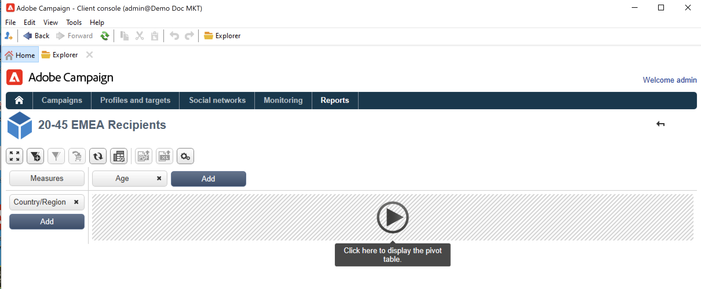

# Creare un cubo{#create-a-cube}

## Area di lavoro dei cubi {#cube-workspace}

Per accedere ai cubi, sfoglia fino a **[!UICONTROL Administration > Configuration > Cubes]** da Campaign explorer.

Con i cubi è possibile:

* Esporta i dati direttamente in un rapporto, progettato in **[!UICONTROL Reports]** della piattaforma Adobe Campaign.

   A questo scopo, crea un nuovo report e seleziona il cubo che desideri utilizzare.

   

   I cubi vengono visualizzati come modelli in base ai quali vengono creati i rapporti. Dopo aver scelto un modello, fai clic su **[!UICONTROL Create]** per configurare e visualizzare il nuovo rapporto.

   È possibile adattare le misure, modificare la modalità di visualizzazione o configurare la tabella, quindi visualizzare il rapporto utilizzando il pulsante principale.

   

* Fai riferimento a un cubo nel **[!UICONTROL Query]** casella di un rapporto per utilizzare i relativi indicatori, come mostrato di seguito:

   

* Inserire una tabella pivot basata su un cubo in qualsiasi pagina di un report. A questo scopo, fai riferimento al cubo da utilizzare nel **[!UICONTROL Data]** scheda della tabella pivot sulla pagina interessata.

   

   Per ulteriori informazioni, consulta [Esplorare i dati in un rapporto](cube-tables.md#explore-the-data-in-a-report).

>[!CAUTION]
>
>Per creare i cubi sono necessarie le autorizzazioni di amministratore.

## Creare un cubo{#cube-create}

Prima di iniziare a creare un rapporto cubo, identificare le dimensioni e le misure rilevanti e crearle nel cubo.

Per creare un cubo, eseguire i seguenti passaggi:

1. Selezionare la tabella di lavoro. [Ulteriori informazioni](#select-the-work-table).
1. Definisci le dimensioni. [Ulteriori informazioni](#define-dimensions).
1. Definisci le misure. [Ulteriori informazioni](#build-indicators).
1. Creare aggregati (facoltativo). [Ulteriori informazioni](customize-cubes.md#calculate-and-use-aggregates).

Nell’esempio seguente, scopri come creare rapidamente un cubo semplice in un rapporto per esportare le sue misure.

### Selezionare la tabella di lavoro {#select-the-work-table}

Per creare un cubo, segui i passaggi seguenti:

1. Fai clic sul pulsante **[!UICONTROL New]** sopra l&#39;elenco dei cubi.

   

1. Seleziona lo schema che contiene gli elementi da esplorare (noto anche come schema dei fatti). In questo esempio, seleziona il valore predefinito **Destinatario** tabella.
1. Fai clic su **[!UICONTROL Save]** per creare il cubo: viene aggiunto all’elenco dei cubi. Ora puoi utilizzare le schede per configurarlo.

1. Fai clic sul pulsante **[!UICONTROL Filter the source data...]** collegamento per applicare i calcoli di questo cubo ai dati del database.

   

### Definire le dimensioni {#define-dimensions}

Una volta creato il cubo, definirne le dimensioni. I Dimension sono gli assi di analisi definiti per ciascun cubo in base al relativo schema di fatti. Queste sono le dimensioni esaminate nell’analisi, ad esempio ora (anno, mese, data), una classificazione di prodotti o contratti (famiglia, riferimento, ecc.), un segmento di popolazione (per città, gruppo di età, stato, ecc.).

Per creare dimensioni, segui la procedura seguente:

1. Sfoglia il **[!UICONTROL Dimension]** scheda del cubo e fai clic sul pulsante **[!UICONTROL Add]** per creare una nuova dimensione.
1. In **[!UICONTROL Expression field]**, fai clic su **[!UICONTROL Edit expression]** per selezionare il campo contenente i dati interessati.

   

1. In questo esempio, stiamo selezionando il destinatario **Età**. Per questo campo è possibile definire il binding alle pagine di gruppo e semplificare la lettura delle informazioni. È consigliabile utilizzare il binding quando è probabile che siano presenti diversi valori separati.

Per eseguire questa operazione, controlla il **[!UICONTROL Enable binning]** opzione . [Ulteriori informazioni](customize-cubes.md#data-binning).

1. Aggiungi un **Data** digita la dimensione. In questo caso, vogliamo visualizzare le date di creazione del profilo del destinatario. A questo scopo, fai clic su **[!UICONTROL Add]** e seleziona la **[!UICONTROL Creation date]** nella tabella dei destinatari.
Puoi personalizzare la modalità di visualizzazione della data. A questo scopo, seleziona la gerarchia da utilizzare e i livelli da generare:

Nel nostro esempio, vogliamo visualizzare solo anni, mesi e giorni. Tieni presente che non puoi lavorare contemporaneamente con settimane e semestri/mesi: questi livelli non sono compatibili.

1. Crea un’altra dimensione per analizzare i dati relativi alla città del destinatario. A questo scopo, aggiungi una nuova dimensione e seleziona la città nella **[!UICONTROL Location]** nodo dello schema destinatario.

È possibile abilitare il binding per semplificare la lettura delle informazioni e collegare i valori a un’enumerazione.

Seleziona l’enumerazione dall’elenco a discesa. Tieni presente che questa enumerazione deve essere definita come **[!UICONTROL Reserved for binning]**.

Verranno visualizzati solo i valori nell’enumerazione. Gli altri saranno raggruppati sotto l&#39;etichetta definita nella **[!UICONTROL Label of the other values]** campo .

Per ulteriori informazioni al riguardo, consulta [questa sezione](customize-cubes.md#dynamically-manage-bins).

### Indicatori di creazione {#build-indicators}

Una volta definite le dimensioni, specifica una modalità di calcolo per i valori da visualizzare nelle celle.

A questo scopo, crea gli indicatori nel **[!UICONTROL Measures]** scheda . Crea tutte le misure quante le colonne da visualizzare nei report basati su questo cubo.

Per generare gli indicatori, segui i passaggi seguenti:

1. Sfoglia il **[!UICONTROL Measures]** e fai clic su **[!UICONTROL Add]** pulsante .
1. Selezionare il tipo di misura e la formula da applicare. In questo esempio, stiamo contando il numero di donne tra i destinatari. La nostra misura si basa sullo schema dei fatti e utilizza il **[!UICONTROL Count]** operatore.

   

   Utilizza la **[!UICONTROL Filter the measure data...]** link per selezionare solo donne. [Ulteriori informazioni](customize-cubes.md#define-measures).

   

1. Inserisci l’etichetta della misura e salvala.

   

1. Salva il cubo.

È ora possibile creare un report basato su questo cubo. [Ulteriori informazioni](cube-tables.md).
