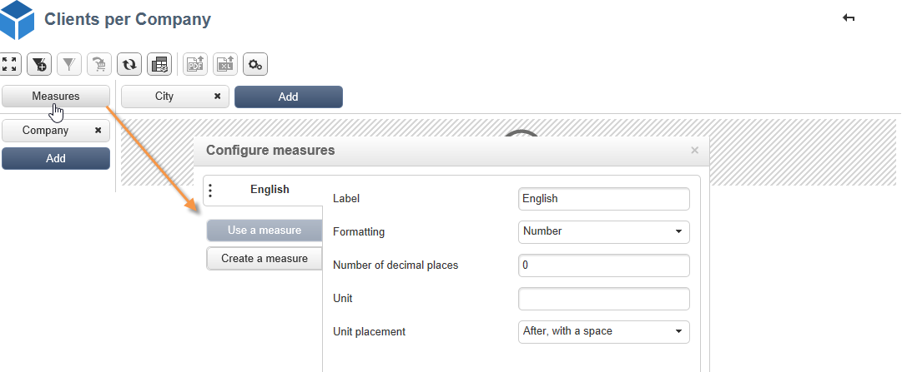
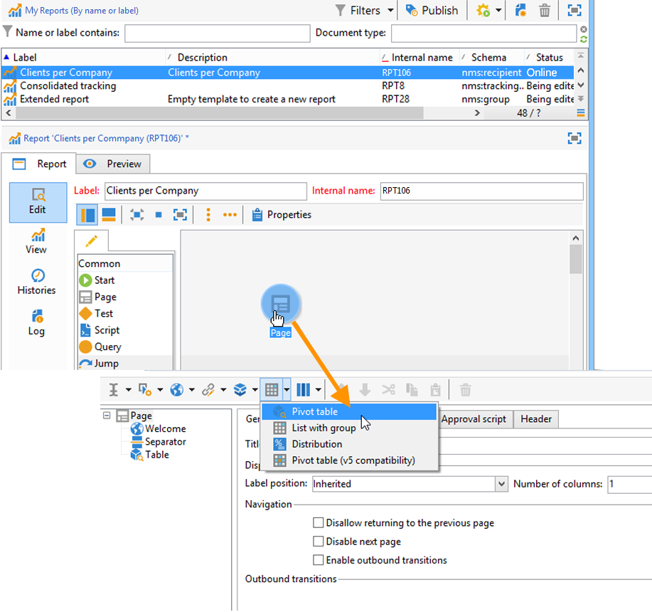

# Usare i cubi per esplorare i dati{#use-cubes-to-create-reports}

Utilizza i cubi per creare rapporti e per identificare e selezionare dati dal database. Puoi eseguire le seguenti azioni:

* Crea rapporti basati su cubi. [Ulteriori informazioni](#explore-the-data-in-a-report).
* Raccogli i dati nel database e raggruppali in elenchi, ad esempio per identificare e creare destinazioni e consegne. [Ulteriori informazioni](#build-a-target-population).
* Inserire una tabella pivot in un report, fare riferimento a un cubo esistente al suo interno. [Ulteriori informazioni](#insert-a-pivot-table-into-a-report).

## Esplorare i dati in un rapporto {#explore-the-data-in-a-report}

### Passaggio 1: creare un rapporto basato su un cubo {#step-1---create-a-report-based-on-a-cube}

Una volta configurato il cubo [&#128279;](cube-indicators.md), è possibile utilizzarlo come modello per la creazione di un nuovo report.

Per creare un report basato su un cubo esistente, effettuare le seguenti operazioni:

1. Fare clic sul pulsante **[!UICONTROL Create]** della scheda **[!UICONTROL Reports]** e selezionare il cubo appena creato.

   

1. Fare clic sul pulsante **[!UICONTROL Create]** per confermare: verrà visualizzata la pagina Configurazione e visualizzazione del report.

   Per impostazione predefinita, le prime due dimensioni disponibili sono offerte in linee e colonne, ma nella tabella non viene visualizzato alcun valore. Per generare la tabella, fai clic sull’icona principale:

   

1. Potete cambiare gli assi della quota, eliminarli, aggiungere nuove misure e così via. A questo scopo, utilizza le icone appropriate.

   

   Tali operazioni sono descritte di seguito.

### Passaggio 2: selezionare righe e colonne {#step-2---select-lines-and-columns}

La visualizzazione predefinita mostra le prime due dimensioni del cubo (età e città, in questo caso).

I pulsanti **[!UICONTROL Add]** su ciascun asse consentono di aggiungere dimensioni.

1. Selezionate le quote da visualizzare nelle linee e nelle colonne della tabella. A questo scopo, trascina e rilascia le dimensioni disponibili.
1. Seleziona dall’elenco le dimensioni da aggiungere alla tabella:
   

1. Selezionate quindi i parametri di questa quota.

   

   Questi parametri dipendono dal tipo di dati della dimensione selezionata.

   Ad esempio, per le date, possono essere disponibili diversi livelli. Per ulteriori informazioni, consulta [Misure di visualizzazione](customize-cubes.md#display-measures).

   In tal caso, sono disponibili le seguenti opzioni:

   

   Puoi effettuare le seguenti operazioni:

   * Espandi dati durante il caricamento: i valori vengono visualizzati per impostazione predefinita a ogni aggiornamento del rapporto (valore predefinito: no).
   * Visualizzare il totale alla fine della riga: quando i dati vengono visualizzati in colonne, un’opzione aggiuntiva consente di visualizzare il totale alla fine della riga: viene aggiunta una colonna alla tabella (valore predefinito: yes).
   * Applica un ordinamento: i valori della colonna possono essere ordinati in base al valore, all’etichetta o a una misura (valore predefinito: per valore).
   * Visualizza i valori in ordine crescente (a-z, 0-9) o decrescente (z-a, 9-0).
   * Modifica il numero di colonne da visualizzare al caricamento (per impostazione predefinita: 200).

1. Fare clic su **[!UICONTROL Ok]** per confermare: la dimensione viene aggiunta alle dimensioni esistenti.

   Il banner giallo sopra la tabella mostra che sono state apportate modifiche: fai clic sul pulsante **[!UICONTROL Save]** per salvarle.

   

### Passaggio 3: configurare le misure da visualizzare {#step-3---configure-the-measures-to-display}

Una volta definite le linee e le colonne, selezionare le misure da visualizzare. Per impostazione predefinita, viene visualizzata una sola misura.

Per aggiungere e configurare le misure, attieniti alla procedura seguente:

1. Fai clic sul pulsante **[!UICONTROL Measures]**.

   

1. Con il pulsante **[!UICONTROL Use a measure]**, seleziona una delle misure esistenti.

   

   Scegliere le informazioni da visualizzare e le opzioni di formattazione. L’elenco delle opzioni dipende dal tipo di misura.

   

   La configurazione generale delle misure è disponibile anche tramite l&#39;icona **[!UICONTROL Edit the configuration of the pivot table]** nell&#39;intestazione.

   

   È quindi possibile scegliere se visualizzare o meno le etichette delle misure. [Ulteriori informazioni](customize-cubes.md#configure-the-display).

1. Puoi creare nuove misure in base a quelle esistenti. A tale scopo, fare clic su **[!UICONTROL Create a measure]** e configurarlo.

   

   Sono disponibili i seguenti tipi di misure:

   * Combinazione di misure: questo tipo di misura consente di creare la nuova misura utilizzando quelle esistenti:

     Gli operatori disponibili sono: somma, differenza, moltiplicazione e tasso.

   * Proporzione: questo tipo di misura consente di calcolare il numero di record misurati per una determinata dimensione. Puoi calcolare la proporzionalità in base a una dimensione o a una dimensione secondaria.
   * Variante: questa misura consente di calcolare la variazione dei valori di un livello.
   * Deviazione standard: questo tipo di misura consente di calcolare le deviazioni all&#39;interno di ogni gruppo di celle rispetto alla media dei valori. Ad esempio, puoi confrontare il volume di acquisto per tutti i segmenti esistenti.

   Una volta creata, la misura viene aggiunta al rapporto.

   

   Dopo aver creato una misura, potete modificarla e modificarne la configurazione. A tale scopo, fare clic sul pulsante **[!UICONTROL Measures]**, quindi passare alla scheda della misura da modificare.

   Quindi fare clic su **[!UICONTROL Edit the dynamic measure]** per accedere al menu delle impostazioni.

## Creare una popolazione target {#build-a-target-population}

I rapporti generati utilizzando i cubi consentono di raccogliere i dati dalla tabella e salvarli in un elenco.

Per raggruppare una popolazione in un elenco, effettua le seguenti operazioni:

1. Fare clic sulle celle che contengono la popolazione da raccogliere per selezionarle, quindi fare clic sull&#39;icona **[!UICONTROL Add to cart]**.

   

   A questo scopo, quante volte è necessario raccogliere vari profili

1. Fare clic sul pulsante **[!UICONTROL Show cart]** per visualizzarne il contenuto prima di eseguire l&#39;esportazione.

   

1. Utilizza il pulsante **[!UICONTROL Export]** per raggruppare gli elementi nel carrello in un elenco.

   Immettere il nome dell&#39;elenco e selezionare il tipo di esportazione da eseguire.

   

   Fare clic su **[!UICONTROL Start]** per eseguire l&#39;esportazione.

1. Una volta completata l’esportazione, un messaggio conferma l’esecuzione e il numero di record elaborati.

   

   Puoi salvare il contenuto del carrello o svuotarlo.

   Il nuovo elenco è disponibile tramite la scheda **[!UICONTROL Profiles and targets]**.

   

## Inserire una tabella pivot in un report {#insert-a-pivot-table-into-a-report}

Per creare una tabella ed esplorare i dati in un cubo, effettuare le seguenti operazioni:

1. Crea un nuovo rapporto con una singola pagina e inserisci una tabella pivot al suo interno.

   

1. Nella scheda **[!UICONTROL Data]** della pagina, selezionare un cubo per elaborare le dimensioni in esso contenute e visualizzare le misure calcolate.

   

   Questo ti consente di creare il rapporto da visualizzare. Per ulteriori informazioni, consulta [Passaggio 2 - Selezionare righe e colonne](#step-2---select-lines-and-columns).
