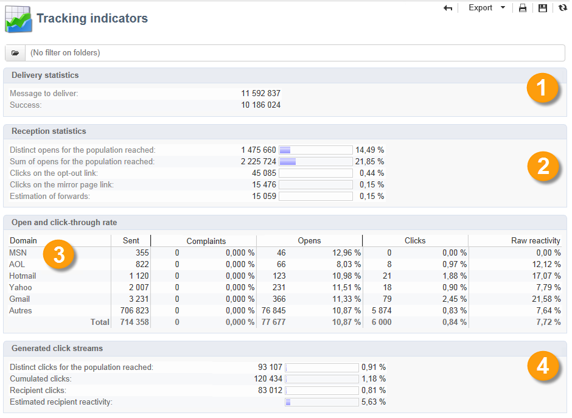

# Rapporti sulle consegne {#delivery-reports}

Puoi tenere traccia dell’esecuzione delle consegne tramite vari rapporti accessibili dalla panoramica della consegna.

Per accedere ai rapporti, effettua le seguenti operazioni:

1. Passare alla scheda **[!UICONTROL Campaigns]** e fare clic sul collegamento **[!UICONTROL Delivery]** per visualizzare l&#39;elenco delle consegne.
1. Fai clic sul nome della consegna a cui desideri accedere.
1. Selezionare la scheda **[!UICONTROL Summary]** e fare clic sul collegamento **[!UICONTROL Reports]** per accedere ai report specifici della consegna.

   

   Per impostazione predefinita, sono disponibili i seguenti rapporti:

   * **[!UICONTROL Delivery throughput]**
   * **[!UICONTROL Sharing to social networks]**
   * **[!UICONTROL Statistics on sharing activities]**
   * **[!UICONTROL Hot clicks]**
   * **[!UICONTROL Tracking statistics]**
   * **[!UICONTROL URLs and click streams]**
   * **[!UICONTROL Tracking indicators]**
   * **[!UICONTROL Non-deliverables and bounces]**
   * **[!UICONTROL User activities]**
   * **[!UICONTROL Delivery summary]**
   * **[!UICONTROL Subscription tracking]**
   * **[!UICONTROL Delivery statistics]**
   * **[!UICONTROL Breakdown of opens]**

## Indicatori di tracciamento {#tracking-indicators}

Questo rapporto combina gli indicatori chiave per monitorare il comportamento dei destinatari al momento della ricezione della consegna. Consente di accedere alle statistiche di consegna e ricezione, ai tassi di apertura e click-through, ai flussi di clic generati, nonché di condividere attività sui social network.

>[!NOTE]
>
>I valori calcolati in base all’apertura dei messaggi sono sempre stime, a causa del margine di errore collegato alle e-mail in formato testo. Gli indicatori **[!UICONTROL Distinct opens/Sum of opens for the population reached]** tengono conto di questo margine di errore. [Ulteriori informazioni](metrics-calculation.md#tracking-opens-).

**[!UICONTROL 1. Delivery statistics]**

* **[!UICONTROL Messages to deliver]**: numero totale di messaggi da consegnare dopo l&#39;analisi della consegna.
* **[!UICONTROL Success]**: numero di messaggi elaborati correttamente.

**[!UICONTROL 2. Reception statistics]**

>[!NOTE]
>
>Le percentuali correlate vengono calcolate in base al numero di messaggi inoltrati correttamente.

* **[!UICONTROL Distinct opens for the population reached]**: stima del numero di destinatari di destinazione che hanno aperto un messaggio almeno una volta. I clic sugli URL tracciati vengono presi in considerazione, in quanto è necessario aprire le e-mail per fare clic su un collegamento.
* **[!UICONTROL Sum of opens for the population reached]**: stima del numero totale di aperture da parte dei destinatari di destinazione.
* **[!UICONTROL Clicks on opt-out link]**: numero di clic sul collegamento di annullamento dell&#39;abbonamento.
* **[!UICONTROL Clicks on the mirror page link]**: numero di clic sul collegamento alla [pagina mirror](../send/mirror-page.md). Per poter essere preso in considerazione, il collegamento deve essere definito come tale nella procedura guidata di consegna (URL tracciati).
* **[!UICONTROL Estimation of forwards]**: stima del numero di e-mail inoltrate dai destinatari interessati. Questo valore viene calcolato sottraendo il numero di persone distinte e il numero di destinatari distinti che hanno fatto clic nell’e-mail.

  >[!NOTE]
  >
  >Per ulteriori informazioni sulla differenza tra persone distinte e destinatari di destinazione, consulta [Persone o destinatari di destinazione](metrics-calculation.md#targeted-persons---recipients).

**[!UICONTROL 3. Open and click-through rate]**

Questa tabella di valori mostra il raggruppamento di consegne, aperture, clic e reattività non elaborata per dominio Internet. Sono utilizzati i seguenti indicatori:

* **[!UICONTROL Sent]**: numero totale di messaggi inviati in questo dominio.
* **[!UICONTROL Complaints]**: numero di messaggi per questo dominio segnalati come non desiderati dal destinatario. La frequenza viene calcolata in base al numero totale di messaggi inviati su questo dominio.
* **[!UICONTROL Opens]**: numero di destinatari di destinazione distinti per questo dominio che hanno aperto un messaggio almeno una volta. La frequenza viene calcolata in base al numero totale di messaggi inviati su questo dominio.
* **[!UICONTROL Clicks]**: numero di destinatari di destinazione distinti che hanno fatto clic almeno una volta nella stessa consegna. La frequenza viene calcolata in base al numero totale di messaggi inviati su questo dominio
* **[!UICONTROL Raw reactivity]**: percentuale del numero di destinatari che hanno fatto clic su una consegna almeno una volta rispetto al numero di destinatari che hanno aperto una consegna almeno una volta.

>[!NOTE]
>
>I nomi di dominio visualizzati in questo report sono definiti nell&#39;elenco dettagliato utilizzato a livello di cubo. Per modificare, aggiungere o rimuovere i domini predefiniti, modificare l&#39;elenco dettagliato **[!UICONTROL Domains]** e modificare i valori e gli alias. La categoria **[!UICONTROL Others]** include nomi di dominio che non appartengono ad alcun valore dell&#39;elenco dettagliato.
>
>Scopri come accedere e configurare le enumerazioni in [questa pagina](../config/enumerations.md).

**[!UICONTROL 4. Generated click streams]**

>[!NOTE]
>
>Le percentuali correlate vengono calcolate in base al numero di messaggi inoltrati correttamente.

* **[!UICONTROL Distinct clicks for the population reached]**: numero di persone distinte che hanno fatto clic almeno una volta in una consegna.
* **[!UICONTROL Cumulated clicks]**: numero totale di clic dai destinatari di destinazione, esclusi i collegamenti di annullamento dell&#39;abbonamento e le pagine mirror.
* **[!UICONTROL Recipient clicks]**: numero di destinatari di destinazione distinti che hanno fatto clic almeno una volta nella stessa consegna.
* **[!UICONTROL Estimated recipient reactivity]**: rapporto tra il numero di destinatari che hanno fatto clic almeno una volta in una consegna e il numero stimato di destinatari che hanno aperto una consegna almeno una volta. I clic sui collegamenti di rinuncia e pagina speculare non vengono presi in considerazione.
<!--
**[!UICONTROL 5. Web tracking]**

* **[!UICONTROL Visited pages]**: Number of web pages visited following message reception.
* **[!UICONTROL Transactions]**: Number of purchases following message reception.
* **[!UICONTROL Total amount]**: Total amount of purchases following message reception. 
* **[!UICONTROL Average transaction amount]**: Average purchase made by distinct delivery recipients. 
* **[!UICONTROL Articles]**: Number of articles purchased by the delivery recipients. 
* **[!UICONTROL Average count of articles per transaction]**: Average number of items per purchase made by distinct recipients.
* **[!UICONTROL Average amount per message]**: Average amount of purchases generated per message.

  >[!NOTE]
  >
  >In order for a visited page, transaction, amount or article to be taken into account, a webtracking tag must be inserted into the matching web page. Webtracking configuration is presented in [this section](../../configuration/using/about-web-tracking.md).

**[!UICONTROL 6. Sharing activities to email and social networks]**

This section shows the number of messages shared on each social network. For more on this, refer to [Sharing to social networks](../../reporting/using/global-reports.md#sharing-to-social-networks).

## URLs and click streams {#urls-and-click-streams}

This report shows the list of pages visited following a delivery. 

You can configure the contents of this report by selecting: the score chart to be displayed, the time filter (since the action launch, over the first 6 hours following launch, etc.) and the data display mode (by label, by URL, by category. Click **[!UICONTROL Refresh]** to confirm your selection.

The following rates are displayed in the upper section of the report:

* **[!UICONTROL Reactivity]**: Ratio of the number of targeted recipients having clicked in a delivery, in relation to the estimated number of targeted recipients having opened a delivery. Clicks on the opt-out link and on the mirror page are not taken into account.

  >[!NOTE]
  >
  >For more information on tracking opens, refer to [this section](metrics-calculation.md#tracking-opens-).

* **[!UICONTROL Distinct clicks]**: Number of distinct people having clicked at least once (excluding unsubscription link and mirror page) in a delivery. The rate displayed is calculated based on the number of messages delivered successfully. 
* **[!UICONTROL Cumulated clicks]**: Total number of clicks by targeted recipients (excluding unsubscription link and mirror page). The rate displayed is calculated based on the number of messages forwarded successfully.

**[!UICONTROL Platform average]**: This average rate, displayed under each rate (reactivity, distinct clicks, and cumulated clicks), is calculated for deliveries sent over the previous six months. Only deliveries with the same typology and on the same channel are taken into account. Proofs are excluded.

The central table provides the following information:

* **[!UICONTROL Clicks]**: Number of cumulated clicks, per link. 
* **[!UICONTROL Clicks (in %)]**: Breakdown of the number of clicks per link, in relation to the total number of cumulated clicks.

**[!UICONTROL Breakdown of clicks in time]**

This chart shows the breakdown of cumulated clicks per day.
-->

## Riepilogo della consegna {#delivery-summary}

Questo rapporto fornisce tutte le informazioni principali sulla consegna.

**[!UICONTROL Target population]**

Questa sezione presenta due indicatori:

* **[!UICONTROL Initial population]**: numero totale di destinatari interessati dalla consegna.
* inserire nell&#39;elenco Bloccati **[!UICONTROL Messages rejected by the rule]**: numero di indirizzi ignorati durante l&#39;analisi durante l&#39;applicazione delle regole di tipologia: indirizzo mancante, messo in quarantena, in fase di, ecc. <!--For more information on typology rules, refer to this [page](../../delivery/using/steps-validating-the-delivery.md#validation-process-with-typologies).-->

**[!UICONTROL Causes of exclusion]**

Il grafico centrale mostra il raggruppamento per regola dei messaggi rifiutati durante l’analisi.

**[!UICONTROL Delivery statistics]**

Questa sezione include i seguenti indicatori:

* **[!UICONTROL Messages to be delivered]**: numero totale di messaggi da consegnare dopo l&#39;analisi della consegna.
* **[!UICONTROL Success]**: numero di messaggi elaborati correttamente. Il tasso associato è il rapporto con il numero di messaggi da consegnare.
* **[!UICONTROL Errors]**: numero totale di errori accumulati durante le consegne ed elaborazione automatica del rebound. Il tasso associato è il rapporto con il numero di messaggi da consegnare.
* **[!UICONTROL New quarantines]**: numero di indirizzi messi in quarantena a seguito di una consegna non riuscita (utente sconosciuto, dominio non valido). Il tasso associato è il rapporto con il numero di messaggi da consegnare.

## Hot click {#hot-clicks}

Questo rapporto mostra il contenuto del messaggio (HTML e/o testo) e la percentuale di clic per ogni collegamento. I collegamenti presenti nei blocchi di personalizzazione per l’annullamento dell’iscrizione, per le pagine mirror e per le offerte vengono presi in considerazione nei clic totali cumulati, ma non vengono visualizzati nel rapporto.

>[!NOTE]
>
>Se la consegna contiene offerte (interazione), nella parte superiore del rapporto viene visualizzata una casella che mostra la percentuale di clic sulle offerte.

## Statistiche di tracciamento {#tracking-statistics}

Questo rapporto fornisce statistiche su aperture, clic e transazioni.

Ti consente di monitorare l’impatto di marketing della consegna. Puoi configurare la modalità di visualizzazione dei valori modificando la scala cronologica (visualizzazione a 1 ora, a 3 ore o a 24 ore, ecc.). Fai clic su **[!UICONTROL Refresh]** per confermare la selezione.

Questo rapporto fornisce una tabella di valori e un grafico Pareto che mostra il tempo necessario affinché la consegna raggiunga la massima efficienza. Sono utilizzati i seguenti indicatori:

* **[!UICONTROL Opens]**: stima del tempo necessario per raggiungere una percentuale del numero totale di messaggi aperti. Le e-mail in formato testo non vengono prese in considerazione. [Ulteriori informazioni](metrics-calculation.md#tracking-opens-).
* **[!UICONTROL Clicks]**: stima del tempo necessario per raggiungere una percentuale del numero totale di clic registrati. I clic sul collegamento di rinuncia e sulla pagina speculare non vengono presi in considerazione.
<!--
* **[!UICONTROL Transactions]**: Time required to achieve a percentage of the total number of transactions following message reception. In order for a transaction to be taken into account, a transaction type webtracking tag must be inserted into the matching web page. Webtracking configuration is presented in [this section](../../configuration/using/about-web-tracking.md).
-->

## Rapporti cumulativi {#cumulated-reports}

Puoi visualizzare i rapporti cumulativi sulle consegne. A questo scopo, seleziona le consegne da confrontare per ottenere l’elenco dei rapporti per queste consegne.

Per selezionare consegne non adiacenti dall’elenco, tieni premuto il tasto CTRL durante la selezione.

Per selezionare le consegne salvate in un&#39;altra cartella, fare clic sull&#39;icona **[!UICONTROL Display sub-levels]**, accessibile nella barra degli strumenti. Vengono quindi visualizzati nello stesso elenco.
