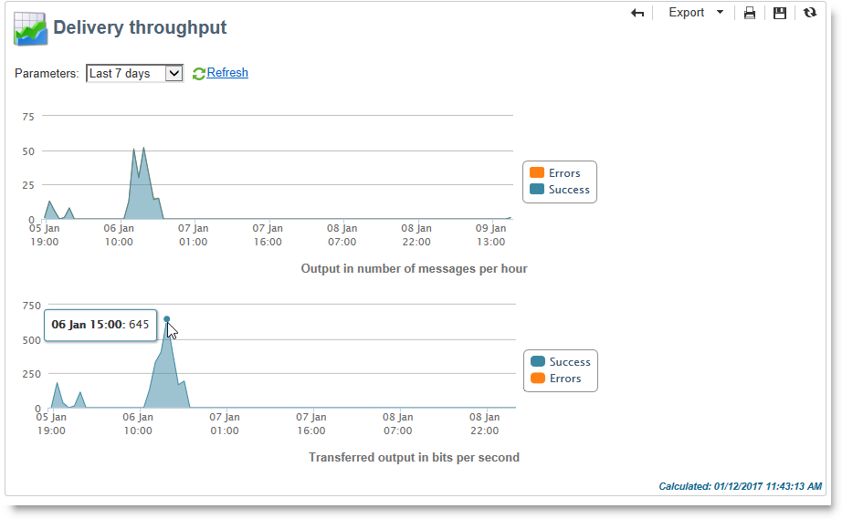

# Rapporti globali {#global-reports}

Tali relazioni riguardano l&#39;attività dei dati nell&#39;intero database. Per visualizzare il dashboard dei rapporti, passa alla pagina **[!UICONTROL Reports]** scheda .

Per visualizzare i rapporti, fare clic sui relativi nomi. Per impostazione predefinita sono disponibili i seguenti rapporti:

>[!NOTE]
>
>Questa sezione mostra solo i rapporti collegati alle consegne.

* **[!UICONTROL Delivery throughput]** : fare riferimento a [Velocità effettiva di consegna](#delivery-throughput).
* **[!UICONTROL Browsers]** : fare riferimento a [Browser](#browsers).
* **[!UICONTROL Sharing to social networks]** : fare riferimento a [Condivisione sui social network](#sharing-to-social-networks).
* **[!UICONTROL Statistics on sharing activities]** : fare riferimento a [Statistiche sulle attività di condivisione](#statistics-on-sharing-activities).
* **[!UICONTROL Operating systems]** : fare riferimento a [Sistemi operativi](#operating-systems).
* **[!UICONTROL URLs and click streams]** : fare riferimento a [URL e flussi di clic](delivery-reports.md#urls-and-click-streams).
* **[!UICONTROL Tracking indicators]** : fare riferimento a [Indicatori di tracciamento](delivery-reports.md#tracking-indicators).
* **[!UICONTROL Non-deliverables and bounces]** : fare riferimento a [Non recapitati e mancati recapiti](#non-deliverables-and-bounces).
* **[!UICONTROL User activities]** : fare riferimento a [Attività utente](#user-activities).
* **[!UICONTROL Subscription tracking]** : fare riferimento a [Tracciamento sottoscrizione](#subscription-tracking).
* **[!UICONTROL Delivery summary]** : fare riferimento a [Riepilogo consegne](delivery-reports.md#delivery-summary).
* **[!UICONTROL Delivery statistics]** : fare riferimento a [Statistiche di consegna](#delivery-statistics).
* **[!UICONTROL Breakdown of opens]** : fare riferimento a [Suddivisione delle aperture](#breakdown-of-opens).

## Velocità effettiva di consegna {#delivery-throughput}

Questo rapporto contiene informazioni sulla velocità effettiva di consegna dell’intera piattaforma per un determinato periodo di tempo. I criteri utilizzati per misurare la velocità con cui vengono consegnati i messaggi comprendono il numero di messaggi inviati all’ora e le dimensioni dei messaggi (in bit al secondo). Nell’esempio seguente, il primo grafico mostra le consegne riuscite in blu e il numero di consegne con errori in arancione.

Puoi configurare i valori visualizzati modificando la scala cronologica: Vista a 1 ora, visualizzazione a 3 ore, visualizzazione a 24 ore, ecc. Fai clic su **[!UICONTROL Refresh]** per confermare la selezione.

>[!NOTE]
>
>Puoi anche monitorare il numero di consegne inviate all’ora utilizzando la variabile [Pannello di controllo Campaign](https://experienceleague.adobe.com/docs/control-panel/using/sftp-management/sftp-storage-management.html).
>
>Il Pannello di controllo è accessibile a tutti gli utenti amministratori. I passaggi per concedere a un utente l’accesso come amministratore sono descritti in[questa pagina](https://experienceleague.adobe.com/docs/control-panel/using/discover-control-panel/managing-permissions.html?lang=it#discover-control-panel).

## Attività degli utenti {#user-activities}

Questo rapporto mostra il raggruppamento di aperture, clic e transazioni per mezz&#39;ora, ora o giorno, sotto forma di grafico.

Sono disponibili le seguenti opzioni:

* **[!UICONTROL Opens]** : Numero totale di messaggi aperti. Le e-mail in formato testo non vengono prese in considerazione. [Ulteriori informazioni](metrics-calculation.md#tracking-opens-).
* **[!UICONTROL Clicks]** : Numero totale di clic sui collegamenti nelle consegne. I clic sui collegamenti di annullamento all’abbonamento e sulle pagine mirror non vengono presi in considerazione.
<!--
* **[!UICONTROL Transactions]** : Total number of transactions after a message is received. In order for a transaction to be taken into account, a transaction type webtracking tag must be inserted into the matching web page. Webtracking configuration is presented in [this section](../../configuration/using/about-web-tracking.md).
-->

## Messaggi non recapitati e non trasferibili {#non-deliverables-and-bounces}

Questo rapporto mostra il raggruppamento dei non-deliverable e un raggruppamento dei mancati recapiti per dominio Internet.

La **[!UICONTROL Number of messages processed]** rappresenta il numero totale di messaggi elaborati dal server di consegna. Questo valore è inferiore al numero di messaggi da consegnare quando alcune consegne sono state interrotte o messe in pausa (prima di essere elaborate dal server).

**[!UICONTROL Breakdown of errors by type]**

>[!NOTE]
>
>Gli errori mostrati in questo rapporto attivano il processo di quarantena. Per ulteriori informazioni sulla gestione della quarantena, consulta [Gestione della quarantena](../send/quarantines.md).

La prima sezione di questo rapporto mostra la suddivisione dei non risultati finali sotto forma di tabella di valori e di grafico.

Per ogni tipo di errore:

* il numero di messaggi di errore di questo tipo,
* la percentuale di messaggi con errori di questo tipo rispetto al numero totale di messaggi con errori,
* la percentuale di messaggi di errore di questo tipo rispetto al numero totale di messaggi elaborati.

Vengono utilizzati i seguenti indicatori:

* **[!UICONTROL User unknown]** : Tipo di errore generato durante la consegna per indicare che l’indirizzo e-mail non è valido.
* **[!UICONTROL Invalid domain]** : Tipo di errore generato durante l’invio di una consegna per indicare che il dominio dell’indirizzo e-mail è errato o non esiste.
* **[!UICONTROL Inbox full]** : Tipo di errore generato dopo cinque tentativi di consegna per indicare che la casella in entrata dei destinatari contiene troppi messaggi.
* **[!UICONTROL Account disabled]** : Tipo di errore generato durante l’invio di una consegna per indicare che l’indirizzo non esiste più.
* **[!UICONTROL Rejected]** : Tipo di errore generato quando un indirizzo viene rifiutato dall&#39;IAP (Internet Access Provider), ad esempio in seguito all&#39;applicazione di una regola di sicurezza (software anti-spam).
* **[!UICONTROL Unreachable]** : Tipo di errore che si verifica nella stringa di distribuzione del messaggio: incidente sul relè SMTP, dominio temporaneamente irraggiungibile, ecc
* **[!UICONTROL Not connected]** : Tipo di errore per indicare che il telefono cellulare dei destinatari è spento o disconnesso dalla rete al momento dell&#39;invio.

   >[!NOTE]
   >
   >Questo indicatore si riferisce alle consegne su [canali mobili](../send/send.md) solo.

   Per aprire ciascuna riga della tabella dei valori, fai clic sul pulsante `[+]` simbolo. Per ogni tipo di errore, puoi visualizzare la suddivisione dei messaggi di errore per dominio.

**[!UICONTROL Breakdown of errors per domain]**

La seconda sezione del rapporto mostra la suddivisione degli errori per dominio Internet sotto forma di tabella di valori e grafico.

Per ogni nome di dominio, abbiamo:

* il numero di messaggi con errori per questo dominio,
* la percentuale di messaggi con errori per questo dominio rispetto al numero totale di messaggi elaborati per questo dominio,
* la percentuale di messaggi di errore per questo dominio rispetto al numero totale di messaggi di errore.

Per aprire ciascuna riga della tabella dei valori, fai clic sul pulsante [+] simbolo. Per ogni tipo di dominio, puoi visualizzare la suddivisione dei messaggi di errore in base al tipo di errore.

>[!NOTE]
>
>I nomi di dominio visualizzati in questo report vengono definiti a livello di cubo. Per modificare questi valori, modifica il **[!UICONTROL Delivery logs (broadlogrcp)]** cubo. Per ulteriori informazioni al riguardo, consulta [questa sezione](gs-cubes.md). La **[!UICONTROL Others]** La categoria include i nomi di dominio che non appartengono a una classe specifica.

## Browser {#browsers}

Questo rapporto mostra la suddivisione dei browser Internet utilizzati dai destinatari della consegna per il periodo in questione.

>[!NOTE]
>
>I valori indicati nel rapporto sono stime: verranno presi in considerazione solo i destinatari che hanno fatto clic su in una consegna.

**Statistiche globali**

Le statistiche globali sull&#39;uso del browser sono presentate sotto forma di tabella di valori e di grafico.

Vengono utilizzati i seguenti indicatori:

* **[!UICONTROL Visitors]** : Numero totale di destinatari interessati (per browser Internet) e che hanno fatto clic su una consegna almeno una volta.
* **[!UICONTROL Pages viewed]** : Numero totale di clic sui collegamenti in una consegna (per browser Internet) per tutte le consegne.
* **[!UICONTROL Usage rate]** : Questo tasso rappresenta la suddivisione dei visitatori (per browser Internet) in relazione al numero totale di visitatori.

**Statistiche per browser**

Nella tabella dei valori statistici globali, puoi fare clic sul nome di ciascun browser per visualizzarne le statistiche di utilizzo.

Le statistiche sono presentate sotto forma di curva, grafico e tabella dei valori.

La **[!UICONTROL History]** curva rappresenta il tasso di frequenza di questo browser al giorno. Il tasso è il rapporto tra il numero di visitatori al giorno (su questo browser) e il numero di visitatori misurato al giorno con il tasso di presenza più alto.

La **[!UICONTROL Breakdown per version]** grafico rappresenta la suddivisione dei visitatori per versione rispetto al numero totale di visitatori (in questo browser).

La tabella dei valori utilizza i seguenti indicatori:

* **[!UICONTROL Global rate]** : Questo tasso rappresenta la suddivisione dei visitatori per versione rispetto al numero totale di visitatori (su tutti i browser).
* **[!UICONTROL Relative rate]** : Questo tasso rappresenta la suddivisione dei visitatori per versione rispetto al numero totale di visitatori (in questo browser).

<!--
### Sharing to social networks {#sharing-to-social-networks}

Viral marketing lets delivery recipients share information with their contact network: they can add a link to their profile (Facebook, Twitter, etc.) or send a message to a friend. Each share and each access to shared information is tracked within the delivery. For more information on viral marketing, refer to [this section](../../delivery/using/viral-and-social-marketing.md).

This report shows the breakdown of shared and opened messages per social network (Facebook, Twitter, etc.) and/or per email.

**[!UICONTROL Email delivery statistics]**

In the email delivery statistics, two values are displayed:

* **[!UICONTROL Number of messages to be delivered]** : Total number of messages processed during delivery analysis.
* **[!UICONTROL Number of successful deliveries]** : Number of messages processed successfully.

**[!UICONTROL Sharing activities and mail open statistics]**

The central table shows the statistics on email shares and opens.

In the **[!UICONTROL Shares]** column, we have the following indicators:

* **[!UICONTROL No. of sharing activities]** : Total number of messages shared on each social network. This value equals the total number of clicks on the icon of the matching **[!UICONTROL Links for sharing to social networks]** personalization block.
* **[!UICONTROL Breakdown]** : This rate represents the breakdown of shares per social network, in relation to the total number of shares.
* **[!UICONTROL Sharing rate]** : This rate represents the breakdown of shares per social network, in relation to the number of messages to be delivered.

In the **[!UICONTROL Opens]** column, we have the following indicators:

* **[!UICONTROL No. of opens]** : Total number of messages opened by people whom the message was forwarded to (via the **[!UICONTROL Links for sharing to social networks]** personalization block). This value equals the number of times the mirror page was displayed. Opens by delivery recipients are not taken into account.
* **[!UICONTROL Breakdown]** : This rate represents the breakdown of opens per social network, in relation to the total number of opens.
* **[!UICONTROL Rate of opens]** : This rate represents the breakdown of opens per social network, in relation to the total number of shares.

**[!UICONTROL Breakdown of sharing activities and opens]**

This section includes two charts which represent the breakdown of sharing activities and opens per social network.

## Statistics on sharing activities {#statistics-on-sharing-activities}

This report shows the evolution of shares to social media in time.

For more information on viral marketing, refer to [this section](../../delivery/using/viral-and-social-marketing.md).

Statistics are presented in the form of a table of values and a chart.

The following indicators are used:

* **[!UICONTROL New contacts]** : Number of new subscriptions following the reception of a message shared via email. This value matches the number of people who received a message shared via email, clicked the **[!UICONTROL Subscription link]** and filled in the subscription form. 
* **[!UICONTROL Opens]** : Total number of messages opened by people whom the message was transferred to (via the **[!UICONTROL Link for sharing to social networks]** personalization block). This value equals the number of times the mirror page was displayed. Opens by delivery recipients are not taken into account.
* **[!UICONTROL Sharing activities]** : Total number of messages shared via social networks. This value matches the total number of clicks on the icon of the **[!UICONTROL Links for sharing to social networks]** personalization block.
-->

## Sistemi operativi {#operating-systems}

Il rapporto mostra la ripartizione dei sistemi operativi utilizzati dai destinatari della consegna per il periodo in questione.

>[!NOTE]
>
>I valori indicati nel rapporto sono stime: verranno presi in considerazione solo i destinatari che hanno fatto clic su in una consegna.

**Statistiche globali**

Le statistiche di utilizzo globale dei sistemi operativi sono presentate sotto forma di tabella dei valori e di grafico.

Vengono utilizzati i seguenti indicatori:

* **[!UICONTROL Visitors]** : Media giornaliera del numero totale di destinatari (per sistema operativo) che hanno fatto clic su una consegna almeno una volta.
* **[!UICONTROL Pages viewed]** : Media giornaliera del numero totale di clic sui collegamenti di consegna (per sistema operativo) per tutte le consegne.
* **[!UICONTROL Rate of use]** : Questo tasso rappresenta la suddivisione dei visitatori (per sistema operativo) in relazione al numero totale di visitatori.

**Statistiche per sistema operativo**

Nella tabella dei valori delle statistiche globali, fare clic sul nome di ciascun sistema operativo per visualizzare le statistiche per sistema operativo.

Le statistiche sono presentate sotto forma di curva, grafico e tabella dei valori.

La **[!UICONTROL History]** curva rappresenta il tasso di utilizzo di questo sistema operativo al giorno. Questo tasso è il rapporto tra il numero di visitatori al giorno (su questo sistema operativo) e il numero di visitatori misurato il giorno con la maggiore frequenza.

La **[!UICONTROL Breakdown by version]** grafico rappresenta la suddivisione dei visitatori per versione in relazione al numero totale di visitatori in questo sistema operativo.

La tabella dei valori utilizza i seguenti indicatori:

* **[!UICONTROL Global rate]** : Questo tasso rappresenta la suddivisione dei visitatori (per versione) in relazione al numero totale di visitatori in tutti i sistemi operativi.
* **[!UICONTROL Relative rate]** : Questo tasso rappresenta la suddivisione dei visitatori (per versione) in relazione al numero totale di visitatori per questo sistema operativo.

## Tracciamento sottoscrizione {#subscription-tracking}

Questo rapporto ti consente di monitorare gli abbonamenti ai servizi di informazione. Mostra abbonamenti e annullamenti degli abbonamenti.

Può essere visualizzato per un abbonamento facendo clic sul pulsante **[!UICONTROL Profiles and targets > Services and subscriptions]** nodo della home page o dell&#39;explorer. Seleziona l’abbonamento desiderato, quindi fai clic sul pulsante **[!UICONTROL Reports]** scheda . La **[!UICONTROL Subscriptions tracking]** il rapporto è disponibile per impostazione predefinita. Ti consente di visualizzare le tendenze di abbonamento e annullamento dell’abbonamento e il tasso di fedeltà in un periodo. Puoi configurare la rappresentazione di questi dati tramite l’elenco a discesa . Fai clic su **[!UICONTROL Refresh]** per convalidare la configurazione selezionata.

Per ulteriori informazioni, consulta [questa pagina](../start/subscriptions.md).

La **[!UICONTROL Number subscribed to date]** rappresenta il numero totale di persone attualmente abbonate.

**[!UICONTROL Overall evolution of subscriptions]**

La tabella dei valori utilizza i seguenti indicatori:

* **[!UICONTROL Subscribers]** : Numero totale di abbonati per il periodo in questione.
* **[!UICONTROL Subscriptions]** : Numero di abbonamenti per il periodo in questione.
* **[!UICONTROL Unsubscriptions]** : Numero di annullamenti per il periodo in questione.
* **[!UICONTROL Evolution]** : Numero di annullamenti di sottoscrizioni meno il numero di sottoscrizioni. Il tasso viene calcolato in base al numero totale di abbonati.
* **[!UICONTROL Loyalty]** : Tasso di fedeltà degli abbonati per il periodo in questione.

**[!UICONTROL Subscription evolution curves]**

Questo grafico mostra l’evoluzione degli abbonamenti e degli annullamenti degli abbonamenti per il periodo in questione.

## Statistiche consegna {#delivery-statistics}

Questo rapporto mostra la suddivisione per dominio Internet di tutti i messaggi elaborati e inviati, di mancati recapiti rigidi e morbidi, aperture, clic e annullamenti delle sottoscrizioni.

Vengono utilizzati i seguenti indicatori:

* **[!UICONTROL Emails processed]** : Numero totale di messaggi elaborati dal server di consegna.
* **[!UICONTROL Delivered]** : percentuale del numero di messaggi elaborati correttamente rispetto al numero totale di messaggi elaborati.
* **[!UICONTROL Hard bounces]** : percentuale del numero di messaggi non recapitati &quot;hard&quot; rispetto al numero totale di messaggi elaborati.
* **[!UICONTROL Soft bounces]** : percentuale del numero di messaggi non recapitati &quot;soft&quot; rispetto al numero totale di messaggi elaborati.

   >[!NOTE]
   >
   >Per ulteriori informazioni sui rimbalzi rigidi e morbidi, consulta [questa pagina](../send/quarantines.md).

* **[!UICONTROL Opens]** : percentuale del numero di destinatari che hanno aperto un messaggio almeno una volta rispetto al numero di messaggi elaborati correttamente.
* **[!UICONTROL Clicks]** : percentuale del numero di persone che hanno fatto clic in una consegna almeno una volta rispetto al numero di messaggi elaborati correttamente.
* **[!UICONTROL Unsubscription]** : percentuale del numero di clic su un collegamento di annullamento dell’abbonamento rispetto al numero di messaggi elaborati correttamente.

## Breakdown delle aperture {#breakdown-of-opens}

Questo rapporto mostra la suddivisione delle aperture per sistema operativo, dispositivo e browser per il periodo in questione. Per ogni categoria vengono utilizzati due grafici. Il primo visualizza le statistiche relative all’apertura su un computer e dispositivi mobili. Il secondo visualizza le statistiche relative solo all’apertura su dispositivi mobili.

Il numero di aperture corrisponde al numero totale di messaggi aperti. Le e-mail in formato testo non vengono conteggiate. Per ulteriori informazioni sull&#39;apertura del tracciamento, consulta [questa sezione](metrics-calculation.md#tracking-opens-).

>[!NOTE]
>
>I nomi dei browser e dei sistemi operativi costituiscono parte delle informazioni inviate dall&#39;agente utente del browser a cui il messaggio è stato aperto. Adobe Campaign deduce il tipo di dispositivo utilizzando le relative informazioni sul dispositivo.
