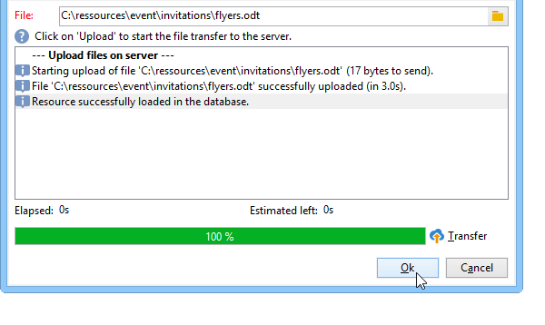

# Allegare file a un’e-mail{#attaching-files}

## Informazioni sugli allegati e-mail {#about-email-attachments}

Puoi allegare uno o più file a una consegna e-mail.

>[!NOTE]
>
>Per evitare problemi di prestazioni, si consiglia di non includere più di un allegato per e-mail. La soglia consigliata può essere configurata dall’elenco delle opzioni di Campaign. Consulta la [documentazione di Campaign Classic](https://experienceleague.adobe.com/docs/campaign-classic/using/installing-campaign-classic/appendices/configuring-campaign-options.html?lang=it#delivery).

Esistono due casi possibili:

* Seleziona un file e allegalo alla consegna così com’è.
* Personalizza il contenuto dell’allegato per ciascun destinatario. In questo caso, è necessario creare un **allegato calcolato**: il nome dell&#39;allegato viene calcolato al momento della consegna per ogni messaggio in base al destinatario. Il contenuto può anche essere personalizzato e convertito in formato PDF al momento della consegna, se disponi dell&#39;opzione **Stampa digitale variabile**.

>[!NOTE]
>
>Questo tipo di configurazione viene generalmente eseguito nei modelli di consegna. Per ulteriori informazioni, consulta questa [pagina](../send/create-templates.md).

## Guardrail {#attachments-guardrails}

Per evitare problemi di prestazioni, le immagini incluse nelle e-mail non possono superare i 100 KB. Questo limite, impostato per impostazione predefinita, può essere modificato dall&#39;opzione `NmsDelivery_MaxDownloadedImageSize`. Tuttavia, Adobe consiglia vivamente di evitare le immagini di grandi dimensioni nelle consegne e-mail.

Adobe consiglia inoltre di limitare le dimensioni e il numero di file allegati. Per impostazione predefinita, è possibile aggiungere un solo file come allegato a un messaggio e-mail. Questa soglia può essere configurata dall&#39;opzione `NmsDelivery_MaxRecommendedAttachments`.

Ulteriori informazioni sono disponibili nell&#39;elenco delle opzioni di Campaign nella [documentazione di Campaign Classic](https://experienceleague.adobe.com/docs/campaign-classic/using/installing-campaign-classic/appendices/configuring-campaign-options.html?lang=it#delivery).

## Allega un file locale {#attaching-a-local-file}

Per allegare un file locale a una consegna, segui i passaggi seguenti.

>[!NOTE]
>
>Puoi allegare diversi file a una consegna. Gli allegati possono essere in qualsiasi formato, incluso il formato compresso.

1. Fai clic sul collegamento **[!UICONTROL Attachments]**.
1. Fai clic sul pulsante **[!UICONTROL Add]**.
1. Fare clic su **[!UICONTROL File...]** per selezionare il file da allegare alla consegna.

   

Puoi anche trascinare e rilasciare direttamente il file nel campo **[!UICONTROL Attachments]** della consegna oppure utilizzare l&#39;icona **[!UICONTROL Attach]** dalla barra degli strumenti dell&#39;assistente alla consegna,

Una volta selezionato, il file viene immediatamente caricato sul server per essere disponibile al momento della consegna. È elencato nel campo **[!UICONTROL Attachments]**.

## Creazione di un allegato calcolato {#creating-a-calculated-attachment}

Quando si crea un allegato calcolato, il nome dell&#39;allegato può essere calcolato durante l&#39;analisi o la consegna di ogni messaggio e può dipendere dal destinatario. Può anche essere personalizzato e convertito in PDF.

Per creare un allegato personalizzato, effettua le seguenti operazioni:

1. Fai clic sul collegamento **[!UICONTROL Attachments]**.
1. Fare clic sul pulsante **[!UICONTROL Add]**, quindi selezionare **[!UICONTROL Calculated attachment]**.
1. Selezionare il tipo di calcolo dall&#39;elenco a discesa **[!UICONTROL Type]**:

Sono disponibili le seguenti opzioni:

* **Nome file specificato durante la creazione del modello di consegna**
* **Il contenuto del file è personalizzato e convertito in PDF durante il recapito di ogni messaggio**
* **Il nome del file viene calcolato durante l&#39;analisi della consegna (non può dipendere dal profilo del destinatario)**
* **Il nome del file viene calcolato al momento della consegna per ogni destinatario (può dipendere dal destinatario)**

### Come allegare un file locale {#attach-a-local-file}

Se l&#39;allegato è un file locale, selezionare l&#39;opzione: **[!UICONTROL File name is specified when creating the delivery template]**. Il file viene selezionato localmente e caricato sul server. Segui i passaggi seguenti:

1. Selezionare il file da caricare nel campo **[!UICONTROL Local file]**.
1. Se necessario, specifica l’etichetta. L’etichetta sostituisce il nome del file quando viene visualizzato nei sistemi di messaggistica. Se non viene specificato nulla, per impostazione predefinita viene utilizzato il nome del file.

   

1. Se necessario, selezionare **[!UICONTROL Upload file on the server]**, quindi fare clic su **[!UICONTROL Update on server]** per avviare il trasferimento.

   

Il file è quindi disponibile sul server da allegare alle diverse consegne create da questo modello.

### Allegare un messaggio personalizzato {#attach-a-personalized-message}

L&#39;opzione **[!UICONTROL The file content is personalized and converted into PDF format at the time of delivery for each message]** consente di selezionare un file con campi di personalizzazione, ad esempio il cognome e il nome del destinatario.

Per questo tipo di allegato, attenersi ai seguenti passaggi di configurazione:

1. Seleziona il file da caricare.
1. Se necessario, specifica l’etichetta.
1. Selezionare **[!UICONTROL Upload file on the server]**, quindi fare clic su **[!UICONTROL Update on server]** per avviare il trasferimento.
1. Puoi visualizzare un’anteprima. A questo scopo, seleziona un destinatario.

   

1. Analizza la consegna e avviala.

   Ogni destinatario riceve un PDF personalizzato associato alla consegna.

   

### Allegare un file calcolato {#attach-a-calculated-file}

Puoi calcolare il nome dell’allegato durante la preparazione della consegna. A tale scopo, selezionare l&#39;opzione **[!UICONTROL The file name is calculated during delivery analysis (it cannot depend on the recipient)]**.

>[!NOTE]
>
>Questa opzione viene utilizzata solo quando la consegna viene inviata da un processo esterno o da un flusso di lavoro.

1. Specificare l&#39;etichetta da applicare all&#39;allegato.
1. Specificare il percorso di accesso del file e il nome esatto nella finestra di definizione.

   >[!IMPORTANT]
   >
   >Il file deve essere presente sul server.

   

1. Analizza e avvia la consegna.

   Il calcolo del nome file può essere visualizzato nel registro di analisi.

   

### Allegare un file personalizzato {#attach-a-personalized-file}

Quando si seleziona l&#39;allegato, è possibile scegliere l&#39;opzione **[!UICONTROL The file name is calculated during delivery for each recipient (it can depend on the recipient)]**. Puoi quindi mappare i dati di personalizzazione del destinatario con il nome del file da inviare.

>[!NOTE]
>
>Questa opzione viene utilizzata solo quando la consegna viene inviata da un processo esterno o da un flusso di lavoro.

1. Specificare l&#39;etichetta da applicare all&#39;allegato.
1. Specificare il percorso di accesso del file e il nome esatto nella finestra di definizione. Se il nome del file è personalizzato, puoi utilizzare i campi di personalizzazione per i valori pertinenti.

   

   >[!IMPORTANT]
   >
   >Il file deve essere presente sul server.

1. Analizza e avvia la consegna.

   Nell’esempio seguente, il file allegato è stato scelto in base al suo nome definito utilizzando i campi di unione.

   

### Impostazioni degli allegati {#attachment-settings}

Per le prime due opzioni, è possibile scegliere **[!UICONTROL Upload file on the server]** selezionando l&#39;opzione appropriata. Il collegamento **[!UICONTROL Update the file on the server]** ti consente di iniziare a caricare.

Un messaggio indica che il file è stato caricato sul server:

Per la modifica del file, viene visualizzato un messaggio di avvertenza:

La scheda **[!UICONTROL Advanced]** consente di definire opzioni avanzate per i file allegati:

* Puoi definire le opzioni di filtro per evitare di inviare il file allegato a tutti i destinatari. L&#39;opzione **[!UICONTROL Enable filtering of recipients who will receive the attachment]** attiva un campo di input utilizzato per definire uno script di selezione dei destinatari, che deve essere immesso in JavaScript.
* Puoi scrivere nello script il nome del file per personalizzarlo.

  Inserisci il testo nella finestra e utilizza i campi di personalizzazione disponibili nell’elenco a discesa. Nell’esempio seguente, il nome del file viene personalizzato in modo da contenere la data odierna e il nome del destinatario.

  
