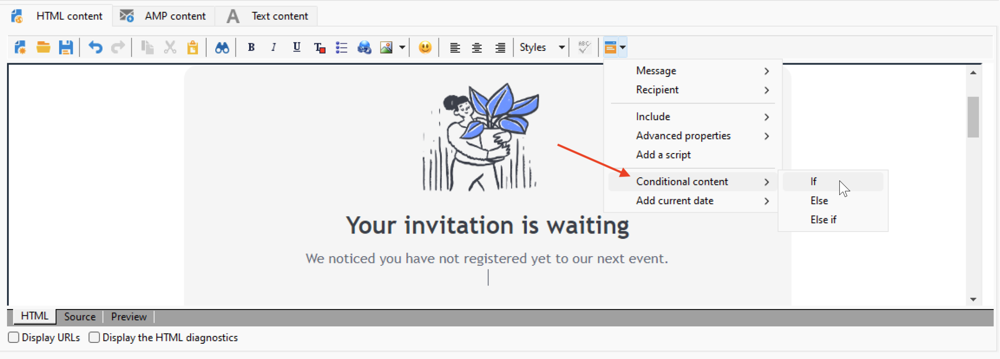

# Creare contenuto condizionale{#conditional-content}

Configurando i campi di contenuto condizionale puoi creare una personalizzazione avanzata. I blocchi di testo completi e/o le immagini vengono sostituiti quando viene soddisfatta una particolare condizione.


## Utilizzare le condizioni in un messaggio e-mail {#conditions-in-an-email}

Nell’esempio seguente, scopri come creare un messaggio personalizzato in modo dinamico sulla città e sugli interessi del destinatario.

* Cambia il messaggio in base alla città del destinatario,
* Personalizza il contenuto dell’offerta in base agli interessi del destinatario.

Per creare contenuto condizionale in base al valore di un campo, procedi come segue:

1. Apri una consegna esistente o creane una nuova.
1. Nell’editor dei contenuti e-mail, fai clic sull’icona di personalizzazione e seleziona **[!UICONTROL Conditional content > If]**.

   

   Gli elementi di personalizzazione vengono inseriti nel corpo del messaggio. È ora necessario configurarli.

1. Inserisci i parametri del **if** espressione.

   * Seleziona il primo elemento dell’espressione, **`<FIELD>`**, quindi fai clic sull’icona di personalizzazione per sostituirla con il campo di test.
   * Sostituisci **`<VALUE>`** con il valore del campo per il quale verrà soddisfatta la condizione. Questo valore deve essere racchiuso tra virgolette.
   * Specifica il contenuto da inserire quando la condizione viene soddisfatta. Può trattarsi di un testo, un’immagine, un modulo, un collegamento ipertestuale, ecc.

   

1. Fai clic sul pulsante **[!UICONTROL Preview]** per visualizzare il contenuto del messaggio in base al destinatario della consegna. Seleziona un destinatario per il quale la condizione è true per controllare il contenuto. Quindi seleziona un altro destinatario per il quale è falso e controlla di nuovo.

Puoi aggiungere altri casi e definire contenuti diversi in base ai valori di uno o più campi. A questo scopo, utilizza **[!UICONTROL Conditional content > Else]** e **[!UICONTROL Conditional content > Else if]**. Queste espressioni sono configurate nello stesso modo della **if** espressione.

>[!CAUTION]
>
>La **%> &lt;%** i caratteri devono essere eliminati dopo l’aggiunta **Else** e **Else se** condizioni.


## Caso di utilizzo: creare un messaggio e-mail multilingue {#creating-multilingual-email}

Nell’esempio seguente, scopri come creare un’e-mail multilingue. Il contenuto viene visualizzato in una lingua o nell’altra a seconda della lingua preferita del destinatario.

1. Crea un’e-mail e seleziona la popolazione target. In questo esempio, la condizione per visualizzare una versione o l’altra sarà basata sui **Lingua** valore del profilo del destinatario. Questi valori sono impostati su **IT**, **FR**, **ES**.
1. Nel contenuto di e-mail HTML, fai clic sul pulsante **[!UICONTROL Source]** imposta e incolla il seguente codice:

   ```
   <% if (language == "EN" ) { %>
   <DIV id=en-version>Hello <%= recipient.firstName %>,</DIV>
   <DIV>Discover your new offers!</DIV>
   <DIV><a href="https://www.adobe.com/products/en">www.adobe.com/products/en</A></FONT></DIV><%
    } %>
   <% if (language == "FR" ) { %>
   <DIV id=fr-version>Bonjour <%= recipient.firstName %>,</DIV>
   <DIV>Découvrez nos nouvelles offres !</DIV>
   <DIV><a href="https://www.adobe.com/products/fr">www.adobe.com/products/fr</A></DIV><%
    } %>
    <% if (language == "ES" ) { %>
   <DIV id=es-version><FONT face=Arial>
   <DIV>Olà <%= recipient.firstName %>,</DIV>
   <DIV>Descubra nuestros nuevas ofertas !</DIV>
   <DIV><a href="https://www.adobe.com/products/es">www.adobe.com/products/es</A></DIV>
   <% } %>
   ```

1. Verifica il contenuto delle e-mail nel **[!UICONTROL Preview]** selezionando i destinatari con diverse lingue preferite.

   >[!NOTE]
   >
   >Poiché non è stata definita alcuna versione alternativa nel contenuto dell’e-mail, assicurati di filtrare la popolazione target prima di inviare l’e-mail.

## Video tutorial {#conditionnal-content-video}

Scopri come aggiungere contenuti condizionali a una consegna sull’esempio di una newsletter multilingue.

>[!VIDEO](https://video.tv.adobe.com/v/335682?quality=12)
