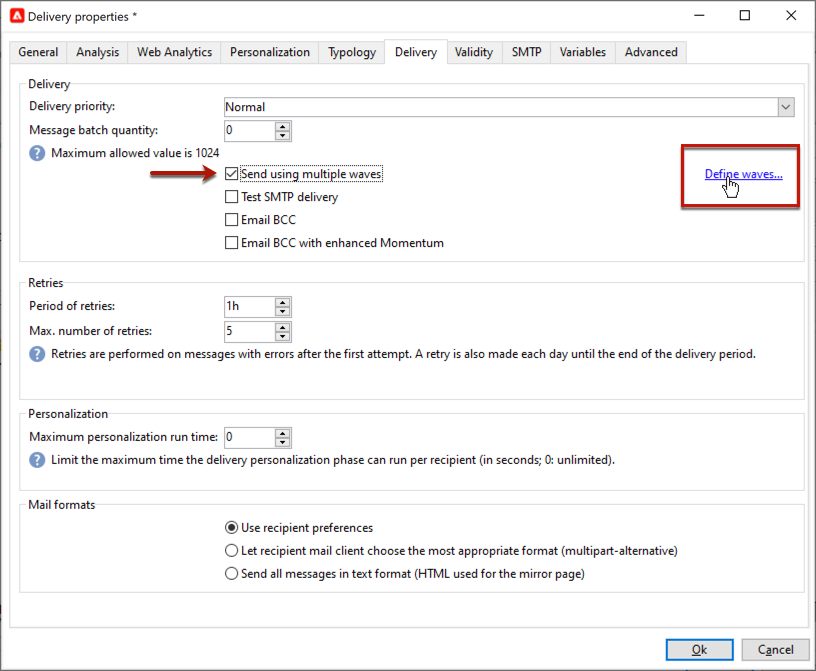
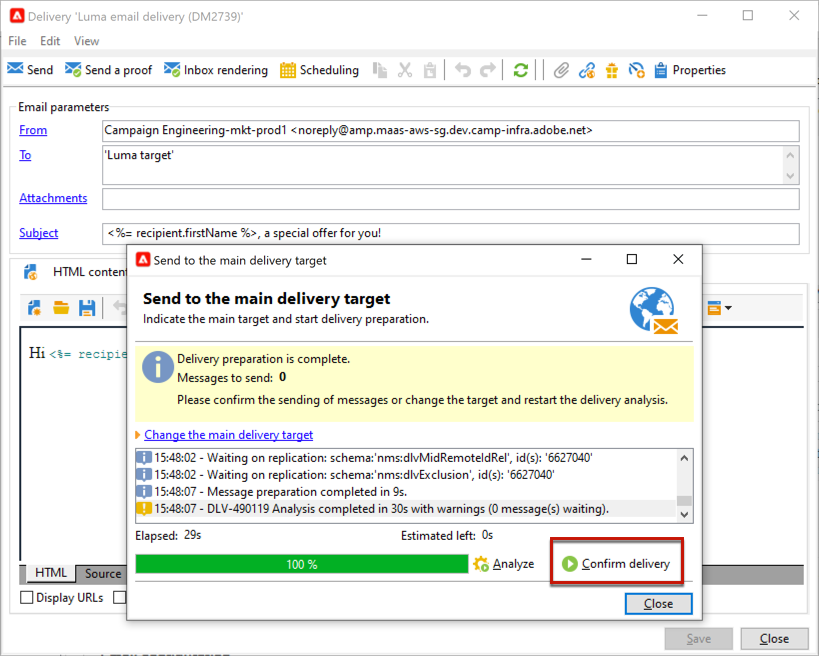
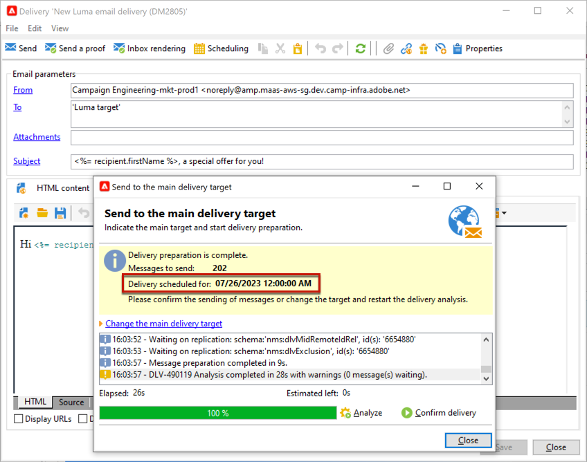
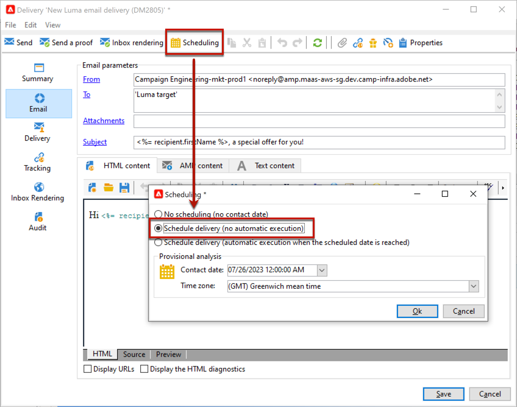

# Configurare e inviare la consegna {#configure-delivery}

Accedi ai parametri di consegna per configurare altre impostazioni e definire la modalità di invio dei messaggi. Puoi definire la consegna [priorità](#delivery-priority), configurazione [ondate](#sending-using-multiple-waves)e verifica l’invio della consegna. Al termine della configurazione, puoi confermare l’invio come descritto in [questa sezione](#confirm-delivery). I messaggi vengono quindi inviati immediatamente o in base alla consegna [pianificazione](#schedule-delivery-sending).

## Imposta parametri aggiuntivi {#delivery-additional-parameters}

Prima di inviare la consegna, puoi definirne i parametri nelle relative proprietà tramite **[!UICONTROL Delivery]** scheda.

### Priorità della consegna {#delivery-priority}

Utilizza il **[!UICONTROL Delivery priority]** per modificare l’ordine di invio delle consegne impostandone il livello di priorità, da **[!UICONTROL Very low]** a **[!UICONTROL Very high]** (il valore predefinito è **[!UICONTROL Normal]**).

### Quantità batch

Utilizza il  **[!UICONTROL Message batch quantity]** per definire il numero di messaggi raggruppati nello stesso pacchetto di consegna XML. Se il parametro è impostato su 0, i messaggi vengono raggruppati automaticamente. La dimensione del pacchetto è definita dal calcolo `<delivery size>/1024`, con un minimo di 8 e un massimo di 256 messaggi per pacchetto.

>[!IMPORTANT]
>
>Quando la consegna viene creata duplicandone una esistente, questo parametro viene reimpostato.

### Testare l’invio della consegna

Utilizza il  **[!UICONTROL Test SMTP delivery]** per verificare l’invio tramite SMTP. La consegna viene elaborata fino alla connessione al server SMTP, ma non viene inviata: per ogni destinatario della consegna, Campaign si connette al server del provider SMTP, esegue il comando SMTP RCPT TO e chiude la connessione prima del comando SMTP DATA.

>[!NOTE]
>
>* Questa opzione non deve essere impostata nel mid-sourcing.
>
>* Ulteriori informazioni sulla configurazione del server SMTP in [Documentazione di Campaign Classic v7](https://experienceleague.adobe.com/docs/campaign-classic/using/installing-campaign-classic/additional-configurations/configure-delivery-settings.html#smtp-relay){target="_blank"}.

## Inviare in più scaglioni {#sending-using-multiple-waves}

Per bilanciare il carico, puoi dividere le consegne in più batch. Configura il numero di batch e la loro proporzione rispetto all’intera consegna.

### Attiva ondate {#enable-waves}

Per definire le ondate, effettuare le seguenti operazioni:

1. Apri le proprietà di consegna e passa alla **[!UICONTROL Delivery]** scheda.
1. Abilita **[!UICONTROL Send using multiple waves]** e fare clic sul pulsante **[!UICONTROL Define waves...]** collegamento.

   

### Configura ondate {#config-waves}

>[!NOTE]
>
>Puoi definire solo la dimensione e il ritardo tra due scaglioni consecutivi. Non è possibile configurare i criteri di selezione dei destinatari per ogni ondata.

È possibile definire la dimensione di ogni scaglione o aggiungerlo a un calendario.

* **Definire la dimensione per ogni scaglione**. Ad esempio, se si immette **[!UICONTROL 30%]** nel campo corrispondente, ogni ondata rappresenterà il 30% dei messaggi inclusi nella consegna, ad eccezione dell’ultimo, che rappresenterà il 10% dei messaggi.

  In **[!UICONTROL Period]** , specificare il ritardo tra l&#39;inizio di due scaglioni consecutivi. Ad esempio, se si immette **[!UICONTROL 2d]**, la prima ondata comincerà immediatamente, la seconda fra due giorni, la terza fra quattro giorni e così via.

  

* **Definisci un calendario per l&#39;invio di ogni ondata**.  Ad esempio, la prima ondata rappresenta il 25% del numero totale di messaggi inclusi nella consegna e inizierà immediatamente. Le due fasi successive completano la consegna e sono impostate per iniziare a intervalli di sei ore.

  In **[!UICONTROL Start]** , specificare il ritardo tra l&#39;inizio di due ondate consecutive. In **[!UICONTROL Size]** , immettere un numero fisso o una percentuale.

  

### Controllo programmazione ondata {#check-waves}

Una regola di tipologia specifica, **[!UICONTROL Wave scheduling check]**, assicura che l’ultimo scaglione sia pianificato prima del limite di validità della consegna. Le tipologie di campagne e le relative regole, configurate in **[!UICONTROL Typology]** delle proprietà di consegna, sono presentate in [questa sezione](../../automation/campaign-opt/campaign-typologies.md#typology-rules)<!--ref TBC-->.

>[!IMPORTANT]
>
>Assicurati che gli ultimi scaglioni non superino la scadenza di consegna, definita nella sezione **[!UICONTROL Validity]** scheda. In caso contrario, alcuni messaggi potrebbero non essere inviati. Ulteriori informazioni sul periodo di validità di una consegna in [questa sezione](delivery-failures.md#valid-period).
>
>È inoltre necessario impostare un tempo sufficiente per i nuovi tentativi durante la configurazione delle ultime ondate. Ulteriori informazioni sui nuovi tentativi in [questa sezione](delivery-failures.md#retries).

### Monitorare le ondate {#monitor-waves}

Per monitorare gli invii, passa ai registri di consegna. Consulta [questa pagina](send.md)

Puoi visualizzare le consegne già inviate negli scaglioni elaborati (**[!UICONTROL Sent]** stato) e le consegne da inviare negli scaglioni rimanenti (**[!UICONTROL Pending]** stato).

### Esempi di scaglioni {#samples-waves}

I due esempi seguenti sono i casi d’uso più comuni per l’utilizzo di più scaglioni.

* **Durante il processo di incremento**

  Quando le e-mail vengono inviate utilizzando una nuova piattaforma, i provider di servizi Internet (ISP) sospettano che gli indirizzi IP non siano riconosciuti. Se grandi quantità di e-mail vengono inviate improvvisamente, gli ISP spesso le contrassegnano come spam.

  Per evitare di essere contrassegnati come spam, puoi aumentare progressivamente il volume inviato scaglionando. Ciò dovrebbe garantire un regolare sviluppo della fase di avvio e consentirti di ridurre il tasso complessivo di indirizzi non validi.

  A tale scopo, utilizza **[!UICONTROL Schedule waves according to a calendar]** opzione. Ad esempio, imposta la prima ondata su 10%, la seconda su 15% e così via.

  

* **Campagne con call center**

  Quando gestisci una campagna fedeltà telefonicamente, la tua organizzazione ha una capacità limitata di elaborare il numero di chiamate per contattare gli abbonati.

  Utilizzando le ondate, puoi limitare il numero di messaggi a 20 al giorno, ad esempio, considerando la capacità di elaborazione giornaliera di un call center.

  A questo scopo, seleziona la **[!UICONTROL Schedule multiple waves of the same size]** opzione. Invio **[!UICONTROL 20]** come la dimensione dell&#39;onda e **[!UICONTROL 1d]** nel **[!UICONTROL Period]** campo.

  

## Conferma la consegna {#confirm-delivery}

Quando la consegna è configurata e pronta per essere inviata, assicurati di aver eseguito l’analisi della consegna prima di confermare l’invio.

A tale scopo, segui la procedura indicata di seguito.

1. Clic **[!UICONTROL Send]**, seleziona l’azione desiderata.

   * Per inviare la consegna immediatamente, seleziona [**Consegna il prima possibile**].
   * Per pianificare l’invio a una data successiva, seleziona **[!UICONTROL Postpone the delivery]**. [Ulteriori informazioni](#schedule-delivery-sending)

1. Fai clic su **[!UICONTROL Analyze]**. Per ulteriori informazioni, consulta [questa sezione](delivery-analysis.md).

   

1. Al termine, fai clic su **[!UICONTROL Confirm delivery]** per avviare la consegna dei messaggi.

   

1. Puoi chiudere la procedura guidata di consegna e tenere traccia dell’esecuzione della consegna dalla sezione **[!UICONTROL Delivery]** accessibile tramite i dettagli di questa consegna o tramite l’elenco delle consegne.

   Per ulteriori informazioni, consulta le sezioni seguenti:

   * [Monitoraggio di una consegna](send.md)
   * [Informazioni sugli errori di consegna](delivery-failures.md)

<!--About message tracking-->

## Pianificare l’invio della consegna {#schedule-delivery-sending}

Puoi posticipare la consegna dei messaggi per pianificare la consegna o per gestire la pressione di vendita ed evitare di sollecitare eccessivamente una popolazione.

1. Fai clic su **[!UICONTROL Send]** e selezionare il pulsante **[!UICONTROL Postpone delivery]** opzione.

1. Specifica una data di inizio in **[!UICONTROL Contact date]** campo.

   

1. Avvia l’analisi della consegna e conferma l’invio. Tuttavia, l’invio della consegna avrà inizio solo alla data indicata nella **[!UICONTROL Contact date]** campo.

   >[!IMPORTANT]
   >
   >Dopo aver avviato l&#39;analisi, la data di contatto definita viene corretta. Se modifichi questa data, dovrai riavviare l’analisi in modo da tenere conto delle modifiche.

   

Nell’elenco di consegna, la consegna viene visualizzata con **[!UICONTROL Pending]** stato.

La pianificazione può essere configurata anche a monte tramite il **[!UICONTROL Scheduling]** pulsante della consegna.

Ti consente di posticipare la consegna a una data successiva o di salvarla nel calendario provvisorio.

* Il **[!UICONTROL Schedule delivery (no automatic execution)]** consente di pianificare un’analisi provvisoria della consegna.

  Quando questa configurazione viene salvata, la consegna cambia in **[!UICONTROL Targeting pending]** stato. L’analisi verrà avviata alla data specificata.

* Il **[!UICONTROL Schedule delivery (automatic execution on planned date)]** consente di specificare la data di consegna.

  Clic **[!UICONTROL Send]** e seleziona **[!UICONTROL Postpone delivery]** quindi avvia l’analisi e conferma la consegna. Al termine dell’analisi, il target della consegna è pronto e i messaggi vengono inviati automaticamente alla data specificata.

Le date e le ore sono espresse nel fuso orario dell&#39;operatore corrente. Il **[!UICONTROL Time zone]** l’elenco a discesa che si trova sotto il campo di immissione della data di contatto consente di convertire automaticamente la data e l’ora immesse nel fuso orario selezionato.

Ad esempio, se pianifichi una consegna da eseguire automaticamente alle 8 (ora di Londra), l’ora viene automaticamente convertita nel fuso orario selezionato:

<!--
## Adjust delivery failure management {#delivery-failure-management}

### Configure retries {#configure-retries}

Temporarily undelivered messages due to a **Soft** or **Ignored** error are subject to an automatic retry. The delivery failure types and reasons are presented in this [section](../../delivery/using/understanding-delivery-failures.md#delivery-failure-types-and-reasons).

>[!IMPORTANT]
>
>For hosted or hybrid installations, if you have upgraded to the [Enhanced MTA](../../delivery/using/sending-with-enhanced-mta.md), the retry settings in the delivery are no longer used by Campaign. Soft bounce retries and the length of time between them are determined by the Enhanced MTA based on the type and severity of the bounce responses coming back from the message's email domain.

For on-premise installations and hosted/hybrid installations using the legacy Campaign MTA, the central section of the **[!UICONTROL Delivery]** tab for delivery parameters indicates how many retries should be performed the day after the delivery and the minimum delay between retries.

By default, five retries are scheduled for the first day of the delivery with a minimum interval of one hour spread out over the 24 hours of the day. One retry per day is programmed after that and until the delivery deadline, which is defined in the **[!UICONTROL Validity]** tab (see [Defining validity period](#defining-validity-period)).

### Define the validity period {#define-validity-period}

When the delivery has been launched, the messages (and any retries) can be sent until the delivery deadline. This is indicated in the delivery properties, via the **[!UICONTROL Validity]** tab.

* The **[!UICONTROL Delivery duration]** field lets you enter the limit for global delivery retries. This means that Adobe Campaign sends the messages beginning on the start date, and then, for messages returning an error only, regular, configurable retries are performed until the validity limit is reached.

  You can also choose to specify dates. To do this, select **[!UICONTROL Explicitly set validity dates]**. In this case, the delivery and validity limit dates also let you specify the time. The current time is used by default, but you can modify this directly in the input field.

  >[!IMPORTANT]
  >
  >For hosted or hybrid installations, if you have upgraded to the [Enhanced MTA](../../delivery/using/sending-with-enhanced-mta.md), the **[!UICONTROL Delivery duration]** setting in your Campaign email deliveries will be used only if set to **3.5 days or less**. If you define a value higher than 3.5 days, it will not be taken into account.

* **Validity limit of resources**: The **[!UICONTROL Validity limit]** field is used for uploaded resources, mainly for the mirror page and images. The resources on this page are valid for a limited time (to save disk space).

  The values in this field can be expressed in the units listed in [this section](../../platform/using/adobe-campaign-workspace.md#default-units).
-->
