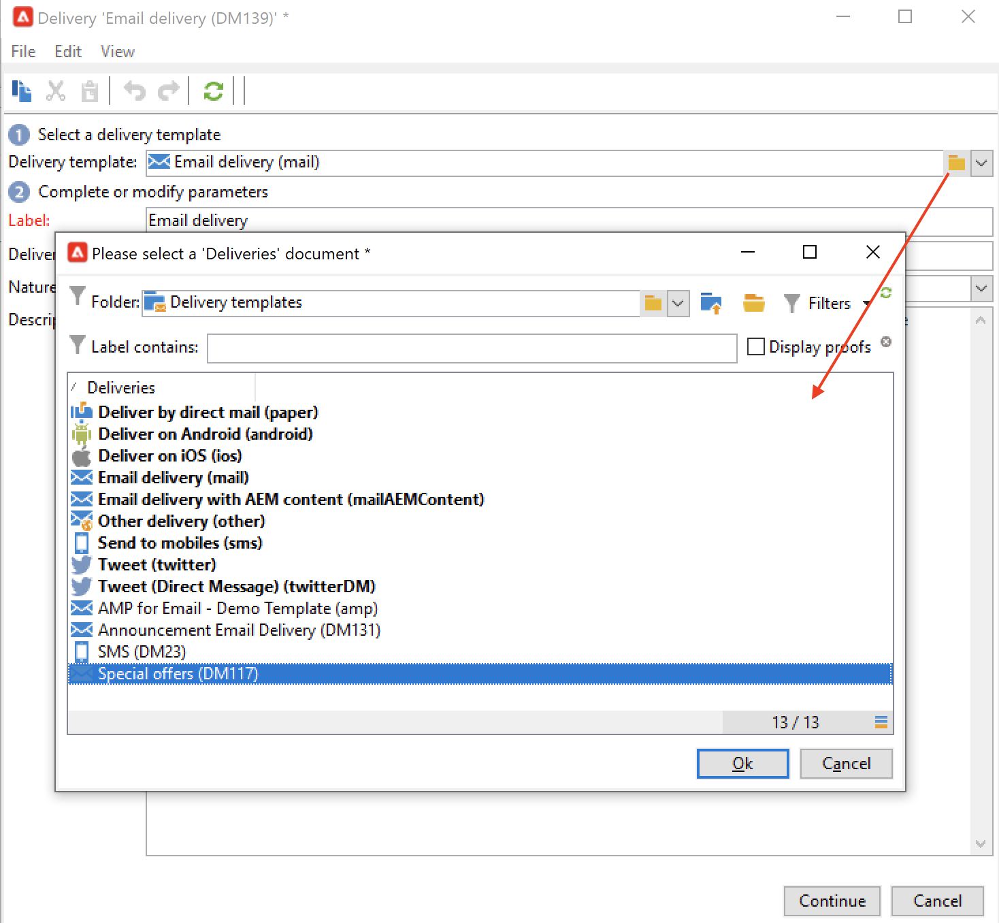

# Utilizzare i modelli di consegna {#work-with-delivery-template}

## Introduzione ai modelli di consegna

Ogni consegna viene creata in base a un modello. Un modello è una configurazione che può essere riutilizzata per facilitare e standardizzare l’implementazione. Puoi utilizzare un modello predefinito o personalizzato.

Un modello può includere impostazioni di configurazione parziali o complete, ad esempio:

* [Regole di tipologia](../../automation/campaign-opt/campaign-typologies.md)
* Indirizzi di invio e risposta
* [blocchi di personalizzazione](../send/personalization-blocks.md) di base
* Collegamenti a [pagine mirror](../send/mirror-page.md) e collegamenti per annullare l&#39;abbonamento
* Contenuto, logo dell’azienda o firma
* Altre proprietà di consegna, ad esempio validità della risorsa, parametri dei nuovi tentativi o impostazioni della quarantena.

 [Guarda il video su questa funzione](#delivery-template-video)

I modelli di consegna sono archiviati nella cartella **[!UICONTROL Resources > Templates > Delivery templates]** di Explorer. In Adobe Campaign puoi utilizzare due tipi di modelli:

1. Modelli di consegna Adobe Campaign **incorporati**: i modelli incorporati sono disponibili per ogni canale. NON DEVONO essere né modificati né eliminati. Includono una configurazione di base per ogni canale di consegna. In qualità di amministratore, puoi impostare valori predefiniti o limitare alcune funzioni agli utenti finali, ad esempio la modifica dei parametri di tracciamento, degli indirizzi e-mail del mittente e altro ancora. I modelli incorporati vengono visualizzati in grassetto nell’elenco dei modelli.

1. **Modelli di consegna personalizzati** - In qualità di amministratore di Adobe Campaign, puoi creare nuovi modelli di consegna. Si consiglia di duplicare e aggiornare un modello incorporato anziché creare un modello da zero. Ad esempio, puoi configurare un modello di consegna e-mail e, quando gli utenti creano una consegna da questo modello, devono solo inserire il testo o il contenuto HTML. Tutte le altre impostazioni sono già definite.

>[!NOTE]
>
>I modelli disponibili dipendono dai diritti di accesso, dalla configurazione dell’istanza e dal contesto. Ad esempio, quando crei un servizio di informazioni, puoi collegare un modello di consegna per i messaggi di conferma: puoi quindi accedere solo ai modelli il cui mapping di destinazione è il mapping di abbonamento. Altri modelli non sono visibili in questo contesto. Per ulteriori informazioni, consulta [Selezionare un mapping di destinazione](../audiences/target-mappings.md) e [Servizi e sottoscrizioni](../start/subscriptions.md).

## Creare un modello {#create-a-delivery-template}

Per creare un modello di consegna, puoi duplicare un modello incorporato o convertire una consegna esistente in un modello. Puoi anche creare un modello di consegna da zero, ma non è consigliabile. Questi metodi sono descritti di seguito.

### Duplicare un modello esistente{#copy-an-existing-template}

Campaign è dotato di un set di modelli incorporati per ogni canale: e-mail, push, SMS, direct mail e altro ancora.

Il modo più semplice per creare un modello di consegna è consiste nel duplicare e personalizzare un modello incorporato.

Per duplicare un modello di consegna, segui la procedura seguente:

1. Passa a **[!UICONTROL Resources > Templates > Delivery templates]** in Adobe Campaign Explorer.
1. Seleziona un modello di consegna integrato. I modelli incorporati sono visualizzati in grassetto nell’elenco.
1. Fare clic con il pulsante destro del mouse e selezionare **[!UICONTROL Duplicate]**.

   

1. Definisci le impostazioni del modello e salva il nuovo modello.

   

Il modello viene aggiunto all’elenco dei modelli di consegna. Ora puoi selezionarlo durante la creazione di una nuova consegna.

### Convertire una consegna esistente in un modello {#convert-an-existing-delivery}

Una consegna può essere convertita in un modello per nuove azioni di consegna ripetute.

Per convertire una consegna in un modello, segui la procedura seguente:

1. Seleziona la consegna dall’elenco di consegna, accessibile tramite il nodo **[!UICONTROL Campaign management]** di Campaign Explorer.

1. Fare clic con il pulsante destro del mouse e selezionare **[!UICONTROL Actions > Save as template...]**.

   

1. Modificare le proprietà di consegna e selezionare la cartella in cui salvare il nuovo modello (nel campo **[!UICONTROL Folder]**) e la cartella in cui creare le consegne basate su questo modello (nel campo **[!UICONTROL Execution folder]**).

   

### Creare un nuovo modello {#create-a-new-template}

>[!NOTE]
>
>Per evitare errori di configurazione, Adobe consiglia di [duplicare un modello incorporato](#copy-an-existing-template) e personalizzarne le proprietà anziché creare un nuovo modello.

Per configurare un modello di consegna da zero, segui la procedura seguente:

1. Individua la cartella **Resources** in Esplora campagne e seleziona **Templates** e quindi **Delivery templates**.
1. Fai clic su **Nuovo** nella barra degli strumenti per creare un nuovo modello di consegna.
1. Imposta l&#39;**etichetta** e il **nome interno** della cartella.
1. Salva il modello e riaprilo.
1. Dal pulsante **Proprietà**, adatta le impostazioni.
1. Nella scheda **Generale**, confermare o modificare i percorsi selezionati nei menu a discesa **Cartella di esecuzione**, **Cartella** e **Indirizzamento**.
1. Completa la categoria **Parametri e-mail** con l&#39;oggetto dell&#39;e-mail e la popolazione di destinazione.
1. Aggiungi il tuo contenuto di **HTML** per personalizzare il modello. Puoi visualizzare un [collegamento a una pagina speculare](../send/mirror-page.md) e un collegamento per annullare l&#39;iscrizione.
1. Selezionare la scheda **Anteprima**. Nel menu a discesa **Prova personalizzazione**, seleziona **Destinatario** per visualizzare in anteprima il modello come profilo scelto.
1. Fai clic su **Salva**. Il modello è ora pronto per essere utilizzato in una consegna.

## Utilizzare i modelli {#use-a-delivery-template}

### Creare una consegna da un modello {#create-a-delivery-from-a-template}

Per creare una consegna basata su un modello esistente, seleziona il modello dall’elenco dei modelli di consegna disponibili.

Se non riesci a visualizzare il modello, fai clic sulla cartella **[!UICONTROL Select link]** a destra del campo per sfogliare le cartelle di Campaign.

Selezionare la directory desiderata dal campo **[!UICONTROL Folder]** oppure fare clic sull&#39;icona **[!UICONTROL Display sub-levels]** per visualizzare il contenuto delle directory nelle sottostrutture della directory corrente.

Selezionare il modello di consegna da utilizzare e fare clic su **[!UICONTROL Ok]**.

### Eseguire un modello {#execute-a-template}

Puoi avviare l’esecuzione di un modello direttamente dall’elenco dei modelli senza prima creare una consegna. Il modello di consegna può essere eseguito manualmente, come descritto di seguito, o attivato da un evento (eseguito in un determinato momento, quando un file è disponibile nel server, ecc.), come spiegato in [questa sezione](https://experienceleague.adobe.com/en/docs/campaign/automation/workflows/wf-activities/action-activities/delivery).

Per eseguire manualmente un modello, effettua le seguenti operazioni:

1. Seleziona il modello da eseguire e fai clic con il pulsante destro del mouse. Seleziona **[!UICONTROL Actions>Execute the delivery template...]**.

   È inoltre possibile utilizzare **[!UICONTROL File>Actions>Execute the delivery template...]**.

   

1. Immettere i parametri di consegna e fare clic su **[!UICONTROL Send]**.

Questa azione genera una consegna nella cartella associata al modello. Il nome di questa consegna è il nome del modello di consegna da cui è stata creata.

## Video tutorial {#delivery-template-video}

### Come configurare un modello di consegna

Il video seguente illustra come configurare un modello per una consegna ad hoc.

>[!VIDEO](https://video.tv.adobe.com/v/342082?quality=12)

### Impostare le proprietà dei modelli di consegna

Il video seguente mostra come impostare le proprietà del modello di consegna e spiega in dettaglio ciascuna proprietà.

>[!VIDEO](https://video.tv.adobe.com/v/338969?quality=12)

### Come distribuire un modello di consegna ad hoc

Questo video spiega come distribuire un modello di consegna e-mail ad hoc e la differenza tra una consegna e-mail e un flusso di lavoro di consegna.

>[!VIDEO](https://video.tv.adobe.com/v/338965?quality=12)

Ulteriori video dimostrativi di Campaign sono disponibili [qui](https://experienceleague.adobe.com/docs/campaign-learn/tutorials/getting-started/introduction-to-adobe-campaign.html){target="_blank"}.
