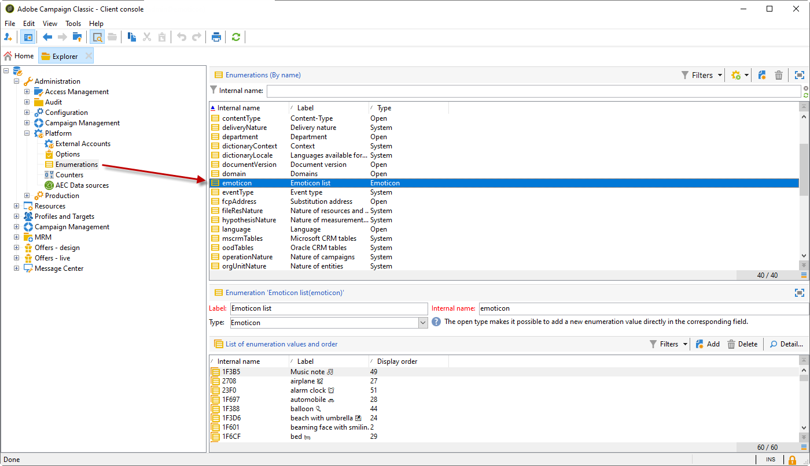

# Personalizzare l’elenco delle emoticon {#customize-emoticons}

L&#39;elenco di emoticon visualizzato nel pop-up è governato da un&#39;enumerazione che consente di visualizzare i valori in un elenco per limitare le scelte dell&#39;utente per un determinato campo.
L’ordine dell’elenco delle emoticon può essere personalizzato, puoi anche aggiungere altre emoticon all’elenco.

Gli emoticon sono disponibili solo per e-mail e push. Per ulteriori informazioni, consulta questa [sezione](defining-the-email-content.md#inserting-emoticons).

## Aggiunta di una nuova emoticon {#add-new-emoticon}

>[!CAUTION]
>
>L’elenco delle emoticon non può visualizzare più di 81 voci.

1. Scegli la nuova emoticon da aggiungere da questa [pagina](https://unicode.org/emoji/charts/full-emoji-list.html). Si noti che deve essere compatibile con le diverse piattaforme come browser e sistema operativo.

1. Da **[!UICONTROL Explorer]**, selezionare **[!UICONTROL Administration]** > **[!UICONTROL Platform]** > **[!UICONTROL Enumerations]** e fare clic sull&#39;enumerazione predefinita **[!UICONTROL Emoticon list]**.

   >[!NOTE]
   >
   >Le enumerazioni predefinite possono essere gestite solo da un amministratore della console Adobe Campaign Classic.

   

1. Fai clic su **[!UICONTROL Add]**.

1. Compila i campi:

   * **[!UICONTROL U+]**: codice del nuovo emoticon. Puoi trovare l&#39;elenco dei codici degli emoticon in questa [pagina](https://unicode.org/emoji/charts/full-emoji-list.html).
Per evitare problemi di compatibilità, ti consigliamo di scegliere gli emoticon supportati sui browser e su ogni sistema operativo.

   * **[!UICONTROL Label]**: etichetta della nuova emoticon.

   

1. Al termine della configurazione, fai clic su **[!UICONTROL Ok]** e quindi su **[!UICONTROL Save]**.
La nuova emoticon verrà automaticamente inserita nel negozio.

1. Per visualizzarlo nella finestra **[!UICONTROL Insert emoticon]** delle consegne, seleziona l&#39;emoticon appena creata facendo doppio clic su di essa.

1. Scegli nell&#39;elenco a discesa **[!UICONTROL Display order]** l&#39;ordine di visualizzazione della nuova emoticon. Tieni presente che selezionando un ordine di visualizzazione già assegnato, l’emoticon esistente verrà automaticamente spostata nello store.

    In questo esempio, è stato scelto il numero di ordine di visualizzazione 61, il che significa che se una voce disponeva già di questo ordine, verrà automaticamente spostata nello store e la nuova voce verrà inserita nell&#39;elenco di enumerazione.

   

1. La nuova emoticon è stata aggiunta all&#39;enumerazione predefinita **[!UICONTROL Insert emoticon list]**. È possibile modificare **[!UICONTROL Display order]** in qualsiasi momento o spostarlo nello store, se non è più necessario.

1. Affinché le modifiche vengano prese in considerazione, disconnettiti e riconnettiti da Adobe Campaign Classic. Se la nuova emoticon non viene ancora visualizzata nella finestra popup **[!UICONTROL Insert emoticon]**, potrebbe essere necessario cancellare la cache. A tale scopo, utilizzare il menu **[!UICONTROL File > Clear the local cache]**.

1. La nuova emoticon è ora disponibile nelle consegne nella finestra a comparsa **[!UICONTROL Insert emoticon]** nella 61esima posizione, come configurato nei passaggi precedenti. Per ulteriori informazioni su come utilizzare gli emoticon nelle consegne, consulta questa [sezione](defining-the-email-content.md#inserting-emoticons).

   

1. Se nella finestra popup **[!UICONTROL Insert emoticon]** vengono visualizzati i seguenti emoticon, significa che non sono stati configurati correttamente. Verificare che il codice **[!UICONTROL U+]** o **[!UICONTROL Display order]** sia corretto in **[!UICONTROL Emoticon list]**.

   
