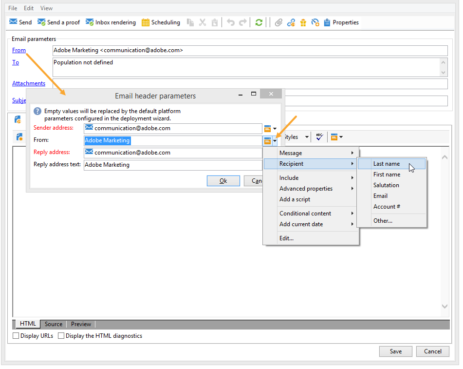

# Definire il contenuto dell’e-mail {#defining-the-email-content}

## Mittente {#sender}

Per definire il nome e l&#39;indirizzo del mittente che verrà visualizzato nell&#39;intestazione dei messaggi inviati, fare clic sul collegamento **[!UICONTROL From]**.

Questa finestra ti consente di inserire tutte le informazioni necessarie per creare le intestazioni dei messaggi e-mail. Queste informazioni possono essere personalizzate. A questo scopo, utilizza i pulsanti a destra dei campi di input per inserire i campi di personalizzazione.

Per informazioni su come inserire e utilizzare i campi di personalizzazione, consulta [questa sezione](personalize.md).

>[!NOTE]
>
>* Per impostazione predefinita, per le risposte viene utilizzato l&#39;indirizzo del mittente.
>* I parametri di intestazione non possono essere vuoti. Per impostazione predefinita, contengono i valori immessi durante la configurazione della procedura guidata di distribuzione.
>* L’indirizzo del mittente è obbligatorio per consentire l’invio di un’e-mail (standard RFC).
>* Adobe Campaign controlla la sintassi degli indirizzi e-mail immessi.

>[!CAUTION]
>
>Per evitare problemi di recapito messaggi, gli account e-mail che corrispondono agli indirizzi specificati per le consegne e le risposte devono esistere e devono essere monitorati. Rivolgiti all’amministratore di sistema.

## Oggetto del messaggio {#message-subject}

L’oggetto del messaggio è configurato nel campo corrispondente. È possibile immetterlo direttamente nel campo o fare clic sul collegamento **[!UICONTROL Subject]** per immettere uno script. Il collegamento di personalizzazione consente di inserire campi di database nell’oggetto.

>[!IMPORTANT]
>
>L’oggetto del messaggio è obbligatorio.

Il contenuto del campo verrà sostituito dal valore nel profilo del destinatario quando il messaggio viene inviato.

Ad esempio, nel messaggio precedente, l’oggetto del messaggio è personalizzato per ogni destinatario con i dati del suo profilo.

>[!NOTE]
>
>L&#39;utilizzo dei campi di personalizzazione è presentato in [questa sezione](personalize.md).

È inoltre possibile inserire emoticon nell&#39;oggetto mediante la finestra popup **[!UICONTROL Insert emoticon]**.

## Contenuto del messaggio {#message-content}

>[!IMPORTANT]
>
>Per motivi di privacy, consigliamo di utilizzare HTTPS per tutte le risorse esterne.

Il contenuto del messaggio è definito nella sezione inferiore della finestra di configurazione della consegna.

Per impostazione predefinita, i messaggi vengono inviati in formato HTML o testo, in base alle preferenze del destinatario. È consigliabile creare contenuti in entrambi i formati per garantire che i messaggi possano essere visualizzati correttamente in qualsiasi sistema di posta. Per ulteriori informazioni, consulta [Selezione dei formati dei messaggi](email-parameters.md#selecting-message-formats).

* Per importare un contenuto HTML, utilizzare il pulsante **[!UICONTROL Open]**. È inoltre possibile incollare il codice sorgente direttamente nella scheda secondaria **[!UICONTROL Source]**.

  Se utilizzi Digital Content Editor (DCE), consulta la [documentazione di Campaign Classic](https://experienceleague.adobe.com/docs/campaign-classic/using/designing-content/editing-html-content/use-case-creating-an-email-delivery.html?lang=it#step-3---selecting-a-content).

  >[!IMPORTANT]
  >
  >Il contenuto HTML deve essere creato in anticipo e quindi importato in Adobe Campaign. L’editor di HTML non è progettato per la creazione di contenuti.

  La scheda secondaria **[!UICONTROL Preview]** consente di visualizzare il rendering di ogni contenuto per un destinatario. I campi di personalizzazione e gli elementi condizionali del contenuto vengono sostituiti con le informazioni corrispondenti per il profilo selezionato.

  I pulsanti della barra degli strumenti consentono di accedere alle azioni e ai parametri di formattazione standard per la pagina HTML.

  

  È possibile inserire immagini nei messaggi da un file locale o da una libreria di immagini in Adobe Campaign. A tale scopo, fare clic sull&#39;icona **[!UICONTROL Image]** e selezionare l&#39;opzione appropriata.

  

  È possibile accedere alle immagini della libreria tramite la cartella **[!UICONTROL Resources>Online>Public resources]** nella struttura delle cartelle. Consulta anche [Aggiunta di immagini](#adding-images).

  L’ultimo pulsante nella barra degli strumenti consente di inserire campi di personalizzazione.

  >[!NOTE]
  >
  >L&#39;utilizzo dei campi di personalizzazione è presentato in [questa sezione](personalize.md).

  Le schede nella parte inferiore della pagina ti consentono di visualizzare il codice HTML della pagina in fase di creazione e il rendering del messaggio con la relativa personalizzazione. Per avviare la visualizzazione, fare clic su **[!UICONTROL Preview]** e selezionare un destinatario utilizzando il pulsante **[!UICONTROL Test personalization]** nella barra degli strumenti. Puoi selezionare un destinatario dalle destinazioni definite o scegliere un altro destinatario.

  

  Puoi convalidare il messaggio HTML. Puoi anche visualizzare il contenuto dell’intestazione dell’e-mail.

  

* Per importare un contenuto di testo, utilizzare il pulsante **[!UICONTROL Open]** o la scheda **[!UICONTROL Text Content]** per immettere il contenuto del messaggio visualizzato in formato testo. Utilizza i pulsanti della barra degli strumenti per accedere alle azioni sul contenuto. L’ultimo pulsante ti consente di inserire campi di personalizzazione.

  

  Per il formato HTML, fare clic sulla scheda **[!UICONTROL Preview]** nella parte inferiore della pagina per visualizzare il rendering del messaggio con la relativa personalizzazione.

  

## Definire il contenuto interattivo {#amp-for-email-format}

Adobe Campaign consente di provare il nuovo formato interattivo [AMP per e-mail](https://amp.dev/about/email/), che consente di inviare e-mail dinamiche, in determinate condizioni.

Per ulteriori informazioni, consulta [questa sezione](defining-interactive-content.md).

## Utilizza gestione contenuti {#using-content-management}

Puoi definire il contenuto della consegna utilizzando i moduli di gestione del contenuto, direttamente nell’assistente alla consegna. A questo scopo, nella scheda **[!UICONTROL Advanced]** delle proprietà di consegna è necessario fare riferimento al modello di pubblicazione del content management da utilizzare.

Una scheda aggiuntiva consente di immettere contenuto che verrà automaticamente integrato e formattato in base alle regole di gestione del contenuto.

>[!NOTE]
>
>Per ulteriori informazioni sulla gestione dei contenuti in Adobe Campaign, consulta la [documentazione di Campaign Classic](https://experienceleague.adobe.com/docs/campaign-classic/using/sending-messages/content-management/about-content-management.html?lang=it).

## Inserisci emoticon {#inserting-emoticons}

Puoi inserire emoticon nel contenuto delle e-mail.

1. Fare clic sull&#39;icona **[!UICONTROL Insert emoticon]**.
1. Selezionare un&#39;emoticon dalla finestra popup.

   

1. Al termine, fare clic sul pulsante **[!UICONTROL Close]**.

Per personalizzare l&#39;elenco degli emoticon, consulta la [documentazione di Campaign Classic](https://experienceleague.adobe.com/docs/campaign-classic/using/sending-messages/personalizing-deliveries/customizing-emoticon-list.html?lang=it).

## Aggiungi immagini {#adding-images}

Le consegne e-mail in formato HTML possono contenere immagini. Dall&#39;assistente alla consegna, puoi importare una pagina HTML contenente immagini o inserire immagini direttamente utilizzando l&#39;editor HTML tramite l&#39;icona **[!UICONTROL Image]**.

### Guardrail {#img-guardrails}

Per evitare problemi di prestazioni, le immagini incluse nelle e-mail non possono superare i 100 KB. Questo limite, impostato per impostazione predefinita, può essere modificato dall&#39;opzione `NmsDelivery_MaxDownloadedImageSize`. Tuttavia, Adobe consiglia vivamente di evitare le immagini di grandi dimensioni nelle consegne e-mail.

Ulteriori informazioni sull&#39;elenco delle opzioni di Campaign sono disponibili nella [documentazione di Campaign Classic](https://experienceleague.adobe.com/docs/campaign-classic/using/installing-campaign-classic/appendices/configuring-campaign-options.html?lang=it#delivery).

### Tipi di immagini {#img-types}

Le immagini possono essere:

* Un&#39;immagine locale o un&#39;immagine denominata da un server
* Immagine memorizzata nella libreria delle risorse pubbliche di Adobe Campaign

  Le risorse pubbliche sono accessibili tramite il nodo **[!UICONTROL Resources > Online]** della gerarchia di Adobe Campaign. Sono raggruppati in una libreria e possono essere inclusi nei messaggi e-mail, ma possono anche essere utilizzati per campagne o attività o per la gestione del contenuto.

* Una risorsa condivisa con Adobe Experience Cloud. Consulta la [documentazione di Campaign Classic](https://experienceleague.adobe.com/docs/campaign-classic/using/integrating-with-adobe-experience-cloud/asset-sharing/sharing-assets-with-adobe-experience-cloud.html?lang=it).

### Inserire e gestire le immagini {#manage-images}

L’assistente alla consegna ti consente di aggiungere al contenuto dei messaggi immagini locali, o immagini memorizzate nella libreria. A tale scopo, fare clic sul pulsante **[!UICONTROL Image]** nella barra degli strumenti del contenuto di HTML.

>[!IMPORTANT]
>
>Affinché i destinatari possano visualizzare le immagini incluse nei messaggi ricevuti, questi messaggi devono essere disponibili su un server accessibile dall’esterno.

Per gestire le immagini tramite l’assistente alla consegna:

1. Fare clic sull&#39;icona **[!UICONTROL Tracking & Images]** nella barra degli strumenti.
   

1. Selezionare **[!UICONTROL Upload images]** nella scheda **[!UICONTROL Images]**.
1. Puoi quindi scegliere se includere le immagini nel messaggio e-mail.
   

* Puoi caricare le immagini manualmente senza attendere la fase di analisi della consegna. A tale scopo, fare clic sul collegamento **[!UICONTROL Upload the images straightaway...]**.
* Puoi specificare un altro percorso per accedere alle immagini sul server di tracciamento. A tale scopo, immetterlo nel campo **[!UICONTROL Images URL]**. Questo valore sostituisce il valore definito nei parametri dell&#39;assistente all&#39;installazione.

Quando apri contenuti HTML con immagini incluse nell’assistente alla consegna, un messaggio ti offre la possibilità di caricare le immagini immediatamente, in base ai parametri di consegna.

>[!IMPORTANT]
>
> Gli URL dell’immagine vengono modificati durante il caricamento manuale o l’invio di messaggi.
> 

### Caso d’uso: inviare un messaggio con immagini {#uc-images}

Di seguito è riportato un esempio di consegna con quattro immagini:

Queste immagini provengono da una directory locale o da un sito Web, come è possibile verificare dalla scheda **[!UICONTROL Source]**.

Fare clic sull&#39;icona **[!UICONTROL Tracking & Images]** e quindi sulla scheda **[!UICONTROL Images]** per iniziare a rilevare le immagini nel messaggio.

Per ogni immagine rilevata, puoi visualizzarne lo stato:

* Se un&#39;immagine è archiviata localmente o si trova in un altro server, anche se questo server è visibile dall&#39;esterno (ad esempio in un sito Internet), verrà rilevato come **[!UICONTROL Not yet online]**.
* Le immagini vengono rilevate come **[!UICONTROL Already online]** se sono state caricate in precedenza durante la creazione di un&#39;altra consegna.
* Nella procedura guidata di distribuzione è possibile definire URL per i quali non è abilitato il rilevamento immagini: il caricamento di queste immagini sarà **[!UICONTROL Skipped]**.

>[!NOTE]
>
>Le immagini sono identificate dal loro contenuto e non dai loro percorsi di accesso. Ciò significa che verrà rilevata come **[!UICONTROL Already online]** un&#39;immagine caricata in precedenza con un nome diverso o in una directory diversa.

Durante la fase di analisi, le immagini vengono caricate automaticamente sul server in modo che siano accessibili dall’esterno, ad eccezione delle immagini locali che devono essere caricate in precedenza.

Puoi lavorare in anticipo e caricare le immagini in modo che possano essere visualizzate da altri operatori Adobe Campaign. Questa funzione può essere utile se si lavora in collaborazione. A tale scopo, fare clic su **[!UICONTROL Upload the images straightaway...]** per caricare le immagini sul server.

>[!NOTE]
>
>Gli URL delle immagini nell’e-mail, e in particolare i loro nomi, vengono quindi modificati.

Una volta che le immagini sono online, è possibile visualizzare le modifiche ai loro nomi e percorsi dalla scheda **[!UICONTROL Source]** del messaggio.

Se si seleziona **[!UICONTROL Include the images in the email]**, è possibile scegliere quali immagini includere nella colonna corrispondente.

>[!NOTE]
>
>Se nel messaggio sono incluse immagini locali, è necessario confermare le modifiche apportate al codice sorgente del messaggio.

## Inserire un codice a barre personalizzato{#insert-a-barcode}

Il modulo di generazione del codice a barre consente di creare diversi tipi di codici a barre conformi a molti standard comuni, inclusi i codici a barre 2D.

È possibile generare dinamicamente un codice a barre come bitmap utilizzando un valore definito utilizzando i criteri del cliente. I codici a barre personalizzati possono essere inclusi nelle campagne e-mail. Il destinatario può stampare il messaggio e mostrarlo alla società emittente per la scansione (ad esempio durante il check-out).

Per inserire un codice a barre in un messaggio e-mail, posiziona il cursore nel contenuto in cui desideri visualizzarlo, quindi fai clic sul pulsante di personalizzazione. Seleziona **[!UICONTROL Include > Barcode...]**.

Quindi configura i seguenti elementi in base alle tue esigenze:

1. Selezionare il tipo di codice a barre.

   * Per il formato 1D, in Adobe Campaign sono disponibili i seguenti tipi: Codabar, Code 128, GS1-128 (precedentemente EAN-128), UPC-A, UPC-E, ISBN, EAN-8, Code39, Interleaved 2 of 5, POSTNET e Royal Mail (RM4SCC).

     Esempio di codice a barre 1D:

     

   * I tipi DataMatrix e PDF417 riguardano il formato 2D.

     Esempio di codice a barre 2D:

     

   * Per inserire un codice QR, selezionare questo tipo e immettere il tasso di correzione dell&#39;errore da applicare. Questo tasso definisce la quantità di informazioni ripetute e la tolleranza al deterioramento.

     

     Esempio di codice QR:

     

1. Immetti la dimensione del codice a barre che desideri inserire nell’e-mail: la configurazione della scala ti consente di aumentare o ridurre la dimensione del codice a barre, da x1 a x10.
1. Il campo **[!UICONTROL Value]** consente di definire il valore del codice a barre. Un valore può corrispondere a un’offerta speciale e può essere la funzione di un criterio, può essere il valore di un campo di database collegato ai clienti.

   In questo esempio viene illustrato un codice a barre di tipo EAN-8 a cui è stato aggiunto il numero di conto di un destinatario. Per aggiungere questo numero di account, fare clic sul pulsante di personalizzazione a destra del campo **[!UICONTROL Value]** e selezionare **[!UICONTROL Recipient > Account number]**.

   

1. Il campo **[!UICONTROL Height]** consente di configurare l&#39;altezza del codice a barre senza modificarne la larghezza, modificando la quantità di spazio tra le barre.

   Non esiste alcun controllo di immissione restrittivo a seconda del tipo di codice a barre. Se un valore di codice a barre non è corretto, sarà visibile solo nella modalità **Anteprima**, dove il codice a barre verrà barrato in rosso.

   >[!NOTE]
   >
   >Il valore assegnato a un codice a barre dipende dal relativo tipo. Ad esempio, un tipo EAN-8 deve avere esattamente 8 numeri.
   >
   >Il pulsante di personalizzazione a destra del campo **[!UICONTROL Value]** consente di aggiungere dati oltre al valore stesso. Questo arricchisce il codice a barre, a condizione che lo standard lo accetti.
   >
   >Se ad esempio si utilizza un codice a barre di tipo GS1-128 e si desidera immettere il numero di conto di un destinatario oltre al valore, fare clic sul pulsante di personalizzazione e selezionare **[!UICONTROL Recipient > Account number]**. Se il numero di conto del destinatario selezionato viene immesso correttamente, il codice a barre ne tiene conto.

Una volta configurati questi elementi, puoi finalizzare l’e-mail e inviarla. Per evitare errori, verificare sempre che il contenuto sia visualizzato correttamente prima di eseguire una consegna facendo clic sulla scheda **[!UICONTROL Preview]**.

>[!NOTE]
>
>Se il valore di un codice a barre non è corretto, la bitmap corrispondente viene visualizzata in rosso.

