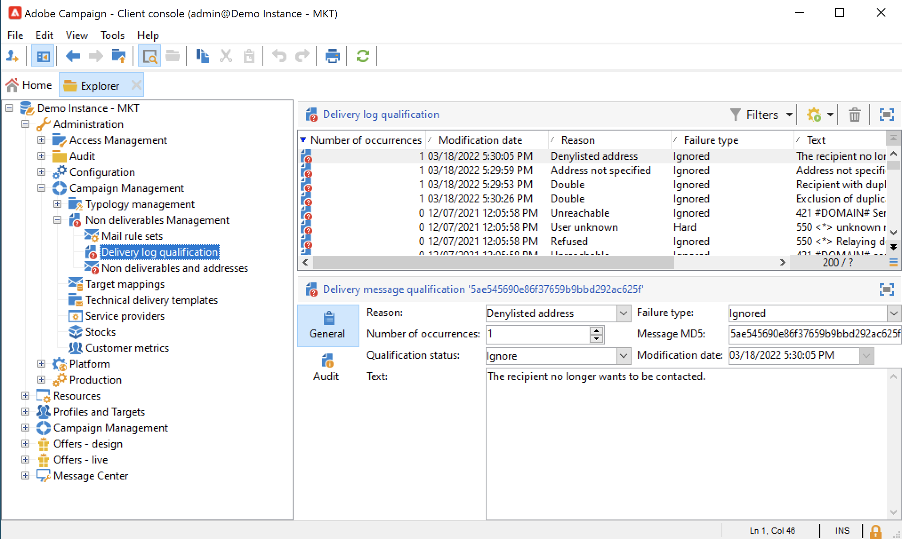

# Errori di consegna {#delivery-failures}

Le e-mail non consegnate sono il risultato di un tentativo e di un errore di consegna in cui l’ISP invia una notifica di errore. L’elaborazione della gestione delle e-mail non consegnate è una parte fondamentale dell’igiene degli elenchi. Dopo che una determinata e-mail è stata recapitata diverse volte di fila, questo processo la contrassegna per l’eliminazione.

Questo processo impedisce ai sistemi di continuare a inviare indirizzi e-mail non validi. Le e-mail non consegnate sono uno dei dati chiave utilizzati dagli ISP per determinare la reputazione dell’IP. È importante tenere d’occhio questa metrica. Le classificazioni &quot;Consegnato&quot; e &quot;Non consegnato&quot; sono probabilmente il modo più comune per misurare la consegna dei messaggi di marketing: più alta è la percentuale di messaggi consegnati, meglio è.

Se non è possibile inviare un messaggio a un profilo, il server remoto invia automaticamente un messaggio di errore ad Adobe Campaign. Questo errore consente di determinare se l’indirizzo e-mail, il numero di telefono o il dispositivo devono essere messi in quarantena. Consulta [Gestione della posta non recapitata](#bounce-mail-qualification).

Dopo l’invio del messaggio, puoi visualizzare lo stato di consegna per ciascun profilo e il tipo e il motivo dell’errore associati nei registri di consegna.

Quando un indirizzo e-mail viene messo in quarantena o se un profilo si trova in fase di inserisco nell&#39;elenco Bloccati di consegna, il destinatario viene escluso durante la fase di preparazione della consegna. I messaggi esclusi sono elencati nel dashboard di consegna.

## Perché la consegna del messaggio non è riuscita {#delivery-failure-reasons}

Esistono due tipi di errore quando un messaggio non riesce. Ogni tipo di errore di consegna determina se un indirizzo viene inviato o meno alla [quarantena](quarantines.md#quarantine-reason).

* **Rimbalzi permanenti**
I mancati recapiti permanenti sono errori permanenti generati dopo che un ISP determina che un tentativo di invio di e-mail all’indirizzo di un abbonato non è consegnabile. In Adobe Campaign, i mancati recapiti permanenti classificati come impossibili da recapitare vengono aggiunti all’elenco di quarantena, il che significa che non verranno ritentati. In alcuni casi, un mancato recapito permanente verrebbe ignorato se la causa dell’errore fosse sconosciuta.

  Di seguito sono riportati alcuni esempi comuni di mancati recapiti permanenti: l’indirizzo non esiste, l’account è disabilitato, la sintassi non è valida, il dominio non valido

* **Mancati recapiti non permanenti**
I mancati recapiti non permanenti sono errori temporanei generati dagli ISP in caso di difficoltà nella consegna della posta. In caso di errori non permanenti, [riprova](#retries) più volte (con varianza in base all&#39;utilizzo di impostazioni di consegna personalizzate o predefinite) per tentare una consegna corretta. Gli indirizzi che generano mancati recapiti non permanenti in modo continuo non verranno aggiunti alla quarantena fino a quando non sarà raggiunto il numero massimo di tentativi (che, anche in questo caso, varia a seconda delle impostazioni).

  Alcune cause comuni di mancati recapiti non permanenti includono: Cassetta postale piena, Ricezione del server e-mail inattivo, Problemi di reputazione del mittente

Il tipo di errore **Ignorato** è considerato temporaneo, ad esempio &quot;Fuori sede&quot;, oppure è un errore tecnico, ad esempio se il tipo di mittente è &quot;postmaster&quot;.

Il ciclo di feedback funziona come le e-mail non recapitate: quando un utente qualifica un’e-mail come spam, puoi configurare le regole e-mail in Adobe Campaign per bloccare tutte le consegne a questo utente. Inserire nell&#39;elenco Bloccati Gli indirizzi di questi utenti vengono anche se non hanno fatto clic sul collegamento di annullamento dell’abbonamento. Gli indirizzi vengono aggiunti alla tabella di quarantena (**NmsAddress**) e non alla tabella dei destinatari (**NmsRecipient**) con lo stato **[!UICONTROL Denylisted]**. Ulteriori informazioni sul meccanismo del ciclo di feedback sono disponibili nella [Guida alle best practice per il recapito messaggi di Adobe](https://experienceleague.adobe.com/docs/deliverability-learn/deliverability-best-practice-guide/transition-process/infrastructure.html?lang=it#feedback-loops){target="_blank"}.

## Errori sincroni e asincroni {#synchronous-and-asynchronous-errors}

La consegna di un messaggio può non riuscire immediatamente, in tal caso viene considerato un errore sincrono. Se l’invio del messaggio non riesce o in un secondo momento, dopo l’invio l’errore diventa asincrono.

Questi tipi di errori vengono gestiti come segue:

* **Errore sincrono**: il server remoto contattato dal server di consegna Adobe Campaign restituisce immediatamente un messaggio di errore. La consegna non può essere inviata al server del profilo. Il Mail Transfer Agent (MTA) determina il tipo di e-mail non recapitate e qualifica l’errore e invia nuovamente tali informazioni a Campaign per determinare se gli indirizzi e-mail interessati devono essere posti in quarantena. Consulta [Qualificazione di mail non recapitate](#bounce-mail-qualification).

* **Errore asincrono**: una mail non recapitata o un SR viene inviato in seguito dal server ricevente. Questo errore viene qualificato con un’etichetta relativa all’errore. Gli errori asincroni possono verificarsi fino a una settimana dopo l’invio di una consegna.

>[!NOTE]
>
>In qualità di utente di Managed Cloud Service, la configurazione della cassetta postale di mancato recapito viene eseguita da Adobe.

## Qualificazione di mail non recapitate {#bounce-mail-qualification}

<!--NO LONGER WITH MOMENTUM - Rules used by Campaign to qualify delivery failures are listed in the **[!UICONTROL Administration > Campaign Management > Non deliverables Management > Delivery log qualification]** node. It is non-exhaustive, and is regularly updated by Adobe Campaign and can also be managed by the user.

-->

Il modo in cui viene gestita la qualifica della posta non recapitata in Adobe Campaign dipende dal tipo di errore:

* **Errori sincroni**: l&#39;MTA determina il tipo e la qualifica di mancato recapito e invia nuovamente tali informazioni a Campaign. Le qualifiche di mancato recapito nella tabella **[!UICONTROL Delivery log qualification]** non vengono utilizzate per **messaggi di errore di recapito sincroni**.

* **Errori asincroni**: le regole utilizzate da Campaign per qualificare gli errori di consegna asincroni sono elencate nel nodo **[!UICONTROL Administration > Campaign Management > Non deliverables Management > Delivery log qualification]**. Le mancate consegne asincrone sono qualificate dal processo inMail attraverso le regole **[!UICONTROL Inbound email]**. Per ulteriori informazioni, consulta la [documentazione di Adobe Campaign Classic v7](https://experienceleague.adobe.com/docs/campaign-classic/using/sending-messages/monitoring-deliveries/understanding-delivery-failures.html?lang=it#bounce-mail-qualification){target="_blank"}.

<!--NO LONGER WITH MOMENTUM - The message returned by the remote server on the first occurrence of this error type is displayed in the **[!UICONTROL First text]** column of the **[!UICONTROL Audit]** tab.


Adobe Campaign filters this message to delete the variable content (such as IDs, dates, email addresses, phone numbers, etc.) and displays the filtered result in the **[!UICONTROL Text]** column. The variables are replaced with **`#xxx#`**, except addresses that are replaced with **`*`**.

This process allows to bring together all failures of the same type and avoid multiple entries for similar errors in the Delivery log qualification table.
  
>[!NOTE]
>
>The **[!UICONTROL Number of occurrences]** field displays the number of occurrences of the message in the list. It is limited to 100 000 occurrences. You can edit the field, if you want, for example, to reset it.

Bounce mails can have the following qualification status:

* **[!UICONTROL To qualify]**: the bounce mail could not be qualified. Qualification must be assigned to the Deliverability team to guarantee efficient platform deliverability. As long as it is not qualified, the bounce mail is not used to enrich the list of email management rules.
* **[!UICONTROL Keep]**: the bounce mail was qualified and will be used by the **Refresh for deliverability** workflow to be compared to existing email management rules and enrich the list.
* **[!UICONTROL Ignore]**: the bounce mail is ignored, meaning that this bounce will never cause the recipient's address to be quarantined. It will not be used by the **Refresh for deliverability** workflow and it will not be sent to client instances.


>[!NOTE]
>
>In case of an outage of an ISP, emails sent through Campaign will be wrongly marked as bounces. To correct this, you need to update bounce qualification.-->


## Gestione dei tentativi {#retries}

Se la consegna dei messaggi non riesce a seguito di un errore temporaneo (**Soft** o **Ignored**), Campaign ritenta l&#39;invio. Questi nuovi tentativi possono essere eseguiti fino alla fine della durata della consegna.

I nuovi tentativi di mancato recapito non permanenti e il periodo di tempo tra di essi è determinato dall’MTA in base al tipo e alla gravità delle risposte di mancato recapito provenienti dal dominio e-mail del messaggio.

>[!NOTE]
>
>Le impostazioni per i nuovi tentativi nelle proprietà di consegna non vengono utilizzate da Campaign.

## Periodo di validità {#valid-period}

Il periodo di validità impostato nelle consegne di Campaign è limitato a **3,5 giorni o meno**. Per una consegna, se definisci un valore superiore a 3,5 giorni in Campaign, non verrà preso in considerazione.

Ad esempio, se il periodo di validità è impostato sul valore predefinito di 5 giorni in Campaign, i messaggi in soft-bouncing verranno inseriti nella coda dei nuovi tentativi MTA e verranno ritentati solo per un massimo di 3,5 giorni da quando il messaggio ha raggiunto l’MTA. In tal caso, il valore impostato in Campaign non verrà utilizzato.

Una volta che un messaggio è rimasto nella coda MTA per 3,5 giorni e la consegna non è riuscita, si verificherà un timeout e il suo stato verrà aggiornato da **[!UICONTROL Sent]** a **[!UICONTROL Failed]** nei registri di consegna.

Per ulteriori informazioni sul periodo di validità, consulta la [documentazione di Adobe Campaign Classic v7](https://experienceleague.adobe.com/docs/campaign-classic/using/sending-messages/key-steps-when-creating-a-delivery/steps-sending-the-delivery.html?lang=it#defining-validity-period){target="_blank"}.


## Tipi di errore e-mail {#email-error-types}

Di seguito sono elencati i possibili motivi di un errore di consegna per il canale e-mail.

<table> 
 <tbody> 
  <tr> 
   <td> Etichetta errore </td> 
   <td> Tipo di errore </td> 
   <td> Valore tecnico </td> 
   <td> Descrizione </td> 
  </tr> 
  <tr> 
   <td> Account disabilitato </td> 
   <td> Morbido/rigido </td> 
   <td> 4 </td> 
   <td> L’account collegato all’indirizzo non è più attivo. Quando il provider di accesso a Internet (IAP) rileva un periodo prolungato di inattività, può chiudere l'account dell'utente. Le consegne all’indirizzo dell’utente saranno quindi impossibili. Se l’account è temporaneamente disabilitato a causa di sei mesi di inattività e può ancora essere attivato, verrà assegnato lo stato Con errori e l’account verrà ritentato fino a quando il contatore degli errori non raggiunge 5. Se l'errore segnala che l'account è disattivato in modo permanente, verrà impostato direttamente su Quarantena.<br /> </td> 
  </tr> 
  <tr> 
   <td> Indirizzo in quarantena </td> 
   <td> Rigido </td> 
   <td> 9 </td> 
   <td> L'indirizzo è stato messo in quarantena.<br /> </td> 
  </tr> 
  <tr> 
   <td> Indirizzo non specificato </td> 
   <td> Rigido </td> 
   <td> 7 </td> 
   <td> Nessun indirizzo specificato per il destinatario.<br /> </td> 
  </tr> 
  <tr> 
   <td> Indirizzo di qualità scadente </td> 
   <td> Ignorato </td> 
   <td> 14 </td> 
   <td> La valutazione della qualità per questo indirizzo è troppo bassa.<br /> </td> 
  </tr> 
  <tr> 
   <td> Indirizzo inserito nell’elenco bloccati </td> 
   <td> Rigido </td> 
   <td> 8 </td> 
   <td> L’indirizzo è stato aggiunto al inserisco nell'elenco Bloccati di invio dell’. Questo stato viene utilizzato per importare dati da elenchi esterni e sistemi esterni nell'elenco di quarantena di Adobe Campaign.<br /> </td> 
  </tr> 
  <tr> 
   <td> Indirizzo di controllo </td> 
   <td> Ignorato </td> 
   <td> 127 </td> 
   <td> L'indirizzo del destinatario fa parte del gruppo di controllo.<br /> </td> 
  </tr> 
  <tr> 
   <td> Doppio </td> 
   <td> Ignorato </td> 
   <td> 10 </td> 
   <td> L'indirizzo del destinatario era già in questa consegna.<br /> </td> 
  </tr> 
  <tr> 
   <td> Errore ignorato </td> 
   <td> Ignorato </td> 
   <td> 25 </td> 
   <td> L'indirizzo è sul elenco Consentiti di. L'errore viene quindi ignorato e verrà inviato un messaggio e-mail.<br /> </td> 
  </tr> 
  <tr> 
   <td> Escluso dopo arbitrato </td> 
   <td> Ignorato </td> 
   <td> 12 </td> 
   <td> Il destinatario è stato escluso da una regola di tipologia della campagna di tipo "arbitrato".<br /> </td> 
  </tr> 
  <tr> 
   <td> Escluso da una regola SQL </td> 
   <td> Ignorato </td> 
   <td> 11 </td> 
   <td> Il destinatario è stato escluso da una regola di tipologia di campagna di tipo 'SQL'.<br /> </td> 
  </tr> 
  <tr> 
   <td> Dominio non valido </td> 
   <td> Morbido </td> 
   <td> 2 </td> 
   <td> Il dominio dell’indirizzo e-mail non è corretto o non esiste più. Questo profilo sarà nuovamente oggetto di targeting fino a raggiungere 5 errori. In seguito, il record verrà impostato sullo stato di quarantena e non verrà eseguito alcun nuovo tentativo.<br /> </td> 
  </tr> 
  <tr> 
   <td> Cassetta postale piena </td> 
   <td> Morbido </td> 
   <td> 5 </td> 
   <td> La cassetta postale dell'utente è piena e non può accettare altri messaggi. Questo profilo sarà nuovamente oggetto di targeting fino a raggiungere 5 errori. Successivamente, il record verrà impostato sullo stato di quarantena e non verrà eseguito alcun nuovo tentativo.<br /> Questo tipo di errore è gestito da un processo di pulizia. L'indirizzo viene impostato su uno stato valido dopo 30 giorni.<br /> Avviso: per consentire la rimozione automatica dell'indirizzo dall'elenco degli indirizzi in quarantena, è necessario avviare il flusso di lavoro tecnico Database cleanup.<br /> </td> 
  </tr> 
  <tr> 
   <td> Non connesso </td> 
   <td> Ignorato </td> 
   <td> 6 </td> 
   <td> Il telefono cellulare del destinatario è spento o non è connesso alla rete quando il messaggio viene inviato.<br /> </td> 
  </tr> 
  <tr> 
   <td> Non definito </td> 
   <td> Non definito </td> 
   <td> 0 </td> 
   <td> L’indirizzo è in qualificazione perché l’errore non è ancora stato incrementato. Questo tipo di errore si verifica quando un nuovo messaggio di errore viene inviato dal server: può essere un errore isolato, ma se si verifica di nuovo, il contatore degli errori aumenta, avvisando i team tecnici. Possono quindi eseguire l'analisi dei messaggi e qualificare questo errore tramite il nodo <span class="uicontrol">Amministrazione</span> / <span class="uicontrol">Campaign Management</span> / <span class="uicontrol">Gestione non deliverables</span> nella struttura ad albero.<br /> </td> 
  </tr> 
  <tr> 
   <td> Non idoneo per le offerte </td> 
   <td> Ignorato </td> 
   <td> 16 </td> 
   <td> Il destinatario non era idoneo per le offerte nella consegna.<br /> </td> 
  </tr> 
  <tr> 
   <td> Rifiutato </td> 
   <td> Morbido/rigido </td> 
   <td> 20 </td> 
   <td> L’indirizzo è stato messo in quarantena a causa di un feedback di sicurezza come segnalazione di spam. In base all'errore, l'indirizzo verrà ritentato fino a quando il contatore degli errori non raggiunge il valore 5 oppure verrà inviato direttamente alle quarantene.<br /> </td> 
  </tr> 
  <tr> 
   <td> Target di dimensioni limitate </td> 
   <td> Ignorato </td> 
   <td> 17 </td> 
   <td> È stata raggiunta la dimensione massima di consegna per il destinatario.<br /> </td> 
  </tr> 
  <tr> 
   <td> Indirizzo non qualificato </td> 
   <td> Ignorato </td> 
   <td> 15 </td> 
   <td> L'indirizzo postale non è stato qualificato.<br /> </td> 
  </tr> 
  <tr> 
   <td> Non raggiungibile </td> 
   <td> Morbido/rigido </td> 
   <td> 3 </td> 
   <td> Si è verificato un errore nella catena di consegna del messaggio. Potrebbe trattarsi di un problema nell’inoltro SMTP, un dominio temporaneamente non raggiungibile, ecc. In base all'errore, l'indirizzo verrà ritentato fino a quando il contatore degli errori non raggiunge il valore 5 oppure verrà inviato direttamente alle quarantene.<br /> </td> 
  </tr> 
  <tr> 
   <td> Utente sconosciuto </td> 
   <td> Rigido </td> 
   <td> 1 </td> 
   <td> L'indirizzo non esiste. Non verranno tentate ulteriori consegne per questo profilo.<br /> </td> 
  </tr> 
 </tbody> 
</table>


## Tipi di errore per le notifiche push {#push-error-types}

Di seguito sono elencati i possibili motivi di un errore di consegna per il canale dell’app mobile.

### quarantena di iOS {#ios-quarantine}

Il protocollo HTTP/V2 consente un feedback diretto e uno stato per ogni consegna push. Se si utilizza il connettore del protocollo HTTP/V2, il servizio di feedback non verrà più chiamato dal flusso di lavoro **[!UICONTROL mobileAppOptOutMgt]**. Un token viene considerato non registrato quando un’app mobile viene disinstallata o reinstallata.

In modo sincrono, se il servizio APN restituisce lo stato &quot;unregistered&quot; per un messaggio, il token di destinazione verrà messo immediatamente in quarantena.

<table> 
 <tbody> 
  <tr> 
   <td> <strong>Scenario</strong><br /> </td> 
   <td> <strong>Stato</strong><br /> </td> 
   <td> <strong>Messaggio di errore</strong><br /> </td> 
   <td> <strong>Tipo di errore</strong><br /> </td> 
   <td> <strong>Motivo errore</strong><br /> </td> 
   <td> <strong>Riprova</strong><br /> </td> 
  </tr> 
  <tr> 
   <td> Dispositivo di destinazione acceso<br /> </td> 
   <td> OK<br /> </td> 
   <td> </td> 
   <td> </td> 
   <td> </td> 
   <td> </td> 
  </tr> 
  <tr> 
   <td> Dispositivo di destinazione spento<br /> </td> 
   <td> OK<br /> </td> 
   <td> </td> 
   <td> </td> 
   <td> </td> 
   <td> </td> 
  </tr> 
  <tr> 
   <td> L'utente disabilita le notifiche per l'applicazione<br /> </td> 
   <td> OK<br /> </td> 
   <td> </td> 
   <td> </td> 
   <td> </td> 
   <td> </td> 
  </tr> 
  <tr> 
   <td> Fase di creazione/analisi dei messaggi - Payload troppo grande<br /> </td> 
   <td> Errore<br /> </td> 
   <td> Payload troppo lungo<br /> </td> 
   <td> Morbido<br /> </td> 
   <td> Rifiutato<br /> </td> 
   <td> No<br /> </td> 
  </tr> 
  <tr> 
   <td> Fase di creazione/analisi dei messaggi - problema di formato del contenuto imprevisto<br /> </td> 
   <td> Errore<br /> </td> 
   <td> Vari messaggi di errore in base all'errore<br /> </td> 
   <td> Morbido<br /> </td> 
   <td> Non definito<br /> </td> 
   <td> No<br /> </td> 
  </tr> 
  <tr> 
   <td> Problema del certificato (password, danneggiamento, ecc.) e verifica la connessione al problema APNs<br /> </td> 
   <td> Errore<br /> </td> 
   <td> Vari messaggi di errore in base all'errore<br /> </td> 
   <td> Morbido<br /> </td> 
   <td> Rifiutato<br /> </td> 
   <td> No<br /> </td> 
  </tr> 
  <tr> 
   <td> Connessione di rete persa durante l'invio<br /> </td> 
   <td> Errore<br /> </td> 
   <td> Errore di connessione<br /> </td> 
   <td> Non definito<br /> </td> 
   <td> Non raggiungibile<br /> </td> 
   <td> Sì<br /> </td> 
  </tr> 
  <tr> 
   <td> Messaggio APNs rifiutato: annullamento della registrazione<br /> l'utente ha rimosso l'applicazione o il token è scaduto<br /> </td> 
   <td> Errore<br /> </td> 
   <td> Non registrati<br /> </td> 
   <td> Rigido<br /> </td> 
   <td> Utente sconosciuto<br /> </td> 
   <td> No<br /> </td> 
  </tr> 
  <tr> 
   <td> Rifiuto messaggio APN: tutti gli altri errori<br /> </td> 
   <td> Errore<br /> </td> 
   <td> La causa del rifiuto dell'errore sarà presente nel messaggio di errore<br /> </td> 
   <td> Morbido<br /> </td> 
   <td> Rifiutato<br /> </td> 
   <td> No<br /> </td> 
  </tr> 
 </tbody> 
</table>

### quarantena di Android {#android-quarantine}

**Per Android V1**

Per ogni notifica, Adobe Campaign riceve gli errori sincroni direttamente dal server FCM. Adobe Campaign li gestisce al volo e genera errori rigidi o morbidi in base alla gravità dell’errore. È possibile eseguire nuovi tentativi:

* Lunghezza del payload superata, problema di connessione, problema di disponibilità del servizio: nuovo tentativo eseguito, errore morbido. Motivo dell&#39;errore: **[!UICONTROL Refused]**.
* Quota dispositivo superata: nessun nuovo tentativo, errore soft, motivo errore: **[!UICONTROL Refused]**.
* Token non valido o non registrato, errore imprevisto, problema dell&#39;account del mittente: nessun nuovo tentativo, errore rigido, motivo errore: **[!UICONTROL Refused]**.

Il flusso di lavoro **[!UICONTROL mobileAppOptOutMgt]** viene eseguito ogni 6 ore per aggiornare la tabella **AppSubscriptionRcp**. Per i token dichiarati non registrati o non più validi, il campo **Disabilitato** è impostato su **True** e la sottoscrizione collegata al token del dispositivo verrà automaticamente esclusa dalle consegne future.

Durante l&#39;analisi della consegna, tutti i dispositivi esclusi dalla destinazione vengono aggiunti automaticamente alla tabella **excludeLogAppSubRcp**.

>[!NOTE]
>
>Per i clienti che utilizzano il connettore Baidu, di seguito sono riportati i diversi tipi di errori:
>
>* Problema di connessione all&#39;inizio della consegna: tipo di errore **[!UICONTROL Undefined]**, motivo dell&#39;errore **[!UICONTROL Unreachable]**, nuovo tentativo eseguito.
>* Connessione persa durante una consegna: errore morbido, motivo errore **[!UICONTROL Refused]**, nuovo tentativo eseguito.
>* Errore sincrono restituito da Baidu durante l&#39;invio: errore rigido, motivo dell&#39;errore **[!UICONTROL Refused]**, nessun nuovo tentativo eseguito.
>
>Adobe Campaign contatta il server Baidu ogni 10 minuti per recuperare lo stato del messaggio inviato e aggiorna i broadLog. Se un messaggio viene dichiarato come inviato, lo stato del messaggio nei broadLog è impostato su **[!UICONTROL Received]**. Se Baidu dichiara un errore, lo stato viene impostato su **[!UICONTROL Failed]**.

**Per Android V2**

Il meccanismo di quarantena di Android V2 utilizza lo stesso processo di Android V1, lo stesso vale per l’aggiornamento delle sottoscrizioni e delle esclusioni. Per ulteriori informazioni, consulta la sezione [Android V1](#android-quarantine).

<table> 
 <tbody> 
  <tr> 
   <td> <strong>Scenario</strong><br /> </td> 
   <td> <strong>Stato</strong><br /> </td> 
   <td> <strong>Messaggio di errore</strong><br /> </td> 
   <td> <strong>Tipo di errore</strong><br /> </td> 
   <td> <strong>Motivo errore</strong><br /> </td> 
   <td> <strong>Riprova</strong><br /> </td> 
  </tr> 
  <tr> 
   <td> Fase di creazione/analisi del messaggio: utilizzo di parole chiave non valide nei campi personalizzati<br /> </td> 
   <td> Errore<br /> </td> 
   <td> Impossibile utilizzare le seguenti parole chiave: {1}<br /> </td> 
   <td> Morbido<br /> </td> 
   <td> </td> 
   <td> No<br /> </td> 
  </tr> 
  <tr> 
   <td> Fase di creazione/analisi del messaggio: payload troppo grande<br /> </td> 
   <td> Errore<br /> </td> 
   <td> Notifica troppo pesante: {1} bit, mentre solo {2} sono autorizzati<br /> </td> 
   <td> Morbido<br /> </td> 
   <td> Rifiutato<br /> </td> 
   <td> No<br /> </td> 
  </tr> 
  <tr> 
   <td> Connessione di rete persa durante l'invio<br /> </td> 
   <td> Errore<br /> </td> 
   <td> Nessuna risposta dal servizio Firebase Cloud Messaging sull'indirizzo: {1}<br /> </td> 
   <td> Morbido<br /> </td> 
   <td> Non raggiungibile<br /> </td> 
   <td> Sì<br /> </td> 
  </tr> 
  <tr> 
   <td> Rifiuto del messaggio FCM: il server FCM è temporaneamente non disponibile (ad esempio con timeout). <br /> </td> 
   <td> Errore<br /> </td> 
   <td> Il servizio Firebase Cloud Messaging non è al momento disponibile<br /> </td> 
   <td> Morbido<br /> </td> 
   <td> Non raggiungibile<br /> </td> 
   <td> Sì<br /> </td> 
  </tr> 
  <tr> 
   <td> Messaggio FCM rifiutato: errore durante l'autenticazione dell'account mittente<br /> </td> 
   <td> Errore<br /> </td> 
   <td> Impossibile identificare l'account sviluppatore. Controllare ID e password<br /> </td> 
   <td> Morbido<br /> </td> 
   <td> Rifiutato<br /> </td> 
   <td> No<br /> </td> 
  </tr> 
  <tr> 
   <td> Messaggio FCM rifiutato: quota dispositivo superata<br /> </td> 
   <td> Errore<br /> </td> 
   <td> </td> 
   <td> Morbido<br /> </td> 
   <td> Rifiutato<br /> </td> 
   <td> Sì<br /> </td> 
  </tr> 
  <tr> 
   <td> Messaggio FCM rifiutato: registrazione non valida / non registrata<br /> </td> 
   <td> Errore<br /> </td> 
   <td> </td> 
   <td> Rigido<br /> </td> 
   <td> Utente sconosciuto<br /> </td> 
   <td> No<br /> </td> 
  </tr> 
  <tr> 
   <td> Messaggio FCM rifiutato: tutti gli altri errori<br /> </td> 
   <td> Errore<br /> </td> 
   <td> Il server Firebase Cloud Messaging ha restituito un codice di errore imprevisto: {1} </td> 
   <td> </td> 
   <td> Rifiutato<br /> </td> 
   <td> No<br /> </td> 
  </tr> 
    <tr> 
   <td> Messaggio FCM rifiutato: argomento non valido<br /> </td> 
   <td> Errore<br /> </td> 
   <td> ARGOMENTO_NON VALIDO </td> 
   <td> Ignorato</td> 
   <td> Non definito<br /> </td> 
   <td> No<br /> </td> 
  </tr>
    <tr> 
   <td> Messaggio FCM rifiutato: errore di autenticazione di terze parti<br /> </td> 
   <td> Errore<br /> </td> 
   <td> ERRORE_AUTH_TERZE PARTI </td> 
   <td> Ignorato</td>
   <td> Rifiutato<br /> </td> 
   <td> Sì<br /> </td> 
  </tr>
    <tr> 
   <td> Messaggio FCM rifiutato: ID mittente non corrispondente<br /> </td> 
   <td> Errore<br /> </td> 
   <td> SENDER_ID_MISMATCH </td> 
   <td> Morbido</td>
   <td> Utente sconosciuto<br /> </td> 
   <td> No<br /> </td> 
  </tr>
    <tr> 
   <td> Rifiuto messaggio FCM: annullamento registrazione<br /> </td> 
   <td> Errore<br /> </td>
   <td> NON REGISTRATO </td> 
   <td> Rigido</td> 
   <td> Utente sconosciuto<br /> </td> 
   <td> No<br /> </td> 
  </tr>
    <tr> 
   <td> Messaggio FCM rifiutato: interno<br /> </td> 
   <td> Errore<br /> </td> 
   <td> INTERNO </td> 
   <td> Ignorato</td> 
   <td> Rifiutato<br /> </td> 
   <td> Sì<br /> </td> 
  </tr>
    <tr> 
   <td> Messaggio FCM rifiutato: non disponibile<br /> </td> 
   <td> Errore<br /> </td> 
   <td> NON DISPONIBILE</td> 
   <td> Ignorato</td> 
   <td> Rifiutato<br /> </td> 
   <td> Sì<br /> </td> 
  </tr>
    <tr> 
   <td> Rifiuto del messaggio FCM: codice di errore imprevisto<br /> </td> 
   <td> Errore<br /> </td> 
   <td> codice di errore imprevisto</td> 
   <td> Ignorato</td> 
   <td> Rifiutato<br /> </td> 
   <td> No<br /> </td> 
  </tr>
  <tr> 
   <td> Autenticazione: problema di connessione<br /> </td> 
   <td> Errore<br /> </td> 
   <td> Impossibile connettersi al server di autenticazione </td> 
   <td> Ignorato</td>
   <td> Rifiutato<br /> </td> 
   <td> Sì<br /> </td> 
  </tr>
    <tr> 
   <td> Autenticazione: client o ambito non autorizzato nella richiesta.<br /> </td> 
   <td> Errore<br /> </td> 
   <td> unauthorized_client </td> 
   <td> Ignorato</td>
   <td> Rifiutato<br /> </td> 
   <td> No<br /> </td> 
  </tr>
    <tr> 
   <td> Autenticazione: il client non è autorizzato a recuperare i token di accesso utilizzando questo metodo oppure il client non è autorizzato per nessuno degli ambiti richiesti.<br /> </td> 
   <td> Errore<br /> </td> 
   <td> unauthorized_client </td> 
   <td> Ignorato</td>
   <td> Rifiutato<br /> </td> 
   <td> No<br /> </td> 
  </tr>
    <tr> 
   <td> Autenticazione: accesso negato<br /> </td> 
   <td> Errore<br /> </td>
   <td> accesso negato</td> 
   <td> Ignorato</td>
   <td> Rifiutato<br /> </td> 
   <td> No<br /> </td> 
  </tr>
    <tr> 
   <td> Autenticazione: e-mail non valida<br /> </td> 
   <td> Errore<br /> </td> 
   <td> invalid_grant </td> 
   <td> Ignorato</td> 
   <td> Rifiutato<br /> </td> 
   <td> No<br /> </td> 
  </tr>
    <tr> 
   <td> Autenticazione: JWT<br /> non valido </td> 
   <td> Errore<br /> </td> 
   <td> invalid_grant </td> 
   <td> Ignorato</td> 
   <td> Rifiutato<br /> </td> 
   <td> No<br /> </td> 
  </tr>
    <tr> 
   <td> Autenticazione: firma JWT non valida<br /> </td> 
   <td> Errore<br /> </td> 
   <td> invalid_grant </td> 
   <td> Ignorato</td> 
   <td> Rifiutato<br /> </td> 
   <td> No<br /> </td> 
  </tr>
    <tr> 
   <td> Autenticazione: ambito OAuth o pubblico del token ID non valido fornito<br /> </td> 
   <td> Errore<br /> </td> 
   <td> unauthorized_client</td> 
   <td> Ignorato</td> 
   <td> Rifiutato<br /> </td> 
   <td> No<br /> </td> 
  </tr>
    <tr> 
   <td> Autenticazione: client OAuth disabilitato<br /> </td> 
   <td> Errore<br /> </td> 
   <td> disabled_client</td> 
   <td> Ignorato</td> 
   <td> Rifiutato<br /> </td> 
   <td> No<br /> </td> 
  </tr>
 </tbody> 
</table>

## Quarantene SMS {#sms-quarantines}

**Per connettori standard**

Le specificità del canale SMS sono elencate di seguito.

>[!NOTE]
>
>La tabella **[!UICONTROL Delivery log qualification]** non si applica al connettore **SMPP** generico esteso.

<table> 
 <tbody> 
  <tr> 
   <td> <strong>Scenario</strong><br /> </td> 
   <td> <strong>Stato</strong><br /> </td> 
   <td> <strong>Messaggio di errore</strong><br /> </td> 
   <td> <strong>Tipo di errore</strong><br /> </td> 
   <td> <strong>Motivo errore</strong><br /> </td> 
  </tr> 
  <tr> 
   <td> Inviato al provider<br /> </td> 
   <td> Inviato<br /> </td> 
   <td> </td> 
   <td> </td> 
   <td> </td> 
  </tr> 
  <tr> 
   <td> Ricevuto sul dispositivo mobile<br /> </td> 
   <td> Ricevuto<br /> </td> 
   <td> </td> 
   <td> </td> 
   <td> </td> 
  </tr> 
  <tr> 
   <td> Errore restituito dal provider<br /> </td> 
   <td> Errore<br /> </td> 
   <td> Errore durante la ricezione dei dati (SR o MO)<br /> </td> 
   <td> Morbido<br /> </td> 
   <td> Non raggiungibile<br /> </td> 
  </tr> 
  <tr> 
   <td> Conferma MT non valida<br /> </td> 
   <td> Errore<br /> </td> 
   <td> Errore '{1}' durante l'elaborazione del frame di conferma per la query di invio<br /> </td> 
   <td> Morbido<br /> </td> 
   <td> Non raggiungibile<br /> </td> 
  </tr> 
  <tr> 
   <td> Errore durante l'invio del messaggio MT<br /> </td> 
   <td> Errore<br /> </td> 
   <td> Errore durante l'invio dei messaggi<br /> </td> 
   <td> Morbido<br /> </td> 
   <td> Non raggiungibile<br /> </td> 
  </tr> 
 </tbody> 
</table>

**Per il connettore SMPP generico esteso**

Quando si utilizza il protocollo SMPP per inviare messaggi SMS, la gestione degli errori viene gestita in modo diverso.

Il connettore SMPP recupera i dati dal messaggio SR (Status Report) restituito utilizzando espressioni regolari (regex) per filtrarne il contenuto. Questi dati vengono quindi confrontati con le informazioni presenti nella tabella **[!UICONTROL Delivery log qualification]** (disponibile tramite il menu **[!UICONTROL Administration]** > **[!UICONTROL Campaign Management]** > **[!UICONTROL Non deliverables Management]**).

Prima che venga qualificato un nuovo tipo di errore, il motivo dell&#39;errore è sempre impostato su **Rifiutato** per impostazione predefinita.

>[!NOTE]
>
>I tipi di errore e i motivi dell’errore sono gli stessi delle e-mail.
>
>Chiedi al provider un elenco di stati e codici di errore per impostare i tipi di errore e i motivi dell’errore nella tabella Qualificazione del registro di consegna.

Esempio di messaggio generato:

```
SR Generic DELIVRD 000|#MESSAGE#
```

* Tutti i messaggi di errore iniziano con **SR** per distinguere i codici di errore SMS dai codici di errore e-mail.
* La seconda parte (**Generic** in questo esempio) del messaggio di errore fa riferimento al nome dell&#39;implementazione SMSC, come definito nel campo **[!UICONTROL SMSC implementation name]** dell&#39;account esterno SMS.

  Poiché lo stesso codice di errore può avere un significato diverso per ogni provider, questo campo consente di sapere quale provider ha generato il codice di errore. L’errore è quindi disponibile nella documentazione del provider pertinente.

* La terza parte (**DELIVRD** in questo esempio) del messaggio di errore corrisponde al codice di stato recuperato dall&#39;SR utilizzando il regex di estrazione dello stato definito nell&#39;account esterno SMS.

  Regex specificato nella scheda **[!UICONTROL SMSC specificities]** dell&#39;account esterno.
Per impostazione predefinita, regex estrae il campo **stat:** come definito dalla sezione **Appendice B** della specifica **SMPP 3.4**.

* La quarta parte (**000** in questo esempio) del messaggio di errore corrisponde al codice di errore estratto dall&#39;SR utilizzando il codice di errore regex definito nell&#39;account esterno SMS.

  Regex specificato nella scheda **[!UICONTROL SMSC specificities]** dell&#39;account esterno.

  Per impostazione predefinita, il regex estrae il campo **err:** come definito dalla sezione **Appendice B** della specifica **SMPP 3.4**.

* Tutto ciò che segue il simbolo di barra verticale (|) viene visualizzato solo nella colonna **[!UICONTROL First text]** della tabella **[!UICONTROL Delivery log qualification]**. Questo contenuto viene sempre sostituito da **#MESSAGE#** dopo la normalizzazione del messaggio. Questo processo evita di inserire più voci per errori simili ed è lo stesso delle e-mail.

Il connettore SMPP generico esteso applica un criterio euristico per trovare valori predefiniti sensibili: se lo stato inizia con **DELIV**, viene considerato un completamento perché corrisponde agli stati comuni **DELIVRD** o **DELIVERED** utilizzati dalla maggior parte dei provider. Qualsiasi altro stato comporta un errore grave.
